# Big Data Structures for System Design Interviews - Study Guide

## Overview

Specialized data structures are crucial for processing massive amounts of data efficiently. They change the **shape of the solution** and make systems more scalable and performant. However, use them only when necessary - over-engineering is a red flag!

## Key Principles

### When to Use Advanced Data Structures

1. **Simple scaling is insufficient** - Adding more machines won't solve the problem
2. **Space is constrained** - Memory usage must be optimized
3. **Approximation is acceptable** - Exact answers aren't required
4. **Massive scale** - Dealing with billions/trillions of items

### Common Pitfalls

- Using advanced structures when simple ones suffice (e.g., Bloom filter vs hash table)
- Not understanding the tradeoffs
- Over-engineering solutions
- Ignoring false positive rates

---

## 1. Bloom Filter

### What It Does

Probabilistic data structure for **set membership testing**:

- ✅ Can tell you an element is **definitely NOT** in the set
- ⚠️ Can tell you an element is **likely** in the set (with false positives)

### How It Works


### Algorithm Steps

1. **Insert**: Hash item with k different hash functions → Set k bits to 1
2. **Query**: Hash item with same k functions → Check if all k bits are 1
   - If any bit is 0 → **definitely not in set**
   - If all bits are 1 → **probably in set**

### Space Efficiency

- 1B elements with 1% false positive rate ≈ 1GB Bloom filter
- Equivalent hash table ≈ 5GB
- **80% space savings** but not orders of magnitude smaller

### Use Cases

#### ✅ Good For:

- **Web Crawling**: Avoid re-crawling same URLs
- **Cache Optimization**: Skip cache check if definitely not cached
- **Database Query Optimization**: Avoid disk reads for non-existent data

#### ❌ Bad For:

- Need to remove elements (standard Bloom filters don't support deletion)
- Cannot tolerate false positives
- Small datasets where hash table is fine

### Cache Optimization Pattern


---

## 2. Count-Min Sketch

### What It Does

Estimates **frequency/count** of items in a data stream with bounded error (always overestimates, never underestimates).

### How It Works


### Algorithm Steps

1. **Initialize**: Create 2D array of counters (d rows × w columns)
2. **Increment**: For each item, hash with d functions → increment d counters
3. **Query**: Hash item with d functions → return minimum of d counters

### Mathematical Properties

- **Never underestimates** - actual count ≤ estimated count
- Error bounds are mathematically defined
- Larger w = fewer collisions = better accuracy
- Larger d = higher confidence in estimates

### Use Cases

#### ✅ Good For:

- **Top-K problems**: Find most popular YouTube videos
- **LFU Cache**: Track access frequency for eviction
- **Stream Analytics**: Count events in real-time streams
- **DDoS Detection**: Track request frequencies per IP

#### ❌ Bad For:

- Need exact counts
- Small number of unique items
- Need to know which items exist (it only counts known items)

### Top-K Implementation


---

## 3. HyperLogLog (HLL)

### What It Does

Estimates **cardinality** (number of unique elements) in massive datasets with minimal memory.

### Core Insight

**Longest streak of leading zeros** correlates with dataset size:

- Binary `1xxx` appears 50% of the time
- Binary `01xx` appears 25% of the time
- Binary `001x` appears 12.5% of the time
- Seeing 8-9 leading zeros suggests ~256-512 unique items

### How It Works


### Memory Efficiency

- **1.5KB** → ~2% error for billions of items
- **3KB** → ~1.6% error
- **6KB** → ~1.2% error
- Error rate: 1/√m (m = number of registers)

### Use Cases

#### ✅ Good For:

- **Analytics**: Daily/Monthly Active Users (DAU/MAU)
- **Web Analytics**: Unique visitors per page
- **Security**: Distinct IP addresses, unique URLs per IP
- **Cache Analysis**: Working set size estimation

#### ❌ Bad For:

- Need exact counts
- Small datasets (use HashSet instead)
- Real-time updates with immediate consistency needs

### Analytics Pipeline


---

## 4. Approximate Quantiles (Bucket Algorithms)

### What It Does

Estimates **percentiles and quantiles** (P50, P95, P99) without storing all values.

### How It Works


### Bucket Strategies

#### Fixed-Width Buckets

- Equal ranges: [0-10, 10-20, 20-30, ...]
- Good for uniform distributions

#### Exponential Buckets

- Powers of 2: [1-2, 2-4, 4-8, 8-16, ...]
- Better for power-law distributions (latency, file sizes)

#### Dynamic Buckets

- Adjust boundaries based on data
- More complex but better accuracy

### Use Cases

#### ✅ Good For:

- **Performance Monitoring**: Response time percentiles
- **SLO Monitoring**: "99% of requests < 100ms"
- **Auto-scaling**: Scale when P95 CPU > threshold
- **A/B Testing**: Session duration distributions

#### ❌ Bad For:

- Need exact quantiles
- Very small datasets
- Extreme percentiles (P99.9+) with few buckets

### Monitoring Dashboard

```mermaid
graph TD
    A[Application Metrics] --> B[Bucket Algorithm]
    B --> C[P50 Latency]
    B --> D[P95 Latency]
    B --> E[P99 Latency]

    F[SLO Check] --> G{P99 < 100ms?}
    G -->|Yes| H[✅ SLO Met]
    G -->|No| I[❌ SLO Violated]

    D --> J[Auto-scaler]
    J --> K{P95 > threshold?}
    K -->|Yes| L[Scale Up]
```



---

## Decision Framework

### When to Use Each Structure


### Quick Reference Table

| Data Structure       | Use Case               | Memory   | Accuracy                | Best For                          |
| -------------------- | ---------------------- | -------- | ----------------------- | --------------------------------- |
| **Bloom Filter**     | Set membership         | Very Low | False positives only    | Cache checks, duplicate detection |
| **Count-Min Sketch** | Frequency counting     | Low      | Upper bound estimates   | Top-K, stream analytics           |
| **HyperLogLog**      | Cardinality estimation | Very Low | ~1-2% error             | Unique users, distinct counts     |
| **Bucket Algorithm** | Quantile estimation    | Low      | Bounded by bucket width | Percentiles, SLO monitoring       |

---

## Interview Tips

### Do's ✅

- Start with simple solutions, then optimize
- Clearly state assumptions and tradeoffs
- Explain when NOT to use these structures
- Discuss error bounds and memory usage
- Connect to real-world systems (Redis, Prometheus, etc.)

### Don'ts ❌

- Jump to advanced structures immediately
- Ignore the complexity they add
- Forget about false positive rates
- Over-engineer simple problems
- Assume exact accuracy isn't needed without asking

### Common Interview Questions

1. **"Design a system to track unique daily users"** → HyperLogLog
2. **"Find the most popular videos on YouTube"** → Count-Min Sketch + Top-K
3. **"Monitor 99th percentile latency"** → Bucket Algorithm
4. **"Avoid re-crawling web pages"** → Bloom Filter
5. **"Cache optimization for expensive operations"** → Bloom Filter

---

## Real-World Examples

### Redis

- Uses HyperLogLog for cardinality estimation
- Bloom filters in RedisBloom module
- Custom pseudo-counters instead of Count-Min Sketch for LFU

### PostgreSQL

- Built-in HyperLogLog support
- Query planners use cardinality estimates

### Prometheus

- Histogram metrics use bucket algorithms
- Powers modern observability stacks

### Google/Big Tech

- Bloom filters in BigTable and Cassandra
- HyperLogLog in analytics pipelines
- Count-Min Sketch in stream processing

Remember: These structures shine at massive scale with relaxed accuracy requirements. Always justify their complexity!

# Big Data Structures - Last Minute Revision

## 🎯 When to Use Advanced Data Structures

- Simple scaling won't work (can't just add more machines)
- Space is constrained (memory optimization critical)
- Approximation is acceptable (don't need exact answers)
- Massive scale (billions/trillions of items)

## 🌸 Bloom Filter - Set Membership

**What:** Tells you if element is definitely NOT in set OR probably in set
**Memory:** 80% space savings vs hash table
**False Positives:** Yes | **False Negatives:** Never
**Use Cases:**

- Web crawling (avoid re-crawling URLs)
- Cache optimization (skip cache check if definitely not cached)
- Database query optimization (avoid disk reads)
  **Don't Use:** When you need to delete elements or can't tolerate false positives

## 📊 Count-Min Sketch - Frequency Counting

**What:** Estimates how often items appear in streams
**Accuracy:** Always overestimates, never underestimates
**Memory:** Low (2D counter array)
**Use Cases:**

- Top-K problems (most popular videos)
- LFU cache eviction
- Stream analytics
- DDoS detection (count requests per IP)
  **Don't Use:** When you need exact counts or have few unique items

## 🔢 HyperLogLog - Unique Count Estimation

**What:** Estimates number of unique elements
**Core Insight:** Longest streak of leading zeros correlates with dataset size
**Memory:** 1.5KB → ~2% error for billions of items
**Use Cases:**

- Daily/Monthly Active Users (DAU/MAU)
- Unique visitors per page
- Working set size estimation
- Distinct IP addresses
  **Don't Use:** When you need exact counts or have small datasets

## 📈 Bucket Algorithm - Percentile Estimation

**What:** Estimates P50, P95, P99 without storing all values
**How:** Groups values into buckets, interpolates within buckets
**Bucket Types:**

- Fixed-width: Equal ranges [0-10, 10-20, ...]
- Exponential: Powers of 2 [1-2, 2-4, 4-8, ...]
  **Use Cases:**
- Performance monitoring (response time percentiles)
- SLO monitoring ("99% of requests < 100ms")
- Auto-scaling triggers
  **Don't Use:** When you need exact percentiles or have very small datasets

## 🚨 Decision Tree

```
Large Scale Problem?
├── Need membership check? → Bloom Filter (if false positives OK)
├── Need frequency counts? → Count-Min Sketch (if estimates OK)
├── Need unique counts? → HyperLogLog (if estimates OK)
└── Need percentiles? → Bucket Algorithm (if estimates OK)
```

## 💡 Interview Strategy

**Start Simple:** Always begin with basic solutions (hash tables, arrays)
**Then Optimize:** "At scale, we could use..."
**State Tradeoffs:** Memory vs accuracy, complexity vs performance
**Real Examples:** "Redis uses HyperLogLog", "Prometheus uses buckets"

## ⚡ Common Questions → Solutions

- **Track unique daily users** → HyperLogLog
- **Most popular videos** → Count-Min Sketch + Top-K heap
- **99th percentile latency** → Bucket Algorithm
- **Avoid re-crawling pages** → Bloom Filter
- **Cache optimization** → Bloom Filter

## ❌ Red Flags to Avoid

- Using advanced structures for small datasets
- Not explaining when NOT to use them
- Ignoring false positive rates
- Over-engineering simple problems
- Jumping to complex solutions immediately

## 🎯 Key Memory Tricks

- **Bloom Filter:** "Definitely NOT in set" (no false negatives)
- **Count-Min:** "Count-Min = Minimum count" (never underestimates)
- **HyperLogLog:** "Leading zeros = rarity = bigger dataset"
- **Buckets:** "Bucket = group similar values together"

## 📊 Quick Comparison

| Structure    | Memory   | Use Case    | Accuracy             | Best For            |
| ------------ | -------- | ----------- | -------------------- | ------------------- |
| Bloom Filter | Very Low | Membership  | False positives only | Duplicate detection |
| Count-Min    | Low      | Frequency   | Upper bounds         | Top-K problems      |
| HyperLogLog  | Very Low | Cardinality | ~1-2% error          | Unique counts       |
| Buckets      | Low      | Percentiles | Bucket-width bounded | SLO monitoring      |
