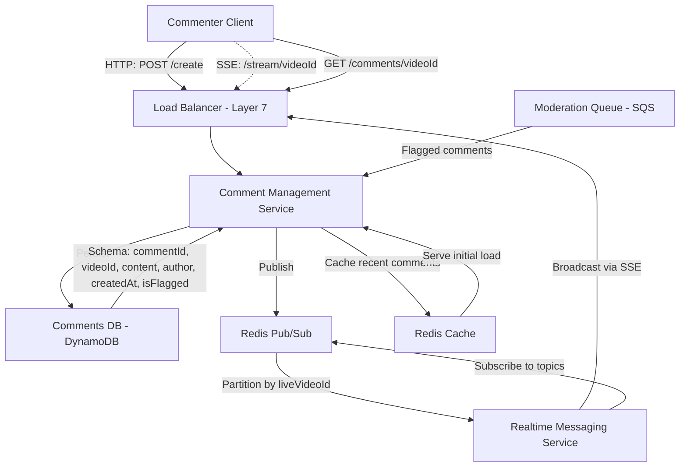

# Complete FB Live Comments System Design Notes (35-Min Interview)

## Overview

- **Goal**: Design a scalable, real-time commenting system for FB Live videos.
- **Requirements**:
  - Real-time comment delivery to viewers of the same live video.
  - High scalability for millions of concurrent users.
  - Low latency (<1s) for comment posting and viewing.
  - Persistence of comments for future retrieval.
  - Handle spikes (e.g., viral live videos with millions of viewers).
  - Support moderation for abusive content.

## Key Components and Flow

### Clients

- **Commenter Client**:
  - Posts comments via HTTP (`POST /create`).
  - Connects via SSE (Server-Sent Events) based on `liveVideoId` for real-time updates.
  - Subscribes only to comments for the live video they are watching.

### Load Balancer

- **Layer 7 Load Balancer**: Routes HTTP requests and SSE connections.
- **Key Decision**: Routes viewers of the same video to the same server to reduce Redis Pub/Sub topic subscriptions per server.

### Comment Management Service

- Handles comment creation (`POST /create`).
- Validates comments (e.g., length, profanity).
- Persists to Comments DB (DynamoDB).
- Publishes to Redis Pub/Sub, partitioned by `liveVideoId`.
- Multiple instances (v1, v2, ..., v5) for scalability.

### Realtime Messaging Service

- Subscribes to Redis Pub/Sub topics for new comments.
- Broadcasts comments to connected clients via SSE, filtered by `liveVideoId`.
- Maintains SSE connection pool and handles reconnection logic.

### Comments DB (DynamoDB)

- **Schema**:
  - `commentId` (PK)
  - `videoId` (FK)
  - `content` (text)
  - `author` (user ID)
  - `createdAt` (SK, for sorting)
  - `isFlagged` (boolean, for moderation)
- Partitioned by `videoId` for scalability.

### Redis Pub/Sub

- Broadcasts new comments, partitioned by `liveVideoId`.
- **Additional**: Use Redis Cluster for scalability across nodes.

### Redis Cache

- Caches recent comments (e.g., last 100 per `videoId`) to reduce DynamoDB load.
- TTL for cache entries (e.g., 1 hour after video ends).

## System Flow

### Comment Creation

- Client sends `POST /create` with `{videoId, content, author}`.
- Load Balancer routes to Comment Management Service.
- Service validates, persists to DynamoDB, and publishes to Redis Pub/Sub.

### Comment Delivery

- Realtime Messaging Service subscribes to Redis topics.
- Broadcasts new comments via SSE to clients connected for that `videoId`.

### Historical Retrieval

- Client sends `GET /comments/{videoId}` with pagination params.
- Comment Management Service queries DynamoDB, serves from cache if available.

## API Design

### `POST /create`

- **Request**:
  ```json
  { "videoId": "vid123", "content": "Great stream!", "author": "user456" }
  ```
- **Response**: `200 OK` or `429 Too Many Requests` (rate limit)
- **Auth**: Requires JWT token in header.

### `GET /comments/{videoId}`

- **Query Params**: `limit=50`, `lastEvaluatedKey` (for pagination)
- **Response**:
  ```json
  {
    "comments": [
      {
        "commentId": "cmt789",
        "content": "...",
        "author": "...",
        "createdAt": "..."
      }
    ],
    "nextKey": "..."
  }
  ```

### `SSE /stream/{videoId}`

- **Connection**: Client opens SSE stream.
- **Events**:
  ```json
  {
    "event": "newComment",
    "data": {
      "commentId": "cmt789",
      "content": "...",
      "author": "...",
      "createdAt": "..."
    }
  }
  ```

## Capacity Estimation

### Assumptions

- 10M daily active users (DAU) watching live videos.
- 10% of users comment (1M users).
- Average 5 comments per user per video → 5M comments/day.
- Peak: 10% of comments in 1 hour (500K comments/hour → ~140 comments/sec).
- Comment size: ~200 bytes (text + metadata).
- Storage: 5M comments \* 200 bytes = 1GB/day → ~30GB/month.

### DynamoDB

- Write throughput: 140 writes/sec (peak).
- Read throughput: Assume 10x reads (initial load + historical) → 1400 reads/sec.
- Use On-Demand mode for spiky traffic.

### Redis

- Pub/Sub: 140 messages/sec across topics.
- Cache: 1GB/day for recent comments (TTL 1 hour).

### SSE Connections

- 10M concurrent viewers → 10M SSE connections.
- Assume 10K connections per server → 1000 servers needed.

## Key Design Decisions

### Real-Time Delivery

- **SSE vs WebSockets**:
  - **SSE**: Lightweight, one-way, browser-native. Suitable for comment updates.
  - **WebSockets**: Bidirectional, heavier. Overkill for this use case.
- **Trade-off**: SSE doesn’t support client-to-server pings; use heartbeat messages to detect disconnects.

### Load Balancing

- Layer 7 LB routes same-video viewers to the same server.
- **Trade-off**: Server failure requires clients to reconnect, causing temporary disruption.

### Scalability

- **Comment Management Service**: Auto-scale based on CPU usage or request rate.
- **Realtime Messaging Service**: Scale based on SSE connection count.
- **DynamoDB**: Auto-scales with On-Demand mode.
- **Redis**: Use Redis Cluster for horizontal scaling.

### Data Storage

- **DynamoDB**:
  - Partition by `videoId` for even distribution.
  - Use `createdAt` as sort key for time-based queries.
- **Trade-off**: Eventual consistency may delay comment visibility; use strong consistency for critical reads.

## Additional Considerations (Real Interview Focus)

### Failure Scenarios

- **Server Failure**:
  - Load Balancer reroutes traffic to healthy instances.
  - Clients reconnect to SSE with exponential backoff.
- **Redis Failure**:
  - Use Redis Cluster with replicas to prevent data loss.
  - Realtime Messaging Service resubscribes to topics on failure.
- **DynamoDB Throttling**:
  - Implement retries with exponential backoff.
  - Cache recent comments in Redis to reduce DB load.
- **Network Partition**:
  - Clients may miss comments during partition; replay recent comments from cache on reconnect.

### User Experience

- **Comment Moderation**:
  - Add `isFlagged` field in DynamoDB for moderation.
  - Use a separate moderation queue (e.g., SQS) for flagged comments.
  - Allow users to report comments (`POST /report`).
- **Comment Sorting**:
  - Default: Sort by `createdAt` (newest first).
  - Optional: Allow sorting by "most liked" (requires additional table for likes).
- **Throttling Feedback**:
  - If rate-limited, show user a message: "Please wait before posting again."

### Latency Optimization

- **Edge Caching**: Use a CDN (e.g., CloudFront) to cache SSE endpoints closer to users.
- **Batching**: Batch multiple comments into a single SSE event during high traffic.
- **Compression**: Compress SSE payloads to reduce bandwidth usage.

### Cost Optimization

- **DynamoDB**: Use On-Demand for spiky traffic; switch to Provisioned Capacity for predictable loads.
- **Redis**: Expire old Pub/Sub topics and cache entries after video ends.
- **Serverless**: Consider AWS Lambda for Comment Management Service to reduce idle costs.

### Testing and Deployment

- **Testing**:
  - Load test with 140 comments/sec and 10M SSE connections.
  - Simulate server failures to test client reconnection logic.
- **Deployment**:
  - Use blue-green deployment for zero-downtime updates.
  - Deploy across multiple AZs for high availability.

### Global Distribution

- **DynamoDB Global Tables**: Replicate comments across regions for low-latency reads.
- **Regional Load Balancers**: Route users to the nearest region for SSE connections.
- **Trade-off**: Increased cost for global replication; may not be needed if most viewers are regional.

## Potential Interviewer Prompts and Responses

### "What happens if a live video goes viral with 50M viewers?"

- Scale Realtime Messaging Service to handle 50M SSE connections (e.g., 10K per server → 5000 servers).
- Increase DynamoDB write capacity for comment spikes.
- Use Redis caching aggressively to reduce DB load.
- Monitor metrics (e.g., SSE connection latency, Redis lag) to detect bottlenecks.

### "How do you ensure comments are not lost during a failure?"

- Persist comments to DynamoDB before publishing to Redis.
- Use Redis Cluster with persistence (AOF) to recover Pub/Sub messages.
- On client reconnect, replay recent comments from Redis cache.

### "How would you add a 'like' feature for comments?"

- Add a DynamoDB table: `CommentLikes (commentId, userId, createdAt)`.
- Use a counter in Redis for quick "like" counts (`INCR comment:<commentId>:likes`).
- Update sorting logic to support "most liked" (query Redis for counts, fetch comments from DynamoDB).

### "What if users post abusive comments?"

- Implement a profanity filter in Comment Management Service.
- Flag comments with `isFlagged` in DynamoDB; send to moderation queue (SQS).
- Allow user reporting (`POST /report`) and admin review via a dashboard.

## Diagram



## Interview Strategy (35 Minutes)

- **3 min**: Clarify requirements and assumptions (real-time, scale, moderation).
- **5 min**: High-level design (draw diagram, explain components and flow).
- **7 min**: API design and capacity estimation (show calculations).
- **10 min**: Deep dive (SSE, load balancing, scalability, failure handling).
- **5 min**: Additional considerations (moderation, UX, global distribution).
- **5 min**: Handle follow-ups (e.g., viral video, likes, abusive comments).

## Component Summary

| Component                  | Role                                                               |
| -------------------------- | ------------------------------------------------------------------ |
| Commenter Client           | Posts and receives comments via HTTP and SSE.                      |
| Load Balancer - Layer 7    | Routes requests, groups viewers by videoId.                        |
| Comment Management Service | Validates, persists, and publishes comments.                       |
| Realtime Messaging Service | Subscribes to Redis Pub/Sub, broadcasts comments via SSE.          |
| Comments DB (DynamoDB)     | Stores comments persistently.                                      |
| Redis Pub/Sub              | Distributes new comments in real-time, partitioned by liveVideoId. |
| Redis Cache                | Caches recent comments to reduce DB load.                          |
| Moderation Queue (SQS)     | Handles flagged comments for moderation.                           |
