# API Design Study Guide for System Design Interviews

## 🎯 Key Interview Strategy
- **Time Limit**: Spend max 5 minutes on API design
- **Default Choice**: REST unless you have specific reasons for GraphQL/RPC
- **Focus**: Show reasonable design judgment, then move to complex architecture
- **Interviewer Priority**: They care more about system architecture than perfect APIs

## 📋 API Protocol Decision Tree

```mermaid
flowchart TD
    A[API Design Decision] --> B{What type of system?}
    B -->|Standard web/mobile app| C[REST]
    B -->|Multiple clients with different data needs| D[GraphQL]
    B -->|High-performance microservices| E[RPC/gRPC]
    B -->|Real-time features| F[WebSockets/SSE]
    
    C --> C1[✓ CRUD operations<br/>✓ Well understood<br/>✓ Great tooling<br/>✓ 90% of use cases]
    D --> D1[✓ Flexible data fetching<br/>✓ Avoid over/under-fetching<br/>✓ Single endpoint<br/>⚠️ More complex]
    E --> E1[✓ Binary serialization<br/>✓ HTTP/2<br/>✓ Type safety<br/>✓ Service-to-service]
    F --> F1[✓ Live updates<br/>✓ Chat systems<br/>✓ Notifications<br/>✓ Persistent connections]
```



## 🔧 REST API Design Essentials

### Resource Modeling (Most Important!)
- **Resources = Core Entities** from your system design
- **Always plural nouns**: `/events`, `/bookings`, `/tickets`
- **Represent things, not actions**: ❌ `/bookTicket` ✅ `/bookings`

#### Example: Ticketmaster System
```
GET /events                    # Get all events
GET /events/{id}              # Get specific event
GET /venues/{id}              # Get specific venue
GET /events/{id}/tickets      # Get tickets for event
POST /events/{id}/bookings    # Create booking
GET /bookings/{id}            # Get specific booking
```

### HTTP Methods Quick Reference


**Key Concept**: **Idempotency** - Operations that can be safely repeated without changing outcome

### Data Input Methods


#### Practical Example
```http
POST /events/123/bookings?notify=true
{
  "tickets": [
    {"section": "VIP", "quantity": 2},
    {"section": "General", "quantity": 1}
  ],
  "payment_method": "credit_card"
}
```

### Response Design
- **Status Codes**: 200 (success), 201 (created), 400 (bad request), 401 (auth required), 404 (not found), 500 (server error)
- **Rule**: 4xx = client error, 5xx = server error
- **Tip**: Using "4XX" or "5XX" in interviews is totally fine

## 🔄 GraphQL Essentials

### When to Choose GraphQL

```mermaid
flowchart TD
    A[Consider GraphQL when...] --> B[Multiple clients need different data<br/>Mobile vs Web vs Dashboard]
    A --> C[Frontend teams need to iterate quickly<br/>Without backend changes]
    A --> D[Over-fetching/under-fetching problems<br/>REST endpoints return too much/little]
    
    E[GraphQL Trade-offs] --> F[✅ Single endpoint<br/>✅ Client specifies data shape<br/>✅ Strongly typed schema]
    E --> G[⚠️ More complex caching<br/>⚠️ N+1 query problem<br/>⚠️ Learning curve]
```


### GraphQL vs REST Example
```graphql
# GraphQL - Single request
query {
  event(id: "123") {
    name
    date
    venue {
      name
      address
    }
    tickets {
      section
      price
      available
    }
  }
}
```

```http
# REST - Multiple requests needed
GET /events/123
GET /venues/456
GET /events/123/tickets
```

## ⚡ RPC/gRPC Essentials

### When to Choose RPC
- **High-performance microservices** communication
- **Type safety** across different programming languages
- **Internal APIs** between your own services
- **Streaming** requirements

### RPC vs REST Comparison


## 📄 Common API Patterns

### Pagination Strategies

```mermaid
graph TD
    A[Pagination Types] --> B[Offset-based<br/>?offset=20&limit=10]
    A --> C[Cursor-based<br/>?cursor=abc123&limit=10]
    
    B --> B1[✅ Simple to implement<br/>✅ Jump to any page<br/>⚠️ Inconsistent with new data]
    C --> C1[✅ Consistent results<br/>✅ Good for real-time data<br/>⚠️ Can't jump to arbitrary page]
```



### Authentication Quick Guide


## 🔒 Security Essentials

### Basic Security Checklist
- **Authentication**: Who is making the request?
- **Authorization**: Are they allowed to do this?
- **Rate Limiting**: Prevent abuse (429 status code)
- **HTTPS**: Always use in production

### RBAC Example
```
Roles:
├── customer: book tickets, view own bookings
├── venue_manager: create events, view sales reports
└── admin: access everything

Authorization Check:
GET /bookings/{id}
1. Valid JWT token? ✓
2. User owns booking OR is admin? ✓
```

## 🎯 Interview Tips & Common Mistakes

### ✅ Do This
- Start with "I'll use REST APIs for this system"
- Model core entities as resources
- Use plural nouns for endpoints
- Mention authentication requirements
- Keep it simple and move on

### ❌ Avoid This
- Spending more than 5 minutes on APIs
- Over-engineering the API design
- Getting stuck on perfect URL structure
- Forgetting about authentication entirely
- Designing internal service APIs in detail

### Template Response
```
"For this system, I'll use REST APIs. The main resources are:
- GET/POST /events for event management
- GET/POST /bookings for ticket bookings  
- GET /users/{id}/bookings for user's bookings

Endpoints that modify data will require user authentication via JWT tokens.
I'll implement rate limiting to prevent abuse.

Now let me move on to the high-level architecture..."
```

## 🧠 Memory Aids

### The CRUD-to-HTTP Mapping
- **C**reate → POST
- **R**ead → GET  
- **U**pdate → PUT/PATCH
- **D**elete → DELETE

### Status Code Categories
- **2xx**: Success (200, 201)
- **4xx**: Client Error (400, 401, 404)
- **5xx**: Server Error (500)

### Protocol Selection Mantra
- **REST**: Default choice, 90% of cases
- **GraphQL**: Multiple clients, different data needs
- **RPC**: High performance, internal services
- **WebSockets**: Real-time, persistent connections

---

**Remember**: The goal is to demonstrate solid engineering judgment, not API perfection. Show you can design reasonable APIs quickly, then focus on the complex architectural challenges that really matter in the interview!