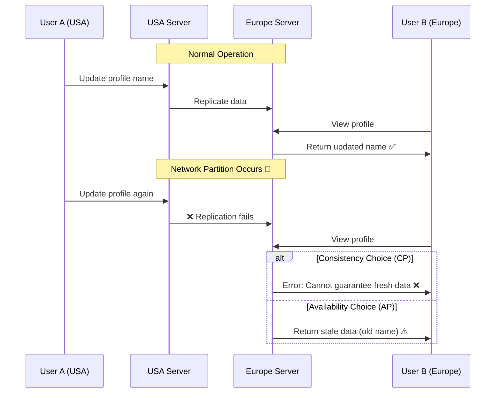
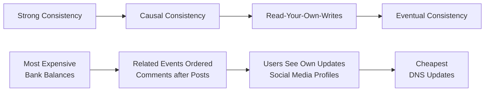
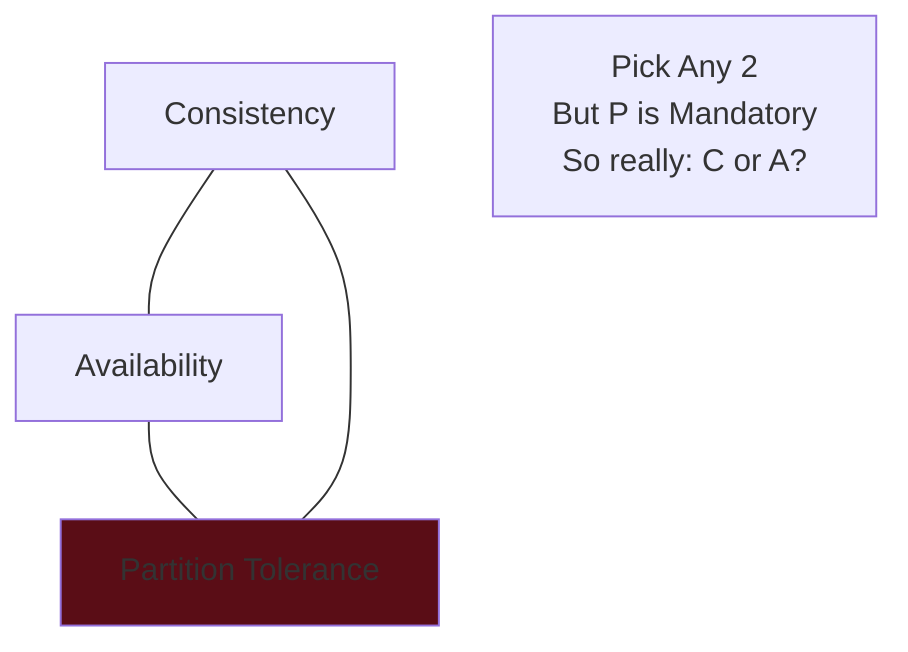

```mermaid
flowchart TD
    A[System Design Question] --> B{Is stale data catastrophic?}
    B -->|YES| C[Choose Consistency<br/>CP System]
    B -->|NO| D[Choose Availability<br/>AP System]

    C --> E[RDBMS, Spanner<br/>Sync Replication<br/>Higher Latency]
    D --> F[Cassandra, Redis<br/>Async Replication<br/>Lower Latency]

    style C fill:#5A0D16
    style D fill:#1E4C50
```

# CAP Theorem - System Design Interview Study Guide

## 🎯 Key Interview Insight

**CAP theorem should be one of the FIRST things you discuss in system design interviews when defining non-functional requirements.**

---

## 📚 What is CAP Theorem?

CAP theorem states that in a distributed system, you can only have **TWO out of THREE** properties:

- **C**onsistency: All nodes see the same data at the same time
- **A**vailability: Every request receives a response (without guarantee of most recent data)
- **P**artition Tolerance: System continues operating despite network failures

### 🔑 Critical Insight

**Partition tolerance is MANDATORY** in distributed systems → Network failures WILL happen

Therefore, CAP really becomes: **Choose Consistency OR Availability during network partitions**

```mermaid
graph TD
    A[Distributed System] --> B[Network Partition Occurs]
    B --> C{Choose One}
    C -->|Consistency| D[Return Error<br/>Guarantee Fresh Data]
    C -->|Availability| E[Return Stale Data<br/>Keep System Running]

    style D fill:#5A0D16
    style E fill:#1E4C50
```

---

## 🌍 Practical Example: USA-Europe Servers

---

## 🎯 When to Choose Each Approach

### Choose Consistency (CP) - "Accuracy is Critical"

**Ask: "Would it be CATASTROPHIC if users saw inconsistent data?"**

✅ **Use Cases:**

- **Ticket Booking**: Prevent double-booking same seat
- **E-commerce Inventory**: Avoid overselling products
- **Financial Systems**: Accurate trading prices, account balances
- **Banking**: Account transactions, transfers

🛠️ **Technology Choices:**

- Traditional RDBMS (PostgreSQL, MySQL)
- Google Spanner
- DynamoDB (strong consistency mode)

### Choose Availability (AP) - "Uptime is Critical"

**Most systems can tolerate brief inconsistency**

✅ **Use Cases:**

- **Social Media**: Profile updates, posts, likes
- **Content Platforms**: Movie descriptions, metadata
- **Review Sites**: Restaurant hours, reviews
- **News Sites**: Article updates

🛠️ **Technology Choices:**

- Cassandra
- DynamoDB (multi-AZ configuration)
- Redis clusters

---

## 🏗️ Design Implications

### Consistency-First Design

```mermaid
graph LR
    A[Client Request] --> B[Primary DB]
    B --> C[Synchronous Replication]
    C --> D[All Replicas Updated]
    D --> E[Response to Client]

    style C fill:#5A0D16
    style D fill:#1E4C50
```

**Features:**

- Distributed transactions (2-phase commit)
- Single-node solutions
- Higher latency, guaranteed accuracy

### Availability-First Design

```mermaid
graph LR
    A[Client Request] --> B[Any Available Node]
    B --> C[Immediate Response]
    B --> D[Async Replication]
    D --> E[Eventually Consistent]

    style C fill:#5A0D16
    style D fill:#1E4C50
```

**Features:**

- Multiple read replicas
- Change Data Capture (CDC)
- Lower latency, eventual consistency

---

## 🚀 Advanced Concepts (Senior+ Level)

### Mixed Requirements in Real Systems

#### Example 1: Ticketmaster

```mermaid
graph TD
    A[Ticketmaster System] --> B[Seat Booking]
    A --> C[Event Browsing]

    B --> D[Strong Consistency<br/>Prevent Double Booking]
    C --> E[High Availability<br/>Show Event Details]

    style D fill:#5A0D16
    style E fill:#1E4C50
```

#### Example 2: Tinder

```mermaid
graph TD
    A[Dating App] --> B[Matching System]
    A --> C[Profile Viewing]

    B --> D[Strong Consistency<br/>Both Users See Match]
    C --> E[High Availability<br/>Show Profile Data]

    style D fill:#5A0D16
    style E fill:#1E4C50
```

### Consistency Spectrum

---

## 🎤 Interview Strategy

### Phase 1: Requirements Gathering

1. **Functional Requirements** (What features?)
2. **Non-Functional Requirements** (System qualities?)

### Phase 2: CAP Decision

**Always ask: "Does this system need to prioritize consistency or availability?"**

### Phase 3: Design Accordingly

- **CP System**: Focus on accuracy, accept higher latency
- **AP System**: Focus on uptime, accept eventual consistency

---

## 💡 Key Interview Phrases

**For Consistency:**

> "For this booking system, I'll prioritize consistency for seat reservations to prevent double-booking, but optimize for availability when users browse events."

**For Availability:**

> "For this social media platform, I'll prioritize availability since showing slightly stale profile data is acceptable, ensuring users can always access the service."

**Mixed Approach:**

> "Different features have different consistency requirements. Critical transactions need strong consistency, while content browsing can use eventual consistency."

---

## ⚡ Quick Decision Framework

---

## 🧠 Memory Aids

**CAP Triangle:**

**The Golden Question:**

> _"Would it be catastrophic if users briefly saw inconsistent data?"_
>
> - **YES** → Consistency
> - **NO** → Availability

---

## 📝 Practice Questions

1. Design a chat application - C or A?
2. Design a stock trading platform - C or A?
3. Design Instagram - C or A for different features?
4. Design an airline reservation system - C or A?
5. Design Netflix - C or A for different components?

**Answers:**

1. **A** - Brief message delays acceptable
2. **C** - Accurate prices critical
3. **Mixed** - Posts (A), Direct messages (C)
4. **C** - Seat booking must be accurate
5. **Mixed** - Viewing (A), User accounts (C)
