# Consistent Hashing - Interview Guide

## 🎯 **TL;DR - Key Takeaway**
Consistent hashing solves the massive data redistribution problem when adding/removing servers in distributed systems by using a circular hash ring where only a small portion of data needs to move.

---

## 📋 **What is Consistent Hashing?**

A distributed systems algorithm that minimizes data redistribution when the number of servers changes. Instead of rehashing all data, it only affects data adjacent to the changed server on a circular hash ring.

---

## 🚨 **The Problem with Simple Modulo Hashing**

### Simple Approach:
```
database_id = hash(event_id) % number_of_databases
```

### Issues:
1. **Adding a server**: Almost ALL data needs redistribution
2. **Removing a server**: Almost ALL data needs redistribution
3. **Result**: Massive database load spikes, slow response times

### Example Problem:


---

## 🔄 **How Consistent Hashing Works**

### Core Concept: Hash Ring


**How it works:**
1. Event #1234 → hash(1234) = 16
2. Find position 16 on ring
3. Move clockwise → hits DB2 at position 25
4. Store event in DB2

### Steps:
1. **Create a circular hash ring** (typically 0 to 2³² - 1)
2. **Place databases** at specific points on the ring
3. **Hash data keys** to find position on ring
4. **Move clockwise** from data position to find responsible database

---

## ➕ **Adding a Database**

**Before: 4 Databases**


**After: Add DB5 at position 90**


**Result**: Only ~15% of data needs to move instead of ~75%

---

## ➖ **Removing a Database**

**Before: DB2 fails at position 25**


**After: DB2 removed**


**Problem**: DB3 now has 2x the load! This is where virtual nodes help.

---

## 🔀 **Virtual Nodes - Load Balancing Solution**

### Problem: 
When a database fails, its entire load goes to one neighbor, creating imbalance.

### Solution:
Place each database at **multiple points** on the ring using different hash variations.

**Without Virtual Nodes:**


**With Virtual Nodes (3 per database):**


**When DB2 fails with Virtual Nodes:**

```mermaid
graph TD
    A["DB2-vn1 data"] --> D["→ DB1"]
    B["DB2-vn2 data"] --> E["→ DB3"] 
    C["DB2-vn3 data"] --> F["→ DB4"]
    
    G["Load distributes evenly!"] 
    
    style A fill:#f8d7da,stroke:#721c24,color:#721c24
    style B fill:#f8d7da,stroke:#721c24,color:#721c24
    style C fill:#f8d7da,stroke:#721c24,color:#721c24
    style D fill:#d4edda,stroke:#155724,color:#155724
    style E fill:#d4edda,stroke:#155724,color:#155724
    style F fill:#d4edda,stroke:#155724,color:#155724
    style G fill:#d1ecf1,stroke:#0c5460,color:#0c5460
```


### Benefits:
- **Better load distribution** when nodes fail
- **More even data placement** across servers
- **Configurable** - more virtual nodes = better distribution

### How Virtual Nodes Work:
Instead of hashing `"DB1"` → position 0, we hash:
- `"DB1-vn1"` → position 15
- `"DB1-vn2"` → position 40  
- `"DB1-vn3"` → position 85

---

## 🌍 **Real-World Usage**

| System | Use Case |
|--------|----------|
| **Apache Cassandra** | Data distribution across cluster nodes |
| **Amazon DynamoDB** | Automatic sharding and scaling |
| **CDNs** | Determining which edge server caches content |
| **Redis Cluster** | Distributing keys across cluster nodes |
| **Memcached** | Client-side consistent hashing for cache distribution |

---

## 🎤 **Interview Usage Guide**

### ⚡ **Quick Mention Scenarios** (90% of interviews)
When designing systems with managed services:
> "We'll use DynamoDB for storage, which handles data distribution using consistent hashing under the hood."

### 🔍 **Deep Dive Scenarios** (Infrastructure-heavy interviews)

**When to explain in detail:**
- Design a distributed database from scratch
- Design a distributed cache system
- Design a distributed message broker
- Custom sharding solutions

**Key points to cover:**
1. **Problem statement**: Why simple modulo hashing fails
2. **Hash ring concept**: Circular arrangement, clockwise traversal
3. **Benefits**: Minimal data movement during scaling
4. **Virtual nodes**: Better load distribution
5. **Failure handling**: How system adapts to node failures

### 🗣️ **Sample Interview Response**

> "For data distribution, I'll use consistent hashing. The key insight is arranging both data and servers on a circular hash ring. When we hash a key, we find its position on the ring and move clockwise to the next server. This way, when we add or remove servers, only the data adjacent to that server needs to move - typically just 1/n of the total data instead of reshuffling everything. We can also use virtual nodes to ensure better load distribution when servers fail."

---

## 🔑 **Key Formulas & Concepts**

### Simple Modulo (❌ Don't use):
```
server_id = hash(key) % number_of_servers
```

### Consistent Hashing (✅ Better):
```
1. hash_position = hash(key) % ring_size
2. Move clockwise on ring to find next server
```

### Data Movement Comparison:
- **Simple hashing**: ~(n-1)/n data moves when adding/removing servers
- **Consistent hashing**: ~1/n data moves when adding/removing servers

---

## ⚠️ **Common Interview Pitfalls**

1. **Don't over-explain** for managed services (DynamoDB, Cassandra)
2. **Do explain the "why"** - massive data redistribution problem
3. **Remember virtual nodes** - shows deep understanding
4. **Focus on benefits** - minimal data movement, better load distribution
5. **Know when it's used** - any distributed data storage/caching system

---

## 🎯 **Practice Questions**

1. "How would you handle adding a new server to your distributed cache?"
2. "What happens when a database server fails in your sharded system?"
3. "Why not just use simple modulo hashing for distributing data?"
4. "How do you ensure even load distribution in consistent hashing?"
5. "Walk me through how you'd find which server stores a specific key."

**Pro tip**: Always start with the problem (massive data redistribution) then introduce consistent hashing as the elegant solution!