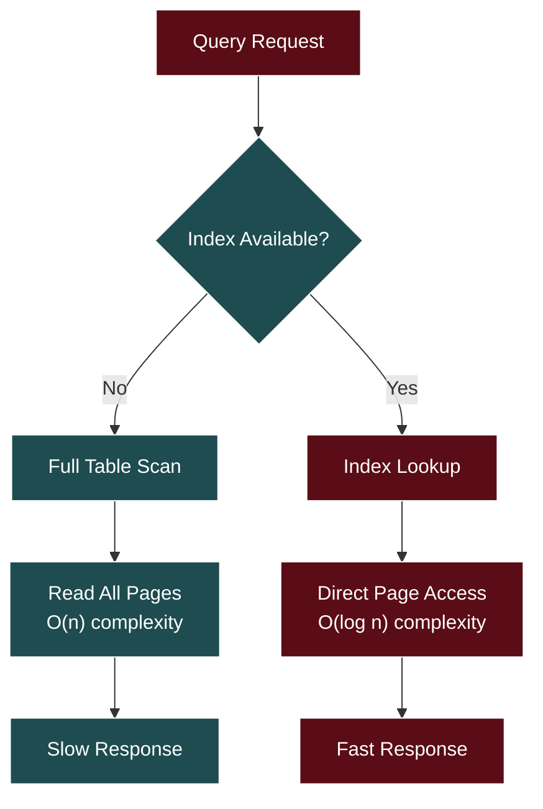
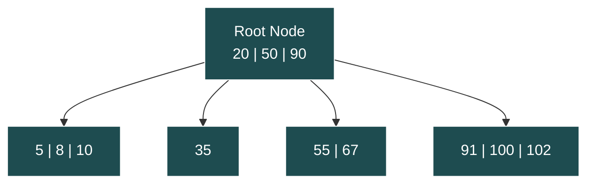
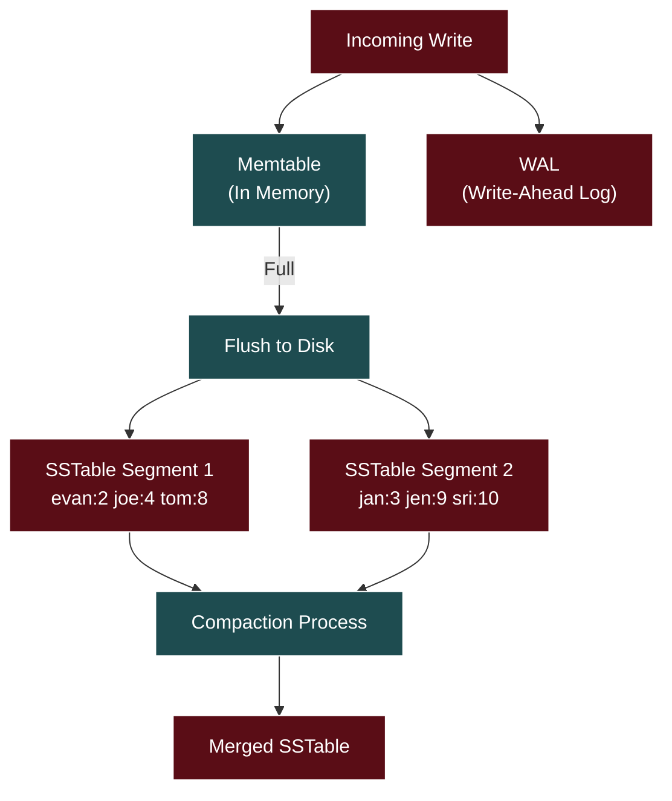
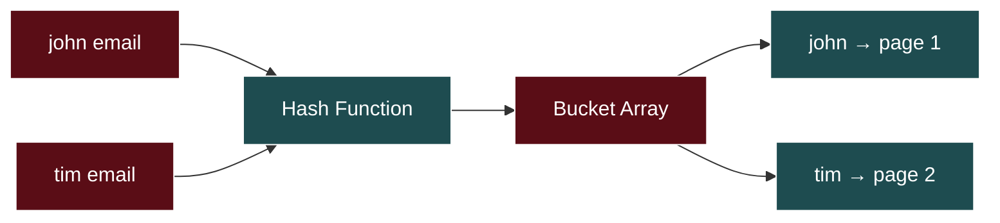
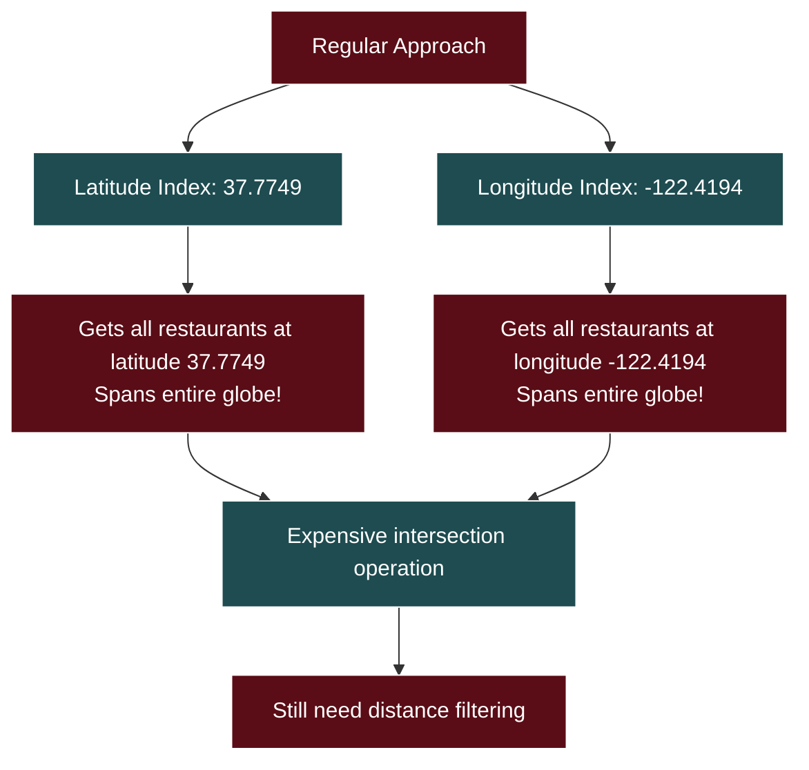
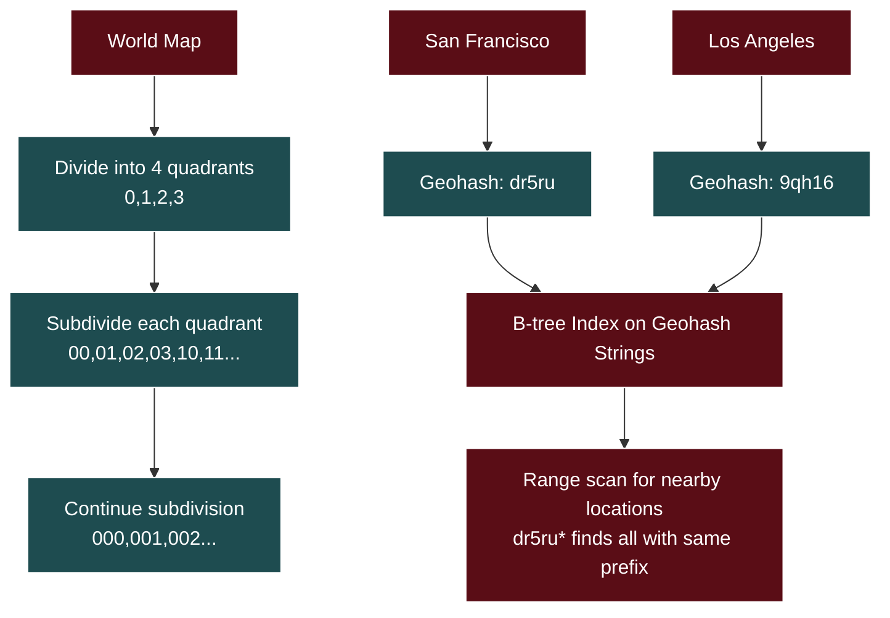
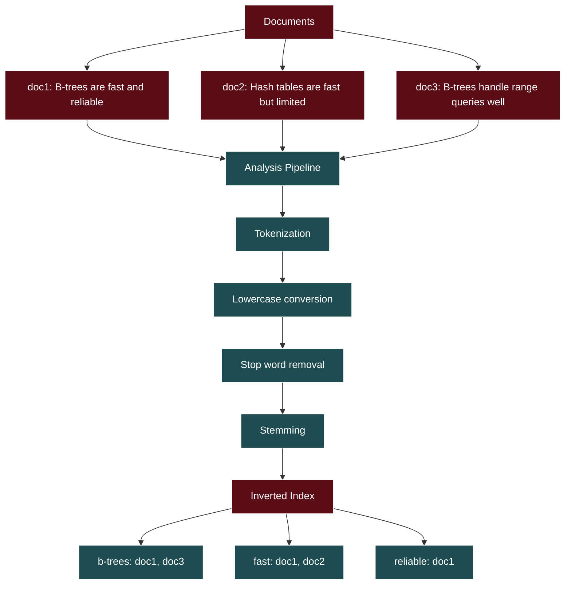
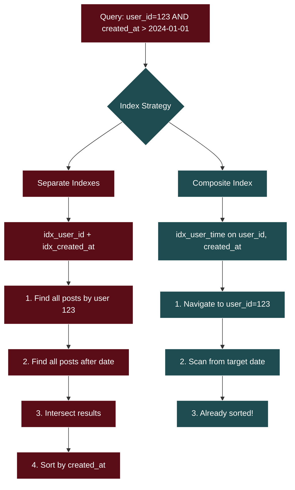
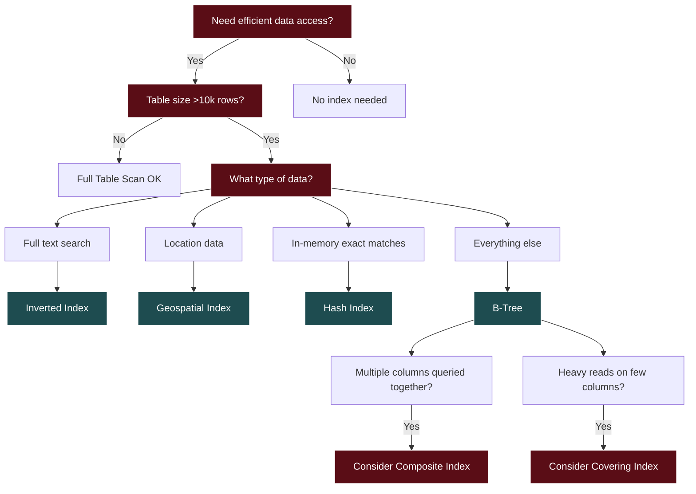

# Database Indexing Deep Dive - Interview Guide

## Core Concepts

### What Are Database Indexes?

Database indexes are separate data structures optimized for searching that allow databases to quickly locate exact records without examining every row. Without indexes, databases must perform sequential scans through all records.

**Key Analogy**: Like a table of contents in a book vs. reading every page to find specific information.

### Why Indexes Matter

- **Performance**: Transform O(n) sequential scans into O(log n) lookups
- **Scalability**: Critical for tables with millions+ records
- **User Experience**: Enable fast queries for real-time applications

### Physical Storage Challenges



**Storage Reality**:

- Data stored on disk (even SSDs)
- Random access slower than sequential
- Need to minimize disk I/O operations
- Each page read is expensive

### Trade-offs of Indexes

**Benefits**:

- Faster reads
- Efficient range queries
- Better sorting performance

**Costs**:

- Additional storage space
- Slower writes (must update index + table)
- Maintenance overhead

## Index Types

### 1. B-Tree Indexes (Most Common)

B-trees are the default choice for most database systems. They maintain a balanced tree structure optimized for disk-based storage.



**Key Properties**:

- Self-balancing
- Each node sized to fit one disk page (typically 8KB)
- Maintains sorted order
- Supports both equality and range queries

**When to Use**:

- General-purpose indexing (default choice)
- Range queries (WHERE age BETWEEN 25 AND 35)
- Sorting operations (ORDER BY)
- Primary keys and unique constraints

**Examples**:

- PostgreSQL: Almost all indexes are B-trees
- DynamoDB: Sort keys use B-tree variants
- MongoDB: Uses B+ trees (variant where all data in leaf nodes)

### 2. LSM Trees (Log-Structured Merge Trees)

Optimized for write-heavy workloads by using append-only approach.



**How It Works**:

1. **Memtable**: New writes go to in-memory sorted structure
2. **WAL**: Writes also appended to log for durability
3. **Flush**: When memtable full, write to disk as SSTable
4. **Compaction**: Background process merges SSTables

**Trade-offs**:

- ✅ Extremely fast writes (append-only)
- ✅ High write throughput
- ❌ Slower reads (may need to check multiple SSTables)
- ❌ Read amplification

**When to Use**:

- Write-heavy workloads (metrics, logs, IoT data)
- Time-series databases
- Analytics platforms

**Examples**:

- Cassandra (Netflix's viewing events)
- RocksDB (Facebook's social interactions)
- DynamoDB (automatically chooses based on workload)

### 3. Hash Indexes

Simple hashmap implementation for exact-match queries.



**Characteristics**:

- O(1) average lookup time
- Perfect for exact matches
- Useless for range queries or sorting
- Handle collisions via linear probing

**When to Use**:

- In-memory databases (Redis)
- Exact-match only scenarios
- When absolute fastest lookup needed

**Reality Check**: Rarely used in practice because B-trees perform nearly as well for exact matches while supporting range queries.

### 4. Geospatial Indexes

Special indexes for location-based queries.

#### Problem with Regular Indexes



#### Geohash Solution



**Geohash Benefits**:

- Converts 2D problem to 1D strings
- Nearby locations share similar prefixes
- Uses existing B-tree infrastructure
- Simple to implement and understand

**Alternative Approaches**:

- **Quadtrees**: Recursive space subdivision (good for understanding, less used in production)
- **R-trees**: Flexible overlapping rectangles (PostgreSQL/PostGIS default)

### 5. Inverted Indexes

For full-text search capabilities.



**How It Works**:

- Reverse mapping: words → documents (instead of documents → words)
- Advanced analysis pipeline processes text
- Enables complex search features (fuzzy matching, relevance scoring)

**When to Use**:

- Full-text search requirements
- Content management systems
- Search engines

**Examples**: Elasticsearch, Lucene, GitHub search, Slack message search

## Index Optimization Patterns

### Composite Indexes

Combine multiple columns in a single index for multi-condition queries.



**Key Rules**:

- Column order matters critically
- Can only use index efficiently for prefixes
- Order from most selective to least selective (usually)
- Consider query patterns over pure selectivity

### Covering Indexes

Include all columns needed by query in the index itself.

**Example**:

```
-- Regular index
CREATE INDEX idx_user_time ON posts(user_id, created_at);

-- Covering index
CREATE INDEX idx_user_time_likes ON posts(user_id, created_at) INCLUDE (likes);
```

**Benefits**:

- Eliminates need to access main table
- Faster queries for specific column sets
- Reduces I/O operations

**Trade-offs**:

- Larger index size
- More maintenance overhead
- Modern optimizers make this less critical

## Decision Framework



## Interview Strategy

### Key Talking Points

1. **Start with the Problem**: Explain why regular sequential scans don't scale
2. **Default to B-Trees**: They're the swiss army knife of indexes
3. **Know the Exceptions**:
   - Spatial data → Geospatial indexes
   - Full-text search → Inverted indexes
   - Write-heavy workloads → LSM trees
4. **Discuss Trade-offs**: Always mention storage overhead and write performance impact
5. **Consider Access Patterns**: Query frequency and patterns drive index strategy

### Common Interview Scenarios

**E-commerce Product Search**:

- B-tree on category, price range
- Composite index on (category, price) for filtered searches
- Inverted index for product name/description search

**Social Media Feed**:

- Composite index on (user_id, created_at) for timeline queries
- Covering index including engagement metrics
- Consider LSM trees for high-volume posting

**Location-Based Services**:

- Explain why separate lat/long indexes fail
- Describe geohash approach with B-tree implementation
- Mention R-tree as production alternative

**Analytics/Logging Platform**:

- LSM trees for high write throughput
- Time-based partitioning strategies
- Trade-off between write speed and query performance

### Red Flags to Avoid

- Don't over-engineer with exotic index types
- Don't ignore write performance implications
- Don't forget about storage overhead
- Don't assume hash indexes are commonly used
- Don't get too deep into implementation details unless asked

### Sample Answers

**"What index would you use for a table storing user profiles?"**

> "I'd start with a B-tree index on the primary key (user_id) since that's our most common lookup pattern. If we frequently search by email for login, I'd add another B-tree index on email since it needs to be unique anyway. For any search functionality on names or bio text, we'd need an inverted index. I'd avoid composite indexes initially unless we have specific multi-column query patterns with high frequency."

**"How would you handle location-based queries for a restaurant app?"**

> "Regular B-tree indexes on latitude and longitude separately won't work well for proximity searches because they treat the coordinates as independent dimensions. I'd use a geospatial approach - probably geohashing, which converts 2D coordinates into strings where nearby locations share similar prefixes. This lets us use a regular B-tree index on the geohash strings and do range scans for proximity queries. For production systems, I might consider R-trees which are optimized for spatial data, but geohashing is simpler to understand and implement."

Remember: **When in doubt, choose B-trees.** They handle the vast majority of use cases efficiently and are what most databases use by default.

# Database Indexing Study Quiz

## Question 1: Database Scanning Without Indexes

**Without indexes, databases must scan through every row sequentially to find matching records.**

**Answer:** True

**Key Point:** Without indexes, databases perform full table scans, reading every page from disk and checking each row for matches. This is like searching through every page of a book to find a specific word instead of using the table of contents.

## Question 2: Index Trade-offs

**What is the main trade-off when adding indexes to a database table?**

**Answer:** Faster reads but slower writes

**Key Point:** Indexes speed up read queries by providing efficient lookup paths, but they slow down writes because every insert, update, or delete must also update all relevant indexes. Each index requires additional storage and maintenance overhead.

## Question 3: B-tree Popularity

**Why are B-trees the most common type of database index?**

**Answer:** They handle both equality and range queries efficiently

**Key Point:** B-trees maintain sorted order and balanced structure, making them efficient for both exact matches (WHERE id = 123) and range queries (WHERE age BETWEEN 25 AND 35). They also support ORDER BY operations naturally since data is already sorted.

## Question 4: LSM Tree Optimization

**LSM trees are optimized for write-heavy workloads at the expense of read performance.**

**Answer:** True

**Key Point:** LSM trees batch writes in memory and flush them sequentially to disk, making writes very fast. However, reads must check multiple locations (memtable, immutable memtables, and multiple SSTables), making them slower than B-tree reads.

## Question 5: LSM Tree Read Performance

**Which optimization technique do LSM trees use to improve read performance?**

**Answer:** Bloom filters to skip irrelevant files

**Key Point:** Bloom filters are probabilistic data structures that can quickly determine if a key is definitely NOT in an SSTable, allowing LSM trees to skip checking most files during reads. This significantly reduces the number of disk reads required.

## Question 6: Hash Index Limitations

**Hash indexes can efficiently handle range queries like 'WHERE age BETWEEN 25 AND 35'.**

**Answer:** False

**Key Point:** Hash indexes scatter similar values across different buckets intentionally, making them excellent for exact matches but useless for range queries. Only B-trees and similar ordered structures can efficiently handle range queries.

## Question 7: B-trees and Geospatial Data

**Why don't traditional B-tree indexes work well for geospatial queries?**

**Answer:** They treat latitude and longitude as independent dimensions

**Key Point:** B-trees on latitude and longitude create two separate 1D indexes, but proximity searches need to understand 2D relationships. A query for 'nearby restaurants' becomes inefficient because you can't easily combine separate latitude and longitude ranges to find points within a circular radius.

## Question 8: Geohash Advantages

**What is the key advantage of geohash for spatial indexing?**

**Answer:** It converts 2D coordinates into 1D strings that preserve proximity

**Key Point:** Geohash converts latitude/longitude into strings where nearby locations share similar prefixes (like 'dr5ru' for the same city block). This allows using regular B-tree indexes on the geohash strings for efficient proximity searches.

## Question 9: R-trees vs Quadtrees

**R-trees are more flexible than quadtrees because they use overlapping rectangles instead of fixed grid divisions.**

**Answer:** True

**Key Point:** R-trees adapt their bounding rectangles to actual data distribution and can overlap, while quadtrees rigidly divide space into equal quadrants. This flexibility allows R-trees to efficiently index both points and complex shapes in the same structure.

## Question 10: Inverted Index Use Cases

**When would you use an inverted index instead of a B-tree?**

**Answer:** For full-text search within document content

**Key Point:** Inverted indexes map words to documents that contain them, making them perfect for full-text search. B-trees can't efficiently handle queries like 'find documents containing the word database' because they can't do middle-of-string pattern matching.

## Question 11: Composite Index Efficiency

**In a composite index on (user_id, created_at), which query can use the index most efficiently?**

**Answer:** WHERE user_id = 123 AND created_at > '2024-01-01'

**Key Point:** Composite indexes can only be used efficiently for prefixes of the column list. Since user_id comes first, the index works best when filtering on user_id first, then optionally on created_at. Queries filtering only on created_at cannot use this index efficiently.

## Question 12: Composite Index Column Order

**The order of columns in a composite index doesn't matter for query performance.**

**Answer:** False

**Key Point:** Column order is crucial in composite indexes. An index on (user_id, created_at) can efficiently handle queries filtering on user_id alone or both columns, but cannot efficiently handle queries filtering only on created_at. The database can only use the index for left-to-right prefixes.

## Question 13: Covering Index Benefits

**What is the main benefit of a covering index?**

**Answer:** It includes all columns needed by a query in the index itself

**Key Point:** A covering index includes not just the columns being filtered on, but also the columns being selected. This allows the database to return results entirely from the index without additional table lookups, significantly improving performance for queries that only need a subset of columns.

## Question 14: LSM Trees in Production

**Cassandra and RocksDB use LSM trees because they handle write-heavy workloads better than B-trees.**

**Answer:** True

**Key Point:** Systems like Cassandra (Netflix's viewing events) and RocksDB (Facebook's social interactions) process millions of writes per second. LSM trees excel at this by batching writes in memory and flushing them sequentially, converting many random writes into fewer large sequential writes.

## Question 15: Social Media Feed Index Strategy

**For a social media feed query filtering by user_id and ordering by created_at, what's the best index strategy?**

**Answer:** Composite index (user_id, created_at)

**Key Point:** A composite index (user_id, created_at) handles both the WHERE clause and ORDER BY in a single index scan. The database can find the user's posts and retrieve them in sorted order without additional sorting, making it much more efficient than separate indexes.
