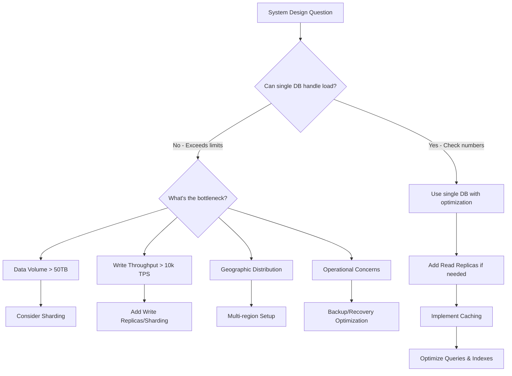

# System Design Numbers & Best Practices 2025 - Interview Guide

## **TL;DR - Key Takeaways**

- Modern hardware is **orders of magnitude** more powerful than what most textbooks suggest
- **Avoid premature sharding** - single databases can handle terabytes of data
- **Don't over-engineer** - simple solutions often outperform complex distributed systems
- Know when to scale vs when to optimize vertically

---

## **Modern Hardware Capabilities (2025)**

### **Servers & Memory**

- **AWS M6i.32xlarge**: 512 GiB RAM, 128 vCPUs
- **Memory-optimized instances**:
  - X1e.32xlarge: 4 TB RAM
  - U-24tb1.metal: 24 TB RAM
- **Storage**:
  - i3en.24xlarge: 60 TB local SSD
  - D3en.12xlarge: 336 TB HDD
  - S3: Effectively unlimited (petabyte-scale)

### **Network Performance**

- **Within datacenter**: 10 Gbps standard, up to 20 Gbps
- **Cross-region**: 100 Mbps - 1 Gbps
- **Latency**: 1-2ms within region, 50-150ms cross-region

---

## **Component Performance Numbers**

### **Caching (Redis/ElastiCache)**

```
Memory: Up to 1TB+ (memory-optimized instances)
Latency:
  - Reads: < 1ms (same region)
  - Writes: 1-2ms (cross-region)
Throughput:
  - Reads: 100k+ requests/second per instance
  - Writes: 100k+ requests/second
```

**Scale Triggers:**

- Hit rate < 80%
- Latency > 1ms
- Memory usage > 80%
- Cache thrashing

### **Databases (PostgreSQL/MySQL/Aurora)**

```
Storage: Up to 64 TiB (Aurora: 128 TiB)
Latency:
  - Reads: 1-5ms (cached), 5-30ms (disk)
  - Writes: 5-15ms commit latency
Throughput:
  - Reads: Up to 50k TPS (single-node)
  - Writes: 10-20k TPS (single-node)
Connections: 5-20k concurrent
```

**Scale Triggers:**

- Dataset size > 50 TiB
- Write throughput > 10k TPS consistently
- Read latency > 5ms for uncached data
- Geographic distribution requirements
- Backup windows becoming impractical

### **Application Servers**

```
Connections: 100k+ concurrent per instance
CPU: 8-64 cores @ 2-4 GHz
Memory: 64-512GB (up to 2TB available)
Network: Up to 25 Gbps bandwidth
Startup Time: 30-60 seconds (containerized)
```

**Scale Triggers:**

- CPU utilization > 70-80%
- Response latency exceeding SLA
- Memory usage > 80%
- Network bandwidth approaching 20 Gbps

### **Message Queues (Kafka/RabbitMQ)**

```
Throughput: Up to 1M messages/second per broker
Latency: 1-5ms end-to-end (within region)
Message Size: 1KB-10MB efficiently handled
Storage: Up to 50TB per broker
Retention: Weeks to months of data
```

**Scale Triggers:**

- Throughput nearing 800k messages/second per broker
- Partition count approaching 200k per cluster
- Growing consumer lag
- Cross-region replication needs

---

## **System Design Decision Framework**



---

## **Common Interview Mistakes to Avoid**

### **1. Premature Sharding**

❌ **Bad**: "We have 10M businesses × 1KB = 10GB data, let's shard by business_id"
✅ **Good**: "10GB easily fits in a single database, no sharding needed"

❌ **Bad**: "100k competitions × 100k users × 40 bytes = 400GB, need to shard cache"
✅ **Good**: "400GB fits comfortably in modern cache instances"

### **2. Overestimating Latency**

❌ **Bad**: "Database lookup is slow, need caching layer"
✅ **Good**: "Simple row lookup with index: ~10ms, fast enough for most use cases"

### **3. Over-engineering for Write Throughput**

❌ **Bad**: "5k writes/second is high, need message queue to buffer"
✅ **Good**: "Modern PostgreSQL handles 20k+ writes/second easily"

---

## **Scaling Decision Checklist**

### **Before Adding Complexity, Ask:**

1. **Data Volume**: Is it really > 50TB?
2. **Write Load**: Are we consistently > 10k TPS?
3. **Read Latency**: Are simple queries really > 5ms?
4. **Geographic**: Do we need multi-region distribution?
5. **Operational**: Are backups/maintenance becoming impractical?

### **Simple Optimizations First:**

- Add database indexes
- Implement connection pooling
- Use read replicas
- Add application-level caching
- Optimize queries
- Use async commits for non-critical writes

---

## **Quick Reference Cheat Sheet**

| Component         | Key Metrics                                   | Scale Triggers                      |
| ----------------- | --------------------------------------------- | ----------------------------------- |
| **Cache**         | ~1ms latency, 100k+ ops/sec, up to 1TB        | Hit rate < 80%, Latency > 1ms       |
| **Database**      | Up to 50k TPS, Sub-5ms reads, 64+ TiB storage | Write > 10k TPS, Read latency > 5ms |
| **App Server**    | 100k+ connections, 64-512GB RAM               | CPU > 70%, Memory > 80%             |
| **Message Queue** | 1M msgs/sec, 1-5ms latency, 50TB storage      | Throughput near 800k msgs/sec       |

---

## **Interview Strategy**

### **Do This:**

1. **Start simple** - Single server, single database
2. **Do the math** - Calculate actual data volumes and throughput
3. **Identify real bottlenecks** - Don't assume constraints
4. **Scale incrementally** - Add complexity only when needed
5. **Justify decisions** - Explain why you're adding each component

### **Don't Do This:**

- Jump to distributed solutions immediately
- Use outdated hardware assumptions
- Add components "just in case"
- Forget to consider operational complexity

---

## **Sample Calculation Examples**

### **Yelp-like System**

- 10M businesses × 1KB = 10GB
- Add reviews (10× data) = 100GB
- **Decision**: Single database easily handles this

### **LeetCode Leaderboard**

- 100k competitions × 100k users × 40 bytes = 400GB
- **Decision**: Single large cache instance, no sharding needed

### **High-Write System**

- 5k writes/second
- **Decision**: Well within single PostgreSQL capacity (20k+ WPS)
- **Optimization**: Connection pooling, proper indexing

---

_Remember: Modern systems are incredibly powerful. Don't over-engineer unless the numbers truly justify the complexity._

# Modern Hardware Capabilities Quiz - Revision Guide

## Question 1: Cache Performance

**What is the correct order of magnitude for operations per second that a modern in-memory cache can handle?**

**Answer:** 100,000 ops/sec

**Key Point:** Modern in-memory caches like Redis can handle over 100,000 operations per second per instance. Understanding this capability helps avoid premature scaling decisions - many systems that seem to need distributed caching can actually run on a single high-performance cache instance.

---

## Question 2: Storage Latency

**Which storage type provides sub-millisecond data access latency?**

**Answer:** In-memory cache

**Key Point:** In-memory caches like Redis provide sub-millisecond latency by keeping data in RAM, while SSD storage typically provides 5-30ms latency, and other storage types are significantly slower.

---

## Question 3: Application Server Bottlenecks

**Which is NOT typically the first bottleneck in modern application servers?**

**Answer:** Memory capacity

**Key Point:** Modern application servers have 64-512GB of RAM standard, making memory capacity rarely the first constraint. CPU utilization typically becomes the bottleneck before memory, network, or latency limits are reached.

---

## Question 4: Memory-Optimized Servers

**Modern memory-optimized servers can handle terabytes of data in memory.**

**Answer:** True

**Key Point:** Current memory-optimized instances like the Amazon EC2 U7i High Memory can provide up to 24TB of RAM, allowing entire large datasets to be kept in memory for ultra-fast access patterns that were impossible just a few years ago.

---

## Question 5: Database Sharding Necessity

**Which factor BEST indicates when database sharding becomes necessary?**

**Answer:** Dataset approaching 50+ TiB

**Key Point:** Modern single database instances can handle up to 64+ TiB and tens of thousands of transactions per second. Sharding becomes necessary when approaching these actual hardware limits, not arbitrary user counts or architectural choices.

---

## Question 6: Cache Sharding for 400GB Dataset

**A 400GB dataset requires cache sharding for optimal performance.**

**Answer:** False

**Key Point:** Not necessarily. Modern memory-optimized cache instances can handle up to 1TB of data. A 400GB dataset fits comfortably within a single cache instance, avoiding the complexity of sharding while maintaining excellent performance.

---

## Question 7: Over-Engineering Causes

**What causes engineers to over-engineer systems during design?**

**Answer:** Using outdated hardware constraints

**Key Point:** When engineers use hardware assumptions from 2015-2020, they dramatically underestimate modern capabilities, leading to unnecessarily complex distributed solutions where simple architectures would suffice.

---

## Question 8: Message Queue Buffering

**A system processing 5,000 writes per second needs message queue buffering.**

**Answer:** False

**Key Point:** Modern well-tuned database instances can handle 10-20k writes per second. At 5,000 WPS, the database can handle the load directly without requiring message queue complexity for buffering.

---

## Question 9: Sub-Millisecond Response Times

**When optimizing for sub-millisecond response times, which approach works best?**

**Answer:** In-memory caching

**Key Point:** Sub-millisecond response times require in-memory storage to avoid disk I/O entirely. SSDs provide 5-30ms latency, which is too slow for sub-millisecond requirements.

---

## Question 10: Database Storage Capacity

**What is the correct order of magnitude for storage capacity that a single modern database instance can handle?**

**Answer:** 100 TB

**Key Point:** Modern single database instances can handle up to 64+ TiB of storage, with some configurations supporting even more. This represents a massive increase from older systems and means many applications don't need database sharding until they reach truly massive scale.

---

## Question 11: Database Sharding Scenarios

**Which scenario does NOT require database sharding?**

**Answer:** 2TB dataset with simple queries

**Key Point:** A 2TB dataset with simple queries can be handled by a single modern database instance. Geographic distribution, cross-region requirements, and operational concerns like backup windows are valid reasons for sharding.

---

## Question 12: Message Queue Latency

**Message queues with sub-5ms latency can be used in synchronous request flows.**

**Answer:** True

**Key Point:** Modern high-performance message queues achieve 1-5ms end-to-end latency, making them fast enough to use within synchronous APIs while gaining benefits of reliable delivery and decoupling.

---

## Question 13: Storage for 10 Million Businesses

**For a system with 10 million businesses at 1KB each, which storage approach is most appropriate?**

**Answer:** Single database instance

**Key Point:** 10 million businesses at 1KB each equals only 10GB of data. Even accounting for indexes and related data, this easily fits within a single modern database instance without requiring distributed complexity.

---

## Question 14: Concurrent Connections

**A single optimized application server instance typically supports approximately how many concurrent connections?**

**Answer:** 100,000 connections

**Key Point:** Modern application servers with optimized configurations can handle over 100,000 concurrent connections per instance. This capability means that connection limits are rarely the first bottleneck - CPU utilization typically becomes the constraint before running out of connection capacity.

---

## Question 15: Network Latency

**What is the typical network latency for communication within a single cloud region?**

**Answer:** 1-2 milliseconds

**Key Point:** Within a single cloud region, network latency typically ranges from 1-2 milliseconds. This predictable low latency enables reliable distributed system design and real-time communication between services in the same region.

---

## Summary of Key Hardware Capabilities

- **In-memory caches:** 100,000+ ops/sec, sub-millisecond latency, up to 1TB capacity
- **Modern databases:** 64+ TiB storage, 10-20k writes/sec
- **Application servers:** 64-512GB RAM, 100,000+ concurrent connections
- **Memory-optimized instances:** Up to 24TB RAM
- **Network latency (same region):** 1-2ms
- **SSD latency:** 5-30ms

## Common Anti-Patterns to Avoid

1. **Premature sharding** based on user count rather than actual data/performance limits
2. **Over-architecting** based on outdated hardware assumptions
3. **Adding message queues** for buffering when databases can handle the load directly
4. **Cache sharding** for datasets under 1TB
5. **Distributed solutions** for problems that single instances can handle
