# System Design Interview: Networking Essentials

## 🎯 Interview Focus

- **Infrastructure/Distributed Systems**: Deep networking knowledge required
- **Full-stack/Product**: Surface understanding sufficient
- **Universal**: Understanding fundamentals helps make better architectural decisions

---

## 📚 Core Networking Layers

### OSI Model Overview

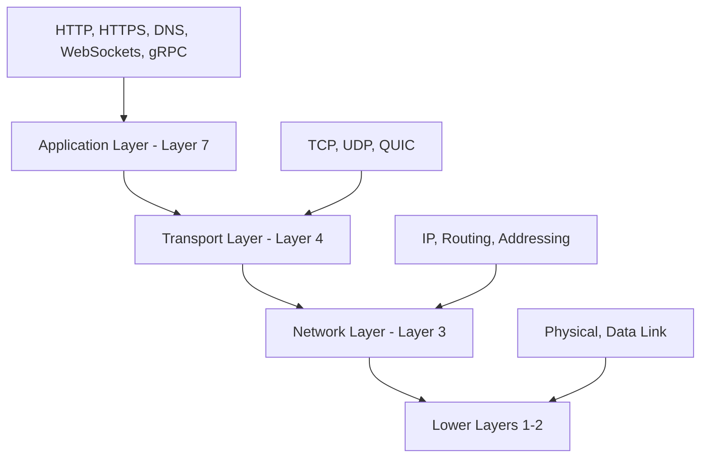

### Key Layers for Interviews

1. **Network Layer (Layer 3)**: IP protocol, routing, addressing
2. **Transport Layer (Layer 4)**: TCP, UDP, QUIC - reliability and flow control
3. **Application Layer (Layer 7)**: HTTP, WebSockets, gRPC - application protocols

---

## 🌐 HTTP Request Flow Example

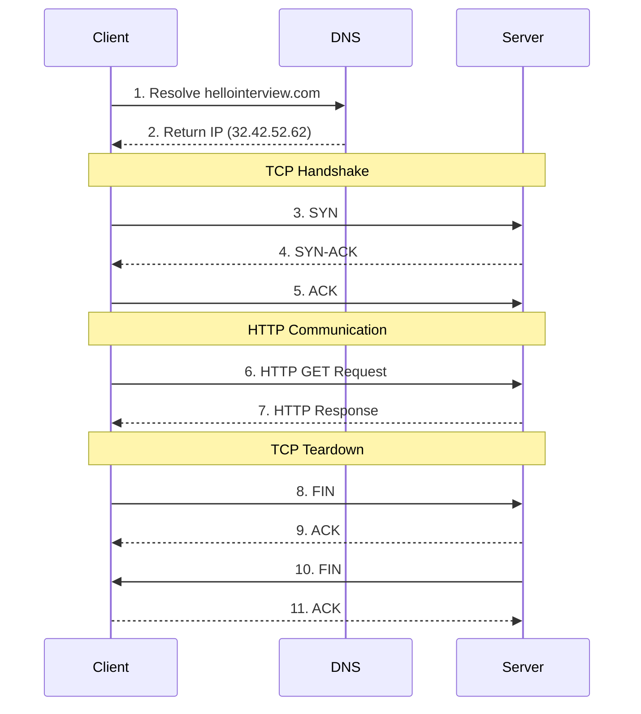

**Key Takeaways:**

- Multiple packets for one conceptual request/response
- Stateful connections require maintenance
- Each step adds latency
- Higher stack = more processing overhead

---

## 🚀 Transport Layer Protocols

### TCP vs UDP Comparison

| Feature          | TCP                 | UDP                     |
| ---------------- | ------------------- | ----------------------- |
| **Connection**   | Connection-oriented | Connectionless          |
| **Reliability**  | Guaranteed delivery | Best-effort             |
| **Ordering**     | Maintains order     | No ordering guarantees  |
| **Flow Control** | Yes                 | No                      |
| **Header Size**  | 20-60 bytes         | 8 bytes                 |
| **Speed**        | Slower (overhead)   | Faster                  |
| **Use Cases**    | Most applications   | Streaming, gaming, VoIP |

### When to Choose UDP

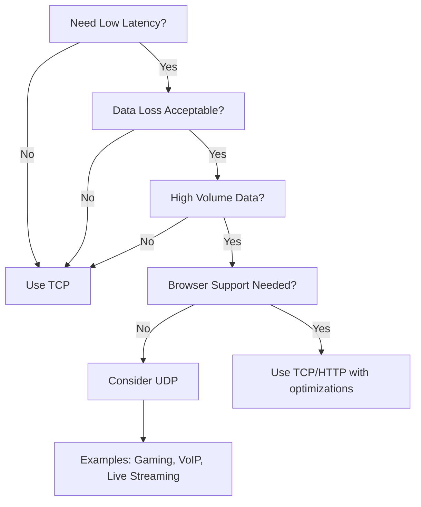

**UDP Interview Examples:**

- Live video streaming
- Online gaming
- VoIP calls
- DNS lookups
- Real-time telemetry

---

## 📡 Application Layer Protocols

### Protocol Selection Matrix

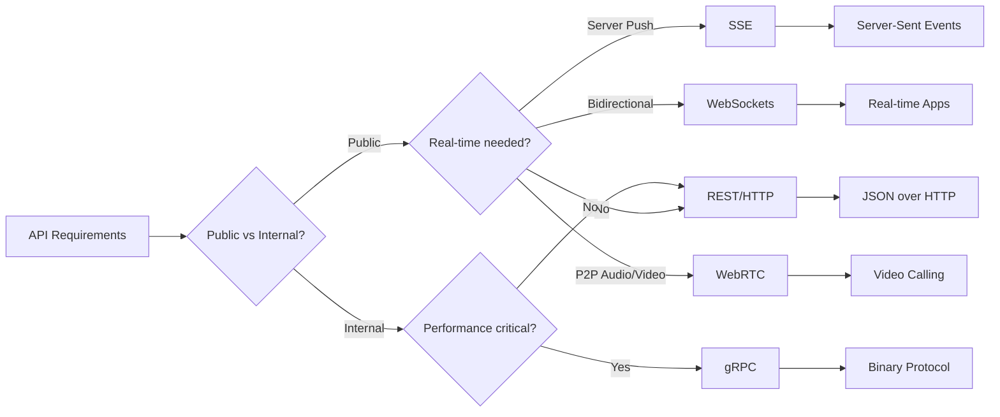

### REST API Design Patterns

**Core Principles:**

- Resources, not operations
- HTTP verbs for actions
- Stateless design

```http
GET    /users/{id}           → Retrieve user
POST   /users               → Create user
PUT    /users/{id}          → Update user
DELETE /users/{id}          → Delete user
GET    /users/{id}/posts    → Get user's posts
```

**Status Codes to Know:**

- **2xx Success**: 200 OK, 201 Created
- **3xx Redirect**: 301 Permanent, 302 Temporary
- **4xx Client Error**: 401 Unauthorized, 403 Forbidden, 404 Not Found, 429 Rate Limited
- **5xx Server Error**: 500 Internal Error, 502 Bad Gateway

### GraphQL vs REST

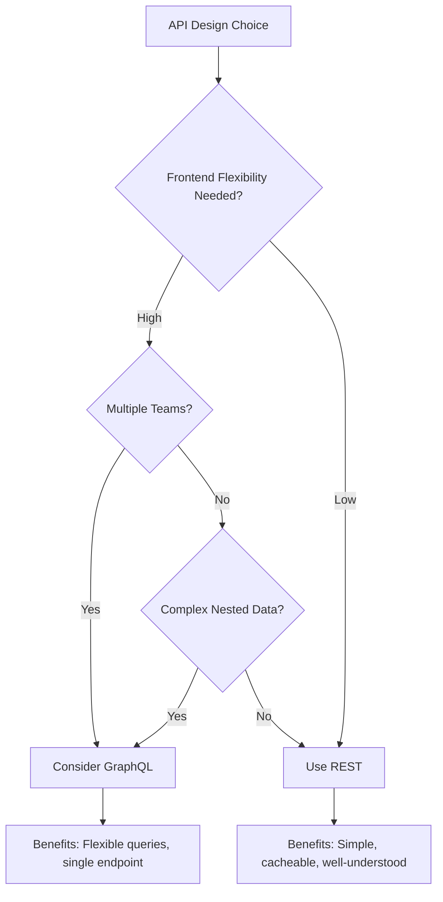

### Real-time Communication Patterns

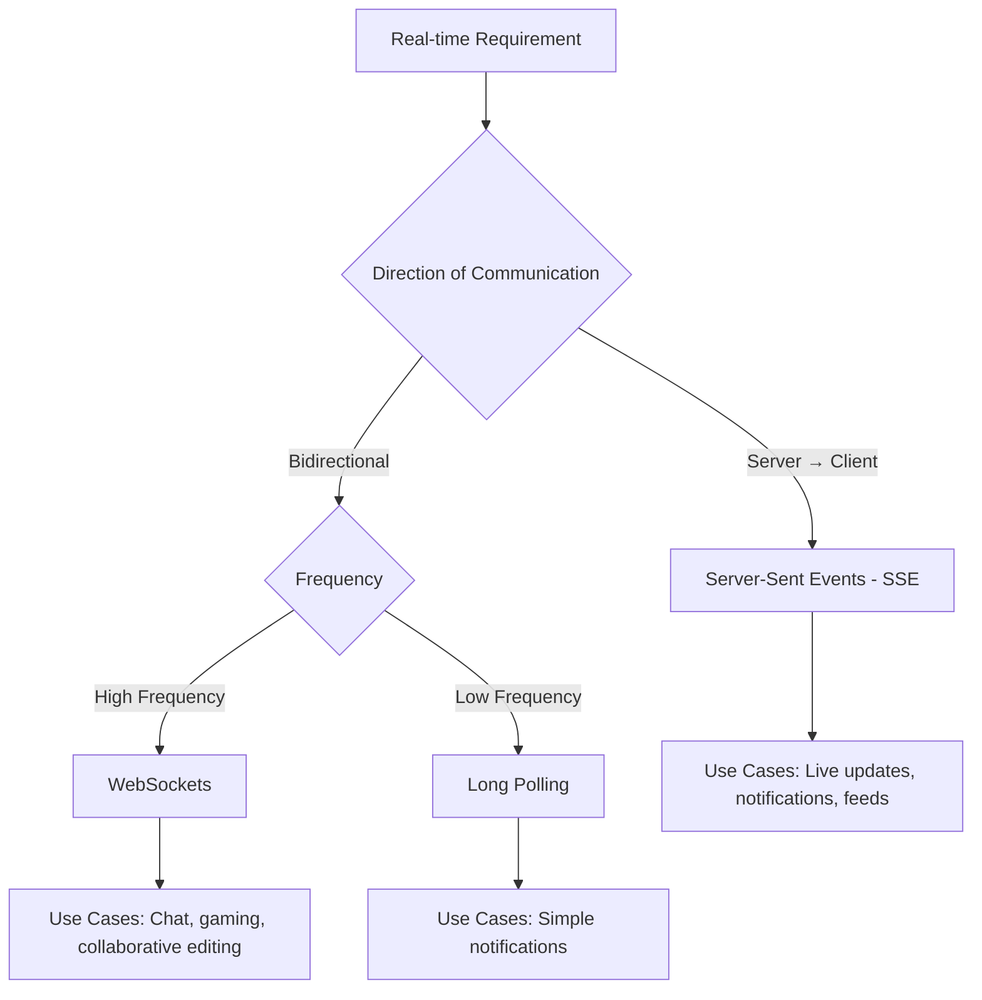

**SSE Limitations:**

- Connection timeouts require reconnection
- One-way communication only
- Some networks buffer responses

**WebSocket Considerations:**

- Stateful connections (scaling complexity)
- Infrastructure support required
- Overkill for simple push notifications

---

## ⚖️ Load Balancing

### Scaling Strategies

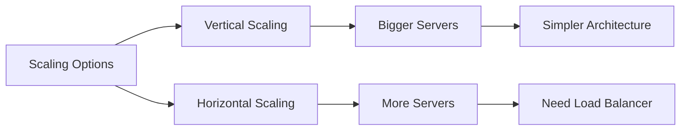

### Load Balancer Types

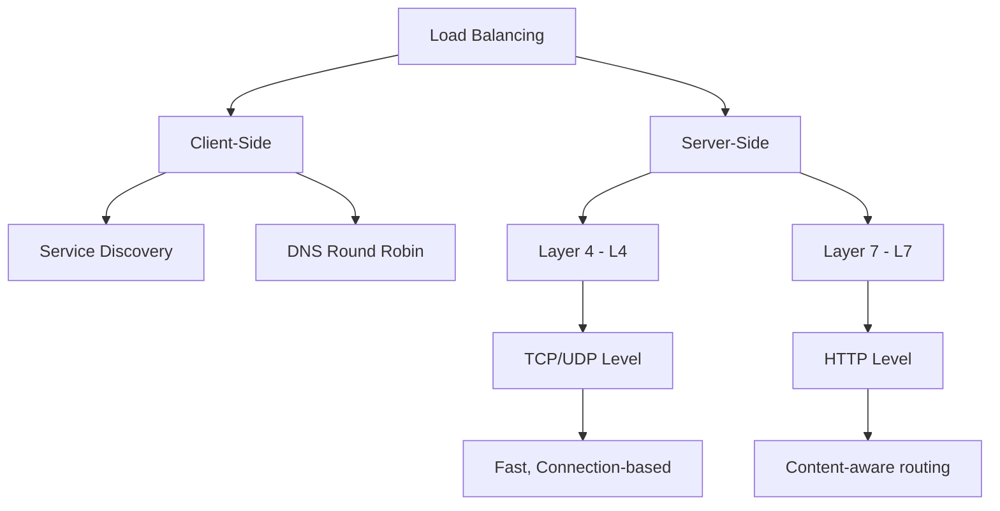

### Layer 4 vs Layer 7 Comparison

| Aspect                  | Layer 4 (L4)                | Layer 7 (L7)                     |
| ----------------------- | --------------------------- | -------------------------------- |
| **Operates At**         | Transport Layer             | Application Layer                |
| **Routing Based On**    | IP, Port                    | URL, Headers, Content            |
| **Connection Handling** | Persistent TCP              | Terminates & recreates           |
| **Performance**         | Faster                      | More CPU intensive               |
| **Features**            | Basic load distribution     | Content routing, SSL termination |
| **Best For**            | WebSockets, raw performance | HTTP APIs, content-based routing |

### Load Balancing Algorithms

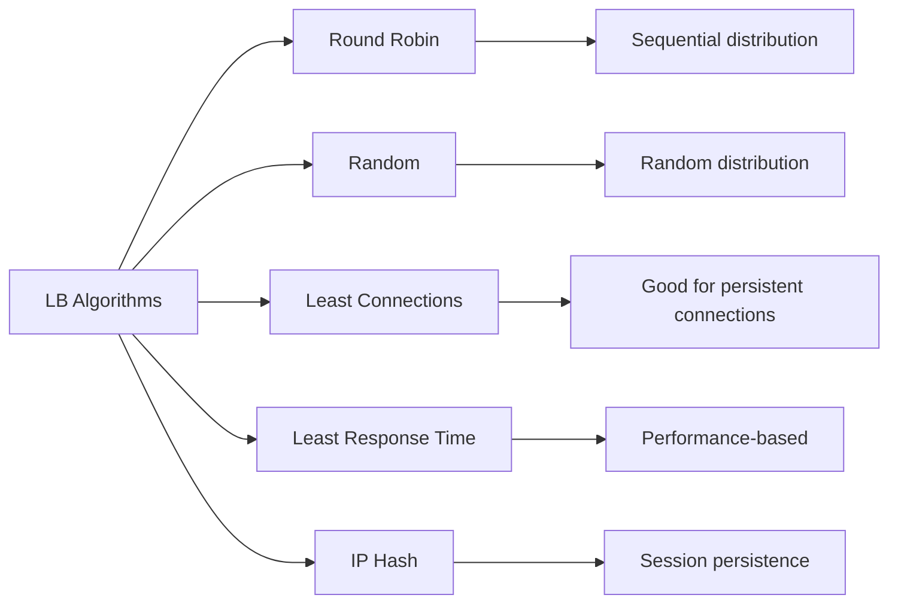

**Interview Recommendations:**

- **Default**: Round Robin or Random
- **WebSockets/SSE**: Least Connections
- **Session-dependent**: IP Hash

---

## 🌍 Global Distribution & CDNs

### Latency Challenges

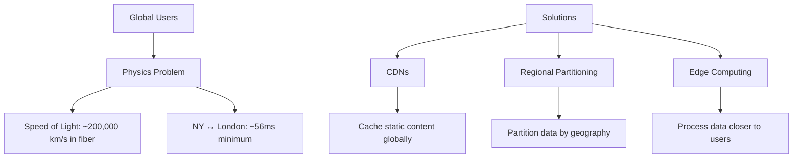

### CDN Strategy

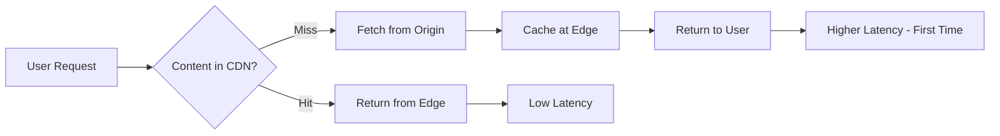

**CDN Use Cases:**

- Static assets (images, CSS, JS)
- Video streaming
- API response caching
- Search results caching

---

## 🛡️ Failure Handling Patterns

### Retry Strategy

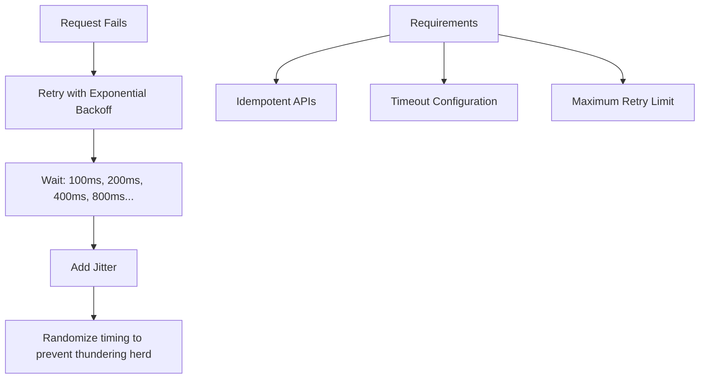

### Circuit Breaker Pattern

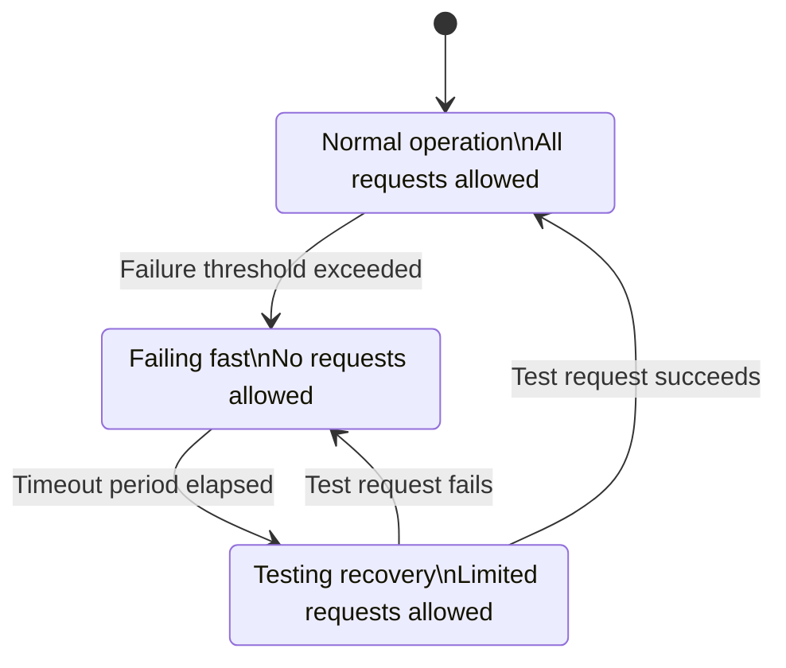

**Circuit Breaker Benefits:**

- Fail fast instead of hanging
- Reduce load on struggling services
- Automatic recovery testing
- Prevent cascading failures

### Idempotency Keys

```http
POST /payments
{
  "amount": 1000,
  "currency": "USD",
  "idempotency_key": "user123_2025-01-01"
}
```

**Implementation:**

- Store processed idempotency keys
- Return same result for duplicate requests
- Prevent double charges/operations

---

## 🎯 Interview Decision Framework

### Protocol Selection Guide

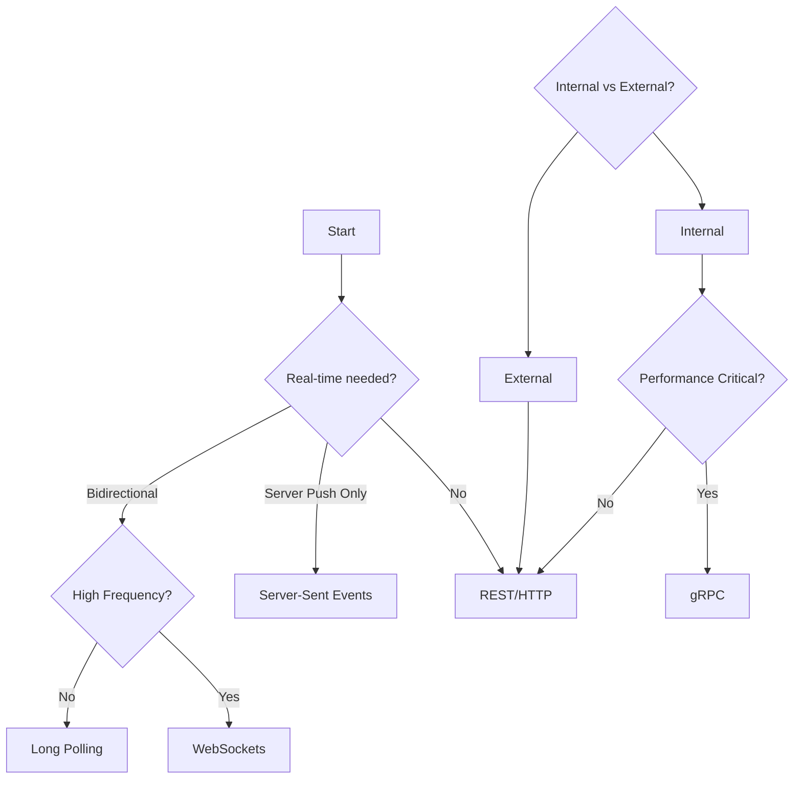

### Load Balancer Selection

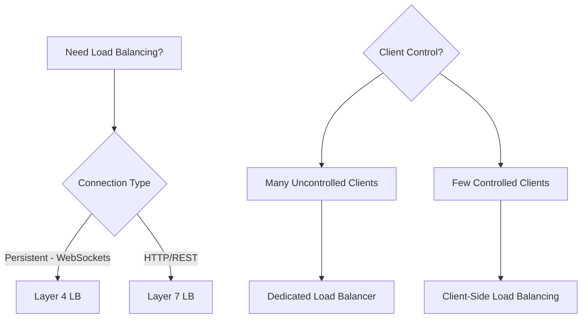

---

## 📝 Common Interview Scenarios

### Scenario 1: Chat Application

**Requirements**: Real-time bidirectional messaging

```
Choice: WebSockets
Load Balancer: Layer 4
Fallback: Long polling for browsers with issues
```

### Scenario 2: Live Sports Updates

**Requirements**: Server pushes score updates

```
Choice: Server-Sent Events
Load Balancer: Layer 7
CDN: Cache team info, player stats
```

### Scenario 3: Microservices Communication

**Requirements**: Internal service-to-service calls

```
Choice: gRPC for performance, REST for simplicity
Load Balancing: Client-side with service discovery
Circuit Breakers: Essential for fault tolerance
```

### Scenario 4: Global Video Streaming

**Requirements**: Low latency worldwide

```
Protocols: HTTP for metadata, CDN for content
Distribution: Regional CDNs
Optimization: Edge caching, adaptive bitrate
```

---

## 🚨 Red Flags to Avoid

### ❌ Don't Do This:

- Use WebSockets for simple notifications
- Choose UDP without justifying browser support
- Ignore failure modes and cascading failures
- Over-engineer with gRPC for public APIs
- Forget about connection state with load balancers

### ✅ Do This:

- Start with simple defaults (TCP, REST, Layer 7 LB)
- Justify protocol choices based on requirements
- Consider failure scenarios and mitigation
- Think about global distribution early
- Mention monitoring and observability

---

## 🎤 Key Interview Talking Points

### Impressive Details to Mention:

1. **"Retry with exponential backoff and jitter"** - Shows production experience
2. **Circuit breaker pattern** - Demonstrates fault tolerance thinking
3. **Client-side load balancing for microservices** - Advanced architecture knowledge
4. **Physics constraints** - Understanding of fundamental limitations
5. **Idempotency keys** - API design best practices

### Questions to Ask:

- "What's the expected global user distribution?"
- "How real-time do the updates need to be?"
- "Are there any specific latency requirements?"
- "Should we optimize for read or write performance?"

---

## 📚 Study Recommendations

### Hands-on Learning:

1. **Wireshark**: Capture and analyze network traffic
2. **Network Link Conditioner**: Simulate poor network conditions
3. **Build a simple chat app**: Experience WebSocket challenges
4. **Set up a load balancer**: Use NGINX or HAProxy

### Advanced Topics for Senior Interviews:

- HTTP/2 and HTTP/3 benefits
- QUIC protocol advantages
- BGP routing basics
- DNS optimization strategies
- TLS/SSL performance considerations

---

_Remember: In interviews, start with simple, well-understood solutions and optimize based on specific requirements. Most problems don't need the most advanced protocols—reliability and simplicity often win over premature optimization._

# Networking Quiz

## Question 1

**Network protocol layers provide abstraction that simplifies application development.**

**Answer: True**

Protocol layers like TCP, HTTP, and WebSockets abstract lower-level networking details, allowing developers to focus on application logic rather than packet routing or error correction.

## Question 2

**Which protocol prioritizes speed over reliability?**

**Answer: UDP**

UDP provides connectionless, best-effort delivery with minimal overhead, making it faster than TCP but without reliability guarantees. This trade-off suits real-time applications where speed matters more than perfect delivery.

## Question 3

**Which is NOT a benefit of load balancing?**

**Answer: Data consistency**

Load balancers distribute traffic and provide failover capabilities, enabling horizontal scaling and improved availability. However, they don't inherently provide data consistency - that requires application-level coordination or database features.

## Question 4

**HTTP's stateless design enables servers to handle requests independently.**

**Answer: True**

HTTP's stateless nature means each request contains all necessary information, allowing any server to handle any request. This simplifies load balancing and horizontal scaling since servers don't need to maintain session state.

## Question 5

**Which load balancer type maintains persistent TCP connections?**

**Answer: Layer 4**

Layer 4 load balancers operate at the transport layer, maintaining persistent TCP connections between clients and specific backend servers. Layer 7 load balancers terminate connections and create new ones for each request.

## Question 6

**Circuit breakers prevent cascading failures by temporarily blocking requests to failing services.**

**Answer: True**

Circuit breakers monitor service health and 'trip' when failures exceed a threshold, blocking requests to give failing services time to recover. This prevents cascading failures and reduces system-wide impact.

## Question 7

**Real-time gaming applications requiring persistent bidirectional communication should use which protocol?**

**Answer: WebSockets**

WebSockets provide persistent, bidirectional connections ideal for real-time gaming where both client and server need to send frequent updates. HTTP and REST are request-response only, while SSE only supports server-to-client communication.

## Question 8

**What is the PRIMARY benefit of Content Delivery Networks?**

**Answer: Reduced latency**

CDNs primarily reduce latency by caching content at edge locations closer to users. While they may provide other benefits, their main purpose is minimizing the distance data travels to improve response times.

## Question 9

**Idempotent APIs can be safely retried without causing side effects.**

**Answer: True**

Idempotent operations produce the same result when executed multiple times. This property enables safe retries during network failures without unintended consequences like duplicate payments or data corruption.

## Question 10

**Which mechanism enables load balancers to detect server failures?**

**Answer: Health checks**

Health checks are periodic tests that load balancers perform to verify server availability. Failed health checks trigger automatic traffic redirection to healthy servers, providing fault tolerance and high availability.

## Question 11

**When users in different continents experience high latency, which approach reduces response times most effectively?**

**Answer: Regional data centers**

Geographic distance creates fundamental latency constraints due to speed of light limitations. Regional data centers place services closer to users, minimizing network hops and physical distance to achieve the lowest possible latency.

## Question 12

**Which retry strategy prevents overwhelming recovering services?**

**Answer: Exponential backoff**

Exponential backoff increases delay between retries, reducing load on recovering services. Adding jitter prevents synchronized retries from multiple clients, avoiding thundering herd problems that could prevent service recovery.

## Question 13

**Server-Sent Events enable bidirectional real-time communication between clients and servers.**

**Answer: False**

Server-Sent Events only support server-to-client communication, not bidirectional. While they enable real-time push notifications, clients must use separate HTTP requests to send data to servers. WebSockets provide true bidirectional communication.

## Question 14

**What happens when using round-robin load balancing with persistent connections?**

**Answer: Uneven connection distribution**

Round-robin distributes new connections evenly, but persistent connections accumulate on servers over time. Long-lived connections can create imbalanced load, making least-connections algorithms more appropriate for persistent connection scenarios.

## Question 15

**Distributed systems should always assume network calls will occasionally fail or timeout.**

**Answer: True**

Networks are inherently unreliable - cables break, routers fail, and congestion causes delays. Robust distributed systems must handle these realities with timeouts, retries, circuit breakers, and graceful degradation rather than assuming perfect connectivity.
