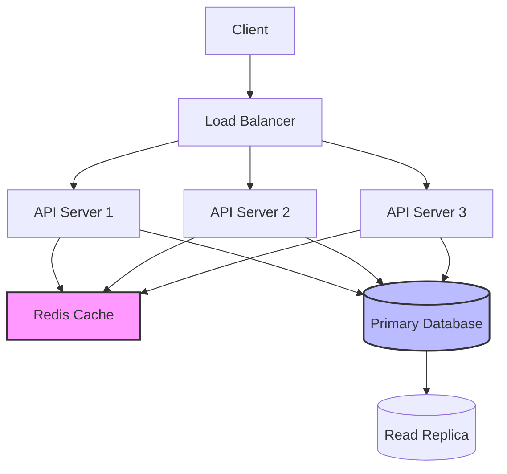
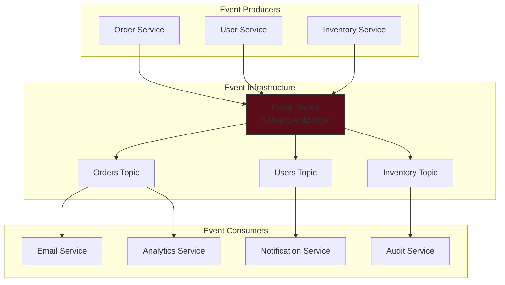

# System Design Patterns - Interview Guide

## Overview

This guide covers the most common system design patterns used in FAANG interviews. These patterns are building blocks that can be combined to solve complex system design problems efficiently.

## Key Interview Strategy

- **Start Simple**: Begin with basic patterns and add complexity as requirements emerge
- **Pattern Recognition**: Identify which patterns fit the problem requirements
- **Time Management**: Move quickly through basic designs to spend time on optimization and deep dives
- **Combination**: Most real systems use multiple patterns together

---

## 1. Simple DB-Backed CRUD Service with Caching

### Use Cases

- Web applications
- Basic REST APIs
- Content management systems
- User profile services

### Architecture

### Key Components

- **Load Balancer**: Distributes traffic across multiple API servers
- **API Servers**: Handle CRUD operations
- **Cache Layer**: Redis/Memcached for frequently accessed data
- **Database**: Primary for writes, replicas for reads
- **Monitoring**: Health checks and metrics

### Interview Notes

- This is often the starting point - don't spend too much time here
- Good for junior roles but needs complexity for senior positions
- Mention cache invalidation strategies
- Discuss read replicas for scaling reads

---

## 2. Async Job Worker Pool

### Use Cases

- Image/video processing
- Email sending
- Data analysis
- Background tasks that can tolerate delay

### Architecture

```mermaid
graph TB
    Client[Client] --> API[API Server]
    API --> Queue[Message Queue<br/>SQS/Kafka]

    Queue --> Worker1[Worker 1]
    Queue --> Worker2[Worker 2]
    Queue --> Worker3[Worker 3]
    Queue --> WorkerN[Worker N]

    Worker1 --> DB[(Database)]
    Worker2 --> DB
    Worker3 --> DB
    WorkerN --> DB

    Worker1 --> Storage[File Storage<br/>S3/GCS]
    Worker2 --> Storage
    Worker3 --> Storage
    WorkerN --> Storage

    style Queue fill: #5A0D16,stroke:#333,stroke-width:2px
    style Storage fill: #1E4C50,stroke:#333,stroke-width:2px
```

### Queue Options

- **SQS**: At-least-once delivery, heartbeat mechanism
- **Kafka**: Append-only log, replay capability, high throughput
- **RabbitMQ**: Feature-rich, supports multiple messaging patterns

### Key Considerations

- **Failure Handling**: Dead letter queues, retry mechanisms
- **Scaling**: Auto-scaling worker pools based on queue depth
- **Monitoring**: Queue depth, processing time, error rates
- **Idempotency**: Ensure operations can be safely retried

---

## 3. Two-Stage Architecture

### Use Cases

- Search engines (inverted indexes)
- Recommendation systems
- Image similarity detection
- Route planning/ETA services

### Architecture

```mermaid
graph TB
    subgraph "Stage 1: Fast Filtering"
        Input[Input Query] --> Filter[Fast Algorithm<br/>Bloom Filter/Hash]
        Filter --> Candidates[Candidate Set<br/>~1000s items]
    end

    subgraph "Stage 2: Precise Processing"
        Candidates --> Precise[Slow Precise Algorithm<br/>ML Model/Complex Logic]
        Precise --> Results[Final Results<br/>~10s items]
    end

    subgraph "Data Storage"
        Index[(Fast Index<br/>Hash/Bloom Filter)]
        FullData[(Full Dataset<br/>Detailed Information)]
    end

    Filter --> Index
    Precise --> FullData

    style Filter fill: #5A0D16,stroke:#333,stroke-width:2px
    style Precise fill: #1E4C50,stroke:#333,stroke-width:2px
```

### Implementation Strategy

1. **Stage 1**: Use fast, approximate algorithms (Bloom filters, LSH, simple heuristics)
2. **Stage 2**: Apply expensive, accurate algorithms only to candidates
3. **Optimization**: Tune Stage 1 to balance recall vs. computational cost

### Interview Notes

- Essential for problems involving large datasets with expensive operations
- Discuss trade-offs between precision and performance
- Mention specific algorithms (LSH for similarity, inverted indexes for search)

---

## 4. Event-Driven Architecture (EDA)

### Use Cases

- Real-time notifications
- Microservices communication
- E-commerce order processing
- IoT data processing

### Architecture

### Key Benefits

- **Loose Coupling**: Services don't need to know about each other
- **Scalability**: Easy to add new consumers
- **Reliability**: Durable event logs for replay
- **Real-time Processing**: Immediate reaction to events

### Critical Considerations

- **Failure Handling**: Dead letter queues, circuit breakers
- **Ordering**: Event ordering guarantees when needed
- **Backpressure**: Handling when consumers can't keep up
- **Schema Evolution**: Maintaining backward compatibility

---

## 5. Durable Job Processing

### Use Cases

- Long-running data processing jobs
- ETL pipelines
- Machine learning model training
- Large file processing

### Architecture

```mermaid
graph TB
    subgraph "Job Management"
        JobQueue[Job Queue<br/>Kafka/Database]
        Scheduler[Job Scheduler<br/>Temporal/Cadence]
    end

    subgraph "Worker Pool"
        Worker1[Worker 1]
        Worker2[Worker 2]
        Worker3[Worker 3]
        Coordinator[Job Coordinator]
    end

    subgraph "State Management"
        Checkpoints[(Checkpoint Store<br/>Database/S3)]
        JobState[(Job State<br/>Progress Tracking)]
    end

    JobQueue --> Scheduler
    Scheduler --> Coordinator
    Coordinator --> Worker1
    Coordinator --> Worker2
    Coordinator --> Worker3

    Worker1 --> Checkpoints
    Worker2 --> Checkpoints
    Worker3 --> Checkpoints

    Worker1 --> JobState
    Worker2 --> JobState
    Worker3 --> JobState

    style Scheduler fill: #5A0D16,stroke:#333,stroke-width:2px
    style Checkpoints fill: #1E4C50,stroke:#333,stroke-width:2px
```

### Key Features

- **Checkpointing**: Save progress periodically
- **Fault Tolerance**: Resume from last checkpoint on failure
- **Scalability**: Distribute work across multiple workers
- **Monitoring**: Track job progress and health

### Technologies

- **Temporal/Cadence**: Workflow orchestration
- **Kafka**: Durable event log for job state
- **Kubernetes Jobs**: Container-based job execution

---

## 6. Proximity-Based Services

### Use Cases

- Ride-sharing apps (Uber, Lyft)
- Food delivery (DoorDash, Uber Eats)
- Location-based social networks
- Store locators

### Architecture

```mermaid
graph TB
    subgraph "Client Layer"
        MobileApp[Mobile App]
        WebApp[Web App]
    end

    subgraph "API Layer"
        LocationAPI[Location API]
        LoadBalancer[Load Balancer]
    end

    subgraph "Geospatial Services"
        GeoIndex[Geospatial Index<br/>PostGIS/Redis Geo]
        QuadTree[QuadTree/Geohash<br/>Spatial Partitioning]
    end

    subgraph "Data Storage"
        LocationDB[(Location Database<br/>Spatial Index)]
        Cache[Location Cache<br/>Redis with Geo Commands]
    end

    MobileApp --> LoadBalancer
    WebApp --> LoadBalancer
    LoadBalancer --> LocationAPI

    LocationAPI --> Cache
    LocationAPI --> GeoIndex
    GeoIndex --> QuadTree
    GeoIndex --> LocationDB

    style GeoIndex fill:#5A0D16,stroke:#333,stroke-width:2px
    style QuadTree fill:#1E4C50,stroke:#333,stroke-width:2px
```

### Geospatial Indexing Strategies

- **Geohash**: Encode lat/lng into string for easy prefix matching
- **QuadTree**: Recursively divide space into quadrants
- **R-Tree**: Spatial data structure for complex shapes
- **Grid-Based**: Simple grid overlay for uniform distribution

### Optimization Techniques

- **Regional Sharding**: Partition data by geographic regions
- **Caching**: Cache popular locations and recent queries
- **Approximation**: Use coarser granularity for distant results

### Interview Notes

- Only use complex geospatial indexes for large datasets (100K+ items)
- For smaller datasets, simple scanning may be more efficient
- Consider user context (most queries are local, not global)

---

## Pattern Combination Examples

### E-commerce Platform

```mermaid
graph TB
    subgraph "User Interface"
        Web[Web App]
        Mobile[Mobile App]
    end

    subgraph "API Gateway"
        Gateway[API Gateway]
    end

    subgraph "Core Services"
        UserService[User Service<br/>CRUD + Cache]
        ProductService[Product Service<br/>CRUD + Cache]
        OrderService[Order Service<br/>Event-Driven]
    end

    subgraph "Async Processing"
        PaymentQueue[Payment Queue]
        EmailQueue[Email Queue]
        InventoryQueue[Inventory Queue]
    end

    subgraph "Search & Recommendations"
        SearchIndex[Search Index<br/>Two-Stage]
        RecommendationEngine[Recommendation Engine<br/>Two-Stage]
    end

    Web --> Gateway
    Mobile --> Gateway
    Gateway --> UserService
    Gateway --> ProductService
    Gateway --> OrderService
    Gateway --> SearchIndex
    Gateway --> RecommendationEngine

    OrderService --> PaymentQueue
    OrderService --> EmailQueue
    OrderService --> InventoryQueue

    style Gateway fill: #5A0D16 ,stroke:#333,stroke-width:2px
    style OrderService fill:#1E4C50,stroke:#333,stroke-width:2px
```

## Interview Tips

### Pattern Selection Strategy

1. **Identify Core Requirements**: What's the primary function?
2. **Consider Scale**: How many users/requests/data?
3. **Understand Constraints**: Latency, consistency, availability requirements
4. **Start Simple**: Begin with basic patterns, add complexity
5. **Justify Choices**: Explain why each pattern fits the requirements

### Common Mistakes to Avoid

- **Over-engineering**: Don't add complexity without justification
- **Under-engineering**: Don't oversimplify for senior roles
- **Ignoring Trade-offs**: Always discuss pros/cons of choices
- **Missing Failure Cases**: Consider what happens when components fail
- **Forgetting Monitoring**: Include observability in your design

### Deep Dive Areas

- **Caching Strategies**: Cache-aside, write-through, write-behind
- **Database Sharding**: Horizontal partitioning strategies
- **Consistency Models**: CAP theorem, eventual consistency
- **Rate Limiting**: Token bucket, sliding window
- **Security**: Authentication, authorization, data protection

---

## Summary Checklist

When designing any system, ensure you've considered:

- [ ] **Scalability**: Can it handle expected load?
- [ ] **Reliability**: What happens when components fail?
- [ ] **Consistency**: What consistency guarantees are needed?
- [ ] **Performance**: Does it meet latency requirements?
- [ ] **Security**: How is data protected?
- [ ] **Monitoring**: How do you know it's working?
- [ ] **Cost**: Is the solution cost-effective?
- [ ] **Maintainability**: Can it be easily modified?

Remember: The goal is to demonstrate your ability to think through complex problems systematically, not to design the perfect system.
