# System Design Core Concepts Guide

_Essential building blocks for technical interviews_

## 🏗️ Scaling Fundamentals

### Vertical vs Horizontal Scaling


**Key Insights**:

- **Vertical scaling** often requires less complexity - prefer when possible
- Many systems can scale vertically to surprising degrees
- **Don't throw machines at poor design** - fix the design first
- Horizontal scaling introduces distribution challenges

### Horizontal Scaling Challenges


---

## ⚖️ Work & Data Distribution

### Work Distribution Strategies

| Strategy               | Use Case                    | Pros                      | Cons                    |
| ---------------------- | --------------------------- | ------------------------- | ----------------------- |
| **Round Robin**        | Simple load balancing       | Even distribution, simple | Ignores server capacity |
| **Least Connections**  | Variable request complexity | Considers server load     | More complex tracking   |
| **Consistent Hashing** | Caching, data distribution  | Minimal redistribution    | Complex implementation  |
| **Geographic**         | Global applications         | Low latency for users     | Data synchronization    |

### Consistent Hashing Deep Dive

```mermaid
graph LR
    A[Hash Ring] --> B[Node A at 0°]
    A --> C[Node B at 120°]
    A --> D[Node C at 240°]

    E[Request Hash] --> F{Find Next Node Clockwise}
    F --> G[Route to That Node]

    H[Add/Remove Node] --> I[Minimal Data Movement]

    style A fill:#5A0D16
    style I fill:#1E4C50
```



### Anti-Patterns to Avoid


**Better Approaches**:

- **Partition by region** for geographic systems
- **Fan-out to few nodes** instead of many
- **Cache hot data** to reduce database load

---

## 🔄 CAP Theorem

### The Trade-off Triangle


### When to Choose Each Model


**Interview Default**: Choose **Availability** unless strong consistency is explicitly required

### Mixed Consistency Models

**Key Insight**: Different features can have different consistency requirements

- **Product descriptions**: Eventually consistent
- **Inventory counts**: Strongly consistent
- **User comments**: Eventually consistent
- **Order processing**: Strongly consistent

---

## 🔒 Locking & Concurrency

### Locking Considerations


### Optimistic vs Pessimistic Locking


**When to Use Each**:

- **Optimistic**: Low contention, read-heavy workloads
- **Pessimistic**: High contention, critical consistency needs

---

## 📊 Indexing Strategies

### Index Types & Use Cases


### Database Indexing Best Practices


### ElasticSearch as Secondary Index


**ElasticSearch Capabilities**:

- **Full-text search** via Lucene
- **Geospatial indexing** for location data
- **Vector indexing** for ML similarity
- **CDC integration** with most databases

---

## 🌐 Communication Protocols

### Protocol Selection Matrix


### Internal vs External Protocols

| Context                | Recommended        | Alternative  | Use Case                    |
| ---------------------- | ------------------ | ------------ | --------------------------- |
| **Internal Services**  | HTTP/HTTPS         | gRPC         | Microservices communication |
| **Simple APIs**        | HTTP/HTTPS         | -            | CRUD operations             |
| **Real-time Updates**  | Server-Sent Events | Long Polling | Live feeds, notifications   |
| **Bidirectional Chat** | WebSockets         | -            | Real-time collaboration     |

### WebSocket Architecture Pattern


---

## 🔐 Security Essentials

### Multi-Layer Security Approach


### Security Best Practices


**Key Principles**:

- **Don't reinvent security** - use proven solutions
- **Defense in depth** - multiple security layers
- **User control** for sensitive data encryption
- **Monitor and log** all access patterns

---

## 📈 Monitoring & Observability

### Three Pillars of Monitoring


### Monitoring Metrics Matrix

| Level              | Key Metrics              | Alert Thresholds   | Tools               |
| ------------------ | ------------------------ | ------------------ | ------------------- |
| **Infrastructure** | CPU, Memory, Disk        | >80% usage         | Datadog, Prometheus |
| **Service**        | Latency, Error Rate, QPS | >500ms, >1% errors | APM tools           |
| **Application**    | DAU, Conversion, Revenue | Business-specific  | Analytics platforms |

### Leading vs Lagging Indicators


---

## 🔧 Design Patterns & Anti-Patterns

### Common Architecture Patterns


### Anti-Patterns to Avoid


---

## 🎯 Interview Application Strategy

### Concept Selection Framework


### When to Apply Each Concept

| System Type         | Key Concepts                              | Focus Areas                        |
| ------------------- | ----------------------------------------- | ---------------------------------- |
| **Social Media**    | Horizontal scaling, CAP (AP), Indexing    | Feed generation, Content delivery  |
| **E-commerce**      | CAP (CP for inventory), Locking, Security | Inventory management, Payments     |
| **Chat/Gaming**     | WebSockets, Message brokers, Real-time    | Low latency, Connection management |
| **Search Engine**   | Indexing, ElasticSearch, Distributed data | Query performance, Relevance       |
| **Video Streaming** | CDN, Geographic distribution, Bandwidth   | Content delivery, Global scale     |

### Interview Progression Strategy

```mermaid
gantt
    title Concept Introduction Timeline
    dateFormat X
    axisFormat %s

    section Early Design
    Basic Architecture :done, arch, 0, 10

    section Scale Discussion
    Horizontal Scaling :done, scale, 10, 15
    CAP Theorem Choice :done, cap, 15, 18

    section Deep Dives
    Indexing Strategy :done, index, 18, 25
    Communication Protocols :done, comm, 25, 30
    Security Considerations :done, sec, 30, 35

    section Optional
    Monitoring Setup :done, mon, 35, 40
```

---

## 📋 Quick Reference Cheat Sheet

### Decision Trees for Common Choices

#### Scaling Decision

```
Small/Medium Scale → Vertical Scaling
Large Scale + Simple → Horizontal + Load Balancer
Large Scale + Complex → Horizontal + Consistent Hashing
```

#### Consistency Decision

```
Banking/Inventory/Booking → Strong Consistency (CP)
Social Media/Content/Profiles → Eventual Consistency (AP)
Mixed System → Per-feature decision
```

#### Communication Decision

```
Simple CRUD → HTTP/REST
Real-time Updates → Server-Sent Events
Bidirectional Real-time → WebSockets + Message Broker
```

#### Indexing Decision

```
Primary DB supports needed indexes → Use built-in
Complex search requirements → ElasticSearch
Simple key-value lookups → Redis/Hash indexes
```

### Common Technology Combinations

| Use Case         | Database   | Cache | Search        | Communication |
| ---------------- | ---------- | ----- | ------------- | ------------- |
| **Social Media** | PostgreSQL | Redis | ElasticSearch | HTTP + SSE    |
| **E-commerce**   | MySQL      | Redis | ElasticSearch | HTTP          |
| **Chat App**     | PostgreSQL | Redis | -             | WebSockets    |
| **Analytics**    | Cassandra  | Redis | ElasticSearch | HTTP          |

---

## 💡 Key Takeaways

### Essential Principles

- **Start simple, scale incrementally** - don't over-engineer early
- **Choose availability over consistency** unless explicitly required
- **Prefer vertical scaling** when possible for simplicity
- **Use battle-tested solutions** over custom implementations
- **Consider the entire system** - not just individual components

### Interview Success Tips

- **Justify your choices** - explain why you picked each technology
- **Consider trade-offs** - acknowledge limitations and alternatives
- **Think about operations** - monitoring, debugging, maintenance
- **Scale appropriately** - match complexity to actual requirements
- **Communicate clearly** - walk through your reasoning process

### Red Flags to Avoid

- Jumping to complex solutions without justification
- Ignoring consistency requirements for critical data
- Over-engineering for unrealistic scale
- Forgetting about monitoring and security
- Not considering failure scenarios

Remember: **System design is about making informed trade-offs, not memorizing perfect architectures.**
