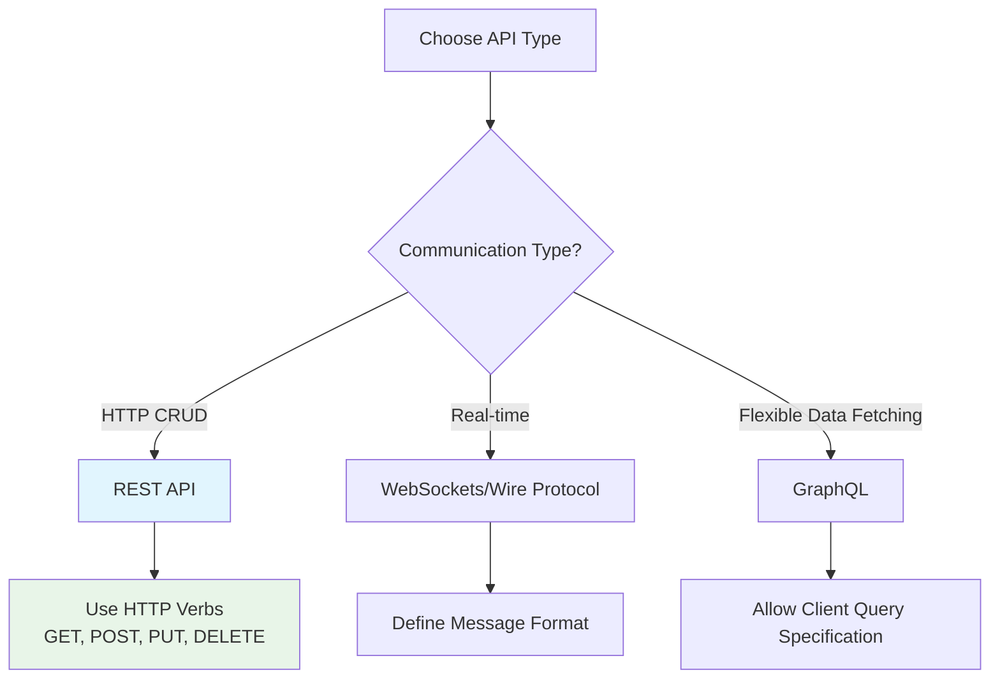
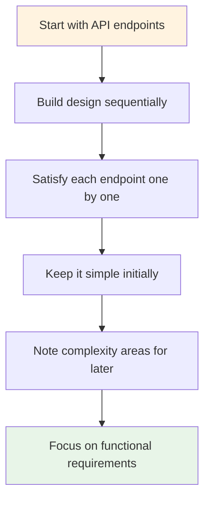
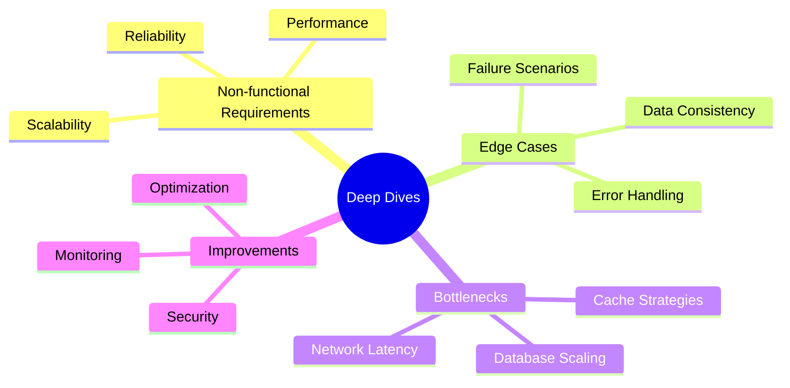
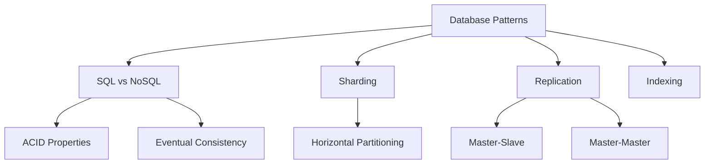
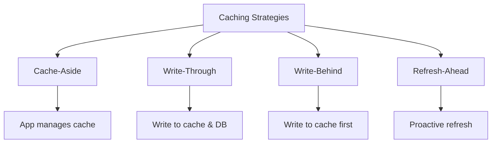
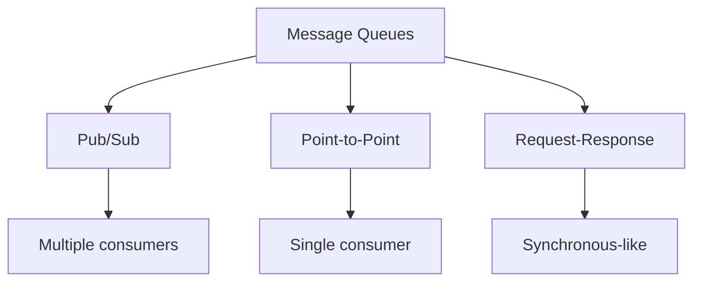

```mermaid
gantt
    title System Design Interview Timeline
    dateFormat X
    axisFormat %s

    section Requirements
    Functional Requirements    :done, req1, 0, 3
    Non-functional Requirements :done, req2, 3, 5

    section Core Setup
    Core Entities    :done, entities, 5, 7
    API Design       :done, api, 7, 12

    section Design
    High Level Design :done, hld, 12, 27
    Deep Dives       :done, deep, 27, 37

    section Wrap-up
    Questions & Summary :done, wrap, 37, 45
```

# System Design Interview Guide

## 🎯 Core Principle

**The #1 goal is to deliver a working system.** Most candidates fail due to poor time management and not focusing on the right things.

## 📋 Interview Structure & Timeline (45 minutes total)



---

## 1. Requirements (~5 minutes)

### Functional Requirements (3 mins)

**Goal**: Define what users can do with the system

**Format**: "Users/Clients should be able to..."

**Strategy**:

- Ask targeted questions like you're talking to a product manager
- Focus on TOP 3 core features only
- Prioritize ruthlessly - long lists hurt more than help

**Example (Twitter)**:

- Users should be able to post tweets
- Users should be able to follow other users
- Users should be able to see tweets from users they follow

### Non-functional Requirements (2 mins)

**Goal**: Define system qualities and constraints

**Format**: "The system should be..." or "The system should be able to..."

**Key Areas Checklist**:

- **CAP Theorem**: Consistency vs Availability?
- **Scalability**: Read vs write ratio? Traffic patterns?
- **Latency**: Response time requirements?
- **Environment**: Mobile? Bandwidth constraints?
- **Durability**: Data loss tolerance?
- **Security**: Access control needs?
- **Compliance**: Regulatory requirements?

**Example (Twitter)**:

- High availability over consistency
- Scale to 100M+ DAUs
- Feed rendering < 200ms latency

### Capacity Estimation

**Recommendation**: Skip upfront calculations unless they directly influence design

**When to calculate**:

- When numbers affect architectural decisions
- Example: TopK system - need to know if single heap vs sharded approach

---

## 2. Core Entities (~2 minutes)

**Goal**: Identify key data objects in your system

**Strategy**:

- List core nouns/resources needed for functional requirements
- Don't define full data model yet - iterate as you design
- Choose good names (avoid foo/bar)

**Questions to ask**:

- Who are the actors in the system?
- What resources are necessary for requirements?

**Example (Twitter)**:

- User
- Tweet
- Follow

---

## 3. API Design (~5 minutes)

**Goal**: Define the contract between system and users

### API Choice Decision Tree



**Default Choice**: REST API (unless you have specific needs)

### Security Best Practices

- Get user ID from authentication token, not request body
- Never put sensitive info in request body
- Use proper HTTP status codes

**Example (Twitter REST API)**:

```
POST /v1/tweet
body: { "text": string }

GET /v1/tweet/:tweetId -> Tweet

POST /v1/follow/:userId

GET /v1/feed -> Tweet[]
```

---

## 4. High Level Design (~10-15 minutes)

**Goal**: Draw boxes and arrows showing system components

### Design Strategy



### Key Components to Consider

- **Servers**: Web servers, application servers
- **Databases**: SQL, NoSQL, key-value stores
- **Caches**: Redis, Memcached
- **Message Queues**: Kafka, RabbitMQ
- **Load Balancers**: Distribute traffic
- **CDN**: Content delivery

### Best Practices

- Talk through your thought process
- Explain data flow from request to response
- Document relevant database columns/fields
- Don't over-engineer initially
- Stay focused on core requirements

---

## 5. Deep Dives (~10 minutes)

**Goal**: Harden your design for non-functional requirements

### Deep Dive Areas



### Common Deep Dive Topics

#### Scalability

- **Horizontal scaling**: Add more servers
- **Database sharding**: Split data across multiple DBs
- **Caching strategies**: Redis, CDN, application-level cache
- **Load balancing**: Round-robin, consistent hashing

#### Performance

- **Database optimization**: Indexing, query optimization
- **Caching patterns**: Cache-aside, write-through, write-behind
- **CDN usage**: Static content delivery
- **Connection pooling**: Reuse database connections

#### Reliability

- **Redundancy**: Multiple instances, backups
- **Failover mechanisms**: Automatic switching
- **Circuit breakers**: Prevent cascade failures
- **Monitoring**: Health checks, alerting

### Senior vs Junior Expectations

- **Junior**: Interviewer guides deep dives
- **Senior**: Proactively identify and lead discussions

---

## 🔧 Common System Design Patterns

### Database Patterns



### Caching Patterns



### Message Queue Patterns



---

## 💡 Key Interview Tips

### Do's ✅

- **Start simple** and iterate
- **Ask clarifying questions** early
- **Think out loud** - explain your reasoning
- **Draw diagrams** to visualize architecture
- **Consider trade-offs** explicitly
- **Scale incrementally** based on requirements
- **Leave room** for interviewer questions

### Don'ts ❌

- **Don't over-engineer** initially
- **Don't skip requirements** gathering
- **Don't assume** - ask questions
- **Don't rush** into implementation details
- **Don't ignore** non-functional requirements
- **Don't talk over** your interviewer

### Time Management

- **Stick to the timeline** - use a watch
- **Flag complexity** early but don't dive deep immediately
- **Save deep dives** for the end
- **If running behind**, communicate with interviewer

---

## 🎯 Common Failure Modes

### Top Reasons Candidates Fail

1. **No working system** - got lost in complexity
2. **Poor time management** - spent too long on one section
3. **Missed requirements** - didn't clarify what to build
4. **Over-engineering** - added unnecessary complexity
5. **Poor communication** - didn't explain thought process

### Red Flags to Avoid

- Jumping to solutions without understanding requirements
- Designing for unrealistic scale (billion users for a startup)
- Ignoring the interviewer's guidance
- Not considering failure scenarios
- Focusing only on happy path

---

## 📚 Study Resources

### Technologies to Know

- **Databases**: MySQL, PostgreSQL, MongoDB, Cassandra
- **Caches**: Redis, Memcached
- **Message Queues**: Kafka, RabbitMQ, AWS SQS
- **Load Balancers**: Nginx, HAProxy, AWS ELB
- **Monitoring**: Prometheus, Grafana, ELK Stack

### Practice Systems

- **Social Media**: Twitter, Facebook, Instagram
- **Messaging**: WhatsApp, Slack, Discord
- **Video**: YouTube, Netflix, TikTok
- **E-commerce**: Amazon, Uber, Airbnb
- **Search**: Google, Elasticsearch
- **Data**: Analytics dashboard, recommendation system

---

## 🚀 Final Checklist

Before your interview:

- [ ] Practice with the whiteboarding tool
- [ ] Review common system design patterns
- [ ] Understand CAP theorem and trade-offs
- [ ] Know basic capacity estimation formulas
- [ ] Practice explaining your thought process out loud
- [ ] Prepare questions about the company's architecture
- [ ] Get comfortable with the timeline and structure

Remember: **The goal is to demonstrate your ability to design systems that work, not to show off every technology you know.**
