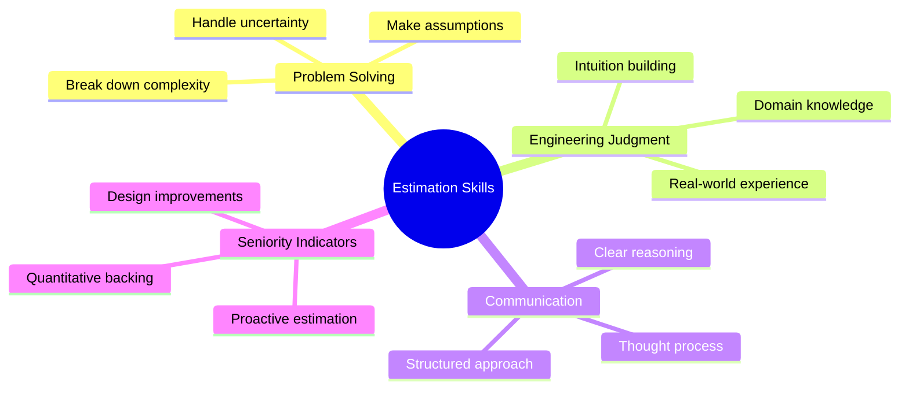
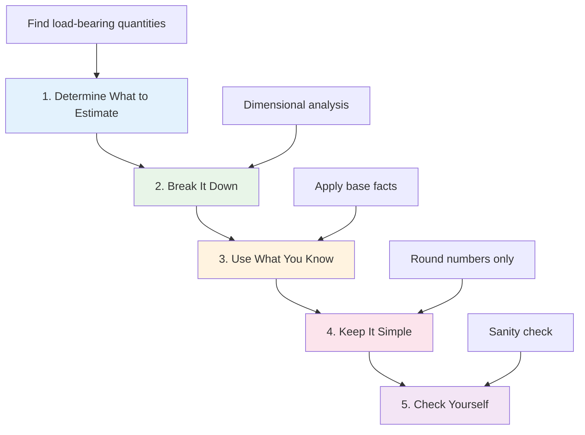
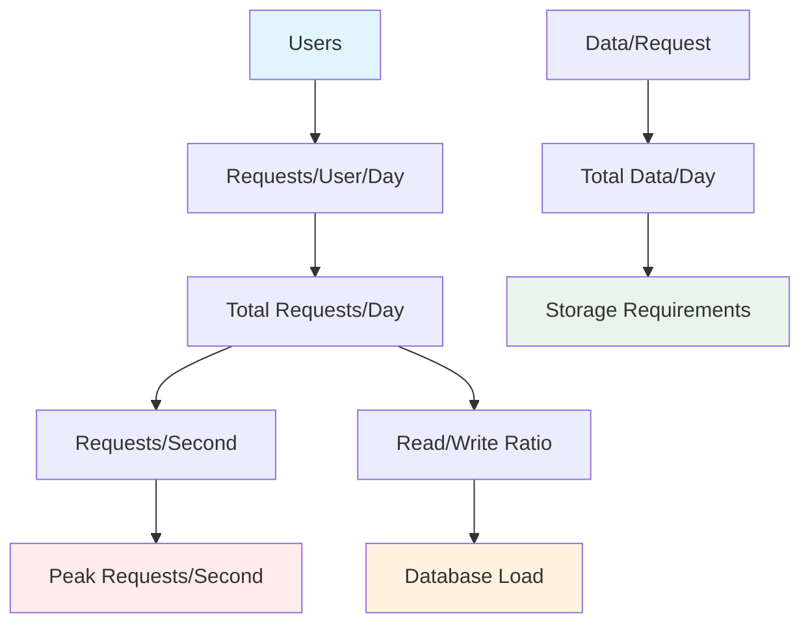
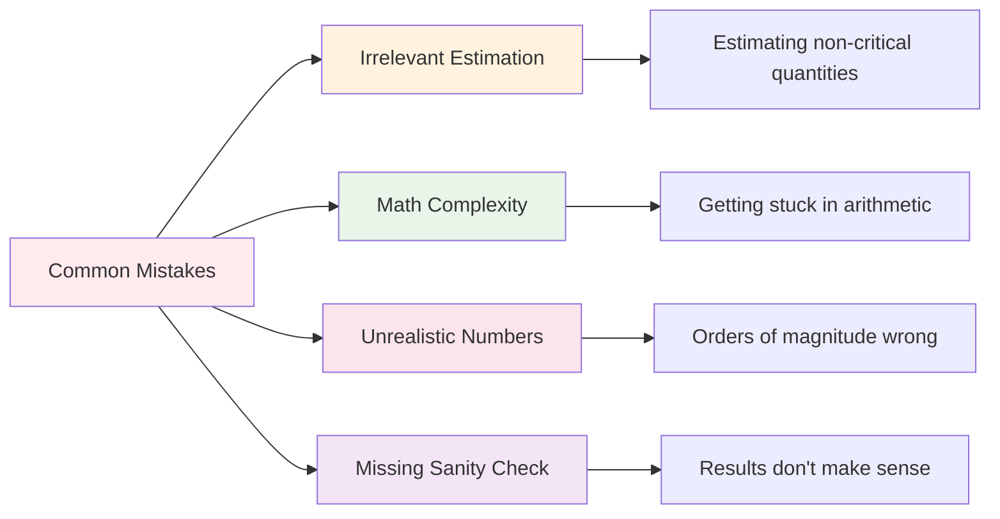
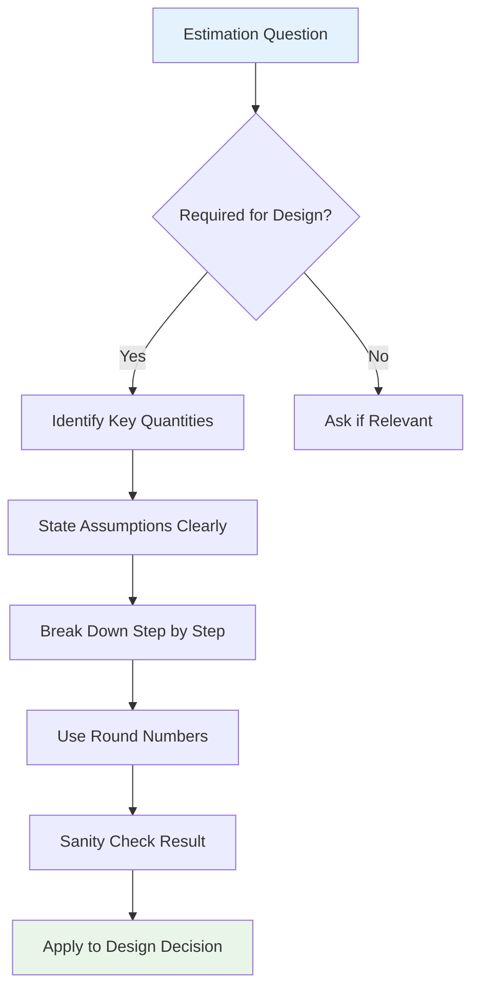

# System Design Estimation Guide
*Master the art of back-of-the-envelope calculations in technical interviews*

## 🎯 Why Estimation Matters

**Core Purpose**: Demonstrate problem-solving skills and engineering judgment with incomplete information

### What Interviewers Are Really Testing


### The Real-World Connection
- **Making decisions** with incomplete information
- **Quick capacity planning** for new features
- **Resource allocation** and budgeting
- **Performance optimization** decisions

---

## 📊 The Estimation Framework

### 5-Step Process


### Step 1: Determine What to Estimate
**Strategy**: Focus on the "crux" of your design problem

**Common Estimation Targets**:
- **Read/Write Throughput**: Bottleneck service capacity (usually DB or API)
- **Storage Requirements**: Memory vs disk vs archival
- **Network Bandwidth**: Data transfer needs
- **Processing Power**: CPU-intensive operations

**Example**: For Twitter Search, focus on search index storage size (memory vs disk trade-offs)

### Step 2: Break It Down (Dimensional Analysis)
**Goal**: Create a path from known quantities to unknown quantities

**Process**:
1. **Inventory what you know** about the problem
2. **Identify missing links** in your calculation chain
3. **Build the equation** step by step

**Example (Twitter Search Index)**:
```
Known: 
- Tweets: 140 characters (storage/tweet)
- Twitter DAU: 250M (users/day)

Need: tweets/user to get storage/day
Formula: (storage/tweet) × (tweets/user) × (users/day) = storage/day
```

---

## 📚 Essential Reference Tables

### Powers of 1000 (Memorize This!)
| Power | Number | Prefix | Example |
|-------|--------|---------|---------|
| 10³ | 1,000 | Kilo (K) | 1 KB |
| 10⁶ | 1,000,000 | Mega (M) | 1 MB |
| 10⁹ | 1,000,000,000 | Giga (G) | 1 GB |
| 10¹² | 1,000,000,000,000 | Tera (T) | 1 TB |
| 10¹⁵ | 1,000,000,000,000,000 | Peta (P) | 1 PB |

**Mental Math Tip**: When multiplying by 1,000, move up one row. For 1,000,000, move up two rows.

### Latency Numbers Every Engineer Should Know
| Action | Time | Comparison |
|--------|------|------------|
| Reading 1MB from memory | 0.25ms | Baseline |
| Reading 1MB from SSD | 1ms | **4x** memory |
| Reading 1MB from HDD | 20ms | **20x** SSD |
| Network round-trip (CA to Netherlands) | 150ms | **150x** SSD |
| Database query (simple) | 1ms | Same as SSD |
| Database query (complex) | 100ms | **100x** simple |

**Key Insight**: SSDs have revolutionized storage economics - many problems that once required clusters can now run on a single server with SSDs.

### Storage Sizes Reference
| Item | Size | Use Case |
|------|------|----------|
| Character (ASCII) | 1 byte | Text storage |
| Integer | 4 bytes | IDs, counters |
| Timestamp | 8 bytes | Created/updated times |
| UUID | 16 bytes | Unique identifiers |
| Small image | 100 KB | Profile pictures |
| High-res photo | 1 MB | Social media posts |
| Book (plain text) | 1 MB | Document storage |
| Song (MP3) | 4 MB | Audio streaming |
| HD movie | 1 GB | Video streaming |

### Business Metrics (Order of Magnitude)
| Metric | Value | Context |
|--------|-------|---------|
| Major social network DAU | 1B | Facebook, Instagram |
| Google searches/second | 100K | Search systems |
| Netflix hours streamed/day | 100M | Video streaming |
| Wikipedia total size | 100 GB | Knowledge base |
| Average user social posts/day | 1-10 | Content creation |
| Email messages/user/day | 10-100 | Communication |

---

## 🔧 Estimation Patterns & Formulas

### Common Calculation Patterns


### Key Formulas to Remember

#### Throughput Calculations
```
Daily requests = Users × Requests/User/Day
Requests/Second = Daily requests ÷ 86,400
Peak RPS = Average RPS × 3 (common peak factor)
```

#### Storage Calculations
```
Record size = Sum of all fields (rounded up)
Total storage = Records × Record size
With replication = Total storage × Replication factor
```

#### Bandwidth Calculations
```
Bandwidth = Data per request × Requests/Second
Monthly bandwidth = Daily bandwidth × 30
```

---

## 💡 Practical Examples

### Example 1: Twitter-like System
**Question**: How much storage for 1 billion tweets?

**Approach**:
```
1. Tweet structure:
   - Text: 140 chars = 140 bytes
   - Metadata: user_id(8) + timestamp(8) + tweet_id(8) = 24 bytes
   - Total per tweet: ~200 bytes (rounded)

2. Total storage:
   - 1B tweets × 200 bytes = 200GB
   - With replication (3x): 600GB
   - With indexing overhead (2x): 1.2TB
```

### Example 2: Video Streaming Service
**Question**: Bandwidth requirements for 1M concurrent users?

**Approach**:
```
1. Video quality assumptions:
   - Average bitrate: 2 Mbps
   - 1M concurrent users

2. Total bandwidth:
   - 1M users × 2 Mbps = 2 Tbps
   - Peak (3x): 6 Tbps
   - Monthly data: 2 Tbps × 86,400 sec/day × 30 days = 5.2 PB
```

### Example 3: Chat Application
**Question**: Message storage for 100M users?

**Approach**:
```
1. Message assumptions:
   - Average message: 100 bytes
   - Messages per user per day: 50
   - Active users: 100M

2. Daily storage:
   - 100M users × 50 messages × 100 bytes = 500GB/day
   - Annual storage: 500GB × 365 = 182TB
   - With metadata & indexing: ~400TB
```

---

## ⚠️ Common Mistakes to Avoid

### Red Flags


### Specific Pitfalls
- **Estimating storage for user profiles** when the problem is about real-time messaging
- **Calculating exact bytes** instead of rounding to manageable numbers
- **Claiming network calls take microseconds** (they take milliseconds)
- **Thinking 1GB can't fit in memory** (it easily can)
- **Forgetting to account for replication** and backup storage

---

## 🏋️ Building Your Estimation Muscle

### Practice Routine

```mermaid
gantt
    title Estimation Practice Timeline
    dateFormat X
    axisFormat %s
    
    section Daily (5 min)
    Basic Mental Math :done, math, 0, 5
    
    section Weekly (30 min)
    System Estimations :done, systems, 5, 35
    
    section Monthly (2 hours)
    Mock Interview Practice :done, mock, 35, 155
```


### Daily Practice Ideas
- **Email volume**: How many emails do you receive per week?
- **Data usage**: How much data does your phone use per month?
- **File sizes**: Estimate sizes of photos, documents, videos
- **Website traffic**: Guess daily visitors for popular sites

### System Design Practice
- **Social media**: Storage for Instagram photos
- **E-commerce**: Database size for Amazon product catalog
- **Gaming**: Bandwidth for 1M concurrent players
- **Finance**: Transaction processing for payment systems

### Validation Methods
1. **Check your guesses** against real data when possible
2. **Compare orders of magnitude** - being within 10x is often good enough
3. **Use online calculators** to verify complex calculations
4. **Research actual system specs** for popular services

---

## 🎯 Interview Strategy

### Before the Interview
- [ ] **Memorize key reference tables** (powers of 1000, latencies, storage sizes)
- [ ] **Practice mental math** with round numbers
- [ ] **Review common system patterns** and their typical scales
- [ ] **Prepare standard assumptions** for users, requests, data sizes

### During the Interview


### Communication Tips
- **Think out loud** - show your reasoning process
- **State assumptions** explicitly before calculating
- **Use round numbers** - don't get stuck in exact arithmetic
- **Relate to real-world** examples when possible
- **Ask for feedback** - "Does this seem reasonable?"

---

## 🚀 Advanced Estimation Techniques

### Sensitivity Analysis
**Question**: How much does your estimate change if key assumptions change?

**Example**:
```
Base case: 1M users, 10 requests/user/day = 10M requests/day
Sensitivity:
- 2x users: 20M requests/day
- 2x activity: 20M requests/day  
- Both 2x: 40M requests/day
```

### Bottleneck Analysis
**Focus on**: Which component will fail first as you scale?

**Common Bottlenecks**:
- **Database writes**: Usually the first to max out
- **Memory**: For caching and real-time systems
- **Network**: For high-bandwidth applications
- **CPU**: For compute-intensive operations

### Growth Projections
**Plan for**: How will your numbers change over time?

**Factors to Consider**:
- **User growth**: Exponential vs linear
- **Feature adoption**: New features increase usage
- **Market expansion**: Geographic scaling
- **Seasonal patterns**: Holiday spikes, daily cycles

---

## 📋 Quick Reference Cheat Sheet

### Essential Numbers
```
Time:
- 1 second = 1,000 milliseconds
- 1 day = 86,400 seconds
- 1 year = 31,536,000 seconds (~31.5M)

Storage:
- 1 KB = 1,000 bytes
- 1 MB = 1,000 KB = 1,000,000 bytes
- 1 GB = 1,000 MB = 1,000,000,000 bytes

Typical Scales:
- Small app: 1K-10K users
- Medium app: 100K-1M users  
- Large app: 10M-100M users
- Giant app: 1B+ users
```

### Quick Estimation Template
```
1. What am I estimating and why?
2. What do I know about this system?
3. What assumptions do I need to make?
4. Break it down: (known) × (estimated) = (target)
5. Sanity check: Does this make sense?
6. How does this affect my design?
```

---

## 🎉 Key Takeaways

**Remember**: Estimation is not about getting the exact right answer - it's about demonstrating:
- **Structured thinking** under pressure
- **Engineering judgment** with incomplete information  
- **Domain knowledge** and real-world intuition
- **Communication skills** in explaining your reasoning

**The goal**: Build quantitative foundation for design decisions, not solve math problems perfectly.

**Practice makes perfect**: The more you estimate, the better your intuition becomes. Start with everyday things and work up to system design problems.

**Stay confident**: Even experienced engineers make estimation mistakes. Focus on the process, not perfection.