# System Design Interview Guide

## 🎯 Core Principles

**Key Philosophy**: System design involves assembling the most effective building blocks to solve problems. Focus on **breadth before depth** - know at least one solution in each category rather than deep expertise in a few.

**Interview Strategy**:

- Choose technologies you're comfortable with
- Avoid unnecessary SQL vs NoSQL comparisons
- Focus on how your chosen tech solves the specific problem
- Depth expectations scale with seniority level

---

## 📊 Technology Categories Overview

---

## 🗄️ Core Database

### Relational Databases (Recommended for Product Design)

**When to Use**: Default choice for product interviews, transactional data, structured relationships

**Key Features**:

- **SQL Joins**: Combine data from multiple tables (watch for performance bottlenecks)
- **Indexes**: B-Tree/Hash Table for faster queries, support for multi-column indexes
- **ACID Transactions**: Atomic operations ensuring data consistency

**Popular Options**: PostgreSQL (recommended), MySQL

### NoSQL Databases (Recommended for Infrastructure Design)

**When to Use**: Flexible schemas, horizontal scaling, big data, real-time applications

**Key Features**:

- **Data Models**: Key-value, document, column-family, graph
- **Consistency Models**: Strong to eventual consistency
- **Horizontal Scaling**: Sharding and consistent hashing

**Popular Options**: DynamoDB (recommended), Cassandra, MongoDB

---

## 📁 Blob Storage

**Purpose**: Store large, unstructured files (images, videos, documents)

**Why Not Database**: Cost-effective and optimized for large files

**Common Pattern**: Database stores metadata + URLs, blob storage holds actual files

**Key Features**:

- **Durability**: Replication and erasure coding
- **Infinite Scalability**: No need to worry about limits in interviews
- **Cost Effective**: Much cheaper than database storage
- **Direct Client Access**: Presigned URLs for upload/download
- **Chunking**: Multipart uploads for large files

**Examples**: YouTube videos, Instagram images, Dropbox files

---

## 🔍 Search Optimized Database

**When to Use**: Full-text search requirements (avoid slow `LIKE '%term%'` queries)

**How It Works**: Inverted indexes map words to documents containing them

```mermaid
graph LR
    Doc1["Document 1: The quick brown fox"]
    Doc2["Document 2: Quick brown jumps"]
    Doc3["Document 3: The fox runs fast"]

    Index["Inverted Index:<br/>quick → Doc1,Doc2<br/>brown → Doc1,Doc2<br/>fox → Doc1,Doc3"]

    Query["Search: quick fox"] --> Index
    Index --> Result["Results: Doc1, Doc2, Doc3<br/>ranked by relevance"]
```

**Key Features**:

- **Inverted Indexes**: Core data structure for fast lookups
- **Tokenization**: Breaking text into searchable terms
- **Stemming**: Reducing words to root form (run, runs, running → run)
- **Fuzzy Search**: Handle typos and variations
- **Scaling**: Sharding across multiple nodes

**Popular Options**: Elasticsearch (recommended), PostgreSQL GIN indexes, Redis search

---

## 🚪 API Gateway

**Purpose**: Single entry point for microservices, handles cross-cutting concerns

**Key Responsibilities**:

- Request routing to appropriate services
- Authentication and authorization
- Rate limiting and throttling
- Logging and monitoring
- Request/response transformation

```mermaid
graph TB
    Client[Mobile/Web Clients] --> Gateway[API Gateway]
    Gateway --> Auth[Auth Service]
    Gateway --> Users[User Service]
    Gateway --> Posts[Post Service]
    Gateway --> Analytics[Analytics Service]

    Gateway --> Features["Cross-cutting Concerns:<br/>• Authentication<br/>• Rate Limiting<br/>• Logging<br/>• Monitoring"]
```

**Popular Options**: AWS API Gateway, Kong, Apigee, NGINX

---

## ⚖️ Load Balancer

**Purpose**: Distribute traffic across multiple servers to handle scale

**When to Use**: Whenever you have multiple servers handling the same requests

**Types**:

- **Layer 4 (L4)**: For persistent connections (WebSockets)
- **Layer 7 (L7)**: For HTTP routing flexibility

```mermaid
graph TB
    Users[Users] --> LB[Load Balancer]
    LB --> Server1[Server 1]
    LB --> Server2[Server 2]
    LB --> Server3[Server 3]

    LB --> Features["Features:<br/>• Health Checks<br/>• Sticky Sessions<br/>• SSL Termination<br/>• Request Routing"]
```

**Popular Options**: AWS ELB, NGINX, HAProxy

---

## 📨 Queue

**Purpose**: Buffer bursty traffic and decouple system components

**When to Use**:

- Handle traffic spikes
- Distribute work across workers
- Decouple producers from consumers

**⚠️ Caution**: Don't use for synchronous workloads with strict latency requirements

```mermaid
graph LR
    Producer[Producer<br/>1000 req/s] --> Queue[Queue<br/>Buffer]
    Queue --> Worker1[Worker 1<br/>200 req/s]
    Queue --> Worker2[Worker 2<br/>200 req/s]
    Queue --> Worker3[Worker 3<br/>200 req/s]

    Queue --> Features["Features:<br/>• FIFO Ordering<br/>• Retry Mechanisms<br/>• Dead Letter Queues<br/>• Partitioning"]
```

**Key Concepts**:

- **Message Ordering**: Usually FIFO
- **Retry Mechanisms**: Configurable retry attempts
- **Dead Letter Queues**: For failed messages
- **Backpressure**: Prevent system overload

**Popular Options**: Apache Kafka, AWS SQS

---

## 🌊 Streams / Event Sourcing

**Purpose**: Process large amounts of real-time data, support event sourcing

**When to Use**:

- Real-time data processing
- Event sourcing for audit trails
- Multiple consumers for same data

**Key Differences from Queues**:

- Data retention for configurable periods
- Multiple consumer groups
- Replay capability from any point in time

**Popular Options**: Apache Kafka, AWS Kinesis, Apache Flink

---

## 🔒 Distributed Lock

**Purpose**: Lock resources across distributed systems for short periods

**When to Use**:

- E-commerce checkout (hold items in cart)
- Ride-sharing driver assignment
- Prevent duplicate cron jobs
- Auction bidding systems

**Key Features**:

- **Expiry**: Automatic release after timeout
- **Atomicity**: Only one process can acquire lock
- **Deadlock Prevention**: Careful lock ordering

**Popular Options**: Redis (Redlock), ZooKeeper

---

## 🚄 Distributed Cache

**Purpose**: Store frequently accessed data in memory for fast retrieval

**When to Use**:

- Save expensive computations
- Reduce database queries
- Speed up complex queries

```mermaid
graph TB
    App[Application] --> Cache{Cache Hit?}
    Cache -->|Yes| Return[Return Cached Data]
    Cache -->|No| DB[Database]
    DB --> Store[Store in Cache]
    Store --> Return

    Cache --> Policies["Cache Policies:<br/>• LRU (Least Recently Used)<br/>• FIFO (First In, First Out)<br/>• LFU (Least Frequently Used)"]
```

**Cache Strategies**:

- **Write-Through**: Write to cache and DB simultaneously
- **Write-Around**: Write to DB, bypass cache
- **Write-Back**: Write to cache, async write to DB

**Data Structures**: Not just key-value! Use sorted sets, lists, hashes as appropriate

**Popular Options**: Redis (recommended), Memcached

---

## 🌐 CDN (Content Delivery Network)

**Purpose**: Deliver content quickly to users worldwide through geographically distributed servers

**When to Use**:

- Static assets (images, videos, CSS, JS)
- Dynamic content with infrequent changes
- API responses for global applications

```mermaid
graph TB
    User1[User in NYC] --> Edge1[NYC Edge Server]
    User2[User in London] --> Edge2[London Edge Server]
    User3[User in Tokyo] --> Edge3[Tokyo Edge Server]

    Edge1 --> Origin[Origin Server]
    Edge2 --> Origin
    Edge3 --> Origin

    Origin --> Features["Features:<br/>• Geographic Distribution<br/>• Cache Invalidation<br/>• DDoS Protection<br/>• SSL Termination"]
```

**Key Features**:

- **Global Edge Locations**: Servers close to users
- **Cache Invalidation**: Update content when changed
- **TTL Management**: Control cache expiration
- **Not Just Static**: Can cache API responses

**Popular Options**: CloudFlare, Akamai, AWS CloudFront

---

## 🏗️ Common Architecture Patterns

### Basic Web Application

### Event-Driven Architecture

### Microservices with Caching

---

## 📝 Interview Tips

### Do's ✅

- **Start with requirements**: Clarify functional and non-functional requirements
- **Estimate scale**: Users, requests per second, data size
- **Choose familiar technologies**: Pick what you know best
- **Focus on trade-offs**: Explain why you chose specific solutions
- **Draw diagrams**: Visual representations help communicate ideas
- **Consider failure modes**: How does your system handle failures?

### Don'ts ❌

- **Don't over-engineer**: Start simple, add complexity when needed
- **Avoid unnecessary comparisons**: Skip SQL vs NoSQL debates unless asked
- **Don't ignore non-functional requirements**: Consider scalability, reliability, consistency
- **Don't forget about monitoring**: How will you know if your system is working?

### Key Questions to Ask 🤔

1. **What is the scale?** (Users, requests, data size)
2. **What are the most important features?** (Prioritize requirements)
3. **What are the performance expectations?** (Latency, throughput)
4. **What is the consistency requirement?** (Strong vs eventual consistency)
5. **What is the availability requirement?** (99.9% vs 99.99%)

---

## 🎯 Technology Selection Guide

| Use Case                       | Recommended Technology | Alternative          |
| ------------------------------ | ---------------------- | -------------------- |
| Product Design Database        | PostgreSQL             | MySQL                |
| Infrastructure Design Database | DynamoDB               | Cassandra            |
| File Storage                   | AWS S3                 | Google Cloud Storage |
| Search                         | Elasticsearch          | PostgreSQL GIN       |
| API Gateway                    | AWS API Gateway        | Kong                 |
| Load Balancer                  | AWS ELB                | NGINX                |
| Queue                          | Apache Kafka           | AWS SQS              |
| Cache                          | Redis                  | Memcached            |
| CDN                            | CloudFlare             | AWS CloudFront       |
| Distributed Lock               | Redis                  | ZooKeeper            |

---

## 📚 Common System Design Examples

### Social Media Platform (Instagram/Twitter)

- **Database**: PostgreSQL for user data, relationships
- **Blob Storage**: S3 for images/videos
- **Cache**: Redis for feeds, user sessions
- **CDN**: CloudFlare for global content delivery
- **Queue**: Kafka for notifications, analytics events
- **Search**: Elasticsearch for user/content search

### E-commerce Platform (Amazon)

- **Database**: PostgreSQL for products, orders
- **Cache**: Redis for product catalog, user sessions
- **Queue**: SQS for order processing
- **Blob Storage**: S3 for product images
- **CDN**: CloudFront for static assets
- **Distributed Lock**: Redis for inventory management

### Video Streaming (Netflix/YouTube)

- **Database**: NoSQL for user preferences, metadata
- **Blob Storage**: S3 for video files
- **CDN**: Global CDN for video delivery
- **Cache**: Redis for recommendations
- **Streams**: Kafka for viewing analytics
- **Search**: Elasticsearch for content discovery

Remember: **Focus on breadth first, then add depth based on interviewer interest!** 🚀
