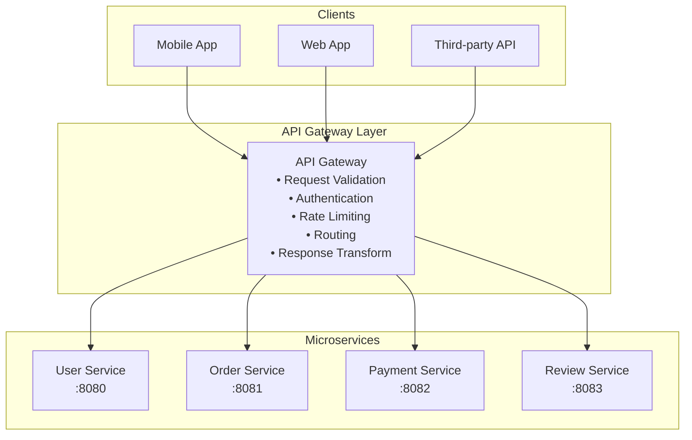
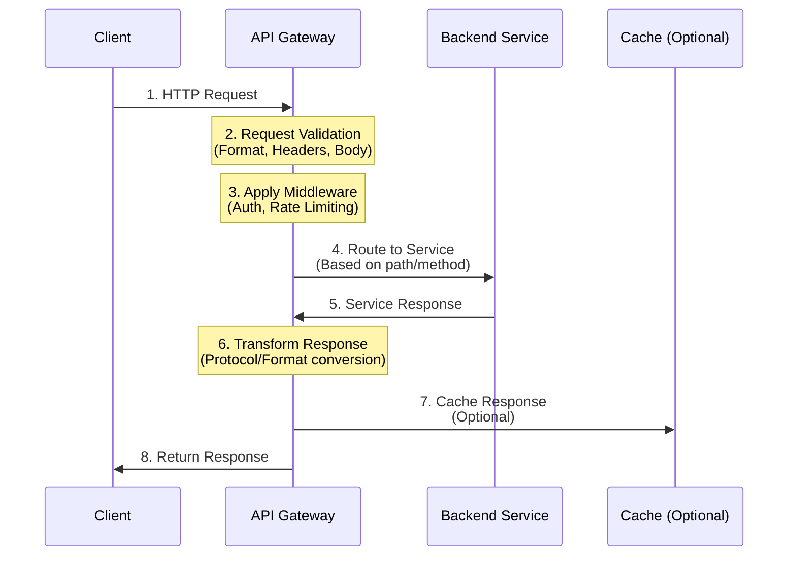
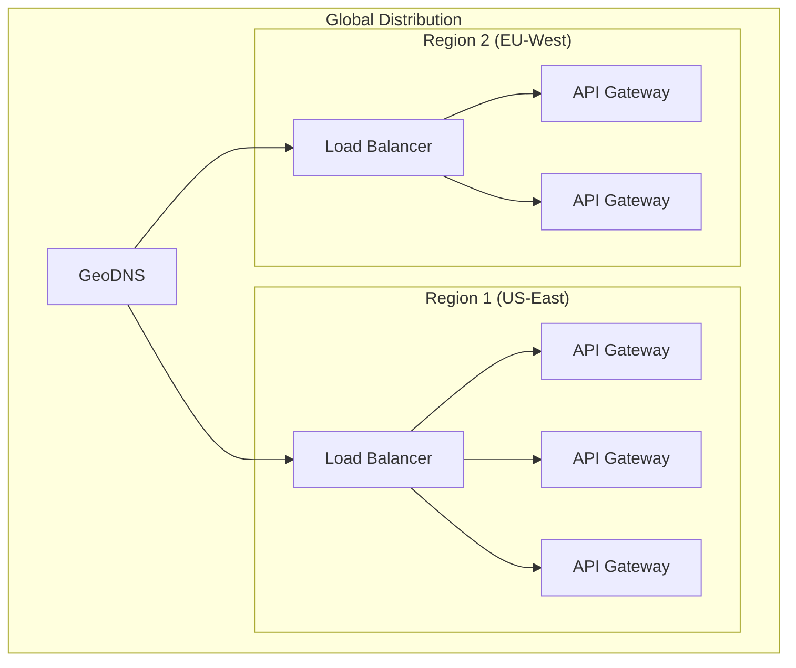

# API Gateway - System Design Interview Guide

## 🎯 Quick Summary

**API Gateway** = Single entry point for all client requests in a microservices architecture

- Think of it as the **front desk at a luxury hotel** - handles all guest requests without exposing internal structure
- **Key Interview Tip**: Mention it briefly ("I'll add an API Gateway to handle routing and basic middleware") and move on - don't spend too much time on it!

## 📊 Architecture Overview



## 🔄 Request Flow (6 Steps)



### Detailed Steps:

1. **Request Validation**

   - Check URL validity
   - Verify required headers
   - Validate request body format
   - Early rejection of malformed requests

2. **Middleware Processing**

   - **Authentication** (JWT tokens, API keys)
   - **Rate Limiting** (prevent abuse)
   - **IP Whitelisting/Blacklisting**
   - SSL termination
   - CORS handling
   - Request logging & monitoring

3. **Routing**

   ```yaml
   routes:
     - path: /users/*
       service: user-service
       port: 8080
     - path: /orders/*
       service: order-service
       port: 8081
     - path: /payments/*
       service: payment-service
       port: 8082
   ```

4. **Backend Communication**

   - Protocol translation (HTTP ↔ gRPC)
   - Service discovery integration

5. **Response Transformation**

   - Format conversion (gRPC → JSON)
   - Response aggregation
   - Error formatting

6. **Caching (Optional)**
   - Full response caching
   - Partial caching
   - TTL-based invalidation

## 🚀 Scaling Strategies



### Scaling Approaches:

1. **Horizontal Scaling**: Add more stateless gateway instances
2. **Global Distribution**: Deploy in multiple regions with GeoDNS
3. **Configuration Sync**: Ensure consistency across regions

## 🛠️ Popular API Gateway Solutions

### Managed Services (Easy but Expensive)

- **AWS API Gateway**: Lambda integration, CloudWatch monitoring
- **Azure API Management**: OAuth support, policy-based config
- **Google Cloud Endpoints**: gRPC support, automatic OpenAPI docs

### Open Source (More Control)

- **Kong**: NGINX-based, extensive plugins
- **Tyk**: GraphQL support, built-in analytics
- **Express Gateway**: Node.js based, lightweight

## ✅ When to Use API Gateway

### ✅ **USE** When You Have:

- **Microservices architecture**
- Multiple backend services
- Need for centralized cross-cutting concerns
- Multiple client types (web, mobile, IoT)
- Need for protocol translation

### ❌ **DON'T USE** When You Have:

- Simple monolithic application
- Single client-server architecture
- Direct service-to-service communication only
- Small-scale applications with minimal complexity

## 🎯 Interview Best Practices

### What to Say:

> "I'll add an API Gateway here to handle request routing to our microservices and manage cross-cutting concerns like authentication and rate limiting."

### What NOT to Do:

- ❌ Spend more than 1-2 minutes explaining it
- ❌ Deep dive into specific vendor features
- ❌ Forget to mention the primary purpose (routing)
- ❌ Overemphasize middleware at the expense of core functionality

### Quick Wins:

1. **Draw it simply**: Single box labeled "API Gateway + Load Balancer"
2. **Mention briefly**: Routing + basic middleware
3. **Move on quickly**: Focus on core system functionality
4. **If pressed for details**: Mention horizontal scaling and caching

## 🔑 Key Takeaways

1. **Primary Purpose**: Request routing in microservices
2. **Secondary Features**: Authentication, rate limiting, caching
3. **Stateless Nature**: Easy to scale horizontally
4. **Interview Strategy**: Keep it brief - it's not the star of your design
5. **Common Mistake**: Spending too much time on API Gateway details

## 💡 Additional Considerations

### Protocol Support

- HTTP/HTTPS (most common)
- WebSocket (real-time communication)
- gRPC (internal services)
- GraphQL (query aggregation)

### Security Features

- API key management
- OAuth 2.0 / JWT validation
- Request/response encryption
- DDoS protection
- Request size limits

### Monitoring & Analytics

- Request/response logging
- Performance metrics
- Error tracking
- Usage analytics
- SLA monitoring

### Advanced Features (Mention Only if Relevant)

- **Service Mesh Integration**: Works with Istio, Linkerd
- **Circuit Breaker**: Prevents cascading failures
- **Request/Response Modification**: Header injection, body transformation
- **API Versioning**: Support multiple API versions simultaneously
- **Webhook Management**: Event-driven architecture support

## 📝 Sample Interview Response

**Interviewer**: "How would you handle multiple microservices in your design?"

**You**: "I'll introduce an API Gateway as a single entry point for all client requests. It will handle request routing to the appropriate microservices based on URL paths and HTTP methods. Additionally, it can manage cross-cutting concerns like authentication and rate limiting. Since API Gateways are stateless, we can easily scale them horizontally behind a load balancer to handle increased traffic. For this design, I'll keep it simple and move on to the core business logic."

---

**Remember**: The API Gateway is important but not the most interesting part of your system design. Get it down, explain briefly, and focus on the unique aspects of your solution! 🚀

# API Gateway - Last Minute Revision Points 🎯

## Core Definition

• **Single entry point** for all client requests in microservices
• Think: **"Front desk of a hotel"** - handles all requests, hides internal complexity
• **Stateless** = Easy horizontal scaling

## Primary Functions (Must Mention)

• **Request Routing** - Directs requests to correct microservice
• **Protocol Translation** - HTTP ↔ gRPC conversion
• **Response Aggregation** - Combine multiple service responses

## Secondary Functions (Quick Mentions)

• **Authentication** - JWT/API key validation
• **Rate Limiting** - Prevent abuse (e.g., 1000 req/min)
• **Caching** - Store frequent responses
• **Load Balancing** - Distribute traffic
• **CORS Handling** - Cross-origin requests

## Request Flow (6 Steps)

1. Client sends request → API Gateway
2. Validate request format/headers
3. Apply middleware (auth, rate limit)
4. Route to appropriate service
5. Transform response if needed
6. Return response to client

## Scaling Strategy

• **Horizontal scaling** - Add more gateway instances
• **Multi-region** - Deploy globally with GeoDNS
• Place behind **Load Balancer**
• Use **Redis/Memcached** for shared rate limit counters

## When to Use ✅

• Multiple microservices
• Different client types (web, mobile, IoT)
• Need centralized auth/rate limiting
• Protocol translation required

## When NOT to Use ❌

• Simple monolithic app
• Single client-server setup
• Direct service-to-service only
• Small-scale applications

## Popular Solutions

• **Managed**: AWS API Gateway, Azure API Management, Google Cloud Endpoints
• **Open Source**: Kong (NGINX-based), Tyk, Express Gateway

## Interview Quick Win Formula 🏆

### What to Say (30 seconds):

> "I'll add an API Gateway as the single entry point. It handles:
>
> 1. Request routing to microservices
> 2. Cross-cutting concerns like auth and rate limiting
> 3. Protocol translation if needed
>    Since it's stateless, we can scale it horizontally behind a load balancer."

### Then MOVE ON! Don't spend more than 1-2 minutes total.

## Common Pitfalls to Avoid ⚠️

• Don't deep dive into vendor features
• Don't forget to mention routing (primary purpose!)
• Don't spend too much time on it
• Don't confuse with Load Balancer (they work together)

## Key Numbers for Interviews

• Typical latency: **5-10ms** overhead
• Can handle: **10K-100K requests/sec** per instance
• Cache hit ratio: **60-80%** for read-heavy systems
• Rate limiting: Usually **1000-10000 requests/min** per client

## Quick Diagram to Draw

```
[Clients] → [Load Balancer] → [API Gateway Cluster] → [Microservices]
                                      ↓
                                 [Cache Layer]
```

## Last Second Reminder 💡

**API Gateway = Traffic Cop** directing requests to the right place with some security checks. That's it! Keep it simple, mention briefly, focus on your unique solution.
