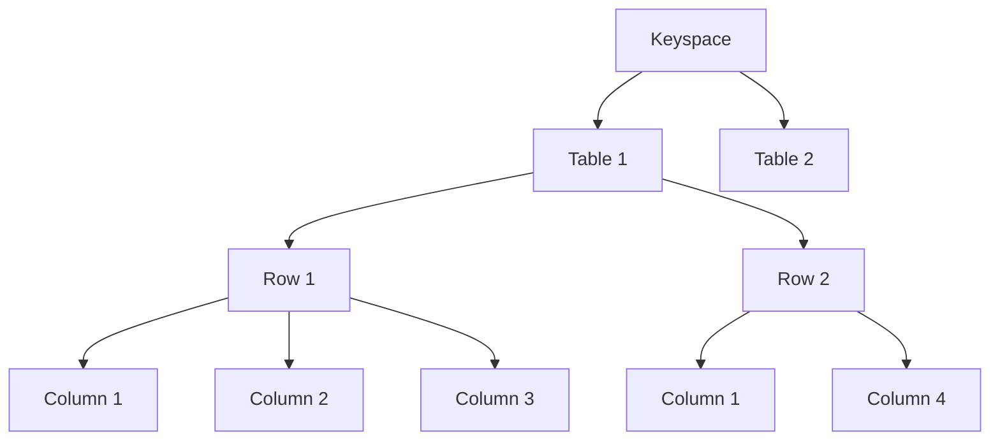
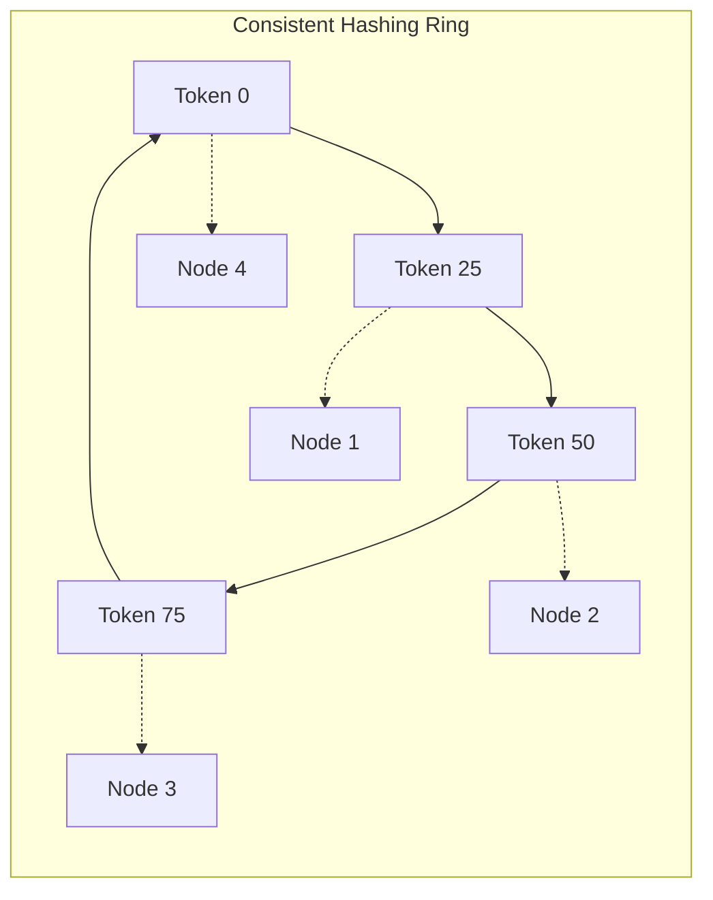
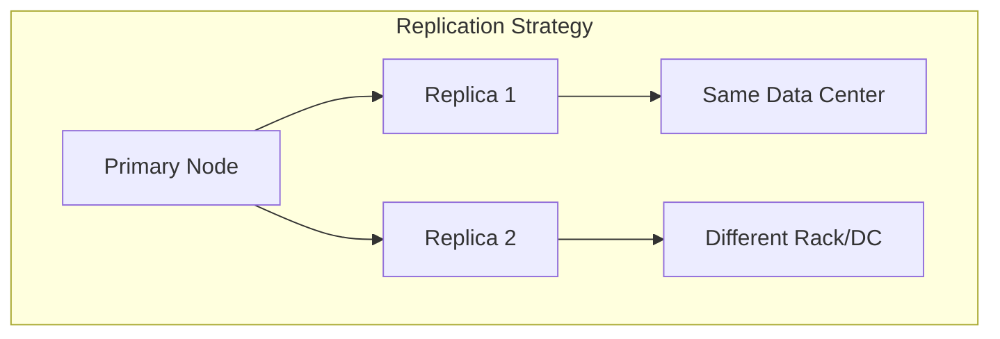
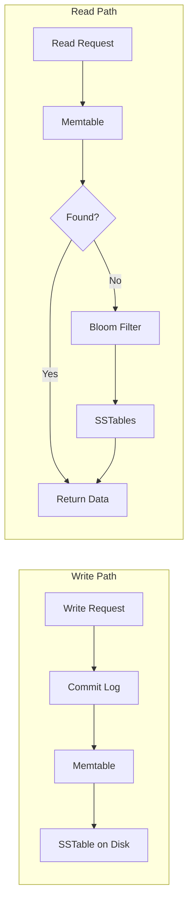
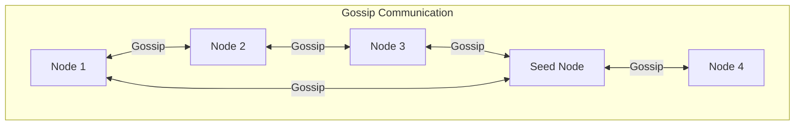
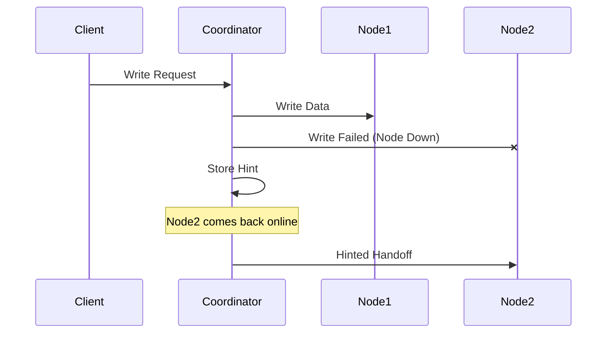

# Cassandra Deep Dive - System Design Interview Guide

## Overview

Apache Cassandra is an **open-source, distributed NoSQL database** that implements a partitioned wide-column storage model with eventually consistent semantics. Originally built by Facebook for their inbox search feature, it's now used by Discord, Netflix, Apple, Bloomberg, and many others.

**Key Characteristics:**

- Combines elements of Amazon's Dynamo and Google's Bigtable
- Horizontally scalable via commodity hardware
- Optimized for high write throughput
- Eventually consistent (AP in CAP theorem)
- No single point of failure

## Data Model

### Core Components



1. **Keyspace**: Container for tables (like a database in RDBMS)

   - Owns replication strategy configuration
   - Contains user-defined types (UDTs)

2. **Table**: Container for rows with configuration metadata

3. **Row**: Data container represented by a primary key

4. **Column**: Contains name, type, value, and timestamp metadata
   - Wide-column flexibility: not all columns needed per row
   - Conflicts resolved via "last write wins" using timestamps

### Primary Key Structure

```sql
-- Simple primary key (partition key only)
PRIMARY KEY (partition_key)

-- Composite primary key (partition + clustering keys)
PRIMARY KEY ((partition_key), clustering_key)

-- Composite partition key
PRIMARY KEY ((part_key1, part_key2), clustering_key)

-- Multiple clustering keys
PRIMARY KEY (partition_key, cluster_key1, cluster_key2)
```

**Components:**

- **Partition Key**: Determines data partition/node location
- **Clustering Key**: Determines sorted order within partition

## Key Concepts

### 1. Partitioning - Consistent Hashing



**How it works:**

- Data hashed to a token on a ring (0-2^127)
- Walk clockwise to find responsible node
- Virtual nodes (vnodes) for better load distribution
- Minimizes data movement when nodes join/leave

### 2. Replication



**Replication Strategies:**

- **NetworkTopologyStrategy** (Production):
  - Data center and rack aware
  - Survives DC/rack failures
- **SimpleStrategy** (Testing):
  - Simple clockwise replication

```sql
-- Production setup with multi-DC replication
ALTER KEYSPACE myapp WITH REPLICATION = {
    'class': 'NetworkTopologyStrategy',
    'dc1': 3,  -- 3 replicas in DC1
    'dc2': 2   -- 2 replicas in DC2
};
```

### 3. Consistency Levels

| Level        | Write Requirement      | Read Requirement   | Use Case                        |
| ------------ | ---------------------- | ------------------ | ------------------------------- |
| ONE          | 1 replica acknowledges | 1 replica responds | Maximum availability            |
| QUORUM       | (n/2 + 1) replicas     | (n/2 + 1) replicas | Balanced consistency            |
| ALL          | All replicas           | All replicas       | Maximum consistency             |
| LOCAL_QUORUM | Quorum in local DC     | Quorum in local DC | Multi-DC with local consistency |

**Important:** Cassandra does NOT support:

- ACID transactions
- Foreign keys
- JOINs
- Referential integrity

### 4. Storage Model - LSM Tree



**Write Process:**

1. Write to commit log (durability)
2. Write to Memtable (in-memory, sorted)
3. Flush Memtable to SSTable when threshold reached
4. Periodic compaction consolidates SSTables

**Key Features:**

- Append-only writes (extremely fast)
- Updates/deletes are new entries
- Tombstones mark deletions
- Compaction removes obsolete data

### 5. Gossip Protocol



**Purpose:**

- Nodes share cluster state information
- No single point of failure
- Tracks node health, schema, token ownership
- Seed nodes bootstrap cluster communication

### 6. Fault Tolerance - Hinted Handoffs



## Data Modeling Best Practices

### Query-Driven Design

Unlike relational databases, Cassandra modeling is **query-driven**, not entity-relationship driven.

**Key Considerations:**

1. **Access patterns first** - Design tables around queries
2. **Denormalization is good** - Duplicate data across tables
3. **Partition size matters** - Keep partitions manageable
4. **One query per table** - No JOINs available

### Example 1: Discord Messages

**Problem:** Store chat messages for channels with high volume

**Initial Design (Problems with large partitions):**

```sql
CREATE TABLE messages (
    channel_id bigint,
    message_id bigint,  -- Snowflake ID (time-sortable UUID)
    author_id bigint,
    content text,
    PRIMARY KEY (channel_id, message_id)
) WITH CLUSTERING ORDER BY (message_id DESC);
```

**Improved Design (Time bucketing):**

```sql
CREATE TABLE messages (
    channel_id bigint,
    bucket int,  -- 10-day time buckets
    message_id bigint,
    author_id bigint,
    content text,
    PRIMARY KEY ((channel_id, bucket), message_id)
) WITH CLUSTERING ORDER BY (message_id DESC);
```

**Benefits:**

- Partitions bounded by time (10 days)
- Recent messages in single partition
- Prevents unbounded partition growth

### Example 2: Ticketmaster Event Tickets

**Requirements:** Show available seats for events with venue maps

**Design with Section Partitioning:**

```sql
-- Individual tickets per section
CREATE TABLE tickets (
    event_id bigint,
    section_id bigint,
    seat_id bigint,
    price decimal,
    PRIMARY KEY ((event_id, section_id), seat_id)
);

-- Denormalized section summaries
CREATE TABLE event_sections (
    event_id bigint,
    section_id bigint,
    num_tickets int,
    price_floor decimal,
    PRIMARY KEY (event_id, section_id)
);
```

**Benefits:**

- Distributes event data across nodes
- Efficient section-level queries
- Denormalized aggregates avoid expensive computations

## Advanced Features

### 1. Storage Attached Indexes (SAI)

- Secondary indexes for flexible querying
- Performance trade-off vs primary key queries
- Good for less frequent access patterns

### 2. Materialized Views

- Automatic denormalization
- Cassandra maintains consistency
- Reduces application complexity

```sql
CREATE MATERIALIZED VIEW user_by_email AS
    SELECT * FROM users
    WHERE email IS NOT NULL
    PRIMARY KEY (email, user_id);
```

### 3. Search Integration

- Can integrate with Elasticsearch/Solr
- Enables full-text search capabilities

## When to Use Cassandra

### ✅ Good For:

- **High write throughput** systems
- **Availability over consistency** (AP systems)
- **Time-series data** (IoT, metrics, logs)
- **Geographically distributed** systems
- **Large scale** with predictable access patterns
- **Wide-column flexibility** (sparse data)

### ❌ Not Good For:

- **ACID transactions** required
- **Complex queries** (JOINs, ad-hoc aggregations)
- **Strong consistency** requirements
- **Small datasets** (overhead not justified)
- **Frequently changing schemas**

## System Design Interview Tips

### 1. Capacity Planning

```
Storage = (avg_row_size × num_rows × replication_factor)
Nodes = Storage / (node_capacity × 0.7)  // 70% utilization
```

### 2. Performance Characteristics

- **Writes**: ~10,000-100,000 ops/sec per node
- **Reads**: ~5,000-50,000 ops/sec per node
- **Latency**: Sub-millisecond for cached, single-digit ms for disk

### 3. Trade-offs to Discuss

- **CAP Theorem**: AP system, tunable consistency
- **Write vs Read**: Optimized for writes
- **Storage**: Higher due to replication and tombstones
- **Operational**: More complex than single-node DBs

### 4. Common Patterns

**Time-Series Data:**

```sql
PRIMARY KEY ((sensor_id, date_bucket), timestamp)
```

**User Activity Feed:**

```sql
PRIMARY KEY ((user_id), activity_timestamp)
```

**Leaderboard:**

```sql
PRIMARY KEY ((game_id, time_bucket), score, player_id)
```

## Key Takeaways

1. **Cassandra = Distributed, NoSQL, Wide-Column, Eventually Consistent**
2. **Design around queries, not entities**
3. **Partition key selection is critical**
4. **Denormalization is your friend**
5. **Excellent for write-heavy, distributed systems**
6. **Not suitable for ACID or complex queries**
7. **Tunable consistency via consistency levels**
8. **No single point of failure with gossip protocol**

## Quick Reference Commands

```sql
-- Create keyspace
CREATE KEYSPACE myapp WITH REPLICATION = {
    'class': 'NetworkTopologyStrategy',
    'datacenter1': 3
};

-- Create table with TTL
CREATE TABLE events (
    id UUID PRIMARY KEY,
    data text
) WITH default_time_to_live = 86400;  -- 24 hours

-- Query with consistency
SELECT * FROM events WHERE id = ?
CONSISTENCY QUORUM;

-- Check cluster status
nodetool status

-- Repair data
nodetool repair
```

## Interview Checklist

- [ ] Explain CAP theorem position (AP)
- [ ] Describe consistent hashing
- [ ] Explain replication strategy
- [ ] Design schema for given use case
- [ ] Discuss partition key selection
- [ ] Calculate capacity requirements
- [ ] Identify when NOT to use Cassandra
- [ ] Compare with alternatives (DynamoDB, MongoDB, HBase)

I'll create concise, memorable bullet points for last-minute Cassandra revision:

## 🎯 Cassandra Quick Revision Points

### **Core Identity**

• **Distributed NoSQL** database - wide-column store, no single point of failure
• **AP in CAP theorem** - prioritizes Availability & Partition tolerance over Consistency
• **Eventually consistent** by default, but tunable via consistency levels
• Originally built by **Facebook**, combines **Amazon Dynamo** (distribution) + **Google Bigtable** (data model)

### **Data Model Hierarchy**

• **Keyspace** → **Table** → **Row** → **Column**
• **Primary Key = Partition Key + Clustering Key**
• Partition key determines **which node**, clustering key determines **sort order within partition**
• **Wide-column** = rows can have different columns (sparse data friendly)

### **Key Architecture Components**

• **Consistent Hashing Ring** - data distributed using token ranges (0 to 2^127)
• **Virtual Nodes (vnodes)** - better load distribution across physical nodes
• **Gossip Protocol** - peer-to-peer cluster state communication
• **Seed Nodes** - bootstrap new nodes joining cluster

### **Storage Engine (LSM Tree)**

• **Write Path**: Commit Log → Memtable → SSTable (always append-only)
• **Read Path**: Memtable → Bloom Filter → SSTables
• **Compaction** merges SSTables and removes tombstones
• **Tombstones** mark deletions (deleted data isn't immediately removed)

### **Replication & Consistency**

• **Replication Factor** = number of copies (typically 3)
• **NetworkTopologyStrategy** for production (rack/DC aware)
• **Consistency Levels**: ONE (fast), QUORUM (balanced), ALL (strong)
• **Formula**: QUORUM = (RF/2) + 1

### **Fault Tolerance**

• **Hinted Handoffs** - coordinator stores writes for down nodes temporarily
• **Read Repair** - fixes inconsistencies during reads
• **Anti-entropy Repair** - periodic background consistency checks

### **Data Modeling Rules**

• **Query-driven design** - model tables around access patterns, NOT entities
• **Denormalization is good** - duplicate data across tables
• **One query per table** - no JOINs available
• **Avoid large partitions** - use time bucketing for unbounded growth

### **Performance Numbers**

• **Writes**: 10K-100K ops/sec per node
• **Reads**: 5K-50K ops/sec per node
• **Latency**: <1ms cached, 1-10ms disk
• **Partition Size**: Keep under 100MB

### **When to Use**

✅ **Use for**: High write throughput, time-series data, geo-distributed, IoT/metrics, chat messages
❌ **Avoid for**: ACID transactions, JOINs, complex queries, strong consistency, small datasets

### **Common Interview Patterns**

**Time-Series**:

```sql
PRIMARY KEY ((sensor_id, day_bucket), timestamp)
```

**User Activity**:

```sql
PRIMARY KEY ((user_id), activity_timestamp)
```

**Messages with Bucketing**:

```sql
PRIMARY KEY ((channel_id, time_bucket), message_id)
```

### **Critical Interview Points**

• **No ACID** - eventual consistency only
• **No foreign keys or JOINs** - denormalize instead
• **Writes are faster than reads** - optimized for writes
• **Compaction overhead** - background process consuming resources
• **Higher storage cost** - due to replication + tombstones

### **Comparison Quick Notes**

• vs **DynamoDB**: Cassandra is open-source, self-managed
• vs **MongoDB**: Cassandra better for writes, MongoDB better for flexible queries
• vs **HBase**: Cassandra is masterless, HBase has master nodes

### **Red Flags to Avoid in Interview**

• Don't suggest Cassandra for financial transactions
• Don't design with JOINs in mind
• Don't ignore partition size limits
• Don't forget about tombstones and compaction

### **Magic Formula for Capacity**

```
Nodes = (Data × RF) / (Node_Capacity × 0.7)
```

_RF = Replication Factor, 0.7 = 70% utilization target_

### **Last Second Memory Trick**

**"CGAP-WD"** = **C**assandra is **G**ood for **A**vailability & **P**artition tolerance, **W**rites, **D**istributed systems
