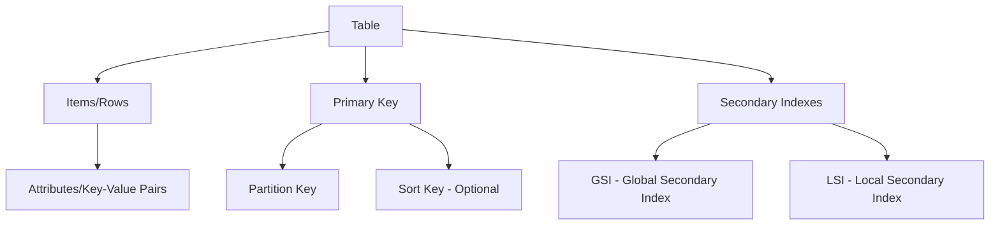
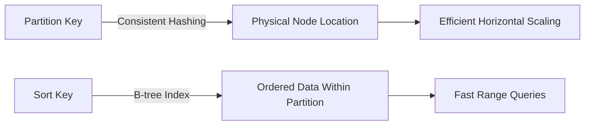
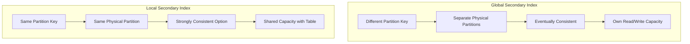
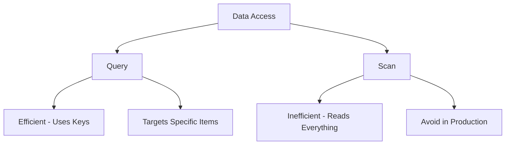
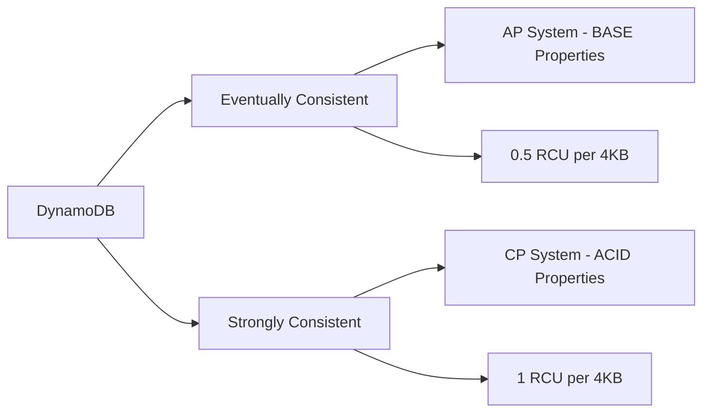
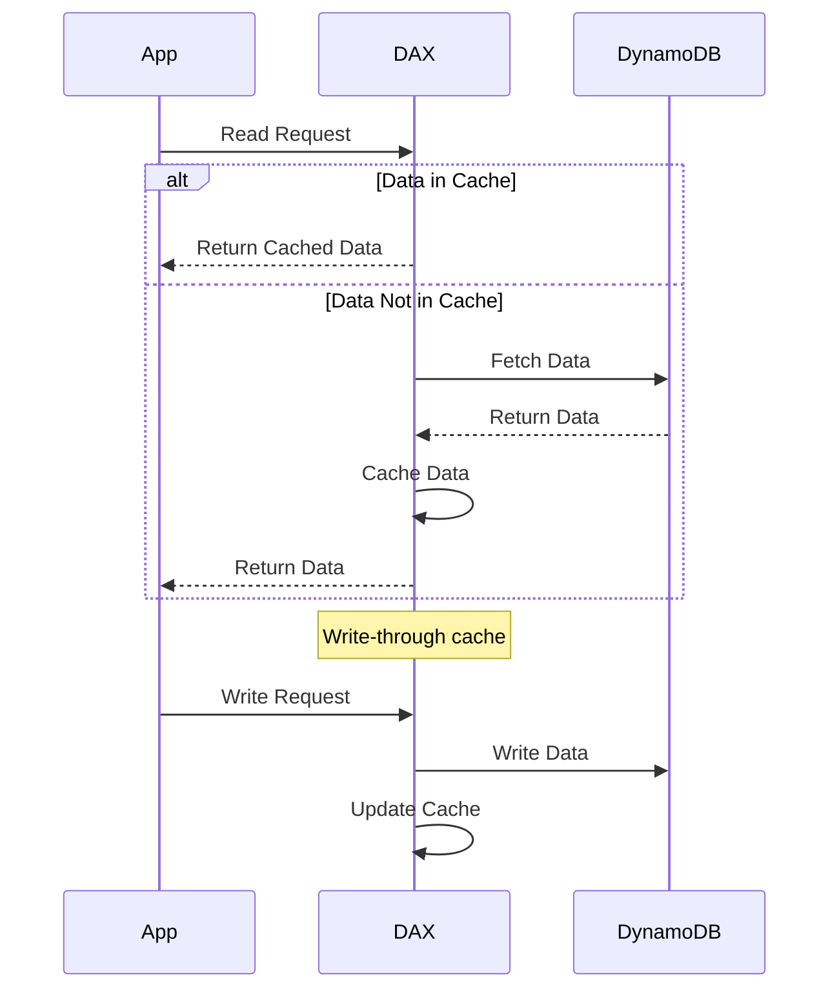
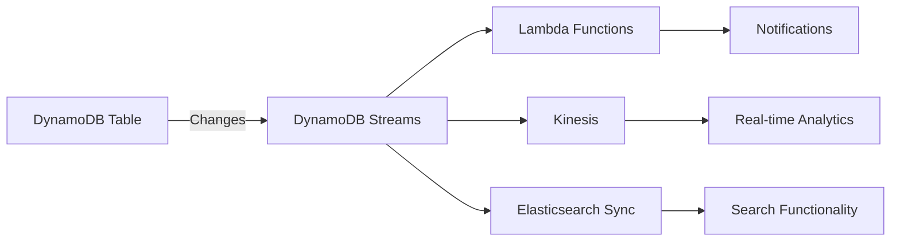
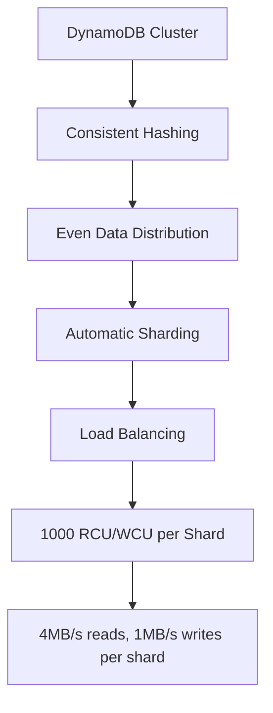
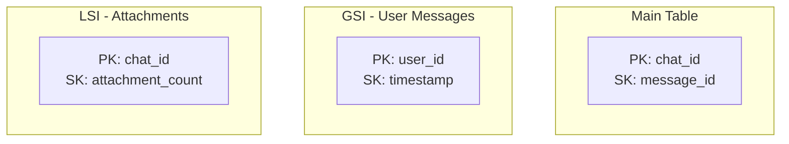
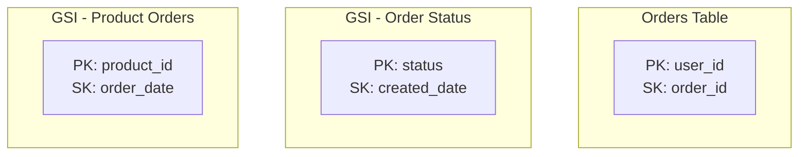

# DynamoDB Deep Dive for System Design Interviews

## Overview

DynamoDB is a **fully-managed**, **highly scalable**, **key-value NoSQL database** by AWS that's perfect for system design interviews.

### Key Characteristics

- **Fully-Managed**: AWS handles all operational aspects (hardware, configuration, patching, scaling)
- **Highly Scalable**: Automatically scales up/down without downtime
- **Key-Value Model**: NoSQL database with flexible data storage
- **Supports Transactions**: ACID properties available (neutralizes old criticisms)
- **Sub-millisecond latency**: With DAX caching

## Data Model

### Core Components

### Schema Structure

- **Tables**: Top-level data structure with mandatory primary key
- **Items**: Individual records (like rows), max 400KB including all attributes
- **Attributes**: Key-value pairs with various types (strings, numbers, booleans, sets, nested structures)
- **Schema-less**: No predefined schema needed, items can have different attributes

## Primary Keys

### Architecture Under the Hood

### Key Types

1. **Simple Primary Key**: Just partition key
2. **Composite Primary Key**: Partition key + Sort key

### Example: Chat Application

- **Partition Key**: `chat_id` (groups messages by chat)
- **Sort Key**: `message_id` (orders messages chronologically)
- Use monotonically increasing IDs (not timestamps) for uniqueness

## Secondary Indexes

### Global Secondary Index (GSI) vs Local Secondary Index (LSI)

### Comparison Table

| Feature           | GSI                         | LSI                         |
| ----------------- | --------------------------- | --------------------------- |
| **Partition Key** | Different from table        | Same as table               |
| **Use Case**      | Query across all partitions | Query within same partition |
| **Storage Limit** | None                        | 10GB per partition key      |
| **Consistency**   | Eventually consistent only  | Both eventual & strong      |
| **Throughput**    | Separate capacity units     | Shared with base table      |
| **Max Count**     | 20 per table                | 5 per table                 |
| **Can Delete**    | Yes                         | No (without deleting table) |

## Data Access Patterns

### Query vs Scan

### Best Practices

- **Always prefer Query over Scan**
- Design partition/sort keys for common query patterns
- Use GSIs for alternative access patterns
- Remember: You read entire items (can't select specific fields like SQL)

## Consistency Models

### CAP Theorem Flexibility

### Implementation Details

- **Eventually Consistent**: Reads from any replica, possible stale data
- **Strongly Consistent**: Reads from leader node, guaranteed latest data
- **Quorum-based replication**: Writes need majority acknowledgment

## Advanced Features

### 1. DAX (DynamoDB Accelerator)

**Key Points:**

- Built-in in-memory cache (no need for Redis/Memcached)
- Sub-millisecond response times
- Read-through and write-through cache
- No code changes required

### 2. DynamoDB Streams (CDC)

**Use Cases:**

- Trigger Lambda functions on data changes
- Keep Elasticsearch in sync
- Real-time analytics with Kinesis
- Cross-region replication

### 3. Global Tables

- Multi-region replication
- Local read/write in each region
- Reduces latency for global applications
- Automatic failover

## Scalability & Performance

### Auto-Scaling Architecture

### Capacity Units

- **RCU (Read Capacity Unit)**: 4KB strongly consistent read/sec (or 2 eventually consistent)
- **WCU (Write Capacity Unit)**: 1KB write/sec
- **Pricing Models**:
  - On-demand: Pay per request (unpredictable workloads)
  - Provisioned: Specify capacity (predictable workloads)

## Interview Strategy

### When to Use DynamoDB

✅ **Perfect For:**

- High-scale applications needing predictable performance
- Simple key-value or document lookups
- Real-time applications requiring low latency
- Applications needing built-in caching (DAX)
- Event-driven architectures (Streams)
- Global applications (Global Tables)

### When NOT to Use DynamoDB

❌ **Avoid When:**

1. **Complex Queries**: Need joins, complex aggregations
2. **Cost Sensitive**: Very high volume (100K+ ops/sec can be expensive)
3. **Vendor Lock-in Concerns**: If interviewer wants vendor-neutral
4. **Heavy GSI Usage**: If you need many secondary indexes, consider RDBMS

### Design Patterns for Interviews

#### Example: Chat Application

#### Example: E-commerce Platform

## Key Interview Points to Remember

### Quick Facts

- **Max item size**: 400KB
- **Max GSIs**: 20 per table
- **Max LSIs**: 5 per table (must be created with table)
- **Supports transactions**: ACID properties available
- **Built-in features**: Encryption at rest, IAM integration, VPC endpoints

### Architecture Decisions

1. **Partition Key Selection**:

   - Choose based on access patterns
   - Ensure even distribution (avoid hot partitions)
   - Consider composite keys for range queries

2. **Consistency Trade-offs**:

   - Default to eventual consistency for performance
   - Use strong consistency for critical reads (banking, inventory)

3. **Caching Strategy**:

   - Enable DAX instead of adding Redis/Memcached
   - Item cache for GetItem operations
   - Query cache for Query/Scan operations

4. **Event-Driven Design**:
   - Use Streams for real-time processing
   - Lambda integration for serverless architectures
   - CDC for maintaining data consistency across systems

## Common Interview Scenarios

### Scenario 1: Social Media Feed

- **Main Table**: PK: user_id, SK: post_timestamp
- **GSI**: PK: hashtag, SK: post_timestamp (for trending)
- **Streams**: Trigger notifications to followers
- **DAX**: Cache popular posts

### Scenario 2: IoT Time Series Data

- **Main Table**: PK: device_id, SK: timestamp
- **GSI**: PK: location, SK: timestamp (geographical queries)
- **TTL**: Auto-delete old data
- **Streams**: Real-time analytics pipeline

### Scenario 3: E-Learning Platform

- **Courses Table**: PK: course_id, SK: lesson_id
- **Enrollment Table**: PK: user_id, SK: course_id
- **GSI**: PK: instructor_id, SK: course_id
- **DAX**: Cache course catalog
- **Streams**: Update progress tracking

## Pro Tips for Interviews

1. **Always mention**: DynamoDB now supports transactions (removes major limitation)
2. **Cost awareness**: Acknowledge pricing model, show you understand RCU/WCU implications
3. **Data modeling**: Emphasize importance of choosing right keys upfront
4. **Don't over-engineer**: Start simple, add GSIs/features as needed
5. **Vendor lock-in**: If asked about alternatives, mention Cassandra, MongoDB, or Redis as open-source options

## Quick Reference Checklist

When proposing DynamoDB in an interview:

- [ ] Define partition key and sort key
- [ ] Identify access patterns
- [ ] Determine if GSIs are needed
- [ ] Choose consistency model
- [ ] Consider enabling DAX for caching
- [ ] Evaluate if Streams are needed for real-time processing
- [ ] Mention encryption and security (IAM, VPC endpoints)
- [ ] Acknowledge any limitations relevant to the use case

## Summary

DynamoDB is an excellent choice for most system design interview scenarios due to:

- Managed service (less operational complexity to discuss)
- Proven scalability (handles any scale the interviewer throws at you)
- Flexible consistency models (can adapt to requirements)
- Rich feature set (DAX, Streams, Global Tables)
- Transaction support (neutralizes NoSQL criticisms)

Remember: It's not just about knowing DynamoDB features, but understanding when and how to apply them effectively in your system design.

## 🚀 DynamoDB Quick Revision Points

### Core Concepts

• **Fully-managed NoSQL** key-value database by AWS
• **Sub-millisecond latency** with automatic scaling
• **400KB max item size** - remember this limit!
• **Schema-less** - items can have different attributes

### Primary Keys (Critical!)

• **Simple**: Just partition key (PK)
• **Composite**: Partition key + Sort key (SK)
• **Partition key** → determines physical node (consistent hashing)
• **Sort key** → orders data within partition (B-tree index)

### Secondary Indexes

• **GSI**: Different partition key, eventually consistent, separate capacity, max 20
• **LSI**: Same partition key, can be strongly consistent, shared capacity, max 5, can't delete

### Access Patterns

• **Query** > Scan (always prefer Query)
• Query uses keys efficiently
• Scan reads entire table (avoid!)
• Read entire items (no field selection like SQL)

### Consistency Models

• **Eventually consistent**: 0.5 RCU per 4KB (default, faster)
• **Strongly consistent**: 1 RCU per 4KB (guaranteed latest)
• Quorum-based replication

### Capacity Units

• **RCU**: 4KB strongly consistent read/sec
• **WCU**: 1KB write/sec
• **Pricing**: On-demand vs Provisioned

### Key Features

• **DAX**: Built-in cache, sub-millisecond, no code changes
• **Streams**: CDC for Lambda triggers, real-time processing
• **Global Tables**: Multi-region replication
• **Transactions**: ACID support (neutralizes NoSQL criticism)

### When to Use ✅

• High-scale with predictable performance
• Simple key-value lookups
• Real-time low latency needs
• Event-driven architectures
• Global applications

### When NOT to Use ❌

• Complex queries/joins needed
• Cost-sensitive at extreme scale (100K+ ops/sec)
• Many secondary indexes needed
• Vendor lock-in concerns

### Interview Must-Mentions

• "DynamoDB now supports transactions"
• "Choose partition key for even distribution"
• "Use DAX instead of adding Redis"
• "Streams enable event-driven architecture"
• Cost awareness - mention RCU/WCU implications

### Design Pattern Template

1. Define PK/SK based on access patterns
2. Add GSIs for alternative queries
3. Enable DAX if caching needed
4. Add Streams for real-time processing
5. Choose consistency model

### Critical Numbers

• **20** GSIs max per table
• **5** LSIs max (create with table)
• **400KB** max item size
• **10GB** per partition key limit (LSI)
• **1000** RCU/WCU per shard

### Pro Interview Response

_"For this use case, I'd use DynamoDB with [PK] as partition key and [SK] as sort key. This gives us automatic scaling and sub-millisecond latency. We'll add a GSI for [alternative access pattern]. Enable DAX for caching hot data. Use Streams to trigger Lambda for [real-time need]. DynamoDB's transaction support ensures ACID properties where needed."_

### Last-Second Reminders

• Always justify your key choices
• Mention eventual vs strong consistency trade-off
• Acknowledge cost at scale
• Show you understand hot partition problem
• If asked for alternatives: Cassandra, MongoDB, Redis

**Golden Rule**: Start simple, add complexity only when justified by requirements!
