# Elasticsearch Deep Dive for System Design Interviews

## 📚 Core Concepts

### Key Terminology

- **Documents**: Individual units of data (JSON objects) - the basic unit you're searching over
- **Indices**: Collections of documents (similar to database tables)
- **Mappings**: Schema of the index - defines fields, data types, and how they're processed
- **Fields**: Key-value pairs within documents containing searchable data
- **Shards**: Subdivisions of indices that allow horizontal scaling
- **Replicas**: Exact copies of shards for high availability and increased throughput


### Mapping Example

```json
{
  "properties": {
    "id": { "type": "keyword" }, // Exact match, not tokenized
    "title": { "type": "text" }, // Full-text search, tokenized
    "author": { "type": "text" },
    "price": { "type": "float" },
    "createdAt": { "type": "date" },
    "reviews": {
      "type": "nested",
      "properties": {
        "user": { "type": "keyword" },
        "rating": { "type": "integer" },
        "comment": { "type": "text" }
      }
    }
  }
}
```

## 🏗️ Architecture

### Node Types


1. **Master Node**: Cluster coordination, index creation/deletion
2. **Data Node**: Stores data and handles search/indexing operations
3. **Coordinating Node**: Routes requests, aggregates results (frontend of cluster)
4. **Ingest Node**: Data transformation and preprocessing
5. **Machine Learning Node**: ML tasks (specialized)

### Request Flow


## 🔍 Search Internals

### Lucene Segments

- **Immutable**: Once created, segments are never modified
- **CRUD Operations**:
  - **Create**: Add to new segment
  - **Read**: Search across all segments
  - **Update**: Soft delete old + insert new
  - **Delete**: Mark as deleted (cleanup during merge)

### Inverted Index Structure

```mermaid
graph LR
    subgraph Documents
        D1[Doc 1: 'lazy dog']
        D2[Doc 53: 'lazy days are best']
    end

    subgraph Inverted Index
        I1[lazy → 1, 53]
        I2[dog → 1]
        I3[days → 53]
        I4[are → 53]
        I5[best → 53]
    end

    D1 -.-> I1
    D1 -.-> I2
    D2 -.-> I1
    D2 -.-> I3
    D2 -.-> I4
    D2 -.-> I5
```



### Doc Values

- Column-oriented storage for efficient sorting/aggregations
- Contiguous memory representation of single fields across all documents
- Enables fast sorting without loading full documents

## 📝 Basic Operations

### 1. Create Index

```http
PUT /books
{
  "settings": {
    "number_of_shards": 3,
    "number_of_replicas": 2
  }
}
```

### 2. Index Document

```http
POST /books/_doc
{
  "title": "The Great Gatsby",
  "author": "F. Scott Fitzgerald",
  "price": 9.99
}
```

### 3. Update Document

```http
POST /books/_update/{doc_id}
{
  "doc": {
    "price": 14.99
  }
}
```

**Note**: Use version control for optimistic concurrency

### 4. Search Operations

#### Basic Search

```json
GET /books/_search
{
  "query": {
    "match": {
      "title": "Great"
    }
  }
}
```

#### Complex Query with Filters

```json
GET /books/_search
{
  "query": {
    "bool": {
      "must": [
        { "match": { "title": "Great" } }
      ],
      "filter": [
        { "range": { "price": { "lte": 15 } } }
      ]
    }
  }
}
```

## 📊 Pagination Strategies

### 1. **From/Size** (Simple but Limited)

- Good for: Small result sets (<10,000)
- Bad for: Deep pagination

```json
{
  "from": 0,
  "size": 10
}
```

### 2. **Search After** (Efficient Deep Pagination)

- Good for: Large result sets, sequential access
- Bad for: Random page access

```json
{
  "search_after": [1463538857, "654323"],
  "sort": [{ "date": "desc" }, { "_id": "desc" }]
}
```

### 3. **Point in Time (PIT)** (Consistent Pagination)

- Good for: Consistent view during updates
- Bad for: Resource intensive

```json
POST /my_index/_pit?keep_alive=1m
```

## 🎯 Interview Key Points

### When to Use Elasticsearch

✅ **Good For:**

- Full-text search with complex queries
- Log analytics and monitoring
- Real-time search on frequently updated data
- Faceted search and aggregations
- Geospatial queries
- Auto-complete and suggestions

❌ **Not Good For:**

- Primary data store (use as secondary index)
- Write-heavy workloads
- Strong consistency requirements
- Small datasets (<100k documents)
- Frequently updating fields (like counters)

### Design Considerations

1. **Data Synchronization**


2. **Consistency Model**

- Eventually consistent by default
- Refresh interval (default 1s) affects visibility
- Use `refresh=wait_for` for immediate consistency (performance cost)

3. **Scaling Strategies**

- **Horizontal**: Add more nodes and shards
- **Vertical**: Increase node resources
- **Index Strategy**: Time-based indices for logs (daily/weekly)

### Performance Optimization

1. **Mapping Optimization**

   - Only index fields you search on
   - Use appropriate field types (keyword vs text)
   - Disable \_source for fields not needed in results

2. **Query Optimization**

   - Use filters instead of queries when possible (cacheable)
   - Limit result size
   - Use query-time boosting sparingly

3. **Hardware Considerations**
   - SSDs for hot data
   - Sufficient heap memory (50% of RAM, max 32GB)
   - Multiple data paths for I/O distribution

## 🔧 Advanced Features

### 1. Aggregations

```json
{
  "aggs": {
    "avg_price": {
      "avg": {
        "field": "price"
      }
    },
    "categories": {
      "terms": {
        "field": "category"
      }
    }
  }
}
```

### 2. Geo Queries

- Geo-distance queries
- Geo-polygon queries
- Geo-shape queries

### 3. Machine Learning

- Anomaly detection
- Forecasting
- Classification

## 💡 System Design Integration Patterns

### Pattern 1: Search Service Architecture


### Pattern 2: Log Analytics Pipeline


## 🎓 Interview Tips

### Common Questions & Answers

**Q: How does Elasticsearch achieve fast search?**

- Inverted indices for O(1) term lookups
- Doc values for efficient sorting/aggregations
- Segment immutability enables aggressive caching
- Distributed architecture for parallel processing

**Q: How to handle inconsistency between primary DB and ES?**

- Implement reconciliation jobs
- Use versioning for conflict detection
- Monitor lag metrics
- Consider using transaction outbox pattern

**Q: How to design for high availability?**

- Multiple replicas (at least 2)
- Multi-zone deployment
- Proper shard allocation awareness
- Regular snapshots for disaster recovery

### Red Flags to Avoid

1. ❌ Using ES as primary/only data store
2. ❌ Not considering eventual consistency
3. ❌ Over-sharding (too many small shards)
4. ❌ Ignoring mapping explosion
5. ❌ Not planning for data growth

### Alternatives to Consider

- **Postgres Full-Text Search**: For smaller datasets
- **Algolia**: For managed search-as-a-service
- **Apache Solr**: Similar capabilities, different ecosystem
- **Amazon CloudSearch**: AWS-managed alternative
- **Typesense**: Simpler, developer-friendly alternative

## 📚 Additional Topics for Deep Dives

### Security

- Authentication & Authorization
- Field-level security
- Document-level security
- Encryption at rest and in transit

### Monitoring & Operations

- Key metrics: Query latency, indexing rate, heap usage
- Slow query logs
- Index lifecycle management
- Backup and restore strategies

### Cost Optimization

- Hot-warm-cold architecture
- Index lifecycle policies
- Appropriate shard sizing (20-50GB per shard)
- Resource allocation based on query patterns

## 🚀 Quick Reference Checklist

When proposing Elasticsearch in system design:

- [ ] Justify why ES over simpler alternatives
- [ ] Address consistency requirements
- [ ] Plan data synchronization strategy
- [ ] Consider scaling approach
- [ ] Define mapping strategy
- [ ] Estimate resource requirements
- [ ] Plan monitoring and alerting
- [ ] Consider backup/recovery
- [ ] Address security requirements
- [ ] Define SLAs for search latency

## 📖 Key Takeaways

1. **Elasticsearch = Distributed Lucene + Coordination Layer**
2. **Immutability is key** to performance (segments never change)
3. **Eventually consistent** - plan accordingly
4. **Not a primary database** - use alongside authoritative store
5. **Inverted index + Doc values** = Fast search + Fast aggregations
6. **Proper mapping** is crucial for performance
7. **Sharding strategy** affects scalability and performance
8. **Query planning** optimizes complex searches automatically

## 🎯 Elasticsearch Quick Revision Points

### Core Architecture

• **Node Types**: Master (cluster ops), Data (storage), Coordinating (routing), Ingest (preprocessing)
• **Data Structure**: Index → Shards → Lucene Segments (immutable)
• **Replication**: Primary shards + Replica shards for HA and throughput
• **Segments**: Immutable once written - updates = soft delete + new insert

### How Search Works

• **Inverted Index**: Term → List of document IDs (O(1) lookups)
• **Doc Values**: Column-store for sorting/aggregations
• **Query Phase**: Get doc IDs + scores from all shards
• **Fetch Phase**: Retrieve actual documents from relevant shards

### Key Design Decisions

• **When to Use**: Full-text search, log analytics, faceted search, auto-complete
• **When NOT to Use**: Primary datastore, write-heavy, strong consistency needs
• **Consistency**: Eventually consistent (1s default refresh)
• **Sync Pattern**: DB → CDC/Kafka → ES (never use ES as primary)

### Performance Must-Knows

• **Shard Size**: 20-50GB per shard optimal
• **Heap Memory**: 50% of RAM, max 32GB
• **Field Types**: `keyword` (exact) vs `text` (analyzed)
• **Filters vs Queries**: Filters are cacheable, use when possible

### Pagination Strategies

• **From/Size**: Simple but fails at deep pagination (>10k)
• **Search After**: Efficient for sequential access
• **PIT (Point in Time)**: Consistent view during updates

### Critical Interview Points

• **Not ACID compliant** - plan for eventual consistency
• **Horizontal scaling** via sharding and replication
• **Version conflicts** handled via optimistic concurrency
• **Update = Delete + Insert** (no in-place updates)
• **Refresh interval** affects search visibility (trade-off: performance vs consistency)

### Common Pitfalls to Avoid

• ❌ Using as primary database
• ❌ Ignoring eventual consistency in design
• ❌ Over-sharding (too many small shards)
• ❌ Not planning data sync strategy
• ❌ Forgetting about mapping explosion

### Quick Alternatives Check

• **Small dataset (<100k)**: Use Postgres full-text
• **Managed service needed**: Algolia or AWS CloudSearch
• **Simple requirements**: Consider Typesense
• **Already using Hadoop**: Apache Solr

### System Design Integration

• **Pattern**: App → Primary DB → CDC → Kafka → ES Indexer → ES
• **Caching**: Add Redis between app and ES for frequent queries
• **Monitoring**: Track query latency, indexing rate, heap usage
• **HA Setup**: Multi-zone, 2+ replicas, snapshot backups

### The 30-Second Pitch

"Elasticsearch is a distributed search engine built on Lucene. It uses inverted indices for fast full-text search and doc values for aggregations. Data is stored in immutable segments within shards that can be replicated. It's eventually consistent, so we pair it with a primary database and sync via CDC/Kafka. Best for search-heavy, read-dominant workloads where slight staleness is acceptable."

**Remember**: ES = Secondary index for search, not primary storage! 🔍
