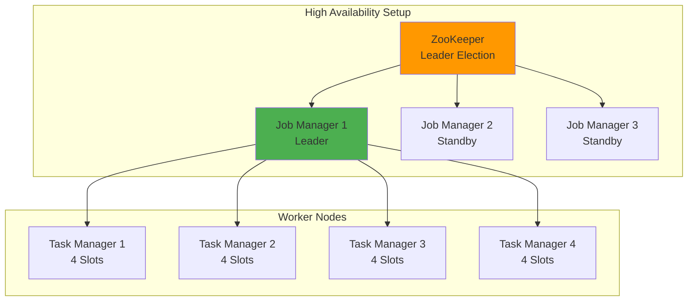
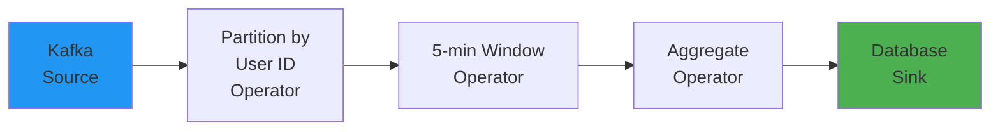
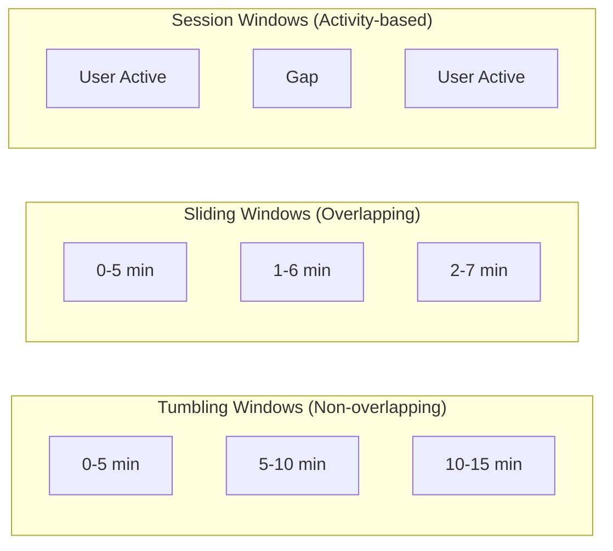
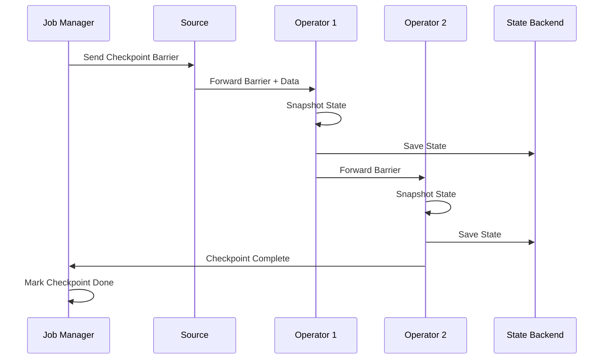

# Apache Flink Deep Dive - Interview Guide

## 📌 Key Takeaway

Apache Flink is a **distributed stream processing framework** that handles continuous data flows with exactly-once processing guarantees, state management, and fault tolerance. Use it when you need real-time processing with complex stateful operations.

## 🎯 When to Use Flink

### ✅ Good Use Cases

- **Real-time analytics** with stateful operations (e.g., counting clicks per user in last 5 minutes)
- **Fraud detection** with pattern matching
- **Event-driven architectures** requiring exactly-once processing
- **Complex windowed aggregations** over streaming data
- **Join operations** between multiple streams

### ❌ When NOT to Use Flink

- Simple stateless transformations (just use a Kafka consumer service)
- Batch processing where real-time isn't needed (use Spark instead)
- Simple filtering or routing (Kafka Streams might be simpler)

## 🏗️ Core Architecture

### Cluster Components



**Job Manager**: Coordinator that schedules tasks, manages checkpoints, handles failures
**Task Manager**: Workers that execute the actual data processing with task slots

## 📊 Dataflow Model



### Key Concepts

1. **Sources & Sinks**

   - Sources: Kafka, Kinesis, Files
   - Sinks: Databases, Data Warehouses, Message Queues

2. **Streams**: Unbounded sequences of data elements

3. **Operators**: Stateful transformations

   - Map, Filter, Reduce
   - Window, Join, Aggregate
   - FlatMap

4. **State Management**
   - Value State: Single value per key
   - List State: List of values per key
   - Map State: Map of values per key
   - Backed by: Memory, Filesystem, or RocksDB

## ⏰ Time & Windows

### Window Types



### Watermarks

- **Purpose**: Handle out-of-order and late events
- **Definition**: Timestamp declaring "all events before this time have arrived"
- **Strategies**:
  - Bounded Out-of-Orderness: Wait for late events up to X time
  - No Watermarks: Process immediately

## 🔄 Fault Tolerance

### Checkpointing Process



### Recovery Process

1. **Failure Detection**: Job Manager detects missing heartbeats
2. **Job Pause**: Entire job stops
3. **State Recovery**: Retrieve last checkpoint
4. **Task Redistribution**: Reallocate tasks to healthy nodes
5. **State Restoration**: Each operator restores its state
6. **Source Rewind**: Sources go back to checkpoint position
7. **Resume**: Processing continues from checkpoint

## 💡 Important Interview Points

### Exactly-Once Processing

- **Internal State**: Guaranteed exactly-once for Flink-managed state
- **External Systems**: Need idempotent operations or transactions
- **Trade-off**: Performance overhead for stronger guarantees

### State Backend Selection

| Backend    | Use Case                      | Pros              | Cons               |
| ---------- | ----------------------------- | ----------------- | ------------------ |
| Memory     | Small state, high performance | Fast              | Limited by RAM     |
| Filesystem | Medium state                  | Balanced          | Slower than memory |
| RocksDB    | Large state (TBs)             | Can exceed memory | Higher latency     |

### Parallelism & Scaling

- **Task Slots**: Unit of parallelism (usually = CPU cores)
- **Slot Sharing**: Multiple operators can share slots
- **Dynamic Scaling**: Requires state redistribution

## 🚀 Sample Design Patterns

### Pattern 1: Real-time Dashboard

```java
DataStream<ClickEvent> clicks = env
    .addSource(kafkaConsumer)
    .keyBy(click -> click.getPageId())
    .window(TumblingWindow.of(Time.minutes(1)))
    .aggregate(new CountAggregator());

clicks.addSink(redisSink); // For dashboard
```

### Pattern 2: Fraud Detection

```java
// Velocity check
DataStream<Alert> velocityAlerts = transactions
    .keyBy(t -> t.getAccountId())
    .window(SlidingWindow.of(Time.minutes(30), Time.minutes(5)))
    .process(new VelocityDetector(3, 1000.0));

// Pattern detection
Pattern<Transaction, ?> fraudPattern = Pattern
    .begin("small").where(tx -> tx.getAmount() < 10)
    .next("large").where(tx -> tx.getAmount() > 1000)
    .within(Time.minutes(5));
```

## 🎓 Design Lessons from Flink

Even if not using Flink, apply these patterns:

1. **Separate Time Domains**: Processing time vs. event time
2. **Watermarks**: Track progress through unordered events
3. **Local State + Checkpointing**: Efficient state management with durability
4. **Slot-based Resources**: Clean resource isolation
5. **Barrier Synchronization**: Consistent distributed snapshots

## ⚠️ Common Pitfalls

1. **Over-engineering**: Don't use Flink for simple transformations
2. **State Growth**: Monitor and plan for state size
3. **Window Selection**: Wrong window type = poor performance
4. **Late Data**: Always have a strategy for late events
5. **External System Integration**: Remember exactly-once doesn't extend automatically

## 🔍 Interview Red Flags to Avoid

- Using Flink for simple stateless operations
- Not considering operational overhead
- Ignoring state management complexity
- Not discussing watermark strategy for late data
- Assuming exactly-once for external systems

## 📝 Quick Decision Framework

Ask yourself:

1. Do I need **real-time** processing? (Not batch)
2. Do I need **stateful** operations? (Not just transformations)
3. Is the **complexity** justified? (Not over-engineering)
4. Can I handle the **operational overhead**? (Cluster management)

If YES to all → Consider Flink
If NO to any → Consider simpler alternatives

## 🎯 Interview Talking Points

When proposing Flink in an interview:

1. **Start with the problem**: "We need to count events per user in 5-minute windows with exactly-once guarantees..."
2. **Justify complexity**: "Simple Kafka consumers won't work because we need to handle failures without losing counts..."
3. **Address trade-offs**: "While Flink adds operational complexity, it gives us state management and exactly-once processing..."
4. **Consider alternatives**: "We could use Kafka Streams for simpler cases, but Flink's windowing and state management are superior for our needs..."
5. **Discuss operations**: "We'll need to monitor state growth, checkpoint performance, and plan for scaling..."

## 📚 Additional Resources

- [Apache Flink Documentation](https://flink.apache.org/docs/)
- [Flink: Stateful Computations over Data Streams](https://flink.apache.org/flink-architecture.html)
- Practice problems: Ad Click Aggregator, Fraud Detection, Real-time Analytics Dashboard

## 🚀 Apache Flink - Last Minute Revision Points

### Core Concept

• **Flink = Distributed stream processing with exactly-once guarantees + state management**
• Think: "Real-time Spark" but built for streaming-first (not batch-first)

### Architecture Components

• **Job Manager**: Brain (schedules tasks, coordinates checkpoints, handles failures)
• **Task Manager**: Muscles (executes tasks in slots, typically slots = CPU cores)
• **ZooKeeper**: HA coordinator for leader election among Job Managers

### When to Use (The 3 S's)

• **Streaming**: Real-time data processing needed
• **Stateful**: Need to maintain state across events (counts, aggregations)
• **Sophisticated**: Complex operations like windowing, joins, pattern matching

### Time & Windows Quick Reference

• **Tumbling**: Fixed, non-overlapping (0-5min, 5-10min)
• **Sliding**: Overlapping windows (0-5min, 1-6min, 2-7min)
• **Session**: Activity-based with gaps
• **Watermarks**: "All events before X have arrived" - handles late data

### State Backends

• **Memory**: Fast, small state
• **Filesystem**: Medium state, balanced
• **RocksDB**: Huge state (TBs), can exceed RAM, slower

### Fault Tolerance Magic

• **Checkpoint Barriers**: Flow through pipeline, trigger state snapshots
• **Recovery**: Pause → Restore last checkpoint → Rewind sources → Resume
• **Exactly-once**: Guaranteed internally, needs idempotency for external systems

### Key Differentiators

• **vs Kafka Streams**: Flink better for complex windowing, multi-stream joins
• **vs Spark Streaming**: Flink is true streaming (not micro-batches)
• **vs Simple Services**: Flink handles state + failures automatically

### Interview Power Phrases

• "Exactly-once processing semantics with distributed snapshots"
• "Watermarks handle out-of-order events in event-time processing"
• "State is local for performance but checkpointed for durability"
• "Barrier synchronization ensures consistent snapshots"

### Red Flags to Avoid

• ❌ Using Flink for simple stateless transformations
• ❌ Ignoring operational complexity (it's not just deploy-and-forget)
• ❌ Assuming exactly-once extends to external systems automatically
• ❌ Not planning for state growth

### Quick Decision Tree

1. Real-time needed? → If NO, use Spark Batch
2. Stateful operations? → If NO, use simple Kafka consumer
3. Complex windowing/joins? → If NO, consider Kafka Streams
4. Can handle ops overhead? → If NO, reconsider architecture
   → If ALL YES: Flink is your answer

### Sample Problem Patterns

• **Click Analytics**: KeyBy(userId) → Window(5min) → Count → Sink
• **Fraud Detection**: Pattern matching + velocity checks in sliding windows
• **Real-time Dashboard**: Tumbling windows → Aggregate → Redis/Dashboard

### Operational Must-Knows

• **Parallelism**: Set via task slots (usually = available CPU cores)
• **Checkpointing interval**: Balance between performance and recovery time
• **State size monitoring**: Critical for production stability
• **Backpressure handling**: Natural flow control in pipeline

### The "Why Flink?" Answer Template

"We need [real-time requirement] with [stateful operation] that requires [exactly-once/complex windowing]. While we could use [alternative], Flink provides [specific advantage] which is critical for [business requirement]."

### Last 30 Seconds Before Interview

Remember: **Flink = Streaming + State + Exactly-Once + Windows + Fault-Tolerant**

If asked about any streaming problem with state, think Flink. If it's simple filtering/routing, suggest simpler alternatives first.
