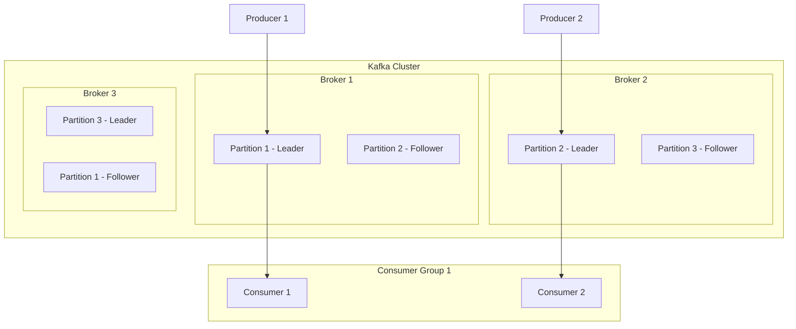
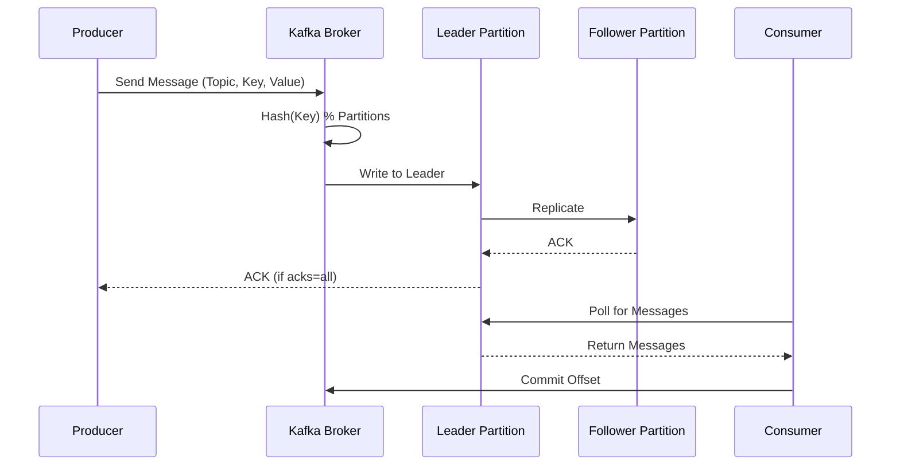
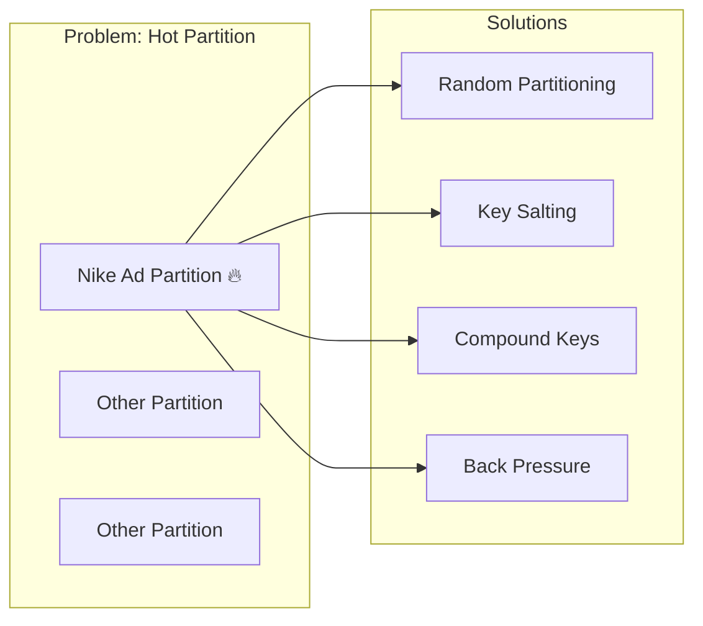
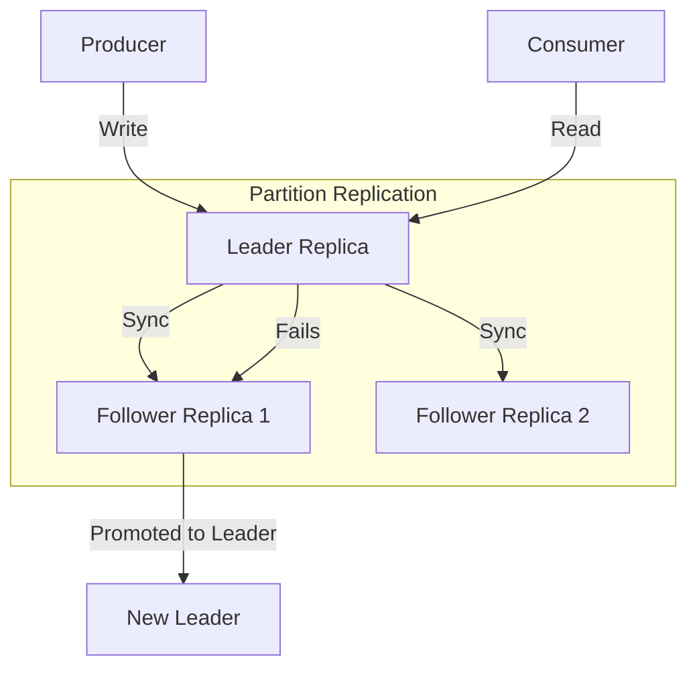
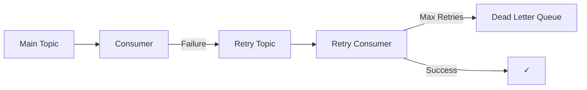
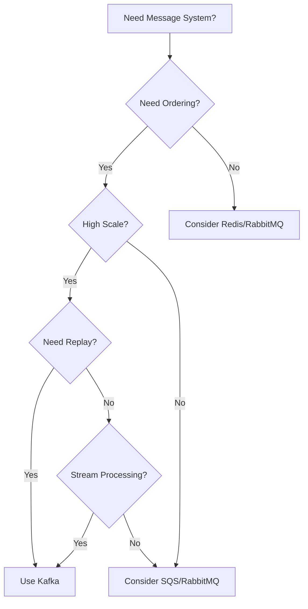

# Apache Kafka - System Design Interview Guide

## 📌 Quick Overview

Apache Kafka is an **open-source distributed event streaming platform** used by 80% of Fortune 100 companies. It functions as both a **message queue** and **stream processing system**, offering high performance, scalability, and durability.

## 🏗️ Core Architecture

### Key Components



### Terminology

- **Broker**: Individual server (physical/virtual) storing data and serving clients
- **Partition**: Ordered, immutable sequence of messages (like a log file)
- **Topic**: Logical grouping of partitions
- **Producer**: Writes data to topics
- **Consumer**: Reads data from topics
- **Consumer Group**: Group of consumers where each message is processed by only one consumer

### Message Structure

```
┌─────────────────────────┐
│   Message/Record        │
├─────────────────────────┤
│ • Key (optional)        │
│ • Value (required)      │
│ • Timestamp (optional)  │
│ • Headers (optional)    │
└─────────────────────────┘
```

## 🔄 How Kafka Works

### Message Flow



### Partition Assignment

- **With Key**: `partition = hash(key) % num_partitions`
- **Without Key**: Round-robin or random distribution
- Messages with same key always go to same partition (ordering guarantee)

## 📈 Scalability Considerations

### Single Broker Limits

- **Storage**: ~1TB of data
- **Throughput**: ~1M messages/second
- **Message Size**: Keep under 1MB (configurable, but recommended)

### Scaling Strategies

#### 1. Horizontal Scaling

Add more brokers to distribute load. Remember: **More partitions = More parallelism**

#### 2. Partitioning Strategy (Most Important!)

Choose keys that distribute evenly. Bad keys = hot partitions.

### Handling Hot Partitions



**Solutions:**

1. **Random partitioning**: No key, lose ordering
2. **Key salting**: Add random suffix to key (e.g., `adId_${random}`)
3. **Compound keys**: Combine attributes (e.g., `${adId}_${region}`)
4. **Back pressure**: Slow down producer based on partition lag

## 🛡️ Fault Tolerance & Durability

### Replication Model



**Key Points:**

- Replication factor typically = 3
- Leader handles all reads/writes
- Followers passively replicate
- `acks=all` ensures all replicas receive message

### Consumer Failure Handling

1. **Offset Management**: Consumers commit offsets after processing
2. **Rebalancing**: Failed consumer's partitions redistributed to others

## 🔄 Retry Patterns

### Producer Retries

```javascript
const producer = kafka.producer({
  retry: {
    retries: 5,
    initialRetryTime: 100,
  },
  idempotent: true, // Prevent duplicates
});
```

### Consumer Retry Pattern (Custom Implementation)



## 🚀 Performance Optimizations

### 1. Batching

```javascript
const producer = kafka.producer({
  batch: {
    maxSize: 16384, // bytes
    maxTime: 100, // ms
  },
});
```

### 2. Compression

- Options: GZIP, Snappy, LZ4
- Reduces message size → faster transmission

### 3. Optimal Partitioning

- Even distribution across partitions
- Maximize parallelism

## 📝 When to Use Kafka

### Use as Message Queue When:

- **Asynchronous processing** needed (e.g., video transcoding)
- **Order guarantee** required (e.g., virtual waiting queue)
- **Decoupling** producers/consumers for independent scaling

### Use as Stream When:

- **Real-time processing** required (e.g., ad click aggregation)
- **Multiple consumers** need same data (e.g., live comments)
- **Continuous data flow** processing

## ⚠️ Common Anti-Patterns

### ❌ DON'T Store Large Files in Kafka

Instead of putting videos in Kafka:

```
❌ Video → Kafka → Worker
✅ Video → S3, URL → Kafka → Worker → Fetch from S3
```

### ❌ DON'T Under-partition

More partitions = better parallelism. Under-partitioning wastes added brokers.

## 🎯 Interview Tips

### Essential Topics by Level

| Level          | Must Know                                      | Nice to Have             |
| -------------- | ---------------------------------------------- | ------------------------ |
| **Junior/Mid** | Basic architecture, When to use                | Partitioning basics      |
| **Senior**     | Partitioning strategy, Fault tolerance         | Performance optimization |
| **Staff+**     | Hot partition handling, Complex retry patterns | All topics               |

### Key Discussion Points

1. **Always start with partitioning strategy** when discussing scale
2. **"Kafka is always available, sometimes consistent"** - push back if asked "what if Kafka goes down?"
3. **Consider retention policies** - default 7 days, configurable based on needs
4. **Offset commit timing** - critical for exactly-once semantics

### Sample Design Questions Where Kafka Fits

- **YouTube**: Video upload → Kafka (URL) → Transcoding workers
- **Ticketmaster**: Virtual waiting queue with order guarantees
- **Ad Click Aggregator**: Real-time stream processing
- **Live Comments**: Pub/sub to multiple consumers
- **Web Crawler**: Queue URLs, but consider SQS for built-in retry/DLQ

## 📊 Kafka vs Alternatives Quick Comparison

| Feature      | Kafka         | RabbitMQ  | AWS SQS     | Redis Pub/Sub |
| ------------ | ------------- | --------- | ----------- | ------------- |
| Throughput   | Very High     | Medium    | Medium      | High          |
| Ordering     | Per partition | Per queue | FIFO option | No guarantee  |
| Persistence  | Yes           | Yes       | Yes         | Optional      |
| Replay       | Yes           | No        | No          | No            |
| Built-in DLQ | No            | Yes       | Yes         | No            |

## 🔍 Advanced Concepts (Staff+ Level)

### Exactly-Once Semantics

- Enable idempotent producers
- Use transactions for atomic writes
- Careful offset management

### Kafka Streams vs Consumer Groups

- **Streams**: Stateful processing, windowing, joins
- **Consumer Groups**: Simple consume-and-process

### Managed Services

- **Confluent Cloud**: Fully managed Kafka
- **AWS MSK**: Amazon's managed Kafka
- Handles much of scaling complexity automatically

## 💡 Quick Decision Framework



## 📚 Remember for Interview

1. **Partition strategy is #1 scaling discussion**
2. **1MB message size limit** (configurable but recommended)
3. **Consumer groups guarantee single processing**
4. **Keys determine partitions** - choose wisely
5. **Replication factor 3** is standard
6. **acks=all** for maximum durability
7. **Offset commits** control replay behavior
8. **Hot partitions** need creative solutions

---

### Last-Minute Checklist

- [ ] Can explain producer → broker → consumer flow
- [ ] Know partition assignment formula
- [ ] Understand leader-follower replication
- [ ] Can discuss hot partition solutions
- [ ] Know when Kafka vs alternatives
- [ ] Remember: Don't store large files in Kafka!

# Apache Kafka - Last Minute Revision Bullets

## 🎯 Core Concepts (30 seconds)

• **What**: Distributed event streaming platform (message queue + stream processing)
• **Components**: Brokers (servers) → Topics → Partitions → Messages
• **Players**: Producers write → Kafka stores → Consumers read
• **Consumer Groups**: Each message processed by only ONE consumer in group

## 🔑 Critical Formulas

• **Partition Assignment**: `partition = hash(key) % num_partitions`
• **No key** → Round-robin distribution
• **Same key** → Always same partition (ordering guarantee)
• **Replication Factor**: Usually 3 (1 leader + 2 followers)

## 📊 Key Numbers

• **1MB** - Recommended max message size
• **1M msgs/sec** - Single broker throughput
• **1TB** - Single broker storage capacity
• **7 days** - Default retention period
• **acks=all** - Maximum durability (wait for all replicas)

## 🚀 Scaling Strategy (MOST IMPORTANT)

• **More partitions = More parallelism**
• **Hot partition solutions**:

- Random partitioning (lose ordering)
- Key salting (`key_${random}`)
- Compound keys (`${adId}_${region}`)
  • **Don't store large files** - Store in S3, send URL via Kafka

## 🛡️ Fault Tolerance

• **Leader handles all reads/writes**
• **Followers passively replicate**
• **Leader fails** → Follower promoted
• **Consumer fails** → Partitions rebalanced to others
• **Offset commits** → Resume from last processed

## ⚡ Performance Tips

• **Batching**: Group messages (reduce network calls)
• **Compression**: GZIP/Snappy/LZ4
• **Idempotent producers**: Prevent duplicates
• **Even partition distribution**: Avoid hot partitions

## 🆚 When to Use Kafka

**YES for:**
• High throughput (millions msgs/sec)
• Order guarantees needed
• Message replay capability
• Real-time stream processing
• Multiple consumers need same data

**NO for:**
• Simple request-reply patterns
• Large file storage
• Low latency requirements (<10ms)

## 🔄 Message Flow

1. Producer sends (topic, key, value)
2. Kafka hashes key → determines partition
3. Write to partition leader
4. Leader replicates to followers
5. Consumer polls from leader
6. Consumer commits offset after processing

## ⚠️ Interview Gotchas

• **"What if Kafka goes down?"** → Kafka is highly available with replication
• **Exactly-once semantics** → Idempotent producers + transactions + careful offset management
• **No built-in retry/DLQ** → Must implement custom (unlike SQS/RabbitMQ)
• **Partition count can't decrease** → Plan ahead
• **Consumer lag** → Monitor partition lag for performance issues

## 💡 Quick Comparisons

• **Kafka vs RabbitMQ**: Kafka for high throughput/replay, Rabbit for complex routing
• **Kafka vs SQS**: Kafka for ordering/streaming, SQS for simple queue with built-in retry
• **Kafka vs Redis Pub/Sub**: Kafka for persistence/replay, Redis for simple pub/sub

## 🎪 Common Use Cases

• **Video processing**: Upload → S3, URL → Kafka → Workers
• **Virtual queue**: Ticketmaster waiting room (order matters)
• **Ad clicks**: Real-time aggregation/analytics
• **Live comments**: Broadcast to multiple consumers
• **Audit logs**: Immutable event history

## 🔴 Red Flags to Avoid

• Suggesting Kafka for synchronous request-reply
• Putting large files directly in Kafka
• Not mentioning partitioning strategy when discussing scale
• Forgetting about hot partition problems
• Not considering message ordering requirements

## ✅ Must-Say Keywords

• "Distributed commit log"
• "Horizontal scaling via partitions"
• "Leader-follower replication"
• "Consumer group rebalancing"
• "Offset management"
• "At-least-once delivery" (default)

## 🏁 30-Second Pitch

"Kafka is a distributed event streaming platform that acts as both a message queue and stream processor. It scales horizontally through partitioning, ensures fault tolerance via replication (leader-follower model), and guarantees message ordering within partitions. Key strengths are high throughput (1M msgs/sec per broker), message replay capability, and supporting both pub/sub and queue patterns. Main consideration is partitioning strategy to avoid hot partitions at scale."

# Apache Kafka - Last Minute Revision Bullets

## 🎯 Core Concepts (30 seconds)

• **What**: Distributed event streaming platform (message queue + stream processing)
• **Components**: Brokers (servers) → Topics → Partitions → Messages
• **Players**: Producers write → Kafka stores → Consumers read
• **Consumer Groups**: Each message processed by only ONE consumer in group

## 🔑 Critical Formulas

• **Partition Assignment**: `partition = hash(key) % num_partitions`
• **No key** → Round-robin distribution
• **Same key** → Always same partition (ordering guarantee)
• **Replication Factor**: Usually 3 (1 leader + 2 followers)

## 📊 Key Numbers

• **1MB** - Recommended max message size
• **1M msgs/sec** - Single broker throughput
• **1TB** - Single broker storage capacity
• **7 days** - Default retention period
• **acks=all** - Maximum durability (wait for all replicas)

## 🚀 Scaling Strategy (MOST IMPORTANT)

• **More partitions = More parallelism**
• **Hot partition solutions**:

- Random partitioning (lose ordering)
- Key salting (`key_${random}`)
- Compound keys (`${adId}_${region}`)
  • **Don't store large files** - Store in S3, send URL via Kafka

## 🛡️ Fault Tolerance

• **Leader handles all reads/writes**
• **Followers passively replicate**
• **Leader fails** → Follower promoted
• **Consumer fails** → Partitions rebalanced to others
• **Offset commits** → Resume from last processed

## ⚡ Performance Tips

• **Batching**: Group messages (reduce network calls)
• **Compression**: GZIP/Snappy/LZ4
• **Idempotent producers**: Prevent duplicates
• **Even partition distribution**: Avoid hot partitions

## 🆚 When to Use Kafka

**YES for:**
• High throughput (millions msgs/sec)
• Order guarantees needed
• Message replay capability
• Real-time stream processing
• Multiple consumers need same data

**NO for:**
• Simple request-reply patterns
• Large file storage
• Low latency requirements (<10ms)

## 🔄 Message Flow

1. Producer sends (topic, key, value)
2. Kafka hashes key → determines partition
3. Write to partition leader
4. Leader replicates to followers
5. Consumer polls from leader
6. Consumer commits offset after processing

## ⚠️ Interview Gotchas

• **"What if Kafka goes down?"** → Kafka is highly available with replication
• **Exactly-once semantics** → Idempotent producers + transactions + careful offset management
• **No built-in retry/DLQ** → Must implement custom (unlike SQS/RabbitMQ)
• **Partition count can't decrease** → Plan ahead
• **Consumer lag** → Monitor partition lag for performance issues

## 💡 Quick Comparisons

• **Kafka vs RabbitMQ**: Kafka for high throughput/replay, Rabbit for complex routing
• **Kafka vs SQS**: Kafka for ordering/streaming, SQS for simple queue with built-in retry
• **Kafka vs Redis Pub/Sub**: Kafka for persistence/replay, Redis for simple pub/sub

## 🎪 Common Use Cases

• **Video processing**: Upload → S3, URL → Kafka → Workers
• **Virtual queue**: Ticketmaster waiting room (order matters)
• **Ad clicks**: Real-time aggregation/analytics
• **Live comments**: Broadcast to multiple consumers
• **Audit logs**: Immutable event history

## 🔴 Red Flags to Avoid

• Suggesting Kafka for synchronous request-reply
• Putting large files directly in Kafka
• Not mentioning partitioning strategy when discussing scale
• Forgetting about hot partition problems
• Not considering message ordering requirements

## ✅ Must-Say Keywords

• "Distributed commit log"
• "Horizontal scaling via partitions"
• "Leader-follower replication"
• "Consumer group rebalancing"
• "Offset management"
• "At-least-once delivery" (default)

## 🏁 30-Second Pitch

"Kafka is a distributed event streaming platform that acts as both a message queue and stream processor. It scales horizontally through partitioning, ensures fault tolerance via replication (leader-follower model), and guarantees message ordering within partitions. Key strengths are high throughput (1M msgs/sec per broker), message replay capability, and supporting both pub/sub and queue patterns. Main consideration is partitioning strategy to avoid hot partitions at scale."
