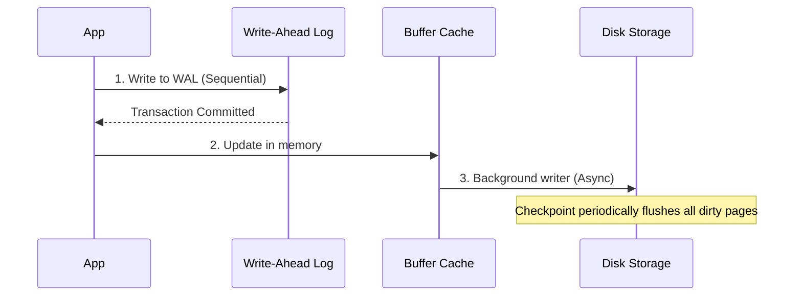
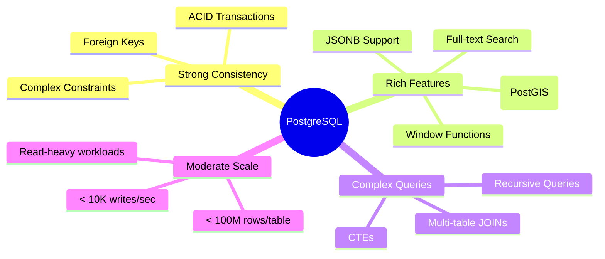

# PostgreSQL System Design Interview Guide

## 📚 Table of Contents

1. [Key Takeaways](#key-takeaways)
2. [Core Capabilities & Limitations](#core-capabilities--limitations)
3. [Read Performance](#read-performance)
4. [Write Performance](#write-performance)
5. [Data Consistency](#data-consistency)
6. [Replication & High Availability](#replication--high-availability)
7. [When to Use PostgreSQL](#when-to-use-postgresql)
8. [System Design Patterns](#system-design-patterns)
9. [Interview Tips](#interview-tips)

## 🎯 Key Takeaways

### The 80/20 Rule for PostgreSQL in Interviews

- **Default Choice**: Start with PostgreSQL unless you have specific reasons not to
- **ACID Compliance**: Strong consistency guarantees out of the box
- **Feature-Rich**: Built-in full-text search, JSONB, geospatial (PostGIS)
- **Scalability**: Can handle significant scale with proper design (sharding, partitioning, replication)

## 🏗️ Core Capabilities & Limitations

### Read Performance Benchmarks

```mermaid
graph LR
    A[Read Operations] --> B[Simple Indexed Lookups<br/>10,000s/sec per core]
    A --> C[Complex Joins<br/>1,000s/sec]
    A --> D[Full Table Scans<br/>Depends on RAM]

    style A fill:#5A0D16
    style B fill:#1E4C50
    style C fill:#5A0D16
    style D fill:#1E4C50
```



### Key Performance Numbers to Remember

| Operation Type           | Performance                 | Notes                |
| ------------------------ | --------------------------- | -------------------- |
| **Simple indexed reads** | ~10,000-50,000/sec per core | B-tree index lookups |
| **Complex joins**        | ~1,000-5,000/sec            | Multiple table joins |
| **Simple writes**        | ~5,000/sec per core         | Single table inserts |
| **Complex transactions** | ~100-1,000/sec              | Multi-table updates  |
| **Bulk inserts**         | ~10,000-50,000 rows/sec     | Using COPY command   |

### Scale Limits (Single Node)

- **Comfortable**: < 100M rows per table
- **Needs optimization**: 100M - 1B rows
- **Consider partitioning/sharding**: > 1B rows
- **Working set should fit in RAM** for optimal performance

## 🔍 Read Performance

### Index Types and Use Cases

```mermaid
graph TD
    A[Index Types] --> B[B-tree<br/>Default]
    A --> C[GIN<br/>Full-text & JSONB]
    A --> D[GiST<br/>Geospatial]
    A --> E[Hash<br/>Equality only]

    B --> B1[Exact matches]
    B --> B2[Range queries]
    B --> B3[ORDER BY]

    C --> C1[Full-text search]
    C --> C2[JSONB queries]
    C --> C3[Array operations]

    D --> D1[PostGIS spatial]
    D --> D2[Distance queries]
    D --> D3[Geometric operations]

    style A fill:#1E4C50
    style B fill:#5A0D16
    style C fill:#1E4C50
    style D fill:#5A0D16
    style E fill:#1E4C50
```



### Advanced Indexing Strategies

#### 1. Covering Indexes

```sql
-- Include all needed columns in index to avoid table lookups
CREATE INDEX idx_posts_user_include
ON posts(user_id) INCLUDE (title, created_at);
```

#### 2. Partial Indexes

```sql
-- Only index active users (smaller, faster index)
CREATE INDEX idx_active_users
ON users(email) WHERE status = 'active';
```

#### 3. Multi-column Indexes

```sql
-- Order matters! Matches (user_id) and (user_id, created_at) queries
CREATE INDEX idx_posts_user_date
ON posts(user_id, created_at DESC);
```

### Full-Text Search Capabilities

- **Built-in FTS** with GIN indexes
- Supports stemming, ranking, multiple languages
- Good for < 10M documents
- Consider Elasticsearch for:
  - Advanced relevancy scoring
  - Faceted search
  - Fuzzy matching
  - > 100M documents

## ✍️ Write Performance

### Write Performance Optimization Hierarchy

```mermaid
graph TD
    A[Write Optimization Strategies] --> B[1. Batch Processing<br/>10x improvement]
    A --> C[2. Vertical Scaling<br/>2-3x improvement]
    A --> D[3. Write Offloading<br/>Async processing]
    A --> E[4. Table Partitioning<br/>By time/key]
    A --> F[5. Horizontal Sharding<br/>Linear scaling]

    B --> B1[Combine multiple ops]
    D --> D1[Queue + Background workers]
    E --> E1[Time-based partitions]
    F --> F1[Shard by user_id/tenant]

    style A fill:#5A0D16
    style B fill:#1E4C50
    style C fill:#5A0D16
    style D fill:#1E4C50
    style E fill:#5A0D16
    style F fill:#1E4C50
```



### Write Architecture Flow



### Partitioning Strategy Example

```sql
-- Partition by month for time-series data
CREATE TABLE posts (
    id SERIAL,
    user_id INT,
    created_at TIMESTAMP
) PARTITION BY RANGE (created_at);

CREATE TABLE posts_2024_01 PARTITION OF posts
    FOR VALUES FROM ('2024-01-01') TO ('2024-02-01');
```

## 🔒 Data Consistency

### Transaction Isolation Levels

```mermaid
graph LR
    A[Isolation Levels] --> B[Read Committed<br/>Default]
    A --> C[Repeatable Read<br/>Snapshot isolation]
    A --> D[Serializable<br/>Strongest]

    B --> B1[Prevents dirty reads]
    C --> C1[+ Prevents non-repeatable reads]
    C --> C2[+ Prevents phantom reads in PG]
    D --> D1[+ Prevents all anomalies]
    D --> D2[May require retries]

    style A fill:#5A0D16
    style B fill:#1E4C50
    style C fill:#5A0D16
    style D fill:#1E4C50
```



### Concurrency Control Strategies

| Strategy                   | Use Case             | Performance       | Complexity             |
| -------------------------- | -------------------- | ----------------- | ---------------------- |
| **Row-level locking**      | Known rows to lock   | High concurrency  | Simple, no retries     |
| **Serializable isolation** | Complex transactions | Lower concurrency | Requires retry logic   |
| **Optimistic locking**     | Low conflict rate    | High concurrency  | Application complexity |

### Example: Preventing Race Conditions

```sql
-- Option 1: Row-level locking
BEGIN;
SELECT * FROM inventory WHERE product_id = 123 FOR UPDATE;
-- Check availability and update
UPDATE inventory SET quantity = quantity - 1 WHERE product_id = 123;
COMMIT;

-- Option 2: Serializable isolation
BEGIN;
SET TRANSACTION ISOLATION LEVEL SERIALIZABLE;
-- Your transaction logic
COMMIT;
```

## 🔄 Replication & High Availability

### Replication Architecture

```mermaid
graph TB
    A[Primary<br/>Handles Writes] --> B[Sync Replica 1<br/>Strong Consistency]
    A --> C[Sync Replica 2<br/>Strong Consistency]
    A --> D[Async Replica 1<br/>Read Scaling]
    A --> E[Async Replica 2<br/>Read Scaling]
    A --> F[Async Replica 3<br/>Analytics]

    B -.->|Failover| A

    style A fill:#1E4C50
    style B fill:#5A0D16
    style C fill:#1E4C50
    style D fill:#5A0D16
    style E fill:#1E4C50
    style F fill:#5A0D16
```



### Replication Trade-offs

- **Synchronous**: Strong consistency, higher write latency
- **Asynchronous**: Better performance, potential lag
- **Hybrid**: 1-2 sync replicas for HA, async for read scaling

## 📊 When to Use PostgreSQL

### Use PostgreSQL When You Need



### Consider Alternatives For

| Requirement              | Alternative           | Why                             |
| ------------------------ | --------------------- | ------------------------------- |
| **> 1M writes/sec**      | Cassandra, ScyllaDB   | Built for write-heavy workloads |
| **Global active-active** | CockroachDB, Spanner  | Multi-region writes             |
| **Simple key-value**     | Redis, DynamoDB       | Optimized for simple access     |
| **Time-series data**     | TimescaleDB, InfluxDB | Specialized compression         |
| **Graph relationships**  | Neo4j, Amazon Neptune | Graph algorithms                |

## 🎨 System Design Patterns

### 1. CQRS with PostgreSQL

```mermaid
graph LR
    A[Application] --> B[Write to Primary]
    A --> C[Read from Replicas]
    B --> D[Primary PostgreSQL]
    C --> E[Read Replica Pool]
    D --> E

    style A fill:#1E4C50
    style B fill:#5A0D16
    style C fill:#1E4C50
    style D fill:#5A0D16
    style E fill:#1E4C50
```



### 2. Event Sourcing Pattern

```mermaid
graph LR
    A[Events] --> B[Kafka Queue]
    B --> C[Event Store<br/>PostgreSQL]
    B --> D[Materialized Views<br/>PostgreSQL]
    D --> E[Read API]

    style A fill:#5A0D16
    style B fill:#1E4C50
    style C fill:#5A0D16
    style D fill:#1E4C50
    style E fill:#5A0D16
```



### 3. Sharding Strategy

```mermaid
graph TD
    A[Router/Proxy] --> B[Shard 1<br/>Users 0-1M]
    A --> C[Shard 2<br/>Users 1M-2M]
    A --> D[Shard 3<br/>Users 2M-3M]

    B --> B1[Primary]
    B --> B2[Replica]
    C --> C1[Primary]
    C --> C2[Replica]
    D --> D1[Primary]
    D --> D2[Replica]

    style A fill:#5A0D16
    style B fill:#1E4C50
    style C fill:#5A0D16
    style D fill:#1E4C50
```



## 💡 Interview Tips

### 1. Structure Your Answer

1. **Start simple**: Single PostgreSQL instance
2. **Add complexity gradually**: Replicas → Partitioning → Sharding
3. **Justify each decision**: Link to requirements

### 2. Key Phrases to Use

- "Given our consistency requirements, PostgreSQL's ACID guarantees make it a good fit"
- "We can start with PostgreSQL and its built-in full-text search, eliminating the need for Elasticsearch initially"
- "Using read replicas, we can scale to handle our read-heavy workload"
- "We'll partition by date to keep recent data performant"

### 3. Common Pitfalls to Avoid

- ❌ "NoSQL always scales better" - PostgreSQL can scale significantly
- ❌ Diving into MVCC/WAL internals - Stay high-level
- ❌ Over-indexing - Each index slows writes
- ❌ Ignoring replication lag - Address read-after-write consistency

### 4. Progression Pattern


## 🔧 Quick Reference SQL

### Essential DDL

```sql
-- Create table with constraints
CREATE TABLE users (
    id SERIAL PRIMARY KEY,
    email VARCHAR(255) UNIQUE NOT NULL,
    created_at TIMESTAMP DEFAULT CURRENT_TIMESTAMP
);

-- Add indexes
CREATE INDEX idx_users_email ON users(email);
CREATE INDEX idx_posts_user_date ON posts(user_id, created_at DESC);

-- Add full-text search
ALTER TABLE posts ADD COLUMN search_vector tsvector;
CREATE INDEX idx_posts_search ON posts USING GIN(search_vector);
```

### Transaction Examples

```sql
-- Basic transaction
BEGIN;
UPDATE accounts SET balance = balance - 100 WHERE id = 1;
UPDATE accounts SET balance = balance + 100 WHERE id = 2;
COMMIT;

-- With isolation level
BEGIN;
SET TRANSACTION ISOLATION LEVEL SERIALIZABLE;
-- operations
COMMIT;
```

## 📝 Final Checklist

Before proposing PostgreSQL in your design:

- [ ] Confirmed ACID requirements align with PostgreSQL
- [ ] Estimated data volume (< 1B rows per table?)
- [ ] Calculated write throughput (< 10K/sec per node?)
- [ ] Identified sharding key if needed
- [ ] Planned replication strategy
- [ ] Considered caching layer for hot data
- [ ] Addressed consistency vs performance trade-offs

## 🎯 Remember

- **Start with PostgreSQL** - It's versatile and battle-tested
- **Add complexity only when needed** - Not every system needs sharding
- **Consider managed services** - AWS RDS, Google Cloud SQL reduce operational burden
- **PostgreSQL can do more than you think** - JSONB, full-text search, geospatial
- **Monitor and iterate** - Use EXPLAIN ANALYZE, track slow queries

# 🚀 PostgreSQL System Design - Last Minute Revision

## 🎯 The Most Important Numbers

- **Simple reads**: 10,000-50,000/sec per core
- **Simple writes**: ~5,000/sec per core
- **Complex joins**: 1,000-5,000/sec
- **Comfortable scale**: < 100M rows/table
- **Needs optimization**: 100M - 1B rows
- **Consider sharding**: > 1B rows

## 💡 Golden Rules

- **Default to PostgreSQL** unless you have specific reasons not to
- **ACID compliance** comes out of the box - no extra work
- **Working set should fit in RAM** for optimal performance
- **Indexes speed reads but slow writes** - be selective
- **Start simple, add complexity gradually** in your design

## 🏗️ Scaling Progression (Always follow this order)

1. **Vertical scaling** → Bigger machine (easiest)
2. **Read replicas** → Handle read-heavy workloads
3. **Connection pooling** → PgBouncer/PgPool
4. **Caching layer** → Redis for hot data
5. **Partitioning** → Split large tables by date/key
6. **Sharding** → Horizontal scaling (last resort)

## ⚡ Quick Performance Wins

- **Batch writes** → 10x improvement with COPY
- **Covering indexes** → Include all columns to avoid table lookups
- **Partial indexes** → Index only what you need (WHERE clause)
- **JSONB for flexibility** → Schema-less data without separate NoSQL
- **Async processing** → Queue writes, process in background

## 🔄 Replication Strategy

- **Primary** → All writes go here
- **Sync replicas (1-2)** → Zero data loss, higher latency
- **Async replicas (N)** → Read scaling, possible lag
- **Typical setup**: 1 primary + 1 sync + 2-3 async

## 📊 When to Choose PostgreSQL

### ✅ Perfect For:

- Financial transactions (ACID required)
- Complex queries with JOINs
- Mixed workloads (OLTP + some analytics)
- Full-text search (< 10M documents)
- Geospatial data (PostGIS)
- Starting point for most applications

### ❌ Consider Alternatives:

- **> 1M writes/sec** → Cassandra/ScyllaDB
- **Global active-active** → CockroachDB/Spanner
- **Pure key-value** → Redis/DynamoDB
- **Time-series only** → TimescaleDB/InfluxDB
- **Graph traversals** → Neo4j

## 🎨 Common Patterns

1. **CQRS**: Write to primary, read from replicas
2. **Event Sourcing**: Store events in PostgreSQL, build materialized views
3. **Multi-tenant**: Partition by tenant_id or use separate schemas
4. **Hot/Cold Data**: Recent in PostgreSQL, archive to S3

## 🔒 Consistency Levels

- **Read Committed** (default) → Prevents dirty reads
- **Repeatable Read** → Snapshot isolation
- **Serializable** → Strongest, may need retries
- **FOR UPDATE** → Row-level locking for critical sections

## 💬 Key Phrases for Interview

- "PostgreSQL gives us ACID guarantees out of the box"
- "We can leverage built-in full-text search initially"
- "Read replicas will handle our read-heavy workload"
- "We'll partition by date to keep queries performant"
- "PostgreSQL's JSONB gives us NoSQL flexibility when needed"

## 🚨 Common Mistakes to Avoid

- Don't over-index (each index slows writes)
- Don't ignore replication lag in read-after-write scenarios
- Don't jump to sharding too early
- Don't forget connection pooling at scale
- Don't use COUNT(\*) on large tables without indexes

## 📝 SQL Quick Reference

```sql
-- Efficient bulk insert
COPY users FROM '/data/users.csv' CSV;

-- Partial index
CREATE INDEX ON orders(user_id) WHERE status = 'active';

-- Covering index
CREATE INDEX ON posts(user_id) INCLUDE (title, created_at);

-- Row-level locking
SELECT * FROM inventory WHERE id = 1 FOR UPDATE;
```

## 🎯 Final Checklist

When proposing PostgreSQL, mention:

1. **Why PostgreSQL**: ACID, features, maturity
2. **Scale considerations**: Data size, throughput estimates
3. **Replication strategy**: HA and read scaling
4. **Partitioning plan**: If tables > 100M rows
5. **Caching layer**: For frequently accessed data
6. **Monitoring**: Slow query log, EXPLAIN ANALYZE

## 🔥 The 30-Second Pitch

"I'd start with PostgreSQL because it provides ACID guarantees, supports our consistency requirements, and has built-in features like JSONB and full-text search. We can scale vertically initially, add read replicas for our read-heavy workload, implement partitioning for large tables, and consider sharding only if we exceed single-node limits. PostgreSQL can handle up to 100M rows comfortably and thousands of transactions per second, which covers most use cases."
