# Redis Deep Dive for System Design Interviews

## Overview

Redis is a **data structure store** that stands out for:

- **Versatility**: Can solve numerous system design problems
- **Simplicity**: Easy to reason about in distributed systems
- **Performance**: In-memory, single-threaded architecture for blazing speed

## Core Concepts

### Key Characteristics

- **In-memory storage** 🚀
- **Single-threaded** (easy to reason about)
- **Written in C** (high performance)
- **Key-value store** at its core
- Keys are strings, values can be various data structures

### ⚠️ Important Trade-off

Redis prioritizes **speed over durability**. While AOF (Append-Only File) can minimize data loss, you don't get the same durability guarantees as traditional databases. Consider AWS MemoryDB for disk-based durability if needed.

## Data Structures

### Basic Data Structures

1. **Strings** - Simple key-value pairs
2. **Hashes** - Objects/dictionaries
3. **Lists** - Ordered collections
4. **Sets** - Unordered unique elements
5. **Sorted Sets** - Priority queues with scores
6. **Bloom Filters** - Probabilistic data structure
7. **Geospatial Indexes** - Location-based data
8. **Time Series** - Time-ordered data

### Communication Patterns

- **Pub/Sub** - Real-time messaging
- **Streams** - Append-only logs (like Kafka)

## Infrastructure Configurations


### Key Points

- Clients cache hash slot mappings for direct node access
- Gossip protocol maintains node awareness
- **Critical limitation**: Data for a single request must be on one node
- Key structure determines scaling strategy

## Performance Metrics

- **Writes**: ~100,000 operations/second
- **Read latency**: Microsecond range
- Enables patterns that would be anti-patterns in other databases

## Common Use Cases

### 1. Cache Implementation


**Key Commands:**

```bash
SET key value EX 3600  # Set with TTL
GET key                # Retrieve value
```

### 2. Distributed Lock


**Implementation:**

```bash
INCR lock_key          # Try to acquire
# If returns 1, you have the lock
# If returns > 1, someone else has it
DEL lock_key           # Release lock
```

### 3. Leaderboards (Sorted Sets)

```bash
ZADD tiger_posts 500 "PostId1"        # Add post with score
ZADD tiger_posts 100 "PostId2"
ZREMRANGEBYRANK tiger_posts 0 -6      # Keep only top 5
ZRANGE tiger_posts 0 -1 WITHSCORES    # Get leaderboard
```

### 4. Rate Limiting


**Fixed Window Implementation:**

```bash
INCR user:123:requests
EXPIRE user:123:requests 60  # Reset after 60 seconds
```

### 5. Proximity Search

```bash
GEOADD restaurants -122.4194 37.7749 "Pizza Place"
GEOSEARCH restaurants FROMLONLAT -122.4194 37.7749 BYRADIUS 5 km
```

### 6. Event Sourcing (Streams)


**Commands:**

```bash
XADD mystream * field1 value1         # Add to stream
XREADGROUP GROUP mygroup consumer1    # Read from consumer group
XCLAIM mystream mygroup consumer2     # Claim failed message
```

### 7. Pub/Sub Pattern


**Note:** Messages are **not persisted** - offline subscribers miss messages. Use Streams for durability.

## Common Problems & Solutions

### Hot Key Issue

```mermaid
graph TB
    subgraph "Problem: Uneven Load"
        HotNode[Node 1<br/>🔥 99% traffic]
        ColdNode1[Node 2<br/>❄️ 0.5% traffic]
        ColdNode2[Node 3<br/>❄️ 0.5% traffic]
    end

    subgraph "Solutions"
        Sol1[Client-side caching]
        Sol2[Key duplication<br/>item:1, item:1:replica2]
        Sol3[Read replicas<br/>with auto-scaling]
    end
```



**Mitigation Strategies:**

1. **Client-side caching** - Reduce Redis hits
2. **Key duplication** - Spread load across multiple keys
3. **Read replicas** - Dynamic scaling with load

## Interview Tips

### When to Use Redis

✅ **Good for:**

- High-speed caching
- Real-time features (chat, notifications)
- Session management
- Leaderboards and counters
- Temporary data with TTL
- Distributed locks (with careful design)

❌ **Not ideal for:**

- Primary data store for critical data
- Large datasets that exceed memory
- Complex queries requiring joins
- Long-term persistent storage

### Key Design Patterns

1. **Cache-Aside Pattern**

   - Check cache first
   - On miss, fetch from DB and update cache
   - Set appropriate TTL

2. **Write-Through Cache**

   - Write to cache and DB simultaneously
   - Ensures consistency

3. **Write-Behind Cache**
   - Write to cache immediately
   - Async write to DB later
   - Higher performance but risk of data loss

### Scaling Considerations

1. **Vertical Scaling**: Increase memory/CPU of nodes
2. **Horizontal Scaling**: Add more nodes to cluster
3. **Read Scaling**: Add read replicas
4. **Write Scaling**: Proper key sharding strategy

### Common Interview Questions

1. **"How would you handle cache invalidation?"**

   - TTL-based expiration
   - Event-driven invalidation
   - Cache versioning

2. **"How do you prevent cache stampede?"**

   - Lock-based refresh
   - Probabilistic early expiration
   - Background refresh

3. **"How do you ensure consistency?"**
   - Use appropriate consistency patterns
   - Consider using Redlock for distributed locks
   - Implement fencing tokens for critical operations

## Advanced Concepts

### Memory Management

- **Eviction Policies**: LRU, LFU, Random, TTL-based
- **Memory optimization**: Use appropriate data structures
- **Key naming**: Use consistent, hierarchical naming

### Monitoring & Operations

- Monitor memory usage
- Track hit/miss ratios
- Watch for hot keys
- Set up alerts for connection limits

### Security Considerations

- Use AUTH for authentication
- Enable TLS for encryption in transit
- Implement proper network isolation
- Regular backups of AOF/RDB files

## Command Cheat Sheet

### Basic Operations

```bash
SET key value [EX seconds]     # Set with optional expiry
GET key                        # Get value
INCR key                       # Atomic increment
DECR key                       # Atomic decrement
DEL key                        # Delete key
EXISTS key                     # Check existence
EXPIRE key seconds             # Set TTL
TTL key                        # Check remaining TTL
```

### Data Structure Operations

```bash
# Lists
LPUSH/RPUSH list value         # Add to left/right
LPOP/RPOP list                 # Remove from left/right
LRANGE list 0 -1               # Get all elements

# Sets
SADD set member                # Add to set
SREM set member                # Remove from set
SISMEMBER set member           # Check membership
SCARD set                      # Get cardinality

# Sorted Sets
ZADD key score member          # Add with score
ZRANGE key 0 -1 WITHSCORES     # Get range with scores
ZRANK key member               # Get rank of member

# Hashes
HSET hash field value          # Set field
HGET hash field                # Get field
HGETALL hash                   # Get all fields
```

## Best Practices

1. **Use appropriate data structures** - Don't use strings for everything
2. **Set TTLs wisely** - Prevent memory bloat
3. **Monitor memory usage** - Set up alerts before hitting limits
4. **Use pipelining** - Batch operations for better performance
5. **Implement circuit breakers** - Handle Redis failures gracefully
6. **Test failure scenarios** - Network partitions, node failures
7. **Document key schemas** - Maintain consistency across team

## Summary

Redis is powerful for system design interviews because:

- Simple mental model makes it easy to reason about
- Versatile enough to solve many problems
- Performance characteristics are predictable
- Scaling patterns are straightforward

Remember: Redis trades durability for speed. Always consider if this trade-off is acceptable for your use case, and be prepared to discuss alternatives when it's not.

## Additional Resources

- Redis Documentation: https://redis.io/docs/
- Redis Commands: https://redis.io/commands/
- Redlock Algorithm: https://redis.io/docs/manual/patterns/distributed-locks/
- AWS MemoryDB (for durability): https://aws.amazon.com/memorydb/

## 🚀 Redis Quick Revision Points

### Core Identity

• **In-memory data structure store** - Not just a cache, it's a Swiss Army knife for system design
• **Single-threaded** - No concurrency issues, predictable performance
• **Speed over durability** - AOF helps but not ACID compliant
• **~100K ops/second** writes, **microsecond latency** reads

### 8 Key Data Structures

• **Strings** → Simple KV pairs, counters
• **Hashes** → User objects, sessions
• **Lists** → Queues, timelines
• **Sets** → Unique items, tags
• **Sorted Sets** → Leaderboards, priority queues
• **Bloom Filters** → Membership testing
• **Geospatial** → Location queries
• **Streams** → Event logs, message queues

### Infrastructure Modes

• **Single Node** → Dev/small apps
• **Replicated** → Read scaling, failover
• **Cluster Mode** → Horizontal scaling (16,384 hash slots)
• ⚠️ **Critical limitation**: Single request data must be on one node

### Top 7 Use Cases to Remember

1. **Cache** → `SET key value EX 3600`, `GET key`
2. **Distributed Lock** → `INCR lock_key` (returns 1 = you have it)
3. **Rate Limiting** → `INCR user:123:requests` + `EXPIRE 60`
4. **Leaderboards** → `ZADD`, `ZRANGE`, `ZREMRANGEBYRANK`
5. **Session Store** → Hashes with TTL
6. **Real-time Pub/Sub** → Fire-and-forget messaging
7. **Geospatial** → `GEOADD`, `GEOSEARCH` for proximity

### Common Problems & Solutions

• **Cache Stampede** → Lock-based refresh, probabilistic expiration
• **Hot Keys** → Client caching, key duplication, read replicas
• **Cache Invalidation** → TTL, event-driven, versioning
• **Consistency** → Cache-aside, write-through, write-behind patterns

### Scaling Strategies

• **Vertical** → More RAM/CPU per node
• **Horizontal** → Add cluster nodes
• **Read Heavy** → Add replicas
• **Write Heavy** → Proper key sharding

### Interview Red Flags to Avoid

• ❌ Using Redis as primary database for critical data
• ❌ Storing data larger than available memory
• ❌ Ignoring TTL (memory bloat)
• ❌ Not handling Redis failures (circuit breakers needed)
• ❌ Complex queries requiring joins

### Golden Rules

• **Keys determine scaling** - Design them wisely
• **TTL everything** - Prevent memory issues
• **Monitor hit/miss ratio** - Should be >90% for cache
• **Eviction policy matters** - LRU for cache, noeviction for data store
• **Pipeline commands** - Batch for performance

### Quick Command Reference

```
SET/GET, INCR/DECR, DEL, EXISTS, EXPIRE, TTL
LPUSH/RPUSH/LPOP/RPOP (lists)
SADD/SREM/SISMEMBER (sets)
ZADD/ZRANGE/ZRANK (sorted sets)
HSET/HGET/HGETALL (hashes)
XADD/XREAD (streams)
PUBLISH/SUBSCRIBE (pub/sub)
```

### Interview Power Phrases

• "Redis gives us microsecond latency which enables patterns that would be anti-patterns elsewhere"
• "I'd use Redis here because we need atomic operations at scale"
• "The trade-off is durability for speed - is that acceptable for this use case?"
• "With cluster mode, we can scale horizontally but need to ensure related data uses the same key prefix"
• "For this real-time feature, Redis pub/sub fits perfectly, but for durability we'd need Streams"

### When Asked "Why Redis?"

✅ **Speed critical** (microsecond response)
✅ **Atomic operations** needed
✅ **Real-time features** (chat, notifications)
✅ **Temporary data** with TTL
✅ **Simple data structures** sufficient

### When Asked "Why NOT Redis?"

❌ **Need durability** guarantees
❌ **Data exceeds memory** budget
❌ **Complex queries** with joins
❌ **Long-term storage** requirement
❌ **Transactional consistency** critical

**Remember**: Redis is your go-to for anything that needs to be FAST and can tolerate some data loss. It's the performance layer, not the persistence layer!
