# ZooKeeper Deep Dive - Interview Guide

## Core Problem: Why Distributed Coordination is Hard

### The Chat Application Evolution

1. **Single Server**: Simple, everything in memory
2. **Multiple Servers**: Coordination problems emerge
   - Where is each user connected?
   - How to handle server failures?
   - How to maintain consistent state?

### Failed Approaches

- **Database**: Single point of failure, latency bottleneck
- **Caching**: Cache consistency issues
- **Server-to-Server Broadcasting**: O(n²) connections, doesn't scale
- **Heartbeats**: Network partition problems, split-brain scenarios

## What is ZooKeeper?

**Definition**: A centralized service for maintaining configuration information, naming, providing distributed synchronization, and group services.

**Key Characteristics**:

- Released in 2008 by Apache
- Optimized for read-heavy workloads (10:1 read/write ratio)
- Stores small amounts of coordination data (<1MB per node)
- Provides strong consistency guarantees

## Core Components

### 1. ZNodes (Data Model)


**Three Types of ZNodes**:

| Type           | Description                     | Use Case                             | Example                      |
| -------------- | ------------------------------- | ------------------------------------ | ---------------------------- |
| **Persistent** | Exists until explicitly deleted | Configuration data                   | `/chat-app/config/max_users` |
| **Ephemeral**  | Auto-deleted when session ends  | Service discovery, failure detection | `/chat-app/servers/server1`  |
| **Sequential** | Auto-appended monotonic counter | Distributed locks, leader election   | `/chat-app/lock-0000000001`  |

### 2. ZooKeeper Ensemble


**Key Points**:

- Odd number of servers (3, 5, or 7) for quorum decisions
- **Leader**: Processes all write requests
- **Followers**: Serve read requests, replicate leader's state
- Can tolerate (n-1)/2 failures (e.g., 1 failure in 3-node ensemble)

### 3. Watches (Change Notifications)

```mermaid
sequenceDiagram
    participant S1 as Server 1
    participant ZK as ZooKeeper
    participant S2 as Server 2

    S1->>ZK: Watch /users directory
    S2->>ZK: Create /users/bob → "server2"
    ZK-->>S1: Notification: bob added
    S1->>S1: Update local cache
    Note over S1: No need to poll ZooKeeper
```



**Benefits**:

- Eliminates constant polling
- Reduces network traffic
- Enables real-time updates
- Local caching pattern

## How ZooKeeper Works

### ZAB Protocol (ZooKeeper Atomic Broadcast)


**Two Phases**:

1. **Leader Election**: Select most up-to-date server
2. **Atomic Broadcast**: Ensure majority agreement before commit

### Consistency Guarantees

| Guarantee                  | Description                       |
| -------------------------- | --------------------------------- |
| **Sequential Consistency** | Updates applied in order sent     |
| **Atomicity**              | All-or-nothing updates            |
| **Single System Image**    | Same view across all servers      |
| **Durability**             | Updates persist until overwritten |
| **Timeliness**             | Bounded update propagation time   |

### Session Management


**Key Parameters**:

- Session timeout: 10-30 seconds typically
- Too short: False positives on network blips
- Too long: Slow failure detection

## Four Key Capabilities

### 1. Configuration Management

```
/app/config/
    ├── database_url     → "postgres://..."
    ├── feature_flags    → {"darkMode": true}
    └── rate_limits      → "100/sec"
```

- Real-time config updates without restarts
- Version control
- Atomic updates across cluster

### 2. Service Discovery

```
/services/
    ├── api-gateway/
    │   ├── instance-001 → "10.0.1.1:8080"
    │   └── instance-002 → "10.0.1.2:8080"
    └── database/
        └── primary      → "10.0.2.1:5432"
```

- Automatic registration/deregistration
- Health checking via ephemeral nodes
- Load balancing support

### 3. Leader Election

```
/election/
    ├── node-0000000001 → "server1" (LEADER)
    ├── node-0000000002 → "server2" (watches 001)
    └── node-0000000003 → "server3" (watches 002)
```

- Lowest sequence number becomes leader
- Automatic failover on leader crash
- No split-brain scenarios

### 4. Distributed Locks

```
/locks/resource-x/
    ├── lock-0000000001 → "process1" (HAS LOCK)
    ├── lock-0000000002 → "process2" (waiting)
    └── lock-0000000003 → "process3" (waiting)
```

- Fair ordering (FIFO)
- Automatic release on failure
- Deadlock prevention

## Modern Alternatives & When to Use

### Alternatives Comparison

| Tool                | Best For                 | Key Features                             |
| ------------------- | ------------------------ | ---------------------------------------- |
| **etcd**            | Kubernetes, cloud-native | HTTP/gRPC APIs, built into K8s           |
| **Consul**          | Service mesh             | Health checking, network automation      |
| **Redis**           | High-performance locks   | Fast, simple, good for short-lived locks |
| **Cloud Solutions** | Managed services         | AWS Parameter Store, Azure App Config    |

### When to Use ZooKeeper in Interviews

✅ **DO mention ZooKeeper for**:

- Deep infrastructure design (distributed queue, scheduler)
- Apache ecosystem integration (Kafka, HBase, Hadoop)
- Complex hierarchical locking requirements
- Smart routing in chat/streaming systems

❌ **DON'T default to ZooKeeper for**:

- Simple service discovery (use cloud-native solutions)
- High-frequency locking (use Redis)
- Large data storage (ZooKeeper limits: <1MB nodes)
- Cloud-first architectures (use managed services)

## Interview Tips & Patterns

### Smart Routing Pattern (Advanced)


**Use Case**: Collocate users in same chat room on same server to minimize cross-server communication

### Distributed Message Queue Architecture

```mermaid
graph TB
    subgraph "Producers"
        P1[Producer 1]
        P2[Producer 2]
    end

    subgraph "Kafka Cluster"
        B1[Broker 1]
        B2[Broker 2]
        B3[Broker 3]
    end

    subgraph "Consumers"
        C1[Consumer 1]
        C2[Consumer 2]
    end

    ZK[ZooKeeper<br/>• Leader election<br/>• Topic metadata<br/>• Consumer groups]

    P1 & P2 --> B1 & B2 & B3
    B1 & B2 & B3 --> C1 & C2
    B1 & B2 & B3 <--> ZK
```



### Performance Considerations

**Limitations to mention**:

- **Write bottleneck**: All writes go through leader
- **Memory constraints**: Everything stored in RAM
- **Hot spotting**: Popular nodes can overwhelm servers
- **Operational complexity**: JVM tuning, disk layout

**Optimization patterns**:

- Local caching with watches (reduce reads)
- Batch operations where possible
- Hierarchical organization for efficient watching
- Session timeout tuning for your use case

## Common Interview Questions & Answers

### Q: "How does ZooKeeper handle network partitions?"

**A**: ZooKeeper requires a majority quorum to remain operational. In a partition:

- The side with majority continues operating
- Minority side becomes read-only or unavailable
- Prevents split-brain scenarios
- When partition heals, minority syncs with majority

### Q: "What's the difference between ZooKeeper and a database?"

**A**:

- **Purpose**: ZooKeeper for coordination, DB for data storage
- **Data size**: ZooKeeper <1MB nodes, DB unlimited
- **Features**: ZooKeeper has watches, ephemeral nodes
- **Consistency**: ZooKeeper provides sequential consistency, most DBs provide various levels

### Q: "How would you implement a distributed lock with ZooKeeper?"

**A**:

1. Create sequential ephemeral node under `/locks/resource`
2. Get all children, sort by sequence number
3. If you have lowest number, you have the lock
4. Otherwise, watch the node before you
5. When notified, check if you're now lowest
6. Delete your node to release lock

### Q: "Why did Kafka move away from ZooKeeper?"

**A**:

- **Operational complexity**: Managing two systems (Kafka + ZooKeeper)
- **Scalability**: ZooKeeper became bottleneck for metadata
- **Single point of failure**: Despite ensemble, still external dependency
- **Solution**: KRaft mode - built-in Raft consensus

## Quick Reference Cheat Sheet

### ZNode Operations

```java
// Create nodes
create /path "data"                    // Persistent
create -e /path "data"                 // Ephemeral
create -s /path "data"                 // Sequential

// Read/Write
get /path                              // Read data
set /path "newdata"                    // Update data
delete /path                           // Delete node

// Watch
get /path watch                        // Set watch
getChildren /path watch                // Watch children
```

### Ensemble Sizing

- **3 nodes**: Tolerates 1 failure (minimum production)
- **5 nodes**: Tolerates 2 failures (recommended)
- **7 nodes**: Tolerates 3 failures (large deployments)

### Session Timeout Guidelines

- **Development**: 5-10 seconds
- **Production**: 10-30 seconds
- **Unstable network**: 30-60 seconds

## Additional Resources for Deep Dive

1. **Consensus Algorithms**: Study Raft (simpler than Paxos/ZAB)
2. **CAP Theorem**: ZooKeeper chooses CP (Consistency + Partition tolerance)
3. **Related Systems**:
   - Study etcd for comparison
   - Understand Chubby (Google's lock service)
   - Learn about Consul for service mesh

## Final Interview Strategy

1. **Start simple**: Explain the coordination problem first
2. **Show alternatives considered**: Database, broadcasting, etc.
3. **Introduce ZooKeeper as solution**: Focus on its strengths
4. **Acknowledge limitations**: Show you understand trade-offs
5. **Mention modern alternatives**: Demonstrate current knowledge

Remember: ZooKeeper is a tool, not a silver bullet. Always justify why it's the right choice for your specific design problem.

# ZooKeeper Last-Minute Revision Guide

## 🎯 What is ZooKeeper?

• **Definition**: Centralized service for distributed coordination, configuration, naming, and synchronization
• **Released**: 2008 by Apache
• **Optimized for**: Read-heavy workloads (10:1 read/write ratio)
• **Data limit**: <1MB per node (small coordination data only)
• **Key guarantee**: Strong consistency

## 🏗️ Core Components

### ZNodes (Data Model)

• **Persistent**: Exists until explicitly deleted (config data)
• **Ephemeral**: Auto-deleted when session ends (service discovery)
• **Sequential**: Auto-appended counter (locks, leader election)

### ZooKeeper Ensemble

• **Odd numbers only**: 3, 5, or 7 servers for quorum decisions
• **Leader**: Handles ALL writes
• **Followers**: Serve reads, replicate leader state
• **Fault tolerance**: Can lose (n-1)/2 servers

### Watches (Change Notifications)

• **Eliminates polling**: Real-time notifications on data changes
• **One-time triggers**: Must re-register after firing
• **Local caching**: Reduces ZooKeeper load

## ⚡ How It Works

### ZAB Protocol (ZooKeeper Atomic Broadcast)

• **Phase 1**: Leader election (most up-to-date server wins)
• **Phase 2**: Atomic broadcast (majority agreement required)
• **Write flow**: Client → Leader → Propose → Accept → Commit → Response

### Consistency Guarantees

• **Sequential consistency**: Updates applied in order sent
• **Atomicity**: All-or-nothing updates
• **Single system image**: Same view across all servers
• **Durability**: Updates persist until overwritten
• **Timeliness**: Bounded update propagation

### Session Management

• **Heartbeats**: Keep session alive
• **Timeout**: 10-30 seconds typical
• **Session expiry**: Ephemeral nodes auto-deleted

## 🔧 Four Key Capabilities

### 1. Configuration Management

• Real-time config updates without restarts
• Atomic updates across entire cluster
• Version control for configurations

### 2. Service Discovery

• **Ephemeral nodes**: Auto-register/deregister services
• **Health checking**: Service dies → node disappears
• **Load balancing**: Clients watch service list

### 3. Leader Election

• **Sequential nodes**: Lowest sequence number = leader
• **Watch chain**: Each node watches predecessor
• **Automatic failover**: No split-brain scenarios

### 4. Distributed Locks

• **FIFO ordering**: Fair first-come-first-served
• **Automatic release**: Process dies → lock released
• **Deadlock prevention**: Built-in ordering mechanism

## 📊 Performance & Limitations

### Limitations

• **Write bottleneck**: All writes through single leader
• **Memory bound**: Everything stored in RAM
• **Data size**: <1MB per node restriction
• **Hot spotting**: Popular nodes can overwhelm servers
• **Operational complexity**: JVM tuning, disk layout

### Optimizations

• **Local caching + watches**: Reduce read load
• **Batch operations**: Multiple updates together
• **Hierarchical organization**: Efficient watching patterns
• **Session timeout tuning**: Balance false positives vs detection speed

## 🆚 Modern Alternatives

| Tool               | Best For                 | Key Features                          |
| ------------------ | ------------------------ | ------------------------------------- |
| **etcd**           | Kubernetes, cloud-native | HTTP/gRPC APIs, K8s integration       |
| **Consul**         | Service mesh             | Health checking, network automation   |
| **Redis**          | High-performance locks   | Fast, simple, good for short locks    |
| **Cloud services** | Managed solutions        | AWS Parameter Store, Azure App Config |

## ✅ When to Use ZooKeeper

### DO Use For:

• Deep infrastructure design (queues, schedulers)
• Apache ecosystem (Kafka, HBase, Hadoop)
• Complex hierarchical locking
• Smart routing in chat/streaming systems
• When you need strong consistency guarantees

### DON'T Use For:

• Simple service discovery (use cloud-native)
• High-frequency locking (use Redis)
• Large data storage (use proper database)
• Cloud-first architectures (use managed services)

## 🎤 Key Interview Questions & Answers

### "How does ZooKeeper handle network partitions?"

• Requires majority quorum to operate
• Majority side continues, minority becomes read-only
• Prevents split-brain scenarios
• Minority syncs when partition heals

### "ZooKeeper vs Database differences?"

• **Purpose**: Coordination vs data storage
• **Size**: <1MB nodes vs unlimited
• **Features**: Watches, ephemeral nodes vs CRUD
• **Consistency**: Sequential vs various levels

### "Implement distributed lock with ZooKeeper?"

1. Create sequential ephemeral node under `/locks/resource`
2. Get all children, sort by sequence
3. Lowest number = has lock
4. Otherwise, watch predecessor node
5. When notified, check if now lowest
6. Delete node to release

### "Why did Kafka move away from ZooKeeper?"

• **Operational complexity**: Managing two systems
• **Scalability**: ZooKeeper metadata bottleneck
• **External dependency**: Single point of failure
• **Solution**: KRaft mode with built-in Raft consensus

## 🔢 Quick Reference Numbers

### Ensemble Sizing

• **3 nodes**: 1 failure tolerance (minimum production)
• **5 nodes**: 2 failure tolerance (recommended)
• **7 nodes**: 3 failure tolerance (large deployments)

### Session Timeouts

• **Development**: 5-10 seconds
• **Production**: 10-30 seconds
• **Unstable network**: 30-60 seconds

### Performance Ratios

• **Read/Write ratio**: 10:1 optimal
• **Node size limit**: 1MB maximum
• **Quorum formula**: (n-1)/2 failures tolerated

## 🎯 Interview Strategy Checklist

### Structure Your Answer:

1. **Start simple**: Explain coordination problem first
2. **Show alternatives**: Database, broadcasting, caching issues
3. **Introduce ZooKeeper**: Focus on its strengths
4. **Acknowledge limitations**: Show trade-off awareness
5. **Mention alternatives**: etcd, Consul, cloud solutions

### Red Flags to Avoid:

• Don't use ZooKeeper for everything
• Don't ignore operational complexity
• Don't forget about alternatives
• Don't skip discussing limitations
• Don't forget CAP theorem (ZooKeeper = CP)

## 🚀 Advanced Patterns

### Smart Routing Pattern

• Use ZooKeeper to track which users are on which servers
• Route related users (same chat room) to same server
• Minimize cross-server communication

### Hierarchical Locking

• Use path structure for lock granularity
• `/locks/database/table/row` hierarchy
• More specific locks can coexist with broader ones

### Configuration Versioning

• Use sequential nodes for config versions
• Atomic rollback capabilities
• Blue-green deployment coordination

## 💡 Final Tips

• **Always justify choice**: Why ZooKeeper over alternatives?
• **Know the trade-offs**: Strong consistency vs availability
• **Understand modern context**: Cloud-native alternatives
• **Show practical knowledge**: Mention operational challenges
• **Think hierarchically**: Use ZooKeeper's tree structure effectively
