# Dealing with Contention Pattern - System Design Interview Guide

## Core Concept

**Contention** occurs when multiple processes compete for the same resource simultaneously, leading to:

- Race conditions
- Double-bookings
- Inconsistent state
- Data corruption

## The Classic Problem: Concert Ticket Booking

```mermaid
sequenceDiagram
    participant Alice
    participant System
    participant Bob

    Note over System: 1 seat available

    Alice->>System: Read seats (1 available)
    Bob->>System: Read seats (1 available)

    Note over Alice,Bob: Both see 1 seat!

    Alice->>System: Purchase & Decrement (0 seats)
    Bob->>System: Purchase & Decrement (-1 seats)

    Note over System: Double booking! 💥
```



## Solution Decision Tree


## Single Database Solutions

### 1. Atomicity & Transactions

**What**: Group operations that succeed or fail together
**When**: Basic consistency needs

```sql
BEGIN TRANSACTION;
-- Check and reserve seat
UPDATE concerts
SET available_seats = available_seats - 1
WHERE concert_id = 'weeknd_tour';

-- Create ticket record
INSERT INTO tickets (user_id, concert_id, seat_number)
VALUES ('user123', 'weeknd_tour', 'A15');

COMMIT;  -- All or nothing
```

### 2. Pessimistic Locking

**What**: Lock resources upfront to prevent conflicts
**When**: High contention scenarios

```sql
BEGIN TRANSACTION;
-- Lock the row first
SELECT available_seats FROM concerts
WHERE concert_id = 'weeknd_tour'
FOR UPDATE;  -- Exclusive lock!

-- Safe to update now
UPDATE concerts
SET available_seats = available_seats - 1
WHERE concert_id = 'weeknd_tour';

COMMIT;
```


### 3. Isolation Levels

| Level            | Description                         | Use Case               |
| ---------------- | ----------------------------------- | ---------------------- |
| READ UNCOMMITTED | See uncommitted changes             | Rarely used            |
| READ COMMITTED   | See only committed changes          | Default in PostgreSQL  |
| REPEATABLE READ  | Consistent reads within transaction | Default in MySQL       |
| **SERIALIZABLE** | Transactions appear sequential      | Solves race conditions |

### 4. Optimistic Concurrency Control (OCC)

**What**: Assume conflicts are rare, detect them after
**When**: Low contention, high read/write ratio

```sql
-- Using version column
UPDATE concerts
SET available_seats = available_seats - 1,
    version = version + 1
WHERE concert_id = 'weeknd_tour'
  AND version = 42;  -- Expected version

-- Or using natural version (seat count itself)
UPDATE concerts
SET available_seats = available_seats - 1
WHERE concert_id = 'weeknd_tour'
  AND available_seats = 1;  -- Expected value
```

## Multiple Database Solutions

### 1. Two-Phase Commit (2PC)


**Pros**: Strong consistency
**Cons**:

- Blocking (locks held during network calls)
- Coordinator failures leave system in limbo
- Performance overhead

### 2. Saga Pattern


**Pros**:

- No distributed locks
- Better resilience
- Each step commits independently

**Cons**:

- Temporary inconsistency
- Complex compensation logic

### 3. Distributed Locks

**Implementation Options**:

| Technology           | Pros                     | Cons                    |
| -------------------- | ------------------------ | ----------------------- |
| **Redis with TTL**   | Fast, auto-expiration    | Single point of failure |
| **Database columns** | No extra infrastructure  | Slower, needs cleanup   |
| **ZooKeeper/etcd**   | Robust, handles failures | Complex to operate      |

```python
# Redis example
def acquire_lock(redis_client, resource_id, ttl=30):
    lock_key = f"lock:{resource_id}"
    acquired = redis_client.set(
        lock_key,
        "locked",
        nx=True,  # Only if not exists
        ex=ttl    # Auto-expire
    )
    return acquired
```

## Common Interview Scenarios & Solutions

### 1. **Ticketmaster/Event Booking**

- **Pattern**: Pessimistic locking + Reservations
- **Key**: Create temporary "reserved" state with timeout
- **Implementation**:
  ```sql
  UPDATE seats
  SET status = 'reserved',
      reserved_until = NOW() + INTERVAL '10 minutes'
  WHERE seat_id = 'A15' AND status = 'available';
  ```

### 2. **Online Auction Systems**

- **Pattern**: Optimistic concurrency
- **Key**: Use current bid as version
- **Implementation**:
  ```sql
  UPDATE auctions
  SET highest_bid = 150, bidder = 'alice'
  WHERE item_id = 123
    AND highest_bid = 100;  -- Current bid as version
  ```

### 3. **Banking/Payment Systems**

- **Pattern**: Saga pattern (for resilience) or 2PC (for strict consistency)
- **Key**: Handle cross-database transfers
- **Implementation**: Debit → Credit → Compensate if needed

### 4. **Ride Sharing Dispatch**

- **Pattern**: Distributed locks with status coordination
- **Key**: Set driver status to "pending_request"
- **Implementation**: Redis lock with 10-second TTL

### 5. **Flash Sales/Inventory**

- **Pattern**: Mixed approach
- **Key**: OCC for updates + shopping cart holds
- **Implementation**:

  ```sql
  -- Inventory update with OCC
  UPDATE products
  SET stock = stock - 1
  WHERE product_id = 'ps5'
    AND stock >= 1;

  -- Cart reservation
  INSERT INTO cart_holds (user_id, product_id, expires_at)
  VALUES ('user123', 'ps5', NOW() + INTERVAL '15 minutes');
  ```

## Edge Cases & Deep Dives

### 1. **Deadlock Prevention**


**Solution**: Ordered locking - always acquire locks in consistent order (e.g., by ID)

```python
def transfer_money(from_id, to_id, amount):
    # Sort IDs to prevent deadlock
    first, second = sorted([from_id, to_id])

    with lock(first):
        with lock(second):
            # Safe to transfer
            perform_transfer()
```

### 2. **ABA Problem in OCC**

**Problem**: Value changes A→B→A, appears unchanged
**Solution**: Use monotonically increasing values

- Review count (always increases)
- Explicit version column
- Timestamp with microsecond precision

### 3. **Hot Partition/Celebrity Problem**


**Solutions**:

1. **Queue-based serialization**: Process requests sequentially
2. **Change the problem**: Multiple identical items, eventual consistency
3. **Rate limiting**: Protect the resource

## Performance Comparison

| Approach         | Latency | Throughput | Complexity | Use When                         |
| ---------------- | ------- | ---------- | ---------- | -------------------------------- |
| Pessimistic Lock | Low     | Medium     | Low        | High contention, single DB       |
| OCC              | Low\*   | High       | Medium     | Low contention                   |
| 2PC              | High    | Low        | Very High  | Must have distributed atomicity  |
| Saga             | Medium  | Medium     | High       | Need resilience over consistency |
| Distributed Lock | Low     | Medium     | Medium     | User-facing flows                |

\*When no conflicts

## Key Interview Tips

### Do's ✅

1. **Identify contention early** - Don't wait to be asked
2. **Start simple** - Single database solutions first
3. **Justify complexity** - Only add distributed coordination if necessary
4. **Consider UX** - Reservations improve user experience
5. **Mention trade-offs** - Every solution has pros/cons

### Don'ts ❌

1. **Over-engineer** - Don't use 2PC when OCC suffices
2. **Ignore failure modes** - What if coordinator crashes?
3. **Forget cleanup** - Expired locks, failed sagas need handling
4. **Assume low latency** - Network calls add milliseconds
5. **Mix concerns** - Keep business logic separate from coordination

## Quick Reference Cheat Sheet

```
Single DB + High Contention → Pessimistic Locking
Single DB + Low Contention → Optimistic Concurrency
Multiple DB + Strong Consistency → 2PC (avoid if possible)
Multiple DB + Resilience → Saga Pattern
User Experience → Reservations with Timeouts
Hot Resources → Queue-based Serialization
```

## Sample Interview Response Template

"For this [ticket booking/auction/payment] system, I see potential contention when [multiple users compete for the same resource].

Since we're dealing with [high/low] contention and [single/multiple] database(s), I'll use [chosen pattern].

Here's how it works: [explain implementation]

The trade-offs are: [discuss pros/cons]

To handle edge cases like [deadlocks/failures], I'll [mitigation strategy]."

## Additional Considerations

### Monitoring & Alerting

- Track retry rates for OCC
- Monitor lock wait times
- Alert on deadlock frequency
- Dashboard for hot resources

### Testing Strategies

- Load test with concurrent users
- Chaos engineering for coordinator failures
- Simulate network partitions
- Test compensation logic in sagas

### Scaling Considerations

- Partition by resource ID for queue processing
- Use read replicas for non-contentious reads
- Consider CRDT for eventual consistency
- Implement backpressure for overload protection

Remember: **The best solution is the simplest one that meets your requirements.** Start with a single database and basic locking, then add complexity only when truly needed.

# Contention Pattern - Quick Revision Points

## 🎯 Core Problem

• **Contention** = Multiple processes competing for same resource simultaneously
• **Classic Example**: 2 users booking last concert ticket → both see available → double booking
• **Key Issues**: Race conditions, inconsistent state, data corruption

## 🔧 Single Database Solutions

### 1. Atomicity & Transactions

• Group operations that succeed/fail together
• Use `BEGIN TRANSACTION` → operations → `COMMIT`
• **When**: Basic consistency needs

### 2. Pessimistic Locking

• Lock resources upfront with `SELECT ... FOR UPDATE`
• Other threads wait until lock released
• **When**: High contention (many users, few resources)

### 3. Optimistic Concurrency (OCC)

• Assume conflicts rare, detect after
• Use version number or natural version (e.g., seat count)
• Retry if version mismatch
• **When**: Low contention, high read/write ratio

### 4. Isolation Levels

• **SERIALIZABLE**: Strongest, prevents all race conditions
• **REPEATABLE READ**: Default MySQL, consistent reads
• **READ COMMITTED**: Default PostgreSQL, see only committed
• Higher isolation = more safety but lower performance

## 🌐 Multiple Database Solutions

### 1. Two-Phase Commit (2PC)

• **Phase 1**: Prepare all databases
• **Phase 2**: Commit if all prepared
• **Pros**: Strong consistency
• **Cons**: Blocking, coordinator failures problematic, slow

### 2. Saga Pattern

• Chain of local transactions with compensations
• Each step commits independently
• Rollback via compensation if failure
• **Pros**: No distributed locks, resilient
• **Cons**: Temporary inconsistency

### 3. Distributed Locks

• **Redis**: Fast, auto-expiration with TTL
• **ZooKeeper/etcd**: Robust, handles failures
• **Database columns**: No extra infrastructure
• Always set timeout to prevent deadlocks

## 📋 Quick Decision Framework

```
Single DB + High Contention → Pessimistic Locking
Single DB + Low Contention → Optimistic Concurrency
Multiple DB + Strong Consistency → 2PC (avoid if possible)
Multiple DB + Resilience → Saga Pattern
User Experience → Reservations with Timeouts
Hot Resources → Queue-based Serialization
```

## 🎮 Common Scenarios

### Ticketmaster/Booking

• Pessimistic locking + temporary reservations
• Status: available → reserved (10 min) → purchased
• Auto-cleanup expired reservations

### Online Auctions

• Optimistic concurrency using current bid as version
• `UPDATE WHERE highest_bid = expected_value`

### Banking/Payments

• Saga for resilience OR 2PC for strict consistency
• Debit → Credit → Compensate if needed

### Ride Sharing

• Distributed locks with Redis (10-second TTL)
• Driver status: available → pending → assigned

### Flash Sales

• OCC for inventory updates
• Shopping cart holds with expiration
• `UPDATE stock WHERE stock >= requested_amount`

## ⚠️ Edge Cases to Remember

### Deadlock Prevention

• Always acquire locks in consistent order (e.g., by ID)
• Sort account IDs before locking in money transfers

### ABA Problem in OCC

• Value changes A→B→A, appears unchanged
• Use monotonically increasing version column

### Hot Partition (Celebrity Problem)

• Million users want same resource
• Solutions: Queue serialization, rate limiting, change problem (multiple items)

## 💡 Interview Tips

### Start With

• "I see potential contention when [describe scenario]"
• Identify single vs multiple database
• Assess contention level (high/low)

### Progress Through

1. Simplest solution first (single DB)
2. Add complexity only if justified
3. Explain trade-offs clearly
4. Mention failure handling

### Key Phrases

• "Given high contention, I'll use pessimistic locking"
• "Since conflicts are rare, OCC would be efficient"
• "For user experience, I'll add reservation timeouts"
• "To prevent deadlocks, I'll order lock acquisition"

## 🚀 Performance Rules of Thumb

| Solution         | Best For                           | Avoid When                        |
| ---------------- | ---------------------------------- | --------------------------------- |
| Pessimistic Lock | High contention, critical sections | Read-heavy workloads              |
| OCC              | Low contention, many readers       | High conflict rate                |
| 2PC              | Must have distributed atomicity    | Can tolerate eventual consistency |
| Saga             | Need resilience, can compensate    | Require strict consistency        |
| Queue            | Hot resources, can wait            | Need immediate response           |

## 🔴 Red Flags to Avoid

• Using 2PC when not absolutely necessary
• Forgetting to handle lock timeouts
• Not considering user experience (show "reserved" state)
• Ignoring cleanup (expired locks, failed sagas)
• Over-engineering simple problems

## ✅ Always Mention

• Trade-offs of chosen approach
• Failure recovery strategy
• Monitoring (retry rates, lock wait times)
• How to scale if load increases
