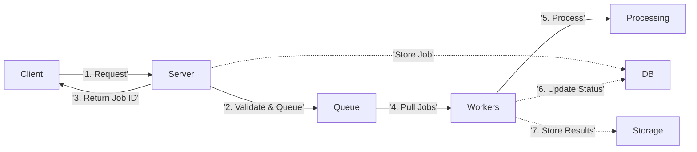
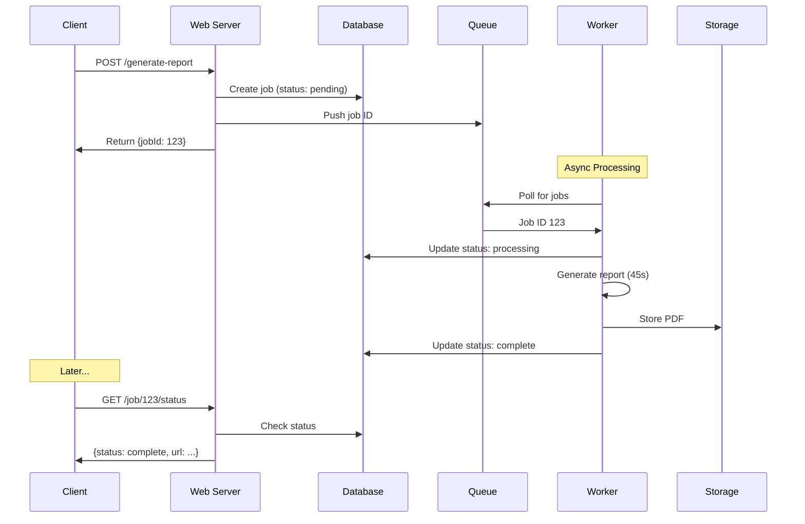
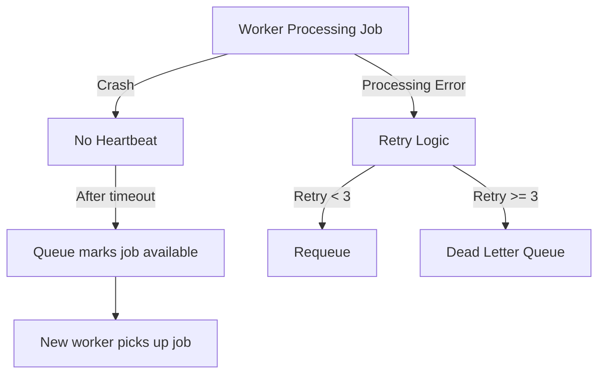
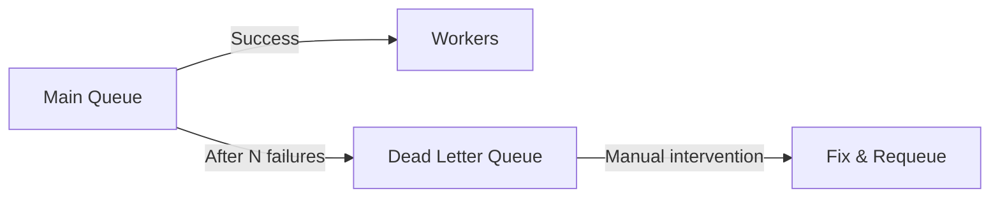
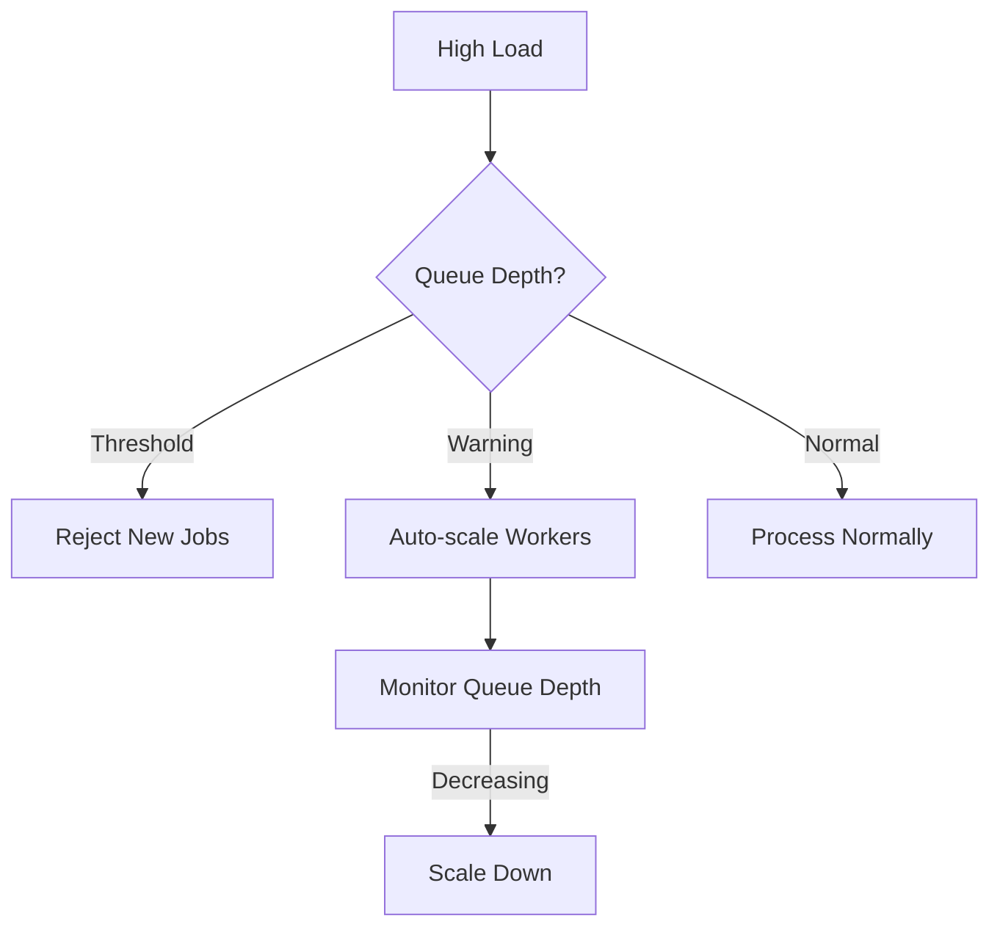
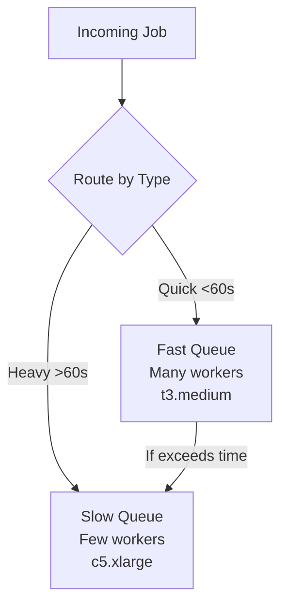
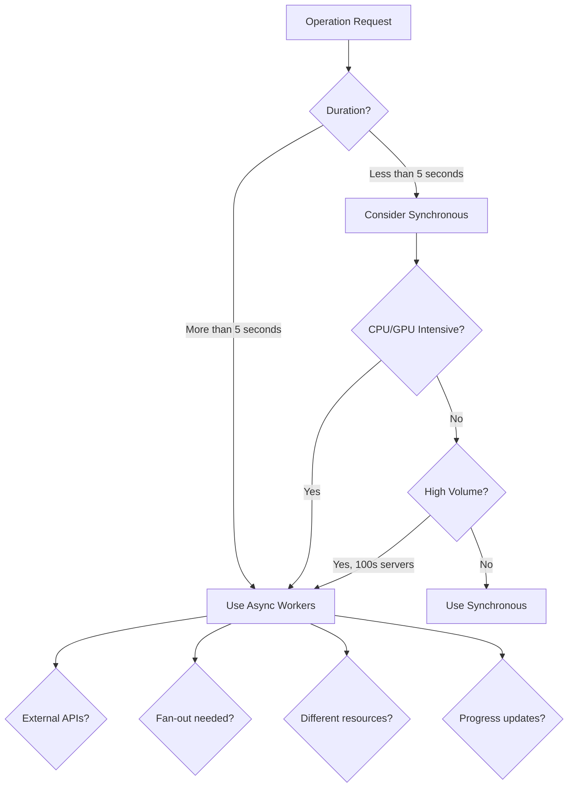
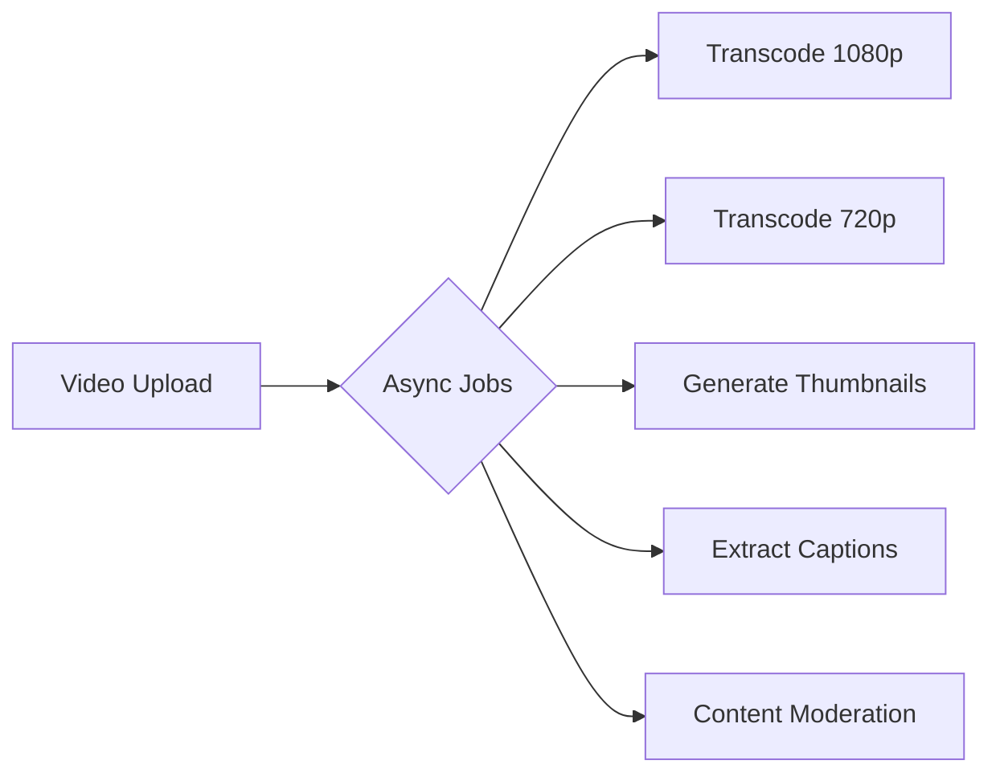
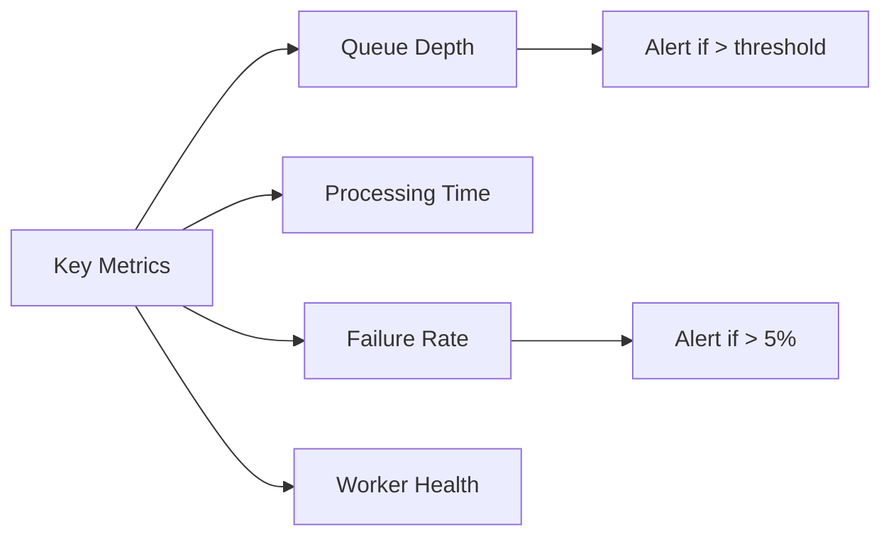

# Managing Long-Running Tasks Pattern - System Design Interview Guide

## Core Concept

The Managing Long-Running Tasks pattern **splits API requests into two phases**:

1. **Immediate acknowledgment** (milliseconds)
2. **Background processing** (seconds to hours)

## The Problem

### Synchronous Processing Issues

- **Timeout limits**: Web servers/load balancers enforce 30-60 second timeouts
- **Poor UX**: Users stare at loading indicators with no progress feedback
- **Resource inefficiency**: Web servers blocked waiting for heavy operations
- **No failure isolation**: One crashed operation can affect the entire API

### Common Long-Running Operations

- PDF/Report generation (45+ seconds)
- Video transcoding (minutes)
- Image processing & thumbnail generation
- Bulk operations (newsletters, CSV imports)
- Complex data aggregations
- Third-party API calls with rate limits

## The Solution: Async Worker Pool Architecture



### Key Components

#### 1. Message Queue Options

| Technology              | Use Case                    | Pros                                 | Cons                              |
| ----------------------- | --------------------------- | ------------------------------------ | --------------------------------- |
| **Redis + Bull/BullMQ** | Startups, <1M jobs/day      | Simple setup, built-in features      | Memory-based, potential data loss |
| **AWS SQS**             | Managed solution            | No ops overhead, guaranteed delivery | 256KB limit, cost at scale        |
| **RabbitMQ**            | Complex routing             | Battle-tested, flexible              | Self-hosting burden               |
| **Kafka**               | High scale, event streaming | Replay capability, strict ordering   | Complex setup                     |

**Interview Default**: Use Kafka unless specific requirements suggest otherwise.

#### 2. Worker Implementation Options

- **Regular servers**: Full control, good for long jobs, but idle capacity costs
- **Serverless (Lambda)**: Auto-scaling, pay-per-use, but 15-min limit
- **Containers (K8s/ECS)**: Middle ground, flexible scaling

## Implementation Flow



## Common Interview Deep Dives

### 1. Failure Handling



**Key Points**:

- Heartbeat mechanism (10-30 seconds typical)
- Visibility timeout in SQS
- Session timeout in Kafka

### 2. Dead Letter Queue (DLQ)



**Purpose**: Isolate poison messages that repeatedly fail

### 3. Idempotency & Deduplication

```python
def submit_job(user_id, job_type, data, idempotency_key):
    # Check for existing job
    existing = db.get_job_by_key(idempotency_key)
    if existing:
        return existing.id

    # Create new job
    job_id = create_job(user_id, job_type, data)
    db.store_idempotency_key(idempotency_key, job_id)
    queue.push(job_id)
    return job_id
```

### 4. Queue Backpressure Management



**Strategies**:

- Set queue depth limits
- Return "system busy" when overwhelmed
- Auto-scale based on queue depth (not CPU!)

### 5. Mixed Workload Handling



## When to Apply This Pattern

### Decision Framework



### Recognition Signals in Interviews

1. **Specific operations mentioned**:

   - "video transcoding" → Immediate async flag
   - "PDF generation" → Async workers
   - "bulk email sending" → Queue + workers
   - "image processing" → Async with specialized workers

2. **Scale math doesn't work**:

   - "1M images/day, 10s each = 120 servers needed" → Use async

3. **Resource mismatch**:

   - "ML inference needs GPUs" → Separate GPU workers
   - "Simple API + heavy processing" → Split with async

4. **Failure/scale questions**:
   - "What if server crashes?" → Queue provides durability
   - "Handle 10x traffic?" → Scale workers independently

## System-Specific Applications

### YouTube/Video Platforms



### Instagram/Photo Sharing

- Multiple image sizes generation
- Filter application
- Metadata extraction
- Feed fan-out for millions of followers

### Uber/Ridesharing

- Driver matching (show "Finding drivers...")
- Route calculation
- Dynamic pricing computation
- Location update processing

### Payment Processing (Stripe)

- Immediate response with pending status
- Async: actual charge, fraud detection, webhooks

## Best Practices

### Do's ✅

- **Be proactive**: Identify long operations before asked
- **Show the math**: "10s × 1M requests = need async"
- **Mention tradeoffs**: Complexity vs. scalability
- **Default to Kafka** for queue choice
- **Consider idempotency** early
- **Plan for failures**: DLQ, retries, monitoring

### Don'ts ❌

- Don't wait for interviewer to point out timeouts
- Don't ignore user experience aspects
- Don't overcomplicate the initial design
- Don't forget about job status tracking
- Don't mix fast and slow jobs in same queue

## Additional Considerations

### Monitoring & Observability



### Job Status API Design

```http
GET /api/jobs/{jobId}/status

Response:
{
  "jobId": "123",
  "status": "processing|completed|failed",
  "progress": 75,
  "result": "s3://bucket/report.pdf",
  "error": null,
  "createdAt": "2024-01-01T00:00:00Z",
  "completedAt": "2024-01-01T00:05:00Z"
}
```

### Notification Strategies

1. **Polling**: Client checks status periodically
2. **Webhooks**: Server calls client URL on completion
3. **WebSockets**: Real-time updates
4. **Push notifications**: Mobile apps
5. **Email**: For long-running reports

## Interview Answer Template

When you identify a long-running operation:

1. **Identify the problem**: "Video transcoding will take several minutes, which exceeds typical timeout limits."

2. **Propose async solution**: "I'll use an async worker pattern. The API returns a job ID immediately, and workers process the video in the background."

3. **Specify components**: "I'll use Kafka for the queue and containerized workers on Kubernetes for processing."

4. **Address scaling**: "Workers auto-scale based on queue depth. Video workers use GPU instances, while web servers use standard instances."

5. **Handle failures**: "Failed jobs retry 3 times before moving to a DLQ. Workers use heartbeats to detect crashes."

6. **Consider UX**: "Users see a progress bar and receive a notification when complete."

## Summary

The Managing Long-Running Tasks pattern is **essential** for:

- Operations > 5 seconds
- CPU/GPU intensive work
- External API calls with rate limits
- Fan-out operations
- Different resource requirements

**Remember**: In interviews, be the one to identify these scenarios proactively. This demonstrates system design maturity and real-world experience.

# Async Worker Pattern - Last Minute Revision

## 🚨 When to Use (Auto-Triggers)

- **Operations > 5 seconds** → Split into async
- **Keywords heard**: video transcoding, PDF generation, bulk email, image processing, ML inference
- **Math doesn't work**: 10s × 1M requests = 120 servers needed → Use async
- **Resource mismatch**: Simple API + heavy GPU work → Separate workers

## 🏗️ Core Architecture (Draw This)

```
Client → API → Queue → Workers → Storage
         ↓
    Return Job ID
```

## 🔧 Essential Components

- **Queue**: Default to Kafka (unless asked otherwise)
- **Workers**: Containerized (K8s/ECS) or serverless (Lambda <15min)
- **Database**: Job status tracking
- **Storage**: Results (S3/blob storage)

## 📊 Queue Technologies Quick Pick

- **Redis/Bull**: Startups, simple setup
- **AWS SQS**: Managed, no ops overhead
- **Kafka**: Interview default, handles scale
- **RabbitMQ**: Complex routing needs

## 💥 Failure Handling (Must Mention)

- **Heartbeats**: Workers ping every 10-30s
- **Retries**: 3 attempts before DLQ
- **Dead Letter Queue**: Isolate poison messages
- **Visibility timeout**: Prevent duplicate processing

## 📈 Scaling Strategies

- **Scale on queue depth** (not CPU usage!)
- **Separate queues** for fast (<60s) vs slow (>60s) jobs
- **Auto-scale workers** based on backlog
- **Backpressure**: Reject when queue full

## 🔄 Job Status Flow

1. **pending** → Job created, queued
2. **processing** → Worker picked up
3. **completed** → Success, results available
4. **failed** → Exhausted retries, check DLQ

## 🛡️ Must-Have Features

- **Idempotency keys**: Prevent duplicate submissions
- **Progress tracking**: Update status percentage
- **Monitoring**: Queue depth, failure rates, processing times
- **Job expiration**: Clean up old completed jobs

## 🎯 Real-World Examples to Mention

- **YouTube**: Video upload → transcode multiple resolutions
- **Instagram**: Photo upload → generate thumbnails, apply filters
- **Stripe**: Payment request → fraud check, actual charge
- **Uber**: Ride request → find drivers, calculate routes

## 💡 Interview Power Moves

- **Be proactive**: "I notice video processing will take minutes, so I'll use async workers"
- **Show the math**: Demonstrate why sync won't work
- **Consider UX**: Progress bars, notifications, polling vs webhooks
- **Think about mixed workloads**: Different queues for different job types

## 🔍 Deep Dive Questions Ready

- **"What if worker crashes?"** → Heartbeat timeout, job becomes available again
- **"How to handle priority jobs?"** → Priority queues or separate high-priority workers
- **"Scale to 10x traffic?"** → Auto-scale workers, not web servers
- **"Prevent duplicate jobs?"** → Idempotency keys with database lookup

## ⚡ One-Liner Summary

**"Long operations (>5s) get immediate job ID response, then async workers process in background with status tracking and failure recovery."**
