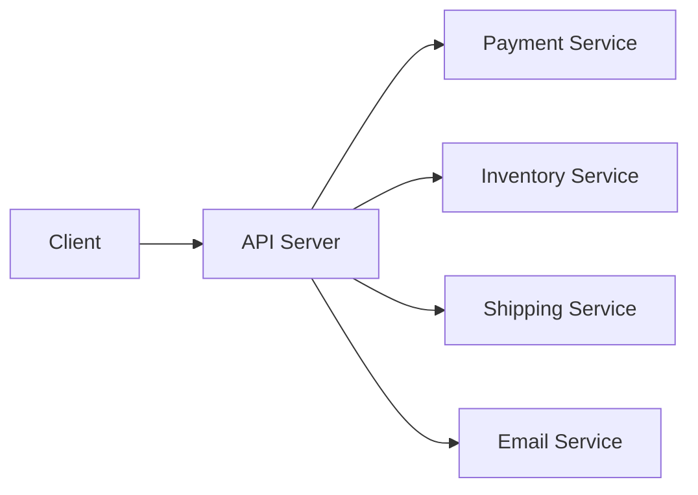
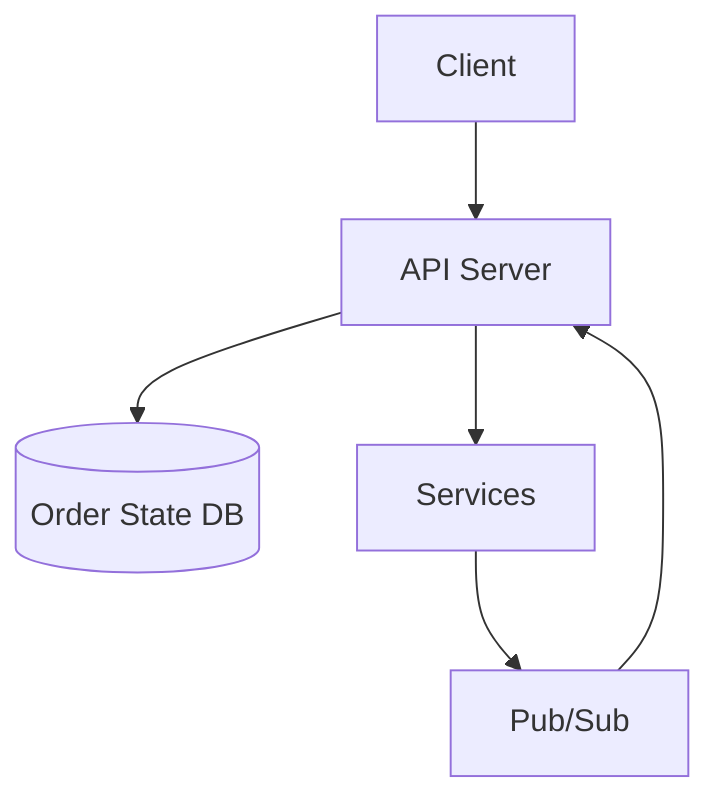
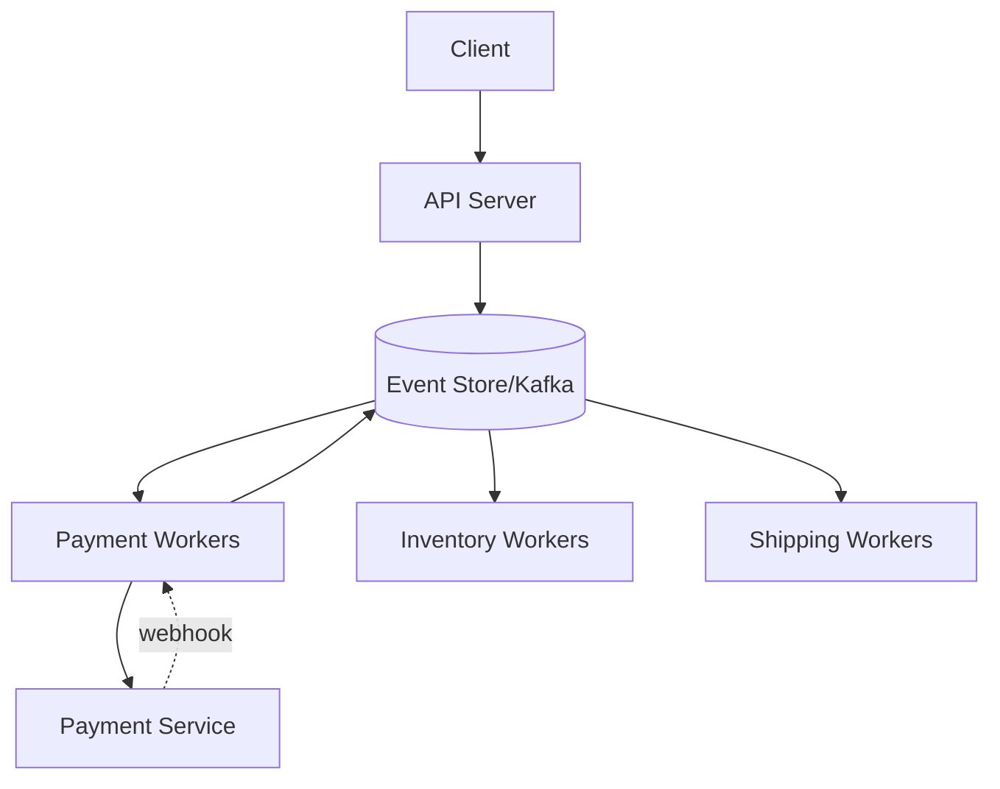
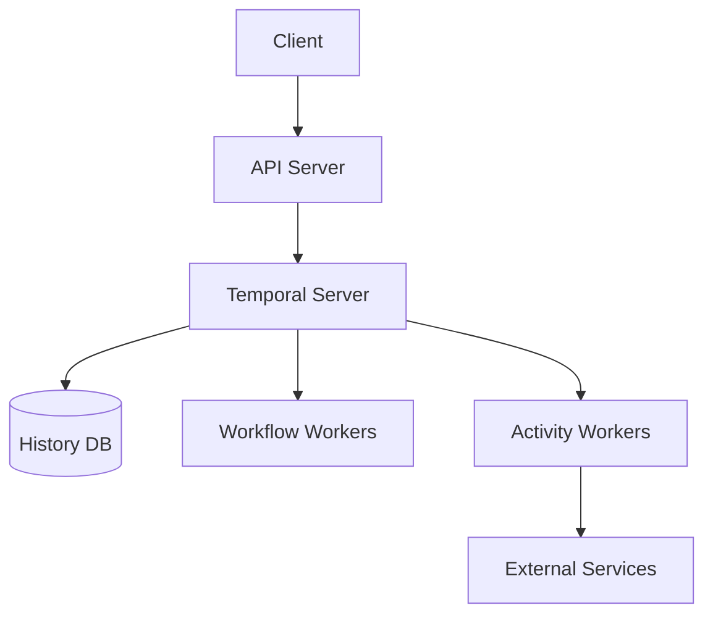
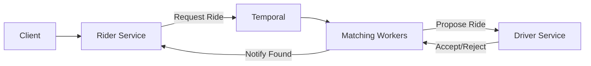
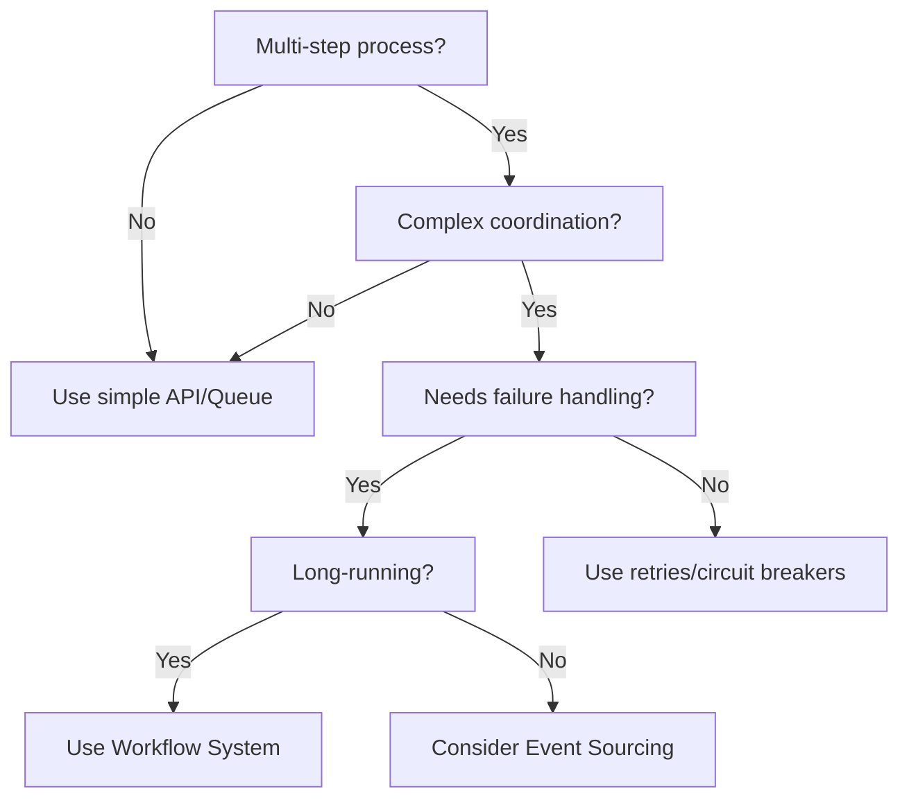

# Multi-Step Processes & Workflow Systems - System Design Interview Guide

## Core Problem

Building reliable multi-step processes in distributed systems where:

- Multiple services need coordination
- Any step might fail or timeout
- Servers might crash mid-process
- Long-running operations span hours/days
- Business logic gets tangled with failure handling

## Evolution of Solutions

### 1. Single Server Orchestration ❌

**Approach**: API server calls services sequentially in one request



**Problems**:

- Server crash = lost progress
- No memory after restart
- Can't handle webhooks/callbacks
- No scalability

### 2. Single Server + State Persistence 🔶

**Approach**: Add database checkpoints and pub/sub for callbacks



**Problems**:

- Manual state machine building
- Complex compensation logic
- Who picks up dropped work?
- Tangled error handling

### 3. Event Sourcing 🔷

**Approach**: Store sequence of events, workers react to events



**Benefits**:

- Fault tolerance (another worker picks up events)
- Scalability (add more workers)
- Complete audit trail
- Flexibility to modify workflows

**Challenges**:

- Building significant infrastructure
- Complex monitoring/debugging
- Event lineage tracking

### 4. Workflow Systems ✅

#### Durable Execution (e.g., Temporal)

**Code-based workflow definition**:

```javascript
async function orderWorkflow(order) {
  const payment = await processPayment(order);

  if (payment.success) {
    const inventory = await reserveInventory(order);
    if (inventory.success) {
      await shipOrder(order);
      await sendEmail(order);
    } else {
      await refundPayment(order);
    }
  }
}
```



#### Managed Workflows (e.g., AWS Step Functions)

**Declarative state machine definition (JSON/YAML)**

**Benefits of Both**:

- Automatic state persistence
- Fault tolerance & recovery
- Built-in retry logic
- Activity idempotency
- Signal/wait for external events

## When to Use Workflows in Interviews

### ✅ Use When You Have:

1. **Multi-step processes with failure handling**

   - "If step X fails, undo step Y"
   - Compensation/rollback requirements

2. **Long-running operations**

   - Human-in-the-loop (Uber driver acceptance)
   - Waiting for external events
   - Processes spanning hours/days

3. **Complex orchestration**

   - Coordinating 5+ services
   - State machine patterns
   - Saga patterns

4. **Critical business processes**
   - Payment processing
   - Order fulfillment
   - Loan approvals

### ❌ Don't Use For:

- Simple CRUD operations
- Single-step async tasks (use queues)
- Synchronous request/response
- High-frequency, low-value operations

## Example: Ride Matching Workflow



**Workflow Logic**:

```python
@workflow
def match_ride(rider_request):
    nearby_drivers = get_nearby_drivers()

    for driver in nearby_drivers:
        offer = send_ride_offer(driver)

        try:
            response = wait_for_signal(
                "driver_response",
                timeout=30_seconds
            )
            if response.accepted:
                notify_rider(driver)
                return driver
        except TimeoutError:
            continue  # Try next driver

    return no_drivers_available()
```

## Common Deep Dives

### 1. Workflow Updates/Migrations

**Q**: "How do you update workflows with 10,000 running instances?"

**Approaches**:

- **Versioning**: Deploy new version, old workflows use old code
- **Patching**: Use conditionals to branch behavior

```javascript
if (workflow.patched("v2-compliance-check")) {
  await performComplianceCheck();
}
```

### 2. State Size Management

**Q**: "How to handle growing workflow history?"

**Solutions**:

- Pass identifiers instead of large payloads
- Periodically recreate long-running workflows
- Archive old history to cold storage

### 3. External Events

**Q**: "How to wait for customer signatures (5 min - 5 days)?"

**Solution**: Use signals

```python
try:
    signature = wait_for_signal("doc_signed", timeout=30_days)
    process_signature(signature)
except TimeoutError:
    send_reminder()
```

### 4. Exactly-Once Execution

**Q**: "How to ensure payment happens exactly once?"

**Solution**: Make activities idempotent

- Store idempotency keys
- Check before performing irreversible actions
- Design for at-least-once with idempotency = exactly-once

## Technology Choices

### Open Source

- **Temporal** (most powerful, needs operation)
- **Apache Airflow** (better for batch/ETL)

### Cloud-Managed

- **AWS Step Functions** (serverless, 256KB state limit)
- **Azure Durable Functions**
- **Google Cloud Workflows**

### Interview Default

Choose **Temporal** unless:

- Company is AWS-heavy → Step Functions
- Simple orchestration needs → Managed solution
- Batch/ETL focus → Airflow

## Key Interview Signals

Listen for these phrases:

- "coordinate multiple services"
- "if X fails, undo Y"
- "ensure all-or-nothing"
- "wait for human action"
- "long-running process"
- "complex state machine"

## Design Patterns to Remember

### Saga Pattern

Sequence of local transactions with compensating actions

### Event Sourcing

Store events, rebuild state by replay

### Workflow as Code

Business logic reads like requirements, not infrastructure

### Activity Idempotency

Multiple calls, same result → exactly-once semantics

## Quick Decision Framework



## Sample Interview Response

**Interviewer**: "Design an e-commerce order fulfillment system"

**Your Response Structure**:

1. **Identify the workflow**: Payment → Inventory → Shipping → Email
2. **Call out failure scenarios**: Payment gateway timeout, inventory unavailable
3. **Propose workflow solution**: "This is a classic multi-step process with compensation requirements. I'd use Temporal for orchestration..."
4. **Draw the architecture**: Show workflow workers, activity workers, external services
5. **Discuss tradeoffs**: Operational complexity vs. reliability guarantees
6. **Handle edge cases**: Idempotency, workflow versioning, external events

## Remember

- Don't force workflows everywhere - recognize when they add value
- Start simple, introduce complexity when justified
- Show you understand tradeoffs (operational overhead vs. reliability)
- Demonstrate knowledge of both code-based and declarative approaches
- Be ready to discuss real-world challenges (versioning, state size, idempotency)

# Workflow Systems - Last Minute Revision

## 🎯 When to Use Workflows

### USE for:

- **Multi-step processes** with failure handling ("if X fails, undo Y")
- **Long-running operations** (hours/days, human-in-loop, waiting for webhooks)
- **Complex orchestration** (5+ services, state machines, sagas)
- **Critical business flows** (payments, orders, loans)

### DON'T USE for:

- Simple CRUD, single async tasks, sync request/response, high-frequency low-value ops

## 🔄 Evolution Pattern (Show You Know Trade-offs)

1. **Single Server** → Crashes lose progress ❌
2. **Server + DB State** → Manual state machines, complex compensation 🔶
3. **Event Sourcing** → Good fault tolerance but complex infrastructure 🔷
4. **Workflow Systems** → Best for complex orchestration ✅

## 💡 Key Technologies

- **Temporal** (default choice) - Code-based workflows, most powerful
- **AWS Step Functions** - If AWS-heavy, serverless, 256KB state limit
- **Apache Airflow** - Better for batch/ETL
- **Event Sourcing** - When you need audit trail + flexibility

## 🏗️ Architecture Components

```
Client → API Server → Workflow Server → History DB
                    ↓
            Workflow Workers → Activity Workers → External Services
```

## 🔑 Critical Concepts

- **Durable Execution**: Code survives crashes, auto-resumes from last state
- **Activity Idempotency**: Multiple calls = same result → exactly-once semantics
- **Signals**: Wait for external events (signatures, approvals)
- **Versioning**: Deploy new code while old workflows run old version
- **Compensation**: Automatic rollback/undo on failures

## 🚨 Interview Red Flags (Listen For These)

- "coordinate multiple services"
- "ensure all-or-nothing"
- "if X fails, undo Y"
- "wait for human action"
- "long-running process"
- "complex state machine"

## 📝 Sample Code Pattern

```javascript
async function orderWorkflow(order) {
  const payment = await processPayment(order); // Auto-retry on failure

  if (payment.success) {
    const inventory = await reserveInventory(order);
    if (!inventory.success) {
      await refundPayment(order); // Compensation
    }
  }
}
```

## 🎤 Interview Response Template

1. **Identify workflow needs**: "This has multi-step coordination with failure handling..."
2. **Propose solution**: "I'd use Temporal/Step Functions because..."
3. **Draw architecture**: Show workers, services, state persistence
4. **Handle failures**: Explain compensation, retries, idempotency
5. **Discuss trade-offs**: Operational complexity vs reliability
6. **Address edge cases**: Versioning, long-running state, external events

## ⚡ Quick Decision Framework

```
Multi-step? → Complex coordination? → Failure handling needed? → Long-running?
    ↓              ↓                      ↓                         ↓
   No=Queue      No=Simple API        No=Retries            Yes=WORKFLOW
```

## 🔥 Deep Dive Topics (Be Ready)

1. **Workflow Updates**: Version new code, patch conditionals for running instances
2. **State Management**: Pass IDs not payloads, archive old history
3. **External Events**: Use signals with timeouts for human actions
4. **Exactly-Once**: Idempotency keys + at-least-once delivery

## 💰 Real Examples to Mention

- **Uber**: Driver matching workflow (propose → wait for accept → timeout → next driver)
- **E-commerce**: Payment → Inventory → Shipping → Email (with compensations)
- **Loan Processing**: Application → Credit check → Approval → Document signing → Funding
- **Food Delivery**: Order → Restaurant confirm → Driver assign → Pickup → Delivery

## ⚠️ Common Mistakes to Avoid

- Don't suggest workflows for everything - show you know when they're overkill
- Don't ignore operational complexity - acknowledge the trade-offs
- Don't forget idempotency - critical for exactly-once guarantees
- Don't overlook state size limits in managed solutions

## 🎯 Key Differentiator

**Show maturity by discussing**:

- Workflow versioning strategies
- Monitoring/debugging distributed workflows
- Cost implications of long-running workflows
- When NOT to use workflows (equally important!)

## 📊 Comparison Cheat Sheet

| Aspect               | Queue/Pub-Sub | Event Sourcing | Temporal       | Step Functions |
| -------------------- | ------------- | -------------- | -------------- | -------------- |
| Complexity           | Low           | Medium         | High           | Medium         |
| Long-running         | ❌            | ✅             | ✅             | ✅             |
| State persistence    | Manual        | Event log      | Automatic      | Automatic      |
| Compensation         | Manual        | Manual         | Built-in       | Built-in       |
| External events      | Hard          | Medium         | Easy (signals) | Easy           |
| Operational overhead | Low           | High           | High           | Low (managed)  |

## 🏁 Final Checklist

✓ Can you explain when to use vs not use workflows?
✓ Can you draw the basic architecture?
✓ Do you know compensation patterns?
✓ Can you handle versioning questions?
✓ Do you understand idempotency?
✓ Can you give real-world examples?
