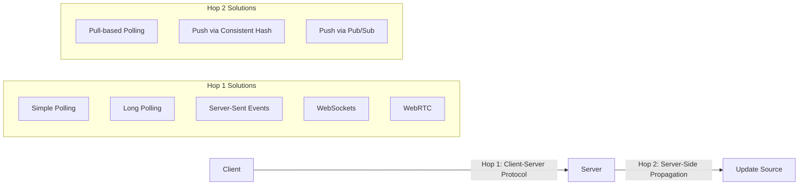
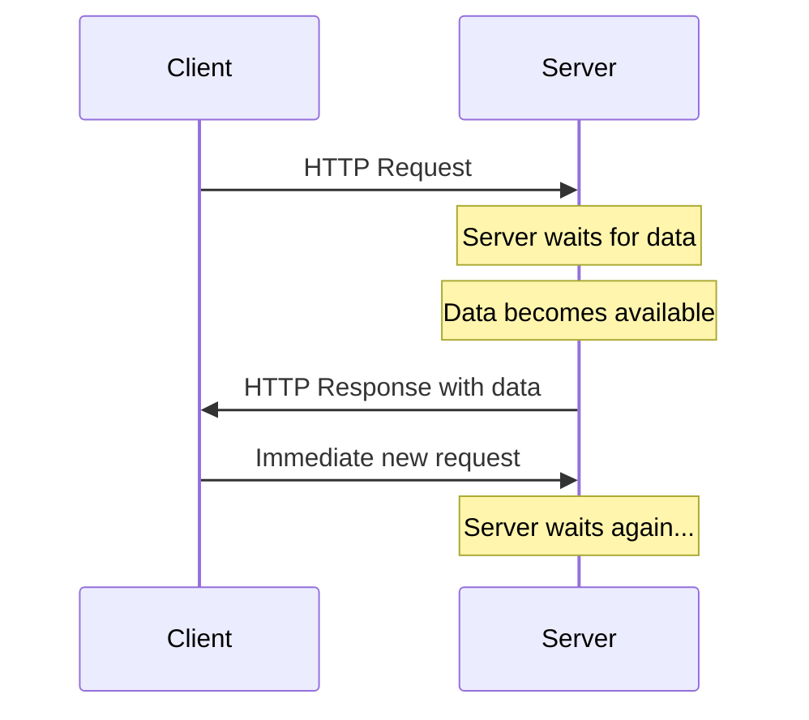
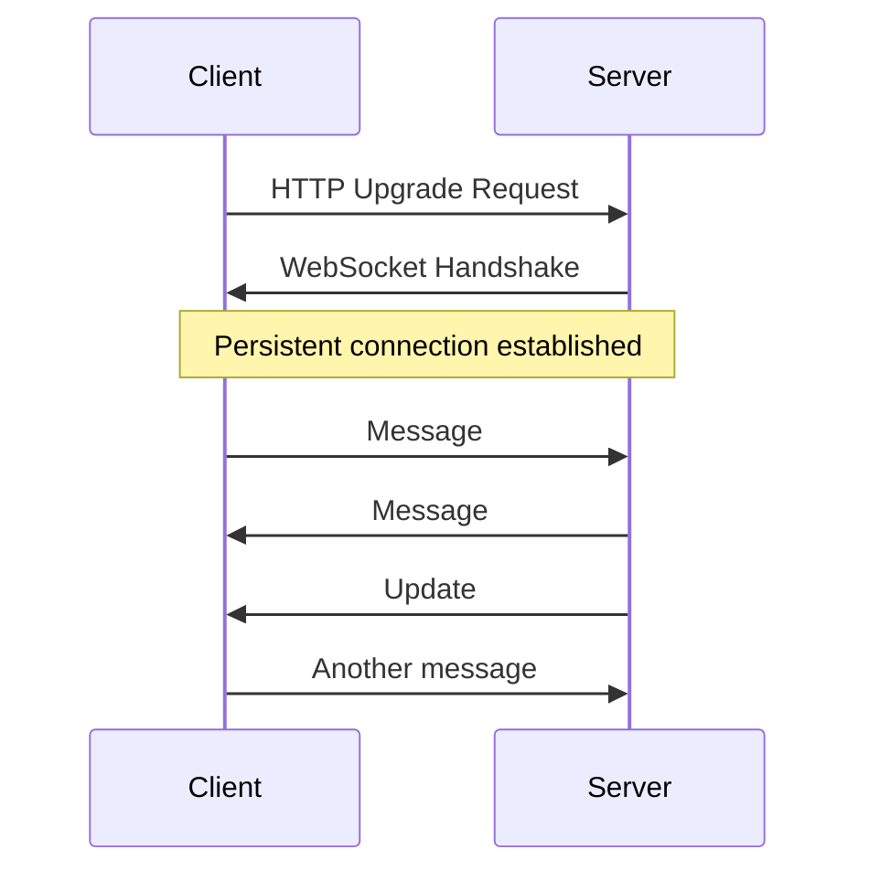
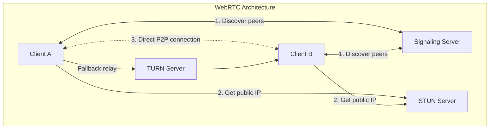
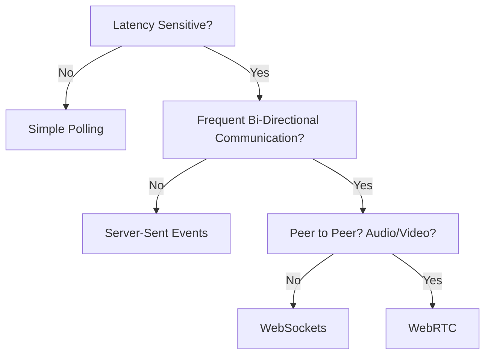
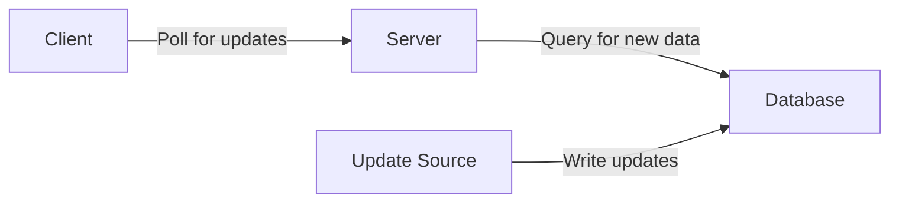
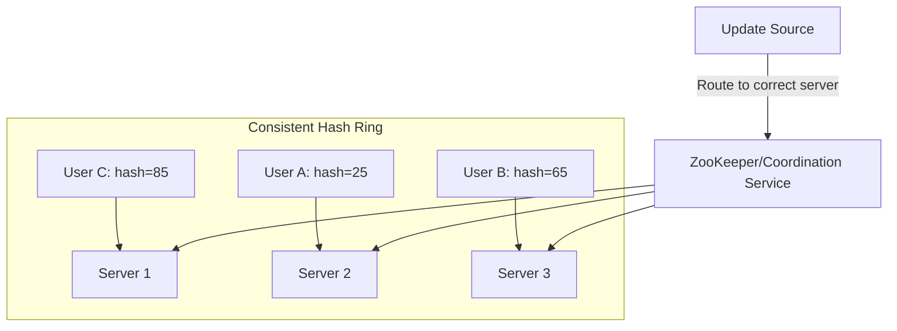
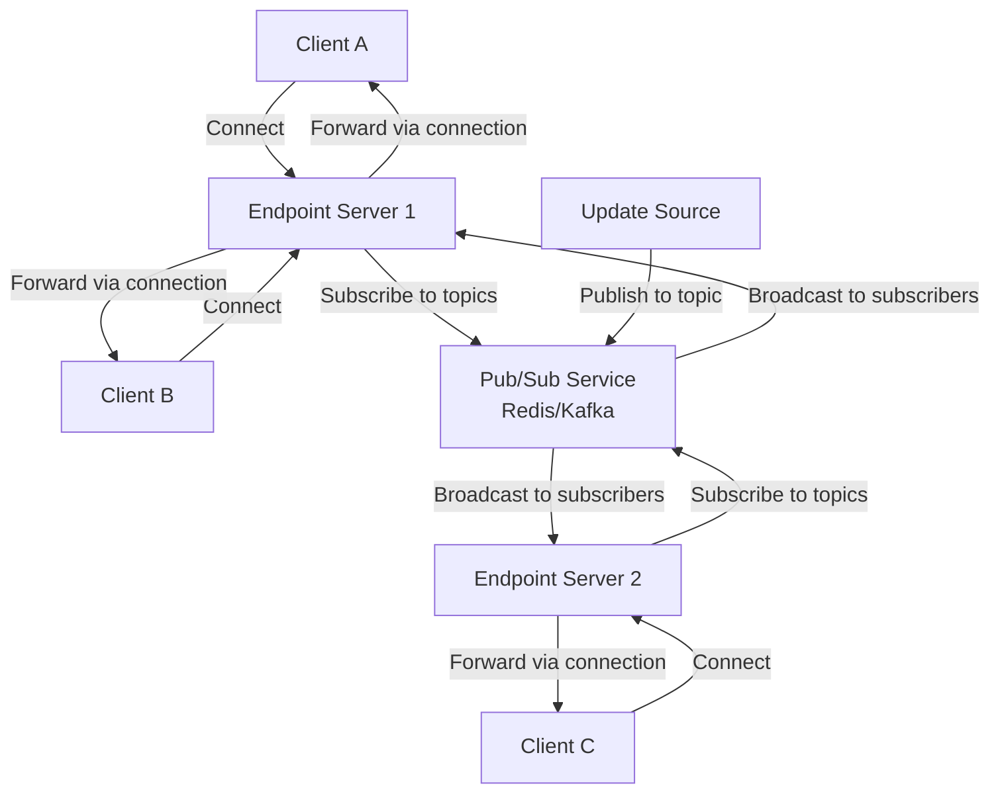
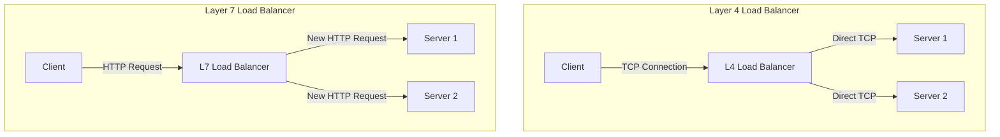

# Real-time Updates Pattern - System Design Interview Guide

## The Problem

Real-time updates address the challenge of delivering immediate notifications and data changes from servers to clients as events occur. Examples include:

- Chat applications where messages need instant delivery
- Collaborative document editors (Google Docs)
- Live dashboards showing real-time metrics
- Gaming applications requiring low-latency communication

### Core Challenge

Standard HTTP follows a request-response model where connections close after each interaction. For real-time updates, servers need to proactively push updates to clients, which breaks the traditional HTTP model.

## Two-Hop Solution Architecture

Real-time systems require solving two distinct problems:



## Client-Server Communication Protocols (Hop 1)

### 1. Simple Polling - The Baseline

**How it works**: Client makes regular HTTP requests to check for updates.

```javascript
async function poll() {
  const response = await fetch("/api/updates");
  const data = await response.json();
  processData(data);
}
setInterval(poll, 2000); // Poll every 2 seconds
```

**Advantages**:

- Simple to implement
- Stateless
- Works with standard HTTP infrastructure
- No special infrastructure needed

**Disadvantages**:

- Higher latency (updates delayed by polling interval)
- More bandwidth usage
- Resource-intensive with many clients

**When to use**: When updates are infrequent and simplicity is preferred. Great baseline approach.

### 2. Long Polling - The Easy Solution

**How it works**: Client makes HTTP request, server holds it open until new data is available.



**Advantages**:

- Builds on standard HTTP
- Easy to implement
- Near real-time updates
- Stateless server-side

**Disadvantages**:

- Higher latency for rapid updates
- Connection management overhead
- Browser connection limits per domain

**When to use**: When you need near real-time updates with minimal complexity. Good for payment processing confirmations.

### 3. Server-Sent Events (SSE) - The Efficient One-Way Street

**How it works**: Server keeps HTTP connection open and sends data chunks as they become available.

```javascript
// Client-side
const eventSource = new EventSource("/api/updates");
eventSource.onmessage = (event) => {
  const data = JSON.parse(event.data);
  updateUI(data);
};

// Server-side (Node.js)
app.get("/api/updates", (req, res) => {
  res.setHeader("Content-Type", "text/event-stream");
  res.setHeader("Cache-Control", "no-cache");
  res.setHeader("Connection", "keep-alive");

  const sendUpdate = (data) => {
    res.write(`data: ${JSON.stringify(data)}\n\n`);
  };
});
```

**Advantages**:

- Built into browsers
- Automatic reconnection
- More efficient than long polling
- Works over HTTP

**Disadvantages**:

- One-way communication only
- Some proxies don't support streaming
- Browser connection limits

**When to use**: Perfect for AI chat applications, live dashboards, or any scenario requiring one-way real-time updates.

### 4. WebSockets - The Full-Duplex Champion

**How it works**: Upgrades HTTP connection to persistent, bidirectional communication channel.



**Advantages**:

- Full-duplex communication
- Lower latency than HTTP
- Efficient for frequent messages
- Wide browser support

**Disadvantages**:

- More complex to implement
- Requires special infrastructure support
- Stateful connections complicate load balancing
- Need to handle reconnection logic

**When to use**: High-frequency, bidirectional communication. Chat applications, collaborative editing, gaming.

### 5. WebRTC - The Peer-to-Peer Solution

**How it works**: Direct peer-to-peer communication after initial signaling through server.



**Advantages**:

- Direct peer communication
- Lower latency
- Reduced server costs
- Native audio/video support

**Disadvantages**:

- Complex setup
- Requires signaling server + STUN/TURN
- NAT/firewall issues
- Connection setup delay

**When to use**: Video/audio calls, gaming, or when you need to reduce server load through P2P communication.

## Decision Flowchart for Client-Server Protocols



## Server-Side Update Propagation (Hop 2)

### 1. Pull-Based Polling

**How it works**: Servers poll database for updates to send to clients.



**Advantages**:

- Simple to implement
- State contained in database
- No special infrastructure

**Disadvantages**:

- Higher latency
- Excess database load

**When to use**: When real-time updates aren't critical and you want maximum simplicity.

### 2. Push via Consistent Hashing

**How it works**: Users are assigned to specific servers using consistent hashing. Updates are routed to the correct server.



**Advantages**:

- Predictable server assignment
- Minimal connection disruption during scaling
- Works well with stateful connections

**Disadvantages**:

- Complex to implement
- Requires coordination service
- Connection state lost if server fails

**When to use**: When you have persistent connections with significant server-side state (like collaborative editing).

### 3. Push via Pub/Sub

**How it works**: Updates published to topics, servers subscribe and forward to appropriate clients.



**Advantages**:

- Easy load balancing on endpoint servers
- Efficient broadcasting to many clients
- Minimizes state proliferation

**Disadvantages**:

- Pub/Sub becomes single point of failure
- Additional latency layer
- Many-to-many connections between services

**When to use**: When you need to broadcast updates to many clients without maintaining much connection state.

## Load Balancer Considerations

### Layer 4 vs Layer 7 Load Balancers



**Layer 4**: Better for WebSockets (maintains persistent connections)
**Layer 7**: Better for HTTP-based solutions like long polling, SSE

## Common Interview Scenarios

### Chat Applications

- **Requirements**: Instant message delivery, typing indicators, presence
- **Solution**: WebSockets + Pub/Sub for message distribution
- **Key considerations**: Message ordering, scaling message fan-out

### Collaborative Document Editing

- **Requirements**: Character-level changes, conflict resolution, user cursors
- **Solution**: WebSockets + Consistent hashing (for document state) + CRDTs/Operational Transforms
- **Key considerations**: Handling simultaneous edits, maintaining document consistency

### Live Dashboards

- **Requirements**: Real-time metrics, business data updates
- **Solution**: Server-Sent Events + database polling/streaming
- **Key considerations**: Data aggregation intervals, what constitutes "real-time enough"

### Gaming Applications

- **Requirements**: Lowest possible latency, frequent state updates
- **Solution**: WebRTC for P2P + WebSockets for server coordination
- **Key considerations**: Different update frequencies for different game elements

## Common Interview Deep Dives

### "How do you handle connection failures?"

- Implement heartbeat mechanisms to detect "zombie" connections
- Maintain per-user message queues for missed updates
- Use sequence numbers for resuming after reconnection
- Consider using Redis Streams for message persistence

### "What about the celebrity problem?"

- Cache updates and use hierarchical distribution
- Implement regional servers to reduce fan-out load
- Use batching and aggregation techniques
- Consider rate limiting for extreme cases

### "How do you maintain message ordering?"

- Use logical timestamps or vector clocks
- Funnel related messages through single server/partition
- Implement sequence numbers per conversation/document
- Consider the trade-off between scalability and consistency

## Key Interview Tips

### Start Simple, Then Escalate

1. **Always begin with polling** unless explicitly told you need real-time
2. **Mention the trade-offs** - "I'm starting with polling for simplicity, but we can upgrade to WebSockets if latency becomes critical"
3. **Don't over-engineer** - Most scenarios don't actually need sub-second updates

### Common Mistakes to Avoid

- Jumping to WebSockets when SSE would suffice
- Not considering infrastructure implications (load balancers, proxies)
- Forgetting about reconnection logic and failure handling
- Not discussing scaling implications of chosen approach

### What Interviewers Want to Hear

- **Trade-off analysis** between different approaches
- **Infrastructure considerations** (load balancers, deployment, scaling)
- **Failure handling** and graceful degradation
- **Specific numbers** - polling intervals, connection limits, latency requirements

## Summary Decision Matrix

| Requirement             | Simple Polling | Long Polling | SSE | WebSockets | WebRTC |
| ----------------------- | -------------- | ------------ | --- | ---------- | ------ |
| Latency sensitive       | ❌             | ✅           | ✅  | ✅         | ✅     |
| Bi-directional          | ✅             | ✅           | ❌  | ✅         | ✅     |
| High frequency          | ❌             | ❌           | ✅  | ✅         | ✅     |
| Simple to implement     | ✅             | ✅           | ✅  | ❌         | ❌     |
| Standard infrastructure | ✅             | ✅           | ⚠️  | ❌         | ❌     |
| Audio/Video             | ❌             | ❌           | ❌  | ❌         | ✅     |

**Legend**: ✅ Good fit, ⚠️ Some limitations, ❌ Poor fit

## Code Examples for Common Patterns

### WebSocket with Reconnection Logic

```javascript
class ReconnectingWebSocket {
  constructor(url) {
    this.url = url;
    this.connect();
  }

  connect() {
    this.ws = new WebSocket(this.url);

    this.ws.onclose = () => {
      setTimeout(() => this.connect(), 1000);
    };

    this.ws.onerror = () => {
      this.ws.close();
    };
  }

  send(data) {
    if (this.ws.readyState === WebSocket.OPEN) {
      this.ws.send(data);
    }
  }
}
```

### SSE with Error Handling

```javascript
function createEventSource(url) {
  const eventSource = new EventSource(url);

  eventSource.onmessage = (event) => {
    const data = JSON.parse(event.data);
    handleUpdate(data);
  };

  eventSource.onerror = () => {
    eventSource.close();
    // Implement exponential backoff
    setTimeout(() => createEventSource(url), 1000);
  };

  return eventSource;
}
```

Remember: The key to succeeding in real-time system design interviews is understanding the trade-offs and being able to articulate why you're choosing one approach over another based on the specific requirements of the system.

# Real-time Updates - Last Minute Revision Bullets

## Core Problem

- Standard HTTP is request-response, but real-time needs server-to-client push
- Two-hop architecture: Client-Server protocol + Server-side propagation

## Client-Server Protocols (Hop 1)

### Simple Polling

- Client makes regular HTTP requests every X seconds
- **Pros**: Simple, stateless, works with standard infrastructure
- **Cons**: Higher latency, more bandwidth usage
- **Use when**: Updates infrequent, simplicity preferred

### Long Polling

- Client requests, server holds connection open until data available
- **Pros**: Near real-time, builds on HTTP, easy implementation
- **Cons**: Connection overhead, browser limits per domain
- **Use when**: Need near real-time with minimal complexity

### Server-Sent Events (SSE)

- Server keeps HTTP connection open, sends data chunks as available
- **Pros**: Built into browsers, automatic reconnection, efficient
- **Cons**: One-way only, proxy issues, connection limits
- **Use when**: One-way real-time updates (AI chat, dashboards)

### WebSockets

- Upgrade HTTP to persistent bidirectional channel
- **Pros**: Full-duplex, lower latency, efficient for frequent messages
- **Cons**: Complex implementation, stateful connections, load balancing issues
- **Use when**: High-frequency bidirectional communication (chat, gaming)

### WebRTC

- Direct peer-to-peer after initial signaling
- **Pros**: Direct P2P, lower latency, reduced server costs, native audio/video
- **Cons**: Complex setup, NAT/firewall issues, requires STUN/TURN
- **Use when**: Audio/video calls, reduce server load via P2P

## Server-Side Propagation (Hop 2)

### Pull-Based Polling

- Servers poll database for updates
- **Pros**: Simple, state in database
- **Cons**: Higher latency, excess DB load
- **Use when**: Non-critical real-time, maximum simplicity

### Push via Consistent Hashing

- Users assigned to specific servers via hash ring
- **Pros**: Predictable assignment, minimal disruption during scaling
- **Cons**: Complex, requires coordination service, state lost on failure
- **Use when**: Stateful connections (collaborative editing)

### Push via Pub/Sub

- Updates published to topics, servers subscribe and forward
- **Pros**: Easy load balancing, efficient broadcasting, minimal state
- **Cons**: Pub/Sub single point of failure, additional latency
- **Use when**: Broadcast to many clients without connection state

## Load Balancer Considerations

- **Layer 4**: Better for WebSockets (maintains persistent connections)
- **Layer 7**: Better for HTTP-based solutions (long polling, SSE)

## Common Scenarios

### Chat Applications

- **Solution**: WebSockets + Pub/Sub
- **Key concerns**: Message ordering, scaling fan-out

### Collaborative Editing

- **Solution**: WebSockets + Consistent hashing + CRDTs
- **Key concerns**: Simultaneous edits, document consistency

### Live Dashboards

- **Solution**: SSE + database polling/streaming
- **Key concerns**: Data aggregation, "real-time enough"

### Gaming

- **Solution**: WebRTC for P2P + WebSockets for coordination
- **Key concerns**: Lowest latency, different update frequencies

## Failure Handling Deep Dive

- Implement heartbeat mechanisms for zombie connections
- Maintain per-user message queues for missed updates
- Use sequence numbers for reconnection resumption
- Consider Redis Streams for message persistence

## Celebrity Problem Solutions

- Cache updates, use hierarchical distribution
- Regional servers to reduce fan-out load
- Batching and aggregation techniques
- Rate limiting for extreme cases

## Message Ordering Strategies

- Logical timestamps or vector clocks
- Funnel related messages through single server/partition
- Sequence numbers per conversation/document
- Trade-off between scalability and consistency

## Interview Strategy

1. **Start simple**: Always begin with polling unless explicitly real-time
2. **Mention trade-offs**: "Starting with polling for simplicity, can upgrade if needed"
3. **Don't over-engineer**: Most scenarios don't need sub-second updates
4. **Discuss infrastructure**: Load balancers, deployment, scaling implications
5. **Include failure handling**: Reconnection, graceful degradation
6. **Provide specific numbers**: Polling intervals, connection limits, latency

## Common Mistakes to Avoid

- Jumping to WebSockets when SSE sufficient
- Ignoring infrastructure implications
- Forgetting reconnection logic and failure handling
- Not discussing scaling implications

## Quick Decision Tree

- **Not latency sensitive** → Simple Polling
- **Latency sensitive + One-way** → SSE
- **Latency sensitive + Bi-directional + High frequency** → WebSockets
- **Audio/Video + P2P** → WebRTC

## Key Numbers to Remember

- Browser connection limits: ~6 per domain
- WebSocket heartbeat: 30-60 seconds typical
- Polling intervals: 2-10 seconds for non-critical
- Long polling timeout: 30-60 seconds

## What Interviewers Want

- Trade-off analysis between approaches
- Infrastructure and scaling considerations
- Failure handling and edge cases
- Specific requirements-based reasoning
