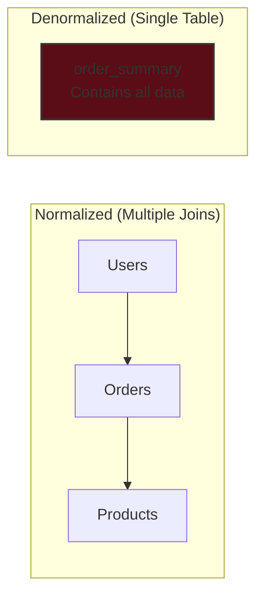
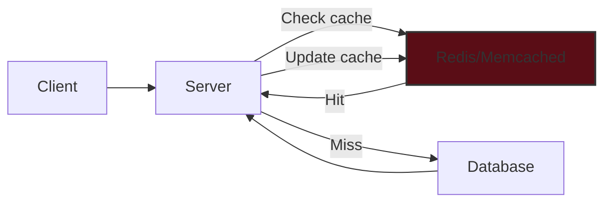

# Scaling Reads - System Design Interview Guide

## 📊 The Problem

### Read vs Write Imbalance

- **Instagram Example**: Loading feed = 100+ database reads vs 1 post per day = 1 write
- **Common Ratios**:
  - Standard: 10:1 (read:write)
  - Content-heavy apps: 100:1 or higher
  - Examples: Twitter, YouTube, Amazon all have massive read:write ratios

### Physical Constraints

- CPU cores have instruction limits
- Memory capacity is finite
- Disk I/O bounded by hardware speeds
- **Key Point**: This isn't a software problem - it's physics!

## 🎯 Solution Progression

### 1. Optimize Within Your Database

#### Database Indexing


**Key Points:**

- Transforms O(n) full table scan → O(log n) index lookup
- Add indexes on columns you frequently:
  - Query by
  - Join on
  - Sort by
- **Interview Tip**: Mention indexes when outlining database schema

**Example:**

```sql
-- Before: Full table scan (slow)
SELECT * FROM users WHERE email = 'user@example.com';
-- Cost: 412,000.00

-- Add index
CREATE INDEX idx_users_email ON users(email);

-- After: Index scan (fast)
SELECT * FROM users WHERE email = 'user@example.com';
-- Cost: 8.45
```

#### Hardware Upgrades (Vertical Scaling)

```mermaid
graph TD
    A[db.m6g.large<br/>8GB RAM<br/>100GB Disk] -->|Upgrade| B[db.r6g.4xlarge<br/>128GB RAM<br/>16TB Disk]

    style A fill:#5A0D16
    style B fill:#1E4C50
```



- SSDs: 10-100x faster than HDDs
- More RAM = more data in memory
- Quick win but not long-term solution

#### Denormalization



**Trade-off**: Storage space for query speed

- Store redundant data to avoid joins
- Good for read-heavy systems
- Complicates writes (must update multiple places)

### 2. Scale Your Database Horizontally

#### Read Replicas (Leader-Follower)

```mermaid
graph TD
    W[Writes] --> L[Leader<br/>Primary DB]
    L -->|Replicate| F1[Follower 1]
    L -->|Replicate| F2[Follower 2]
    L -->|Replicate| F3[Follower 3]

    R[Reads] --> F1
    R --> F2
    R --> F3

    style L fill:#5A0D16,stroke:#333,stroke-width:3px
    style F1 fill:#1E4C50
    style F2 fill:#5A0D16
    style F3 fill:#1E4C50
```



**Characteristics:**

- All writes → Primary
- Reads → Any replica
- **Challenge**: Replication lag
  - Synchronous: Consistent but slower
  - Asynchronous: Faster but potentially stale

**When to Use**: ~50,000-100,000 requests/second (with proper indexing)

#### Database Sharding

##### Functional Sharding

```mermaid
graph TD
    C[Client] --> S[Server]
    S --> DB1[DB1: Posts]
    S --> DB2[DB2: Users]
    S --> DB3[DB3: Likes]

    style DB1 fill:#1E4C50
    style DB2 fill:#5A0D16
    style DB3 fill:#1E4C50
```



##### Geographic Sharding

```mermaid
graph TD
    subgraph "Global Distribution"
        US[US Users] --> USDB[US Database]
        EU[EU Users] --> EUDB[EU Database]
        AS[Asia Users] --> ASDB[Asia Database]
    end

    style USDB fill:#1E4C50
    style EUDB fill:#5A0D16
    style ASDB fill:#1E4C50
```



**Benefits:**

- Smaller datasets = faster queries
- Distributed load across databases
- Lower latency for geographic distribution

### 3. Add External Caching Layers

#### Application-Level Caching



**Performance:**

- Cache hit: <1ms response
- Database query: 10-100ms response

#### Cache Invalidation Strategies

| Strategy             | Description           | Use Case                    |
| -------------------- | --------------------- | --------------------------- |
| **TTL (Time-based)** | Fixed lifetime        | Predictable update patterns |
| **Write-through**    | Update cache on write | Strong consistency needed   |
| **Write-behind**     | Async invalidation    | Low write latency priority  |
| **Tagged**           | Invalidate by tags    | Complex dependencies        |
| **Versioned keys**   | Change key on update  | Avoid race conditions       |

#### CDN and Edge Caching

```mermaid
graph TD
    subgraph "Geographic Distribution"
        Client -->|Closest| CDN1[CDN Tokyo]
        Client2 -->|Closest| CDN2[CDN London]
        Client3 -->|Closest| CDN3[CDN New York]

        CDN1 --> Origin[Origin Server]
        CDN2 --> Origin
        CDN3 --> Origin
    end

    style CDN1 fill:#5A0D16
    style CDN2 fill:#1E4C50
    style CDN3 fill:#5A0D16
```



**Benefits:**

- Reduces latency: 200ms → <10ms
- Can reduce origin load by 90%+
- Best for shared content (not user-specific)

## 🚨 Common Deep Dive Topics

### 1. Cache Stampede Problem

**Problem**: When popular cache expires, thousands of requests hit DB simultaneously

**Solutions:**

- **Distributed Locks**: Serialize rebuilds (can cause timeouts)
- **Probabilistic Early Refresh**:
  ```
  Minute 50: 1% chance to refresh
  Minute 55: 5% chance
  Minute 59: 20% chance
  ```
- **Background Refresh**: Continuously update before expiration

### 2. Hot Key Problem

**Problem**: Millions of requests for same cached item overwhelm cache server

**Solutions:**

- **Request Coalescing**: Combine multiple requests into one backend call
- **Cache Key Fanout**:
  ```
  Instead of: feed:taylor-swift
  Use: feed:taylor-swift:1, feed:taylor-swift:2, ...:10
  Randomly distribute load across 10 keys
  ```

### 3. Immediate Consistency Requirements

**Problem**: Some updates must be immediately visible (e.g., venue address change)

**Solutions:**

- **Cache Versioning**: Change cache key on update
- **Write-through Caching**: Update cache synchronously with DB
- **Deleted Items Cache**: Small cache of recently changed items to filter

## 📱 Common Interview Scenarios

### URL Shortener (Bitly)

- **Pattern**: Extreme read:write ratio (millions:1)
- **Solution**:
  - Aggressive Redis caching (no expiration)
  - CDN for global distribution
  - DB only for cache misses

### Ticketmaster

- **Pattern**: Burst traffic for popular events
- **Solution**:
  - Cache static data (venue, seating charts)
  - DON'T cache availability (overselling risk)
  - Read replicas for browsing, write master for purchases

### News Feed Systems

- **Pattern**: Read-intensive feed generation
- **Solution**:
  - Pre-compute feeds for active users
  - Cache recent posts from followed users
  - Smart pagination (users read only first items)

### Video Platforms (YouTube)

- **Pattern**: Metadata creates surprising load
- **Solution**:
  - Cache video metadata aggressively
  - View counts can be eventually consistent
  - CDN for thumbnails

## ❌ When NOT to Use Read Scaling

1. **Write-heavy systems** (Uber location tracking: 2:1 or 1:1 ratio)
2. **Small scale** (1000 users don't need complex caching)
3. **Strong consistency required** (financial transactions)
4. **Real-time collaboration** (Google Docs needs immediate updates)

## 💡 Interview Tips

### Opening Approach

When you identify a high-volume read endpoint, say:

> "This user profile endpoint will get hit every time someone views a profile. With millions of users, that's potentially billions of reads per day. Let me address that in my deep dive."

### Key Numbers to Remember

- **Database needs scaling**: ~50,000-100,000 RPS (with indexing)
- **Cache response time**: <1ms
- **DB query time**: 10-100ms
- **CDN load reduction**: 90%+
- **Common read:write ratios**: 10:1 → 100:1+

### Progressive Scaling Path

1. Start with database optimization (indexes, denormalization)
2. Consider vertical scaling briefly
3. Add read replicas for distribution
4. Implement caching layers
5. Use CDN for global distribution

### Consistency vs Performance Trade-offs

Always discuss based on data type:

- User profiles: 5-minute staleness OK
- Event venues: Immediate updates needed
- View counts: Eventually consistent fine
- Financial data: Strong consistency required

## 🎯 Key Takeaways

1. **Read scaling ≠ just making things faster** - It's about reducing database load
2. **Start simple**: Indexes → Read replicas → Caching → CDN
3. **Different data has different needs**: Design caching strategy accordingly
4. **Cache invalidation is hard**: Choose strategy based on consistency requirements
5. **Monitor for patterns**: Skewed access patterns make caching extremely effective

## 📚 Additional Considerations

### Monitoring Metrics

- Cache hit ratio (aim for >90%)
- Database CPU utilization
- Query response times (P50, P95, P99)
- Replication lag

### Cost Optimization

- Caching reduces database costs
- CDN bandwidth costs vs origin costs
- Read replicas vs cache infrastructure

### Operational Complexity

- More components = more failure points
- Need proper monitoring and alerting
- Consider team expertise for maintenance

---

Remember: In interviews, demonstrate understanding of both benefits AND operational complexity. Show judgment about when each solution is appropriate based on scale and requirements.

# Scaling Reads - Quick Revision Notes

## 🎯 Core Problem

- **Read:Write Ratios**: Standard 10:1, Content-heavy 100:1+
- **Physical limits**: CPU, Memory, Disk I/O - not just software issue

## 📊 Solution Hierarchy (Progressive Scaling)

### Level 1: Database Optimization

- **Indexing**: O(n) → O(log n), mention when outlining schema
- **Vertical Scaling**: Quick win, not long-term (SSDs 10-100x faster)
- **Denormalization**: Trade storage for speed, complicates writes

### Level 2: Horizontal Database Scaling

- **Read Replicas**:
  - Leader handles writes, followers handle reads
  - Challenge: Replication lag (sync vs async)
  - Good for ~50-100K RPS with indexing
- **Sharding**:
  - Functional: Split by data type (posts, users, likes)
  - Geographic: Split by region (lower latency)

### Level 3: Caching Layers

- **Application Cache** (Redis/Memcached):
  - Cache hit: <1ms vs DB query: 10-100ms
  - Aim for >90% hit ratio
- **CDN**:
  - Reduces latency: 200ms → <10ms
  - Can reduce origin load by 90%+
  - Best for shared content

## 🔥 Cache Invalidation Strategies

- **TTL**: Fixed lifetime for predictable patterns
- **Write-through**: Update cache on write (strong consistency)
- **Write-behind**: Async invalidation (low write latency)
- **Versioned keys**: Change key on update (avoid races)

## ⚠️ Common Problems & Solutions

### Cache Stampede

- **Problem**: Popular cache expires → thousands hit DB
- **Solutions**: Distributed locks, probabilistic refresh, background refresh

### Hot Key Problem

- **Problem**: One key gets millions of requests
- **Solutions**: Request coalescing, cache key fanout (distribute across multiple keys)

### Immediate Consistency

- **Solutions**: Cache versioning, write-through, deleted items cache

## 💡 Interview Scenarios

### URL Shortener (Bitly)

- Extreme read ratio (millions:1)
- Aggressive Redis caching (no expiration)
- CDN for global distribution

### Ticketmaster

- Burst traffic patterns
- Cache static (venues), NOT availability
- Read replicas for browsing, write master for purchases

### News Feed

- Pre-compute feeds for active users
- Cache recent posts from followed users
- Smart pagination (users only read first items)

### YouTube

- Cache video metadata aggressively
- View counts can be eventually consistent
- CDN for thumbnails

## 🚫 When NOT to Use Read Scaling

- Write-heavy systems (Uber location: 2:1 ratio)
- Small scale (<1000 users)
- Strong consistency required (financial)
- Real-time collaboration (Google Docs)

## 📈 Key Numbers to Remember

- **DB needs scaling**: ~50-100K RPS (with indexing)
- **Cache response**: <1ms
- **DB query**: 10-100ms
- **CDN load reduction**: 90%+
- **Cache hit ratio target**: >90%
- **Common ratios**: 10:1 → 100:1+ (read:write)

## 🗣️ Interview Talk Track

### Opening Statement

> "This endpoint will get hit every profile view. With millions of users, that's billions of reads/day. Let me address that in my deep dive."

### Progressive Approach

1. "First, I'll optimize within the database with indexes"
2. "As we scale, add read replicas for distribution"
3. "Implement Redis caching for frequently accessed data"
4. "Use CDN for global static content distribution"

### Consistency Discussion

- User profiles: "5-minute staleness acceptable"
- Event venues: "Need immediate updates"
- View counts: "Eventually consistent is fine"
- Financial: "Require strong consistency"

## ✅ Final Checklist

- [ ] Identify read-heavy endpoints early
- [ ] Start simple (indexes) before complex (sharding)
- [ ] Discuss consistency vs performance trade-offs
- [ ] Consider operational complexity
- [ ] Match solution to scale (don't over-engineer)
- [ ] Mention monitoring (cache hit ratio, replication lag)
- [ ] Address failure scenarios (cache miss, replica failure)

## 🎯 Remember

- **It's not just about speed** - it's about reducing database load
- **Different data = different needs** - tailor your approach
- **Cache invalidation is hard** - pick strategy based on requirements
- **Show judgment** - explain WHY you chose each solution
