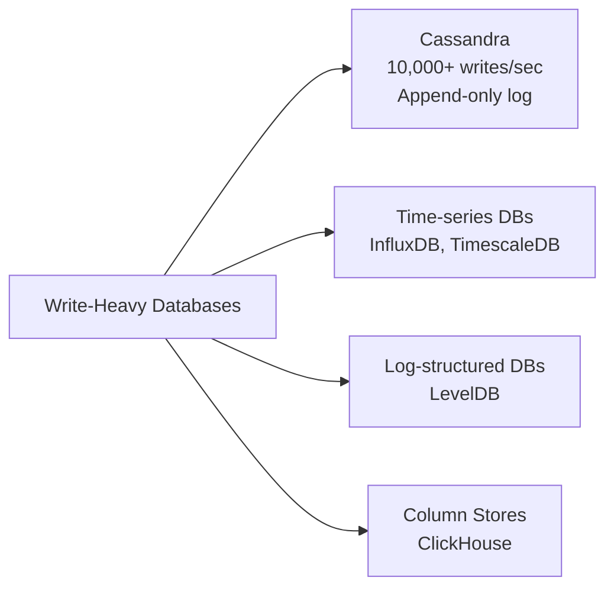
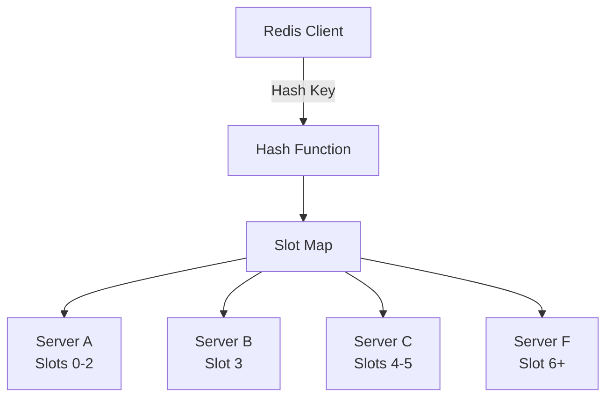
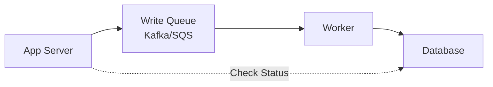
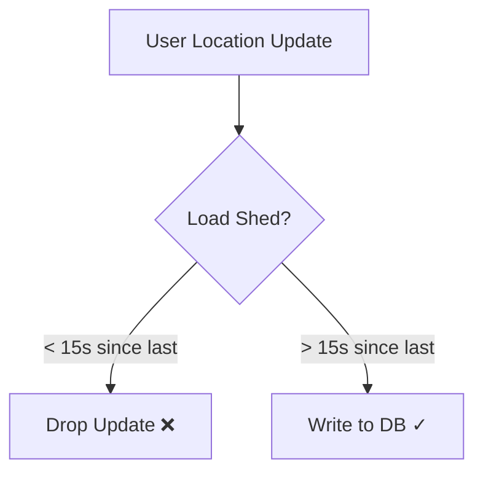
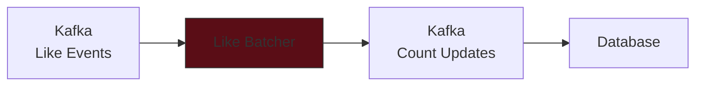
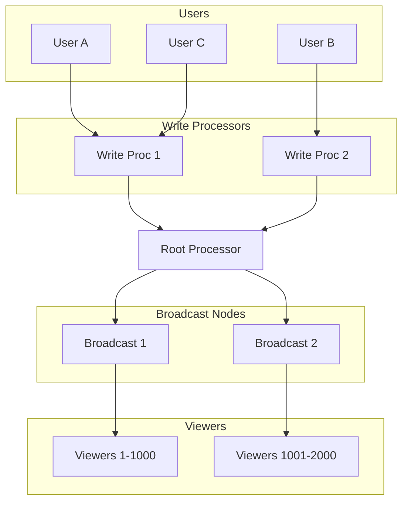

# Scaling Writes in System Design Interviews

## 📌 Core Challenge

- Single database/server bottlenecks: disk I/O, CPU, network bandwidth
- Handling growth from hundreds to millions of writes per second
- Bursty, high-throughput writes with contention
- Interviewers probe: "How does it scale?"

## 🎯 Four Key Strategies for Scaling Writes

### 1. Vertical Scaling & Database Optimization

#### Vertical Scaling

- **Modern hardware capabilities**: 200 CPU cores, 10Gbps network, NVMe SSDs
- Calculate actual write throughput vs hardware capabilities
- Show interviewer you understand hardware limits before adding complexity

#### Database Choices for Write Optimization



**Key Trade-offs:**

- Cassandra: Superior writes (append-only) but slower reads
- Time-series DBs: Optimized for sequential writes with timestamps
- Disable expensive features: foreign keys, triggers, complex indexes

### 2. Sharding and Partitioning

#### Horizontal Sharding Example (Redis Cluster)



#### Selecting Good Partitioning Keys

**Good Keys:**

- Hash(userID) - even distribution
- Hash(postID) - balanced load

**Bad Keys:**

- Country - creates hot spots (China vs New Zealand)
- Timestamp - temporal clustering

#### Vertical Partitioning

Split by data type/access pattern:

```sql
-- Instead of one massive table:
TABLE posts (everything...)

-- Split into:
TABLE post_content (write-once, read-many)
TABLE post_metrics (high-frequency writes)
TABLE post_analytics (append-only, time-series)
```

### 3. Handling Bursts: Queues & Load Shedding

#### Write Queue Architecture



**Benefits:**

- Burst absorption
- Decouples write acceptance from processing
- Smooths traffic spikes

**Limitations:**

- Only temporary - unbounded growth if input > processing
- Async means delayed consistency
- Not suitable for steady-state overload

#### Load Shedding Strategy



**When to use:**

- Redundant data (location updates)
- Non-critical writes (impressions vs clicks)
- System overload prevention

### 4. Batching & Hierarchical Aggregation

#### Batching Layers



Example: 100 likes → 1 database write

**Implementation levels:**

- Application layer batching
- Intermediate processor batching
- Database flush configuration

#### Hierarchical Aggregation (Live Comments)



## 🔥 Common Deep Dives

### 1. Resharding Without Downtime

**Gradual Migration Strategy:**

1. Start dual-writes (old + new shard)
2. Migrate data gradually
3. Switch reads to new shard
4. Stop writing to old shard

### 2. Handling Hot Keys

**Option A: Split All Keys**

```
post1Likes → post1Likes-0, post1Likes-1, post1Likes-2
```

- Pros: Simple
- Cons: k× storage, k× read amplification

**Option B: Dynamic Hot Key Splitting**

- Monitor for hot keys
- Split only when needed
- Readers check all sub-keys

## 📊 Back-of-Envelope Calculations

Always validate bottlenecks:

| Component      | Typical Capacity |
| -------------- | ---------------- |
| Single SSD     | 50K IOPS         |
| 10Gbps Network | 1.25 GB/s        |
| Cassandra Node | 10K+ writes/sec  |
| MySQL (B-tree) | 1K writes/sec    |
| Redis Cluster  | 100K+ ops/sec    |

## ✅ Interview Strategy Checklist

### When to Apply These Patterns

1. **Calculate first**: Is there actually a bottleneck?
2. **Start simple**: Vertical scaling → Database optimization
3. **Then distribute**: Sharding/Partitioning
4. **Handle spikes**: Queues for bursts, load shedding for overload
5. **Optimize last**: Batching, hierarchical aggregation

### Red Flags to Avoid

- ❌ Over-engineering when simple solutions work
- ❌ Using queues for steady-state overload
- ❌ Ignoring read performance when optimizing writes
- ❌ Not considering operational complexity (resharding)
- ❌ Forgetting consistency requirements

## 🎓 Key Interview Scenarios

### Social Media (Instagram/Twitter)

- **Challenge**: Celebrity posts → millions of writes
- **Solution**: Shard by userID, queue for bursts, hierarchical fan-out

### Live Comments/Chat

- **Challenge**: All-to-all communication
- **Solution**: Hierarchical aggregation, broadcast nodes

### Analytics/Metrics

- **Challenge**: High-volume time-series data
- **Solution**: Time-series DB, batching, vertical partitioning

### Location Tracking (Uber/Strava)

- **Challenge**: Frequent updates from millions of users
- **Solution**: Load shedding old updates, batching, sharding by userID

## 💡 Pro Tips

1. **Show trade-offs**: Every solution has costs

   - Queues → eventual consistency
   - Sharding → complex reads
   - Batching → latency

2. **Be specific with numbers**:

   - "Cassandra can handle 10K writes/sec on modest hardware"
   - "Redis cluster with 10 nodes = 1M ops/sec"

3. **Consider the full picture**:

   - How does this affect reads?
   - What about operational complexity?
   - Can the business tolerate delays/drops?

4. **Progressive enhancement**:
   - Start: "Let me verify this is actually a bottleneck"
   - Middle: "Here's how we'd scale to 10x"
   - End: "For 100x, we'd need hierarchical aggregation"

## 🔄 Summary

**The Core Principle**: Reduce throughput per component

- Spread load (sharding)
- Smooth bursts (queues)
- Combine operations (batching)
- Build hierarchies (aggregation)

Remember: Most systems don't need all these patterns. Apply strategically based on actual bottlenecks, not hypothetical ones. Show the interviewer you understand both the solutions AND when to use them.

# 🚀 Scaling Writes - Quick Revision Points

## 🎯 Core Problem & Approach

• **Bottleneck**: Single DB limited by disk I/O, CPU, network bandwidth
• **Always calculate first**: Verify actual bottleneck before proposing solutions
• **Progressive scaling**: Simple → Complex (don't over-engineer)

## 📊 Key Capacity Numbers (Memorize!)

• **Single SSD**: 50K IOPS
• **10Gbps Network**: 1.25 GB/s
• **Cassandra Node**: 10K+ writes/sec
• **MySQL (B-tree)**: 1K writes/sec
• **Redis Cluster**: 100K+ ops/sec per node

## 🔧 Four Main Strategies

### 1️⃣ Vertical Scaling & DB Optimization

• **Try first**: Modern hardware (200 cores, NVMe SSDs)
• **Write-optimized DBs**: Cassandra (append-only), Time-series DBs, ClickHouse
• **Quick wins**: Disable foreign keys, triggers, complex indexes
• **Trade-off**: Better writes → slower reads

### 2️⃣ Sharding/Partitioning

• **Good partition keys**: Hash(userID), Hash(postID) - even distribution
• **Bad keys**: Country (hot spots), Timestamp (clustering)
• **Vertical partitioning**: Split tables by access pattern (content vs metrics)
• **Resharding strategy**: Dual writes → Migrate → Switch reads → Stop old

### 3️⃣ Burst Handling

• **Queues (Kafka/SQS)**: Temporary burst absorption, NOT for steady overload
• **Load shedding**: Drop redundant writes (e.g., location updates < 15s apart)
• **When to use**: Bursty traffic, non-critical data, preventing overload

### 4️⃣ Batching & Aggregation

• **Batching**: 100 likes → 1 DB write
• **Hierarchical aggregation**: Tree structure for live comments/chat
• **Implementation levels**: App layer, processor, DB flush config

## 🔥 Common Interview Scenarios

### Social Media (Instagram/Twitter)

• **Problem**: Celebrity posts → millions of writes
• **Solution**: Shard by userID + Queue bursts + Hierarchical fan-out

### Live Comments/Chat

• **Problem**: All-to-all communication
• **Solution**: Hierarchical aggregation + Broadcast nodes

### Analytics/Metrics

• **Problem**: High-volume time-series data
• **Solution**: Time-series DB + Batching + Vertical partitioning

### Location Tracking (Uber/Strava)

• **Problem**: Frequent updates from millions
• **Solution**: Load shedding + Batching + Shard by userID

## ⚠️ Hot Key Solutions

• **Option A**: Split all keys (simple but k× storage)
• **Option B**: Dynamic splitting (monitor & split when hot)

## ✅ Interview Response Template

1. **Calculate**: "Let me verify this is actually a bottleneck"
2. **Start simple**: "First, can we vertically scale?"
3. **Database choice**: "Switch to write-optimized DB like Cassandra"
4. **Distribute**: "If needed, shard by [appropriate key]"
5. **Handle spikes**: "Add queue for bursts or load shed if appropriate"
6. **Optimize**: "Finally, batch operations or use hierarchical aggregation"

## 🚫 Red Flags (Avoid!)

• Over-engineering when simple works
• Using queues for steady-state overload
• Ignoring read performance impact
• Not mentioning operational complexity
• Forgetting consistency requirements

## 💡 Pro Tips

• **Always mention trade-offs**: Every solution has costs
• **Be specific with numbers**: "Cassandra handles 10K writes/sec"
• **Consider full picture**: Reads, ops complexity, business tolerance
• **Show progression**: 1x → 10x → 100x scaling strategies

## 🎯 The ONE Core Principle

**Reduce throughput per component** via:
• Spread (sharding)
• Smooth (queues)
• Combine (batching)
• Hierarchy (aggregation)

## 📝 Last 30 Seconds Before Interview

Remember the order:

1. **Calculate** bottleneck
2. **Optimize** single node
3. **Distribute** load
4. **Handle** bursts
5. **Batch** operations

**Golden rule**: Don't jump to complex solutions - show you understand when each pattern applies!
