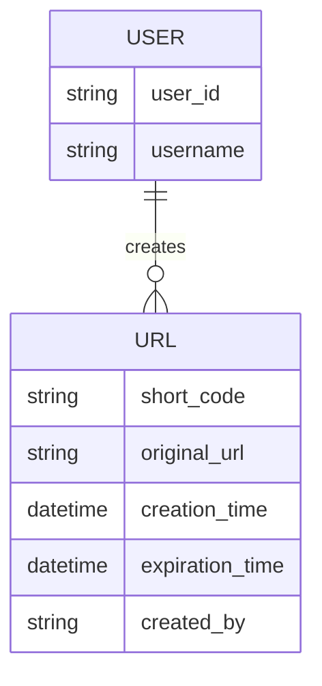
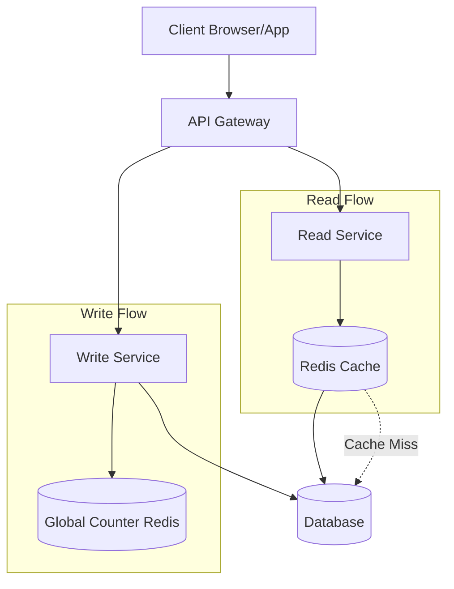
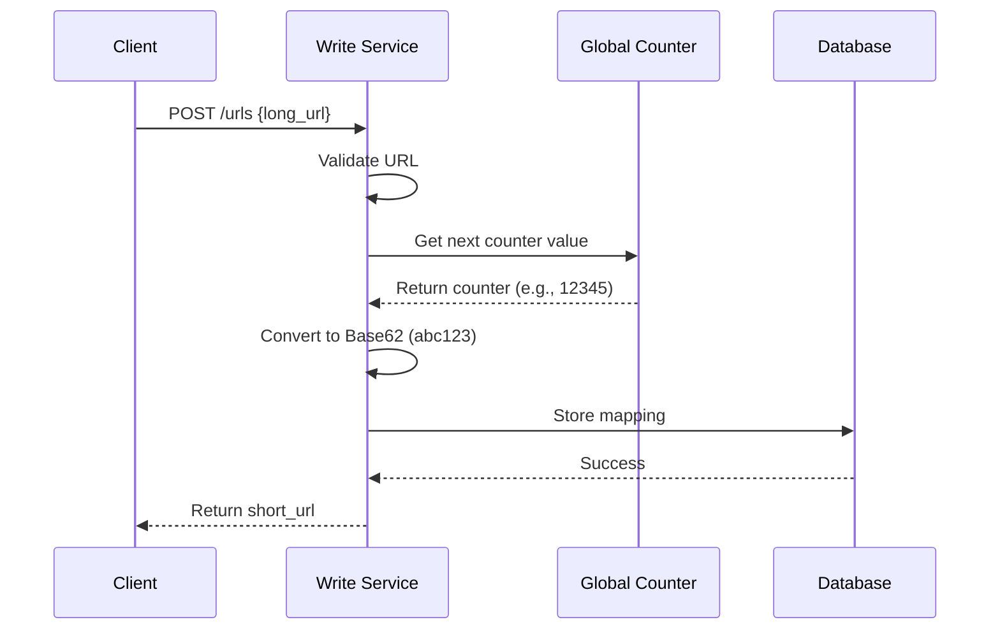
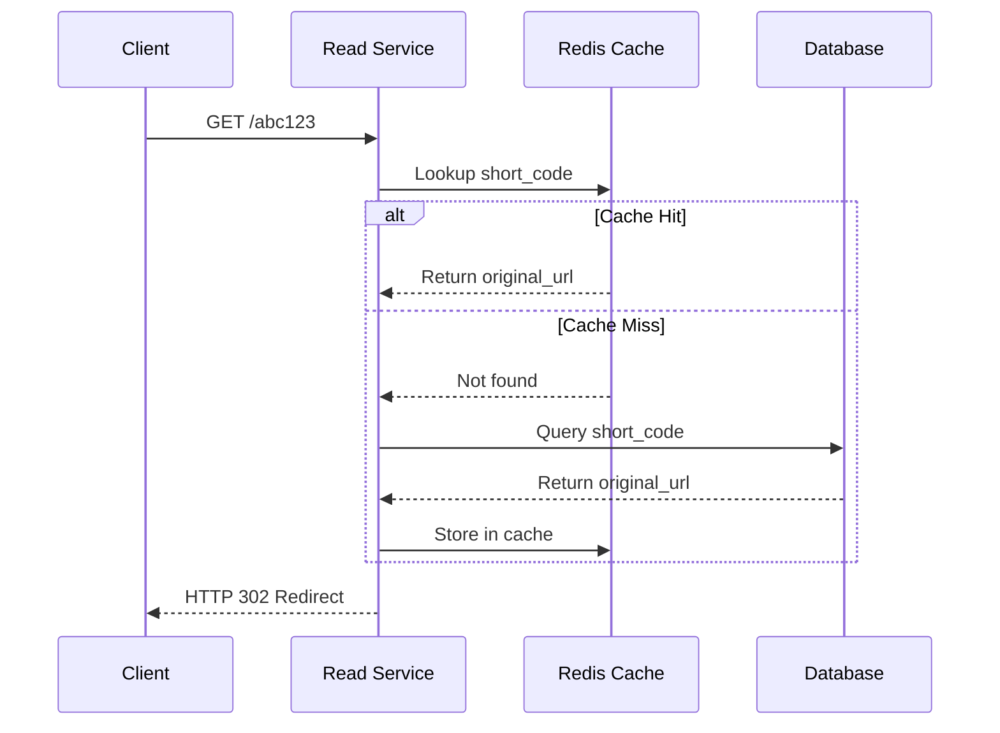
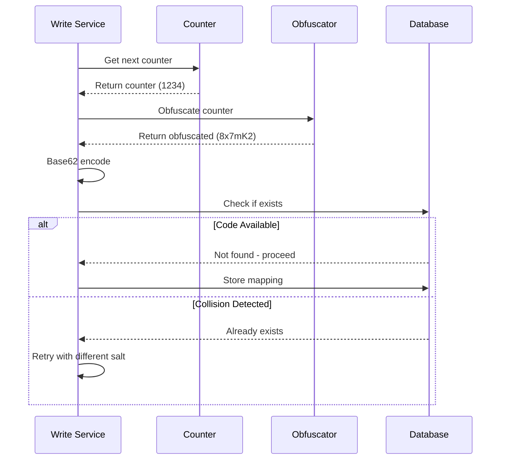
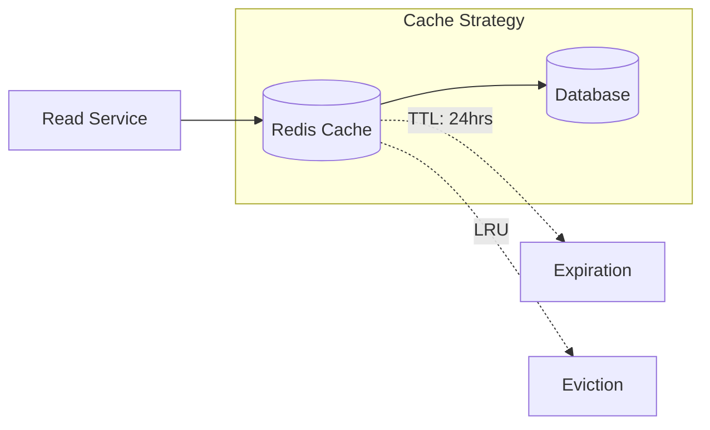
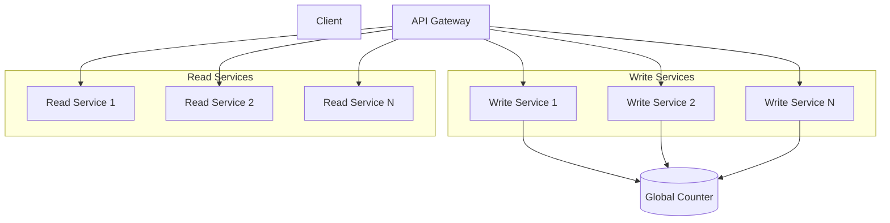
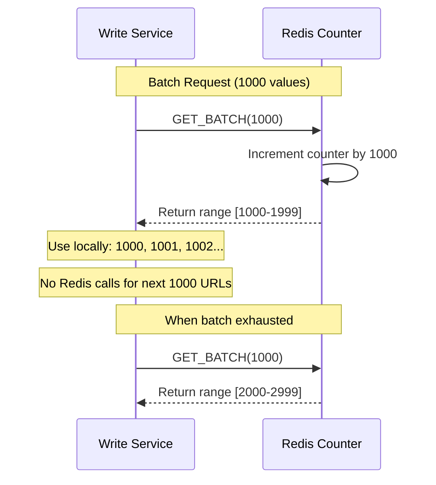
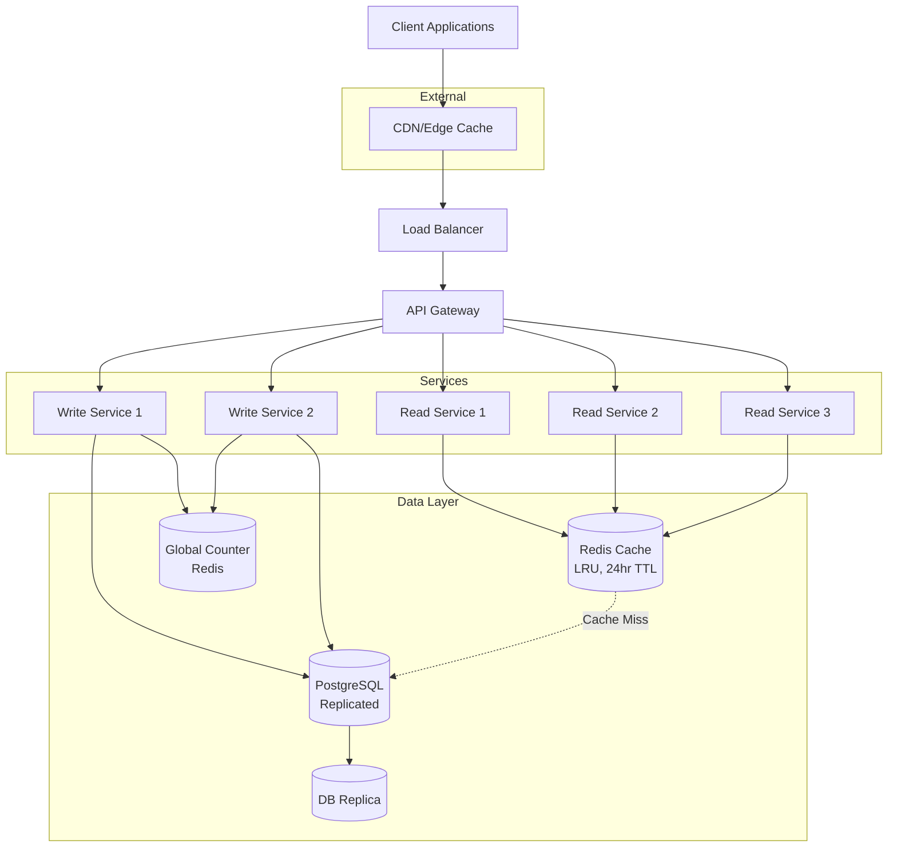

# URL Shortener System Design - Complete Interview Guide

## 📋 Problem Overview

Design a URL shortening service like Bit.ly that converts long URLs into shorter, manageable links and provides analytics.

**Key Insight**: This is a **read-heavy system** with a 1000:1 read-to-write ratio (1000 clicks per 1 URL creation).

---

## 🎯 Functional Requirements

### ✅ Core Requirements (In Scope)

1. **URL Shortening**: Users can submit long URLs and receive shortened versions
   - Optional: Custom alias support
   - Optional: Expiration date setting
2. **URL Redirection**: Users can access original URLs via shortened URLs

### ❌ Below the Line (Out of Scope)

- User authentication and account management
- Analytics on link clicks (geographic data, click counts)
- Advanced security (spam detection, malicious URL filtering)

---

## ⚡ Non-Functional Requirements

### Core Requirements

1. **Uniqueness**: Ensure short codes are globally unique
2. **Low Latency**: Redirection should occur within 100ms
3. **High Availability**: 99.99% uptime (Availability > Consistency)
4. **Scalability**: Support 1B shortened URLs and 100M DAU

### Important Considerations

- **Read-to-Write Ratio**: 1000:1 (heavily read-skewed)
- **Data Consistency**: Real-time analytics not critical
- **Security**: Basic validation, advanced features out of scope

---

## 🏗️ Core Entities



---

## 🔌 API Design

### 1. Shorten URL

```http
POST /urls
Content-Type: application/json

{
  "long_url": "https://www.example.com/some/very/long/url",
  "custom_alias": "optional_custom_alias",
  "expiration_date": "optional_expiration_date"
}

Response:
{
  "short_url": "http://short.ly/abc123"
}
```

### 2. Redirect to Original URL

```http
GET /{short_code}

Response:
HTTP/1.1 302 Found
Location: https://www.original-long-url.com
```

**Why 302 over 301?**

- 302 (Temporary): Browsers don't cache, ensures traffic goes through our servers
- Allows tracking, link updates, and expiration handling
- 301 (Permanent): Browsers cache, bypassing our servers

---

## 🏛️ High-Level Architecture



---

## 🔄 System Flows

### URL Creation Flow



### URL Redirection Flow



---

## 🔧 Deep Dive: Short Code Generation

### ❌ Bad Solution: URL Prefix

**Approach**: Take first N characters of the input URL as short code.

- Example: `www.linkedin.com/in/evan-king/` → `www.link`

**Problems**:

- **No Uniqueness**: Multiple URLs with same prefix map to same short code
- **Collision Resolution**: No way to distinguish between different URLs
- **Predictable**: Not suitable for production systems

### ✅ Good Solution: Random Number Generator / Hash Function

#### Random Number Generator Approach

```javascript
input_url = "https://www.example.com/some/very/long/url";
random_number = Math.random();
short_code_encoded = base62_encode(random_number);
short_code = short_code_encoded.slice(0, 8); // 8 characters
```

#### Hash Function Approach

- Use cryptographic hash functions (SHA-256, MD5)
- Same input always produces same hash
- High entropy and randomness

**Pros**:

- Simple to implement
- Good entropy/randomness
- Hash functions provide deterministic results

**Cons**:

- **Birthday Problem**: Collision probability increases with more URLs
- **Collision Detection**: Requires database checks for each new code
- **Trade-off**: Longer codes vs. collision probability
- **Scalability Issues**: Checking becomes bottleneck

### 🌟 Great Solution: Counter + Base62 Encoding

**Why Base62?**

- Characters: `a-z, A-Z, 0-9` (62 total characters)
- URL-safe (no special characters like + or / from Base64)
- Compact representation

**Length Analysis:**

- 6 characters: 62^6 = ~57 billion URLs
- 7 characters: 62^7 = ~3.5 trillion URLs

**For 1B URLs**: 6 characters sufficient, 7 for growth

**Implementation:**

```python
def int_to_base62(num):
    if num == 0:
        return '0'

    alphabet = '0123456789abcdefghijklmnopqrstuvwxyzABCDEFGHIJKLMNOPQRSTUVWXYZ'
    result = ''

    while num > 0:
        result = alphabet[num % 62] + result
        num //= 62

    return result

# Example: counter = 12345 → short_code = "dnh"
```

**Pros**:

- **Guaranteed Uniqueness**: No collision detection needed
- **Efficient**: Simple increment + encoding
- **Scalable**: Easy to distribute across services
- **Compact**: Optimal short code length

**Cons**:

- **Predictable**: Sequential pattern (security concern)
- **Single Point**: Global counter coordination needed

### 🔒 Security Consideration: Predictability Problem

**The Issue**:

```javascript
// Sequential counter with Base62 encoding
Counter: 1000 → Base62: 'G8'
Counter: 1001 → Base62: 'G9'
Counter: 1002 → Base62: 'GA'
Counter: 1003 → Base62: 'GB'

// An attacker can easily predict:
// If they see short.ly/G8, they know G9, GA, GB exist
```

**Attack Scenario**:

```bash
# Attacker discovers
https://short.ly/abc123

# Can systematically try:
https://short.ly/abc124
https://short.ly/abc125
# ... potentially accessing private URLs
```

### 🛡️ Security Solutions

#### Option 1: ID Obfuscation (Recommended)

```javascript
function obfuscateId(id) {
  const MULTIPLIER = 1664525; // Large prime-like number
  const INCREMENT = 1013904223;
  const MODULUS = Math.pow(2, 32);

  return (id * MULTIPLIER + INCREMENT) % MODULUS;
}

function generateShortCode(counter) {
  const obfuscated = obfuscateId(counter);
  return base62Encode(obfuscated);
}
```

#### Option 2: Hash-Based with Salt

```javascript
function generateShortCode(counter, longUrl) {
  const combined = `${counter}-${sha256(longUrl).substring(0, 8)}`;
  const finalHash = sha256(combined + SECRET_SALT);
  const number = parseInt(finalHash.substring(0, 10), 16);
  return base62Encode(number);
}
```

#### Option 3: Pre-generated Pool

```javascript
// Background job generates collision-free codes
async function preGenerateShortCodes() {
  const batch = [];
  for (let i = 0; i < 1000; i++) {
    let shortCode;
    do {
      shortCode = generateRandomShortCode();
    } while (await db.exists(shortCode));

    batch.push(shortCode);
  }
  await redis.lpush("available_codes", ...batch);
}
```

### 🔄 Security Impact on Architecture

**Trade-offs with Security**:

| Approach       | Generation Speed | Collision Risk | Code Length | Predictable | Collision Check |
| -------------- | ---------------- | -------------- | ----------- | ----------- | --------------- |
| Simple Counter | Very Fast        | 0%             | 6-7 chars   | ✅ Yes      | ❌ No           |
| Obfuscated     | Medium           | <0.1%          | 7-8 chars   | ❌ No       | ✅ Rare         |
| Pre-generated  | Fast             | 0%             | 7-8 chars   | ❌ No       | ❌ No           |
| Hash-based     | Medium           | 0.1%           | 7-8 chars   | ❌ No       | ✅ Sometimes    |

**Secure Flow with Collision Check**:



---

## 🚀 Scaling Strategies

### 1. Read Scaling (Critical for 1000:1 ratio)

#### Database Indexing

**B-tree Indexing** (Default for most databases):

```sql
CREATE INDEX idx_short_code ON urls(short_code);
-- Provides O(log n) lookup time
```

**Primary Key Strategy**:

```sql
ALTER TABLE urls ADD PRIMARY KEY (short_code);
-- Automatically creates index + ensures uniqueness
```

**Hash Indexing** (PostgreSQL):

```sql
CREATE INDEX CONCURRENTLY idx_short_code_hash ON urls USING HASH (short_code);
-- Provides O(1) average case lookup for exact matches
```

**Performance Impact**:

- Without index: O(n) - Full table scan
- With B-tree index: O(log n) - Logarithmic search
- With hash index: O(1) - Constant time for exact matches

#### In-Memory Caching (Redis/Memcached)

**Performance Comparison**:

- **Memory access**: ~100 nanoseconds (0.0001 ms)
- **SSD access**: ~0.1 milliseconds (1,000x slower)
- **HDD access**: ~10 milliseconds (100,000x slower)

**Operations per Second**:

- **Memory**: Millions of reads/sec
- **SSD**: ~100,000 IOPS
- **HDD**: ~100-200 IOPS

**Load Calculation Example**:

```
100M DAU × 5 redirects/day = 500M redirects/day
500M ÷ 86,400 seconds = ~5,787 RPS average
Peak traffic (10x): ~60K RPS
With spikes (100x): ~600K RPS
```

**Cache Strategy**:



**Cache Configuration**:

- **TTL**: 24 hours (URLs rarely change)
- **Eviction**: LRU (Least Recently Used)
- **Cache Hit Ratio**: Target 80%+

**Challenges**:

- **Cache Invalidation**: Complex for updates/deletions
- **Cold Start**: Cache needs time to warm up
- **Memory Limits**: Requires careful size management
- **Added Complexity**: Need invalidation strategies

#### CDN and Edge Computing

**Approach**:

- Deploy short URL domain through CDN with global Points of Presence (PoPs)
- Cache URL mappings at edge locations
- Use edge computing (Cloudflare Workers, AWS Lambda@Edge)
- Redirect directly from CDN without reaching origin server

**Benefits**:

- **Geographic Distribution**: Serve users from nearest location
- **Reduced Latency**: Popular URLs redirect from edge
- **Server Offloading**: Origin server traffic reduction

**Challenges**:

- **Cache Invalidation**: Complex across all CDN nodes
- **Edge Limitations**: Memory, execution time, library constraints
- **Cost**: Higher expenses with high traffic
- **Debugging**: Complex monitoring in distributed environment
- **Consistency**: Ensuring data consistency across nodes

**Trade-off**: Cost and complexity vs. performance improvement

### 2. Write Scaling

#### Microservice Architecture



#### Horizontal Scaling Challenges

**The Counter Problem**
When horizontally scaling write services, maintaining a **globally unique counter** becomes critical:

**Problem**: Multiple write service instances need to agree on next counter value
**Solution**: Centralized Redis instance as single source of truth

**Why Redis for Counter**:

- **Single-threaded**: Eliminates race conditions
- **Atomic Operations**: INCR command is guaranteed atomic
- **High Performance**: Sub-millisecond response times
- **Reliability**: Built-in replication and persistence

**Network Overhead Considerations**
**Question**: Is additional network request per write concerning?

**Answer**: Generally not a problem because:

- Network requests are fast (sub-millisecond in same datacenter)
- Negligible compared to other operations (DB writes, validation)
- Write frequency is low (~1-12 writes/second)

#### Counter Batching Strategy



**Implementation**:

1. Each Write Service instance requests batch of counter values (e.g., 1000)
2. Redis atomically increments counter by 1000 and returns start of batch
3. Write Service uses values locally without contacting Redis
4. When batch exhausted, request new batch

**Benefits**:

- Reduces Redis load
- Improves performance by reducing network calls
- Maintains uniqueness across all instances
- Tolerates some ID loss (acceptable trade-off)

---

## 💾 Database Design

### Database Choice & Sizing

**Storage Estimation Details**:

```
Per URL record breakdown:
- short_code: ~8 bytes
- original_url: ~100 bytes
- creation_time: ~8 bytes
- expiration_time: ~8 bytes
- created_by: ~100 bytes
- custom_alias: ~100 bytes (optional)
- analytics_id: ~8 bytes
- metadata: ~168 bytes
- Total: ~400 bytes → Round to 500 bytes (safety margin)

For 1B URLs: 500 bytes × 1B = 500GB
```

**Write Load Analysis**:

```
Estimated new URLs: 100K/day
100K ÷ 86,400 seconds = ~1.2 writes/second
Peak load (10x): ~12 writes/second
```

**Database Recommendations**:

- **500GB**: Well within modern SSD capabilities
- **Low Write Load**: Any reasonable database works
- **Options**: PostgreSQL, MySQL, DynamoDB
- **Rule**: Choose based on team expertise
- **Default**: PostgreSQL (if no preference)

### High Availability Strategies

#### Database Replication

**Master-Slave Setup**:

- Multiple identical database copies
- Automatic failover capability
- Read replicas for load distribution

**Trade-offs**:

- **Pros**: High availability, read scaling
- **Cons**: Added complexity, operational overhead, consistency challenges

#### Database Backup

**Periodic Snapshots**:

- Regular database backups to separate storage
- Point-in-time recovery capability
- Cross-region backup storage

**Trade-offs**:

- **Pros**: Disaster recovery, data durability
- **Cons**: Recovery time, storage costs, complexity

---

## 🏗️ Final Architecture



---

## 📊 Performance Metrics

### Latency Targets

- **URL Creation**: < 200ms (less frequent)
- **URL Redirection**: < 100ms (critical path)
- **Cache Hit Ratio**: > 80%

### Throughput Targets

- **Reads**: 100M requests/day = ~1,157 RPS
- **Writes**: 100K requests/day = ~1.2 RPS
- **Peak Load**: 5x average = ~5,785 read RPS

### Availability

- **Target**: 99.99% uptime
- **Downtime**: < 53 minutes/year
- **Strategy**: Multi-region deployment with failover

---

## 🔍 Additional Interview Deep Dives

### URL Expiration Handling

**Lazy Deletion Approach**:

- Check expiration during read operations
- Return 404 if expired
- Background cleanup jobs for maintenance

**Implementation**:

```sql
SELECT original_url FROM urls
WHERE short_code = 'abc123'
AND (expiration_time IS NULL OR expiration_time > NOW());
```

### Custom Alias Support

**Validation Requirements**:

- Check uniqueness against existing short codes
- Validate characters (alphanumeric only)
- Length restrictions (4-20 characters)
- Reserved word filtering

### Analytics Integration (Out of Scope Discussion)

**Architecture Approach**:

- Async event logging to prevent latency impact
- Message queues (Apache Kafka) for event streaming
- Separate analytics service for processing
- CQRS pattern: Read/Write separation

### Security Considerations

**Basic Validation**:

- URL format validation using libraries (is-url)
- Domain whitelist/blacklist
- Rate limiting per IP/user

**Advanced Features** (mention but don't implement):

- Malicious URL detection
- Spam prevention
- CAPTCHA for suspicious traffic

---

## 🎤 Common Follow-up Questions

### 1. URL Expiration Handling

**Implementation Options**:

- **Lazy Deletion**: Check during read, return 404 if expired
- **Background Jobs**: Periodic cleanup of expired URLs
- **Cache TTL**: Set expiration in cache layer
- **Database Triggers**: Auto-cleanup with DB features

### 2. Redis Counter Failure

**High Availability Solutions**:

- **Redis Replication**: Master-slave with automatic failover
- **Redis Sentinel**: Monitoring and failover management
- **Circuit Breaker**: Graceful degradation patterns
- **Backup Strategy**: Periodic counter persistence to durable storage

### 3. Analytics Implementation

**Architecture Approach**:

- **Async Logging**: Event streaming to prevent redirect latency
- **Message Queues**: Apache Kafka for high-throughput events
- **Separate Service**: Dedicated analytics microservice
- **CQRS Pattern**: Command Query Responsibility Segregation

### 4. Custom Domain Support

**Technical Requirements**:

- **DNS Configuration**: CNAME records pointing to service
- **SSL Certificates**: Automated cert management (Let's Encrypt)
- **Domain Validation**: Ownership verification
- **Multi-tenancy**: Isolated customer data

### 5. Rate Limiting

**Implementation Strategies**:

- **Token Bucket**: Allow burst traffic with sustained limits
- **Sliding Window**: More accurate but complex
- **Per-IP Limits**: Prevent abuse from single sources
- **User-based Limits**: Different limits for authenticated users

### 6. Short Code Storage (~8 bytes explanation)

**Character Encoding**:

- Each ASCII character in Base62 = 1 byte
- 6-7 character codes = 6-7 bytes actual data
- Database overhead: length prefix, alignment, metadata
- Result: ~8 bytes including storage overhead

---

## 🎯 Interview Tips

### Key Points to Emphasize

1. **Read-Heavy Nature**: Emphasize 1000:1 read-to-write ratio impact on design
2. **Base62 Encoding**: Explain why it's optimal (URL-safe, compact)
3. **Caching Strategy**: Critical for performance at scale
4. **302 vs 301**: Show understanding of HTTP redirects and business needs
5. **Counter Batching**: Demonstrates optimization thinking
6. **Security Trade-offs**: Acknowledge predictability vs. uniqueness trade-off

### Security Discussion Strategy

**When asked about predictability:**

> _"Great question! You're right that sequential counters are predictable. We have options:_
>
> 1. **Accept the risk**: For most applications, URL predictability isn't critical
> 2. **Add obfuscation**: Use hashing/scrambling with small collision risk
> 3. **Risk assessment**: Discuss whether this is actually a concern for the use case
>
> _The pure counter approach is often acceptable unless dealing with sensitive URLs."_

### Things to Avoid

- Over-engineering (avoid complex solutions unless asked)
- Ignoring the read-heavy nature
- Forgetting to discuss caching strategies
- Not explaining trade-offs clearly
- Dismissing security concerns without discussion

### Architecture Evolution Strategy

1. **Start Simple**: Basic counter + database approach
2. **Add Caching**: Introduce Redis for read performance
3. **Scale Services**: Separate read/write services
4. **Add Security**: Discuss obfuscation if questioned
5. **CDN/Edge**: Only if performance requirements demand

---

## 🎯 Quick Reference

### Technologies Stack

- **API Gateway**: Nginx, AWS ALB
- **Services**: Node.js, Python, Java
- **Cache**: Redis (with replication)
- **Database**: PostgreSQL (with replicas)
- **Message Queue**: Apache Kafka (for analytics)
- **Monitoring**: Prometheus, Grafana
- **CDN**: CloudFlare, AWS CloudFront

### Key Formulas

- **Base62 Length**: `log62(total_urls)` rounded up
- **QPS Calculation**: `daily_requests / (24 * 3600)`
- **Storage**: `num_urls × avg_record_size`
- **Cache Size**: `hot_data_percentage × total_storage`

### Decision Framework

1. **Requirements First**: Always clarify functional vs non-functional
2. **Start Simple**: Basic working system before optimization
3. **Identify Bottlenecks**: Use the 1000:1 ratio to focus on reads
4. **Scale Incrementally**: Add complexity only when needed
5. **Discuss Trade-offs**: Security vs simplicity, cost vs performance

---

_Remember: Start simple, then add complexity. Focus on the core requirements first, then dive deep into scaling challenges. Always explain your reasoning and trade-offs!_

# URL Shortener - Last Minute Revision Points

## 🔑 Key System Characteristics

- **Read-Heavy System**: 1000:1 read-to-write ratio (most critical insight)
- **Scale**: 1B URLs, 100M DAU, ~5,787 RPS average reads, ~1.2 RPS writes
- **Latency**: <100ms redirections, <200ms URL creation
- **Storage**: ~500GB for 1B URLs (500 bytes per record)

## 🎯 Core Requirements (Must Know)

- **Functional**: Shorten URLs → Get short codes, Redirect short codes → Original URLs
- **Non-Functional**: Uniqueness, Low latency, High availability (99.99%), Scalability
- **Out of Scope**: Authentication, analytics, advanced security

## 🔧 Short Code Generation (Critical Deep Dive)

### ❌ Bad: URL Prefix

- No uniqueness guarantee, collision prone

### ✅ Good: Random/Hash

- **Pros**: Simple, good entropy
- **Cons**: Birthday problem, collision detection needed, scales poorly

### 🌟 Best: Counter + Base62

- **Why Base62**: URL-safe (a-z, A-Z, 0-9), compact (6 chars = 57B URLs)
- **Algorithm**: Increment counter → Base62 encode → Store mapping
- **Benefits**: Guaranteed unique, no collision detection, efficient
- **Security Issue**: Predictable sequence (abc123 → abc124)

## 🛡️ Security Solutions

- **ID Obfuscation**: Multiply by large prime + add constant
- **Hash with Salt**: Combine counter + URL hash + secret
- **Pre-generated Pool**: Background job creates collision-free codes
- **Trade-off**: Security vs simplicity vs performance

## 🏗️ Architecture Components

### API Design

```
POST /urls → {short_url}
GET /{code} → 302 Redirect
```

- **302 vs 301**: 302 = temporary, no browser caching, allows tracking

### Core Services

- **Write Service**: Handle URL creation, counter management
- **Read Service**: Handle redirections, cache management
- **Global Counter**: Redis for atomic increments

### Data Flow

1. **Write**: Validate → Get counter → Encode → Store → Return
2. **Read**: Check cache → Query DB if miss → Cache result → Redirect

## 🚀 Scaling Strategies (Focus on Reads)

### Caching (Most Important)

- **Redis Cache**: LRU eviction, 24hr TTL, target 80%+ hit ratio
- **Performance**: Memory (0.0001ms) vs SSD (0.1ms) vs HDD (10ms)
- **Size**: Cache hot URLs, ~80% of traffic hits 20% of URLs

### Database Optimization

- **Indexing**: Primary key on short_code, O(1) hash or O(log n) B-tree
- **Replication**: Master-slave for availability and read scaling

### Write Scaling

- **Counter Batching**: Get 1000 counter values at once, use locally
- **Horizontal Scaling**: Multiple write services share global counter

### Advanced (Mention if Asked)

- **CDN/Edge**: Cache at global edge locations
- **Microservices**: Separate read/write services

## 📊 Performance Numbers to Remember

- **Daily Load**: 500M redirects/day (100M users × 5 clicks)
- **Peak Traffic**: 10x average = ~60K RPS
- **Cache Hit Ratio**: 80%+ essential for performance
- **Database**: 1.2 writes/sec, 5,787 reads/sec average

## 🏛️ Final Architecture

```
Client → CDN → Load Balancer → API Gateway
         ↓
Write Services (2x) ← Global Counter (Redis)
Read Services (3x) ← Cache (Redis) ← Database (PostgreSQL)
         ↓                           ↓
    Database ← ← ← ← ← ← ← ← ← ← Replicas
```

## 🎤 Common Follow-ups & Answers

### "How handle expired URLs?"

- **Lazy deletion**: Check expiration during read, return 404
- **Background cleanup**: Periodic jobs remove expired entries

### "Redis counter fails?"

- **Replication**: Master-slave with automatic failover
- **Circuit breaker**: Graceful degradation patterns

### "Custom domains?"

- **DNS**: CNAME records, SSL cert management
- **Validation**: Domain ownership verification

### "Rate limiting?"

- **Token bucket**: Allow bursts with sustained limits
- **Per-IP limits**: Prevent abuse

## 💡 Interview Strategy

### Start Simple, Add Complexity

1. Basic counter + database
2. Add Redis caching
3. Separate read/write services
4. Discuss security if asked
5. CDN only if performance demands

### Key Points to Emphasize

- **1000:1 ratio** drives all design decisions
- **Base62 encoding** rationale
- **302 redirect** business reasoning
- **Caching strategy** is critical
- **Counter batching** shows optimization thinking

### Avoid These Mistakes

- Over-engineering without requirements
- Ignoring the read-heavy nature
- Forgetting caching discussion
- Not explaining trade-offs
- Dismissing security concerns

## 🎯 Decision Framework

1. **Requirements first**: Clarify functional vs non-functional
2. **Bottleneck identification**: Focus on reads due to 1000:1 ratio
3. **Trade-off discussion**: Always explain pros/cons
4. **Incremental complexity**: Add features only when needed
5. **Business impact**: Connect technical decisions to user experience
