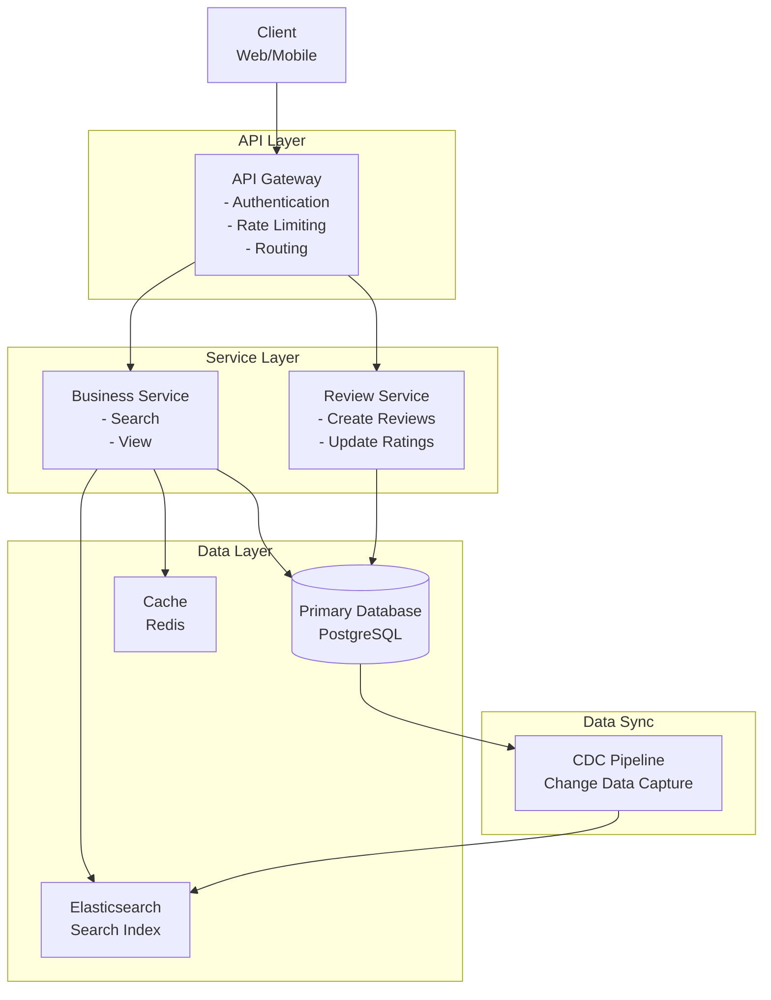
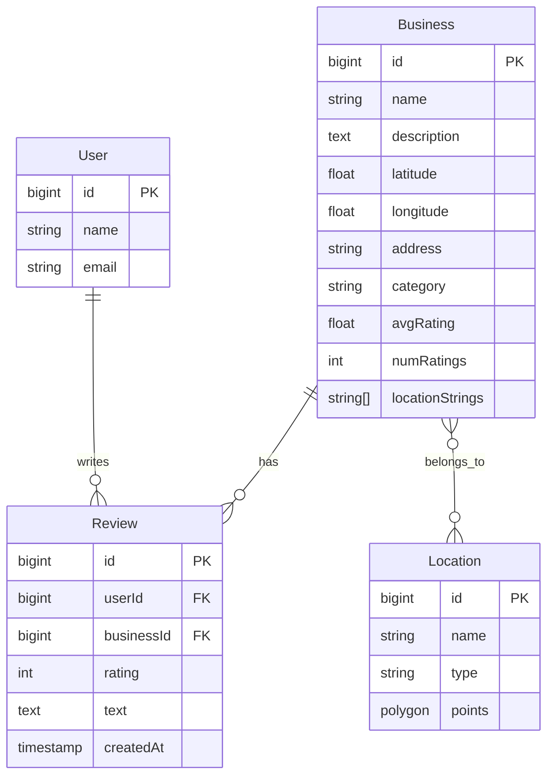
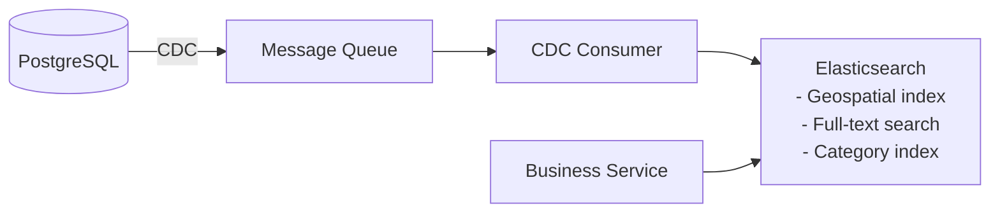
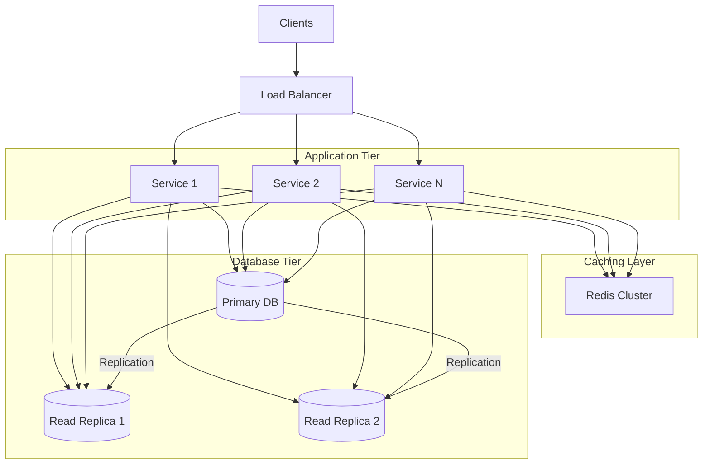

# Yelp System Design Interview Guide

## 📍 What is Yelp?
Yelp is an online platform that allows users to search for and review local businesses, restaurants, and services.

## 🎯 Functional Requirements

### Core Requirements
1. **Search for businesses** by name, location (lat/long), and category
2. **View businesses** and their reviews
3. **Leave reviews** on businesses (1-5 star rating + optional text)

### Out of Scope
- Admin features (add/update/remove businesses)
- View businesses on a map
- Business recommendations

## ⚡ Non-Functional Requirements

### Core Requirements
1. **Low latency** for search operations (< 500ms)
2. **Highly available**, eventual consistency is fine
3. **Scalable** to handle:
   - 100M daily active users (DAU)
   - 10M businesses
   - ~1TB of data (10M businesses × 100 reviews × 1KB)

### Additional Considerations
- GDPR compliance
- Fault tolerance
- Spam/abuse protection

## 📊 Key Metrics & Insights

### Read/Write Ratio
- **Extremely read-heavy**: 1000:1 ratio
- 100M users → ~100k writes/day → ~1 write/second
- **Key insight**: Write volume is tiny, no need for complex queueing systems

### Data Volume
- 10M businesses × 1KB = 10GB
- 10M businesses × 100 reviews × 1KB = 1TB
- **Key insight**: Small data volume, single database instance sufficient

## 🏗️ System Architecture

### High-Level Design



### Core Entities



## 🔄 API Design

```typescript
// Search for businesses
GET /businesses?query=coffee&location=37.7749,-122.4194&category=cafe&page=1
Response: Business[]

// View business details
GET /businesses/:businessId
Response: Business

// View reviews for a business
GET /businesses/:businessId/reviews?page=1
Response: Review[]

// Leave a review
POST /businesses/:businessId/reviews
Body: {
    rating: number,  // 1-5, required
    text?: string    // optional
}
```

## 🎯 Deep Dive Topics

### 1. Average Rating Calculation

#### ❌ Bad: On-the-fly calculation
```sql
-- Expensive JOIN operation for every search
SELECT b.*, AVG(r.rating) AS avg_rating
FROM businesses b
JOIN reviews r ON b.id = r.business_id
GROUP BY b.id;
```

#### ✅ Good: Periodic update with cron job
- Pre-compute ratings periodically (hourly/daily)
- Store in `avgRating` column
- **Issue**: Stale data between updates

#### ✅✅ Great: Synchronous update with optimistic locking
```sql
-- Add numRatings column to businesses table
-- Update synchronously on each new review
new_avg = (old_avg * num_reviews + new_rating) / (num_reviews + 1)

-- Use optimistic locking to handle concurrent updates
UPDATE businesses 
SET avg_rating = ?, num_ratings = ?
WHERE id = ? AND num_ratings = ?
```

### 2. One Review Per User Constraint

#### ❌ Bad: Application-level check
```python
def leave_review(user_id, business_id):
    if user_already_reviewed(user_id, business_id):
        return error
    # Race condition possible!
```

#### ✅✅ Great: Database constraint
```sql
ALTER TABLE reviews
ADD CONSTRAINT unique_user_business 
UNIQUE (user_id, business_id);
```

### 3. Search Optimization

#### Search Requirements by Type

| Search Type | Index Type | Technology |
|------------|------------|------------|
| **Location** | Geospatial (R-tree, Quadtree, Geohash) | PostGIS, Elasticsearch |
| **Name/Text** | Full-text (Inverted index) | pg_trgm, Elasticsearch |
| **Category** | B-tree | Standard DB index |

#### Solution Options

##### Option 1: Elasticsearch


**Pros:**
- Purpose-built for search
- Excellent geospatial support
- Great full-text search

**Cons:**
- Consistency challenges
- Not suitable as primary DB
- Additional infrastructure

##### Option 2: PostgreSQL with Extensions
```sql
-- Enable extensions
CREATE EXTENSION postgis;      -- Geospatial
CREATE EXTENSION pg_trgm;      -- Full-text search

-- Create indexes
CREATE INDEX idx_location ON businesses 
USING GIST(geography(location));

CREATE INDEX idx_name ON businesses 
USING GIN(name gin_trgm_ops);
```

**Pros:**
- Single database (simpler)
- Strong consistency
- Good for our data volume

**Cons:**
- Less optimized than Elasticsearch at scale

### 4. Location-based Search (Cities/Neighborhoods)

#### Implementation Steps

1. **Store location polygons**
```sql
CREATE TABLE locations (
    id BIGINT PRIMARY KEY,
    name VARCHAR(255),     -- "San Francisco", "Mission District"
    type VARCHAR(50),      -- "city", "neighborhood"
    polygon GEOMETRY       -- Geographic boundary
);
```

2. **Pre-compute business locations**
```json
{
    "id": "123",
    "name": "Pizza Place",
    "location_names": ["bay_area", "san_francisco", "mission_district"],
    "category": "restaurant"
}
```

3. **Index location names for fast lookup**

## 🚀 Scaling Strategies

### Read Scaling Pattern


### Caching Strategy
- **Business details**: Cache with TTL ~1 hour
- **Search results**: Cache with shorter TTL ~5 minutes
- **Average ratings**: Can be cached since updates are synchronous

## 🎓 Level-Specific Expectations

### Mid-Level
- Create working high-level design
- Understand basic search optimization
- Problem-solve rating calculation approaches

### Senior
- Master all deep dives except advanced search
- Justify technology choices with tradeoffs
- Understand different index types

### Staff+
- Recognize simplicity opportunities:
  - No message queue needed (low write volume)
  - Single DB instance sufficient (small data)
  - PostgreSQL extensions vs Elasticsearch tradeoff
- Articulate when complex solutions become necessary
- Focus on operational simplicity

## 💡 Key Interview Tips

### Do's
1. **Start simple**, add complexity only when needed
2. **Quantify everything** with numbers
3. **Consider read/write patterns** early
4. **Think about consistency** requirements
5. **Discuss tradeoffs** explicitly

### Don'ts
1. Don't over-engineer for small data/traffic
2. Don't use Elasticsearch as primary database
3. Don't ignore database constraints for business logic
4. Don't forget about pagination for list endpoints

## 🔍 Common Follow-up Questions

1. **How to handle trending/popular businesses?**
   - Hot partition problem
   - Solution: Caching, read replicas, eventual consistency

2. **How to prevent review spam/abuse?**
   - Rate limiting
   - User verification
   - ML-based spam detection
   - Human moderation queue

3. **How to implement "near me" searches?**
   - Geolocation from IP/GPS
   - Quadtree for efficient radius search
   - Second-pass filtering with Haversine formula

4. **How to handle business chain updates?**
   - Bulk update APIs
   - Event-driven architecture
   - Batch processing during off-peak

## 📝 Sample Search Query (Elasticsearch)

```json
{
  "query": {
    "bool": {
      "must": [
        {
          "match": { "name": "coffee" }
        },
        {
          "geo_distance": {
            "distance": "10km",
            "location": {
              "lat": 40.7128,
              "lon": -74.0060
            }
          }
        },
        {
          "term": { "category": "coffee_shop" }
        }
      ]
    }
  }
}
```

## 🔧 Technology Stack Summary

| Component | Technology | Why |
|-----------|------------|-----|
| **Primary DB** | PostgreSQL | ACID, reliable, sufficient for our scale |
| **Search** | Elasticsearch OR PostgreSQL + Extensions | Depends on scale needs |
| **Cache** | Redis | Fast, supports geo operations |
| **CDC** | Debezium/Kafka | Reliable change capture |
| **API Gateway** | Kong/AWS API Gateway | Rate limiting, auth |

## 📊 Back-of-Envelope Calculations

### Storage
- Businesses: 10M × 1KB = 10GB
- Reviews: 10M × 100 × 1KB = 1TB
- Indexes: ~200GB
- **Total**: ~1.2TB (fits in single instance)

### Throughput
- Reads: 100M DAU × 10 searches/day = 11,500 QPS
- Writes: 100K reviews/day = 1 write/second
- **Read/Write Ratio**: 10,000:1

### Latency Targets
- Search: < 500ms (p99)
- Business view: < 200ms (p99)
- Review submission: < 1s (p99)

## 🎯 Final Architecture Decisions

For the given scale (100M DAU, 10M businesses):

1. **Single PostgreSQL instance** with read replicas
2. **PostgreSQL extensions** for search (simpler than Elasticsearch)
3. **Synchronous rating updates** (no queue needed)
4. **Redis caching layer** for hot data
5. **Database constraints** for business logic

This keeps the system simple while meeting all requirements. Scale up to Elasticsearch and sharding only when data exceeds single-instance capacity (~10TB).
