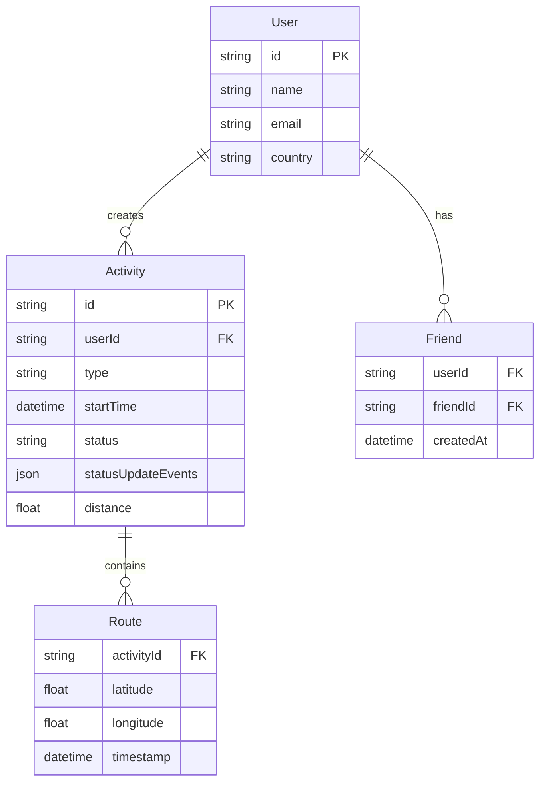
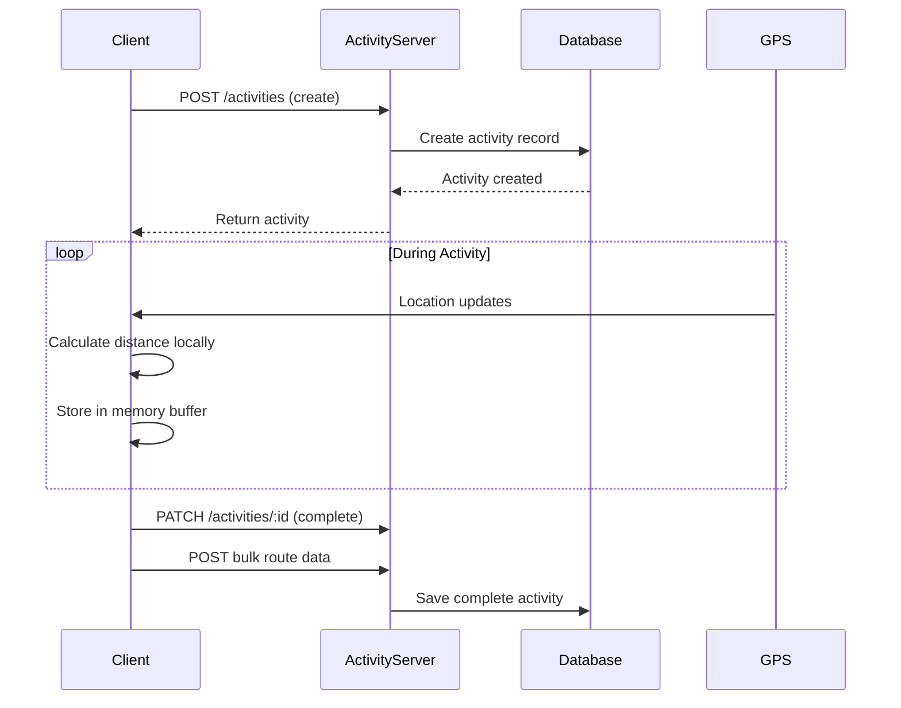
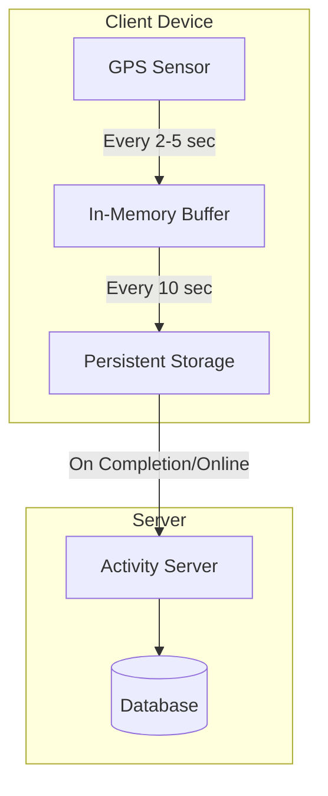
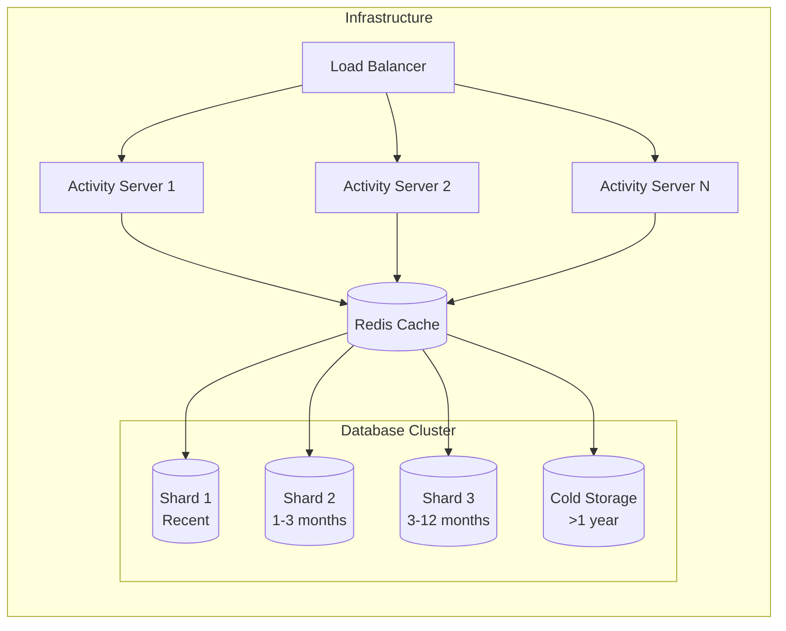
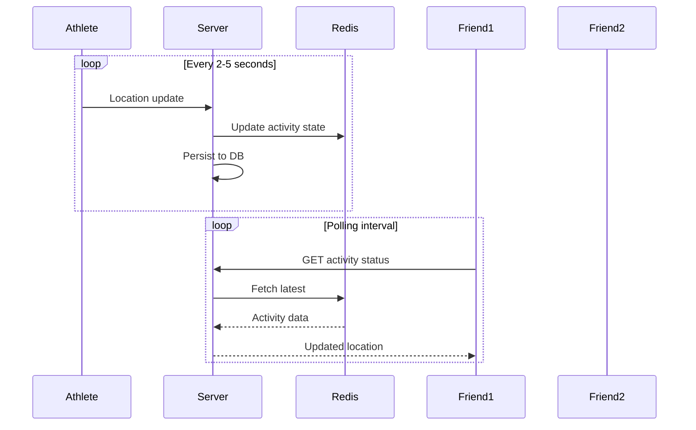
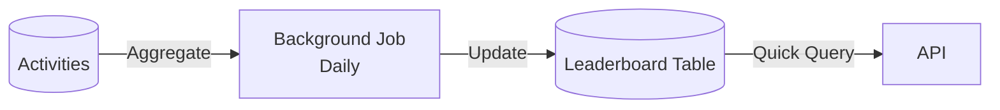
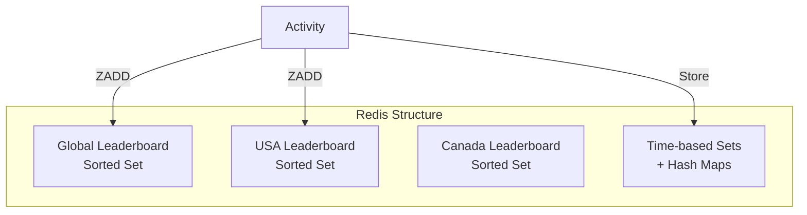

# Strava System Design Interview Guide

## 📋 Problem Overview

**What is Strava?**
- Fitness tracking application for recording and sharing physical activities
- Focus on running and cycling
- Provides detailed analytics on performance, routes, and social interactions

## 🎯 Requirements

### Functional Requirements (Core)
1. **Activity Management**: Start, pause, stop, and save runs/rides
2. **Real-time Tracking**: View activity data during exercise (route, distance, time)
3. **Social Features**: View own and friends' completed activities

### Out of Scope
- Friend management (adding/deleting)
- Authentication/authorization
- Comments/likes on activities

### Non-Functional Requirements
1. **High Availability** (availability >> consistency)
2. **Offline Support**: Function in areas without network connectivity
3. **Low Latency**: Accurate, up-to-date local statistics during activity
4. **Scale**: Support 10 million concurrent activities

## 🏗️ Core Entities



## 🔌 API Design

### Activity Management
```http
# Create new activity
POST /activities
{
  "type": "RUN" | "RIDE"
}

# Update activity state
PATCH /activities/:activityId
{
  "state": "STARTED" | "PAUSED" | "RESUMED" | "COMPLETE"
}

# Add location to route
POST /activities/:activityId/routes
{
  "location": GPSCoordinate
}
```

### Activity Viewing
```http
# List activities
GET /activities?mode={USER|FRIENDS}&page={page}&pageSize={pageSize}
→ Returns: Partial<Activity>[]

# Get activity details
GET /activities/:activityId
→ Returns: Activity (full details)
```

## 🏛️ High-Level Architecture

### Basic System Flow



### Key Design Decision: Client-Side Processing
- **GPS tracking happens locally** on the device
- Updates sent to server only on completion or periodic sync
- Reduces server load by ~100x
- Enables offline functionality

## 🎯 Deep Dives

### 1. Offline Support Architecture



**Implementation Details:**
- **iOS**: Core Location + Core Data/UserDefaults
- **Android**: FusedLocationProviderClient + Room/SharedPreferences
- Buffer persisted every ~10 seconds to prevent data loss
- Maximum data loss: 10 seconds on unexpected shutdown

### 2. Scaling to 10M Concurrent Activities



**Scaling Strategies:**
- **Database Sharding**: By completion time
- **Data Tiering**:
  - Hot: Recent activities (fast storage)
  - Warm: 3-12 months (slower storage)
  - Cold: >1 year (archival/S3)
- **Horizontal Scaling**: Activity servers scale out as needed
- **Caching**: Redis for frequently accessed activities

**Storage Calculations:**
- 100M DAU × 1 activity/day = 36.5B activities/year
- ~15KB per activity (including route data)
- Total: ~547.5TB/year

### 3. Real-time Activity Sharing



**Key Insights:**
- **Polling > WebSockets** for this use case
  - Updates are predictable (every 2-5 seconds)
  - Slight delay acceptable
  - Simpler implementation
- **Smart Buffering**: Lag display by 5-10 seconds for smooth animation

### 4. Leaderboard Implementation

#### ❌ Bad: Naive Approach
```sql
SELECT u.name, SUM(a.distance) as total_distance
FROM activities a
JOIN users u ON a.userId = u.userId
WHERE a.state = "COMPLETE" AND a.type = "RUN"
GROUP BY u.userId
ORDER BY total_distance DESC
```
**Problem**: Aggregates millions of records on each request

#### ✅ Good: Periodic Aggregation


#### ✅✅ Best: Redis Sorted Sets


**Redis Implementation:**
```python
# Add to leaderboard
redis.zadd("leaderboard:run:global", {user_id: distance})
redis.zadd(f"leaderboard:run:{country}", {user_id: distance})

# Query top 10
redis.zrange("leaderboard:run:global", 0, 9, desc=True)

# Time-range filtering
activity_ids = redis.zrangebyscore("activities:timestamps", start, end)
# Aggregate in-memory and sort
```

## 💡 Additional Considerations

### Battery Optimization
- **Adaptive GPS Sampling**: 
  - Running: Every 5 seconds
  - Cycling: Every 2 seconds
  - Stationary: Reduce frequency
- **Batch Network Requests**: Minimize radio wake-ups
- **Smart Persistence**: Balance data safety with battery life

### Data Accuracy
- **Haversine Formula**: Calculate distance between GPS points
- **GPS Signal Loss Handling**: 
  - Interpolate missing points
  - Mark segments as "estimated"
- **Elevation Data**: Consider altitude changes for accurate distance

### Privacy & Security
- **Route Privacy**: Option to hide start/end points
- **Private Activities**: Not shared with friends
- **Data Encryption**: In-transit and at-rest
- **GDPR Compliance**: Data deletion, export capabilities

### Advanced Features to Mention
1. **Segments**: Popular route sections with leaderboards
2. **Live Segments**: Real-time comparison during activity
3. **Route Planning**: Pre-plan routes with elevation profiles
4. **Heatmaps**: Aggregate route data to show popular paths
5. **Virtual Competitions**: Time-based challenges

## 🎓 Interview Tips

### Start Simple, Then Optimize
1. Begin with basic client-server architecture
2. Add offline support (major optimization)
3. Scale the backend
4. Add real-time features if time permits

### Key Talking Points
- **Client capabilities**: Modern phones are powerful - use them!
- **Offline-first design**: Critical for fitness apps
- **Battery considerations**: GPS and network are battery-intensive
- **Data tiering**: Not all data needs fast access
- **Redis for leaderboards**: Perfect use case for sorted sets

### Common Follow-ups
- "How would you handle GPS drift?" → Filtering algorithms, snap to roads
- "What about wearables?" → Similar architecture, sync through phone
- "How to detect cheating?" → Velocity checks, ML anomaly detection
- "Multi-sport activities?" → State machine for transitions

### Time Management
- Requirements & API: 5-10 minutes
- High-level design: 10-15 minutes
- Deep dives: 20-30 minutes
- Leave 5-10 minutes for questions

## 📊 Metrics to Monitor
- **System Health**: API latency, error rates, uptime
- **User Engagement**: DAU, activities per user, social interactions
- **Data Quality**: GPS accuracy, missing data points
- **Performance**: Battery usage, app responsiveness
- **Scale**: Concurrent activities, storage growth rate