# Distributed Rate Limiter System Design

## 🎯 Problem Overview
A rate limiter controls how many requests a client can make within a specific timeframe. It prevents abuse, protects servers from being overwhelmed, and ensures fair usage across all users.

## 📋 Requirements

### Functional Requirements
1. **Identify clients** by user ID, IP address, or API key
2. **Limit HTTP requests** based on configurable rules (e.g., 100 requests/minute)
3. **Reject excess requests** with HTTP 429 and helpful headers (X-RateLimit-Remaining, X-RateLimit-Reset)

### Non-Functional Requirements
1. **Low latency**: < 10ms per request check
2. **High availability** > Strong consistency (eventual consistency is acceptable)
3. **Scale**: Handle 1M requests/second across 100M daily active users

## 🏗️ High-Level Architecture

### Rate Limiter Placement Options

```mermaid
graph TB
    subgraph "✅✅ Best: API Gateway Integration"
        C3[Client] --> GW[API Gateway<br/>with Rate Limiter]
        GW --> MS7[Microservice 1]
        GW --> MS8[Microservice 2]
        GW --> MS9[Microservice 3]
    end
```




**Choice: API Gateway** - Best because it:
- Blocks bad requests at the edge
- Reduces load on backend services
- Centralized control and monitoring
- No additional network hops for each request

### Client Identification Strategy
- **User ID**: For authenticated users (from JWT tokens)
- **IP Address**: For anonymous users (from X-Forwarded-For header)
- **API Key**: For developer APIs (from X-API-Key header)
- **Layered approach**: Apply multiple rules, enforce most restrictive

## 🔄 Rate Limiting Algorithms

### 1. Fixed Window Counter

- **Problem**: Boundary effect - user can make 200 requests in 2 seconds at window boundary

### 2. Sliding Window Log
- Maintains timestamp log of all requests
- Perfect accuracy but high memory usage
- O(n) space complexity where n = requests per window

### 3. Sliding Window Counter
- Hybrid approach using weighted average of current and previous windows
- Good accuracy with minimal memory (2 counters per client)

### 4. Token Bucket ✅ (Recommended)


**Why Token Bucket?**
- Handles burst traffic naturally
- Simple implementation
- Memory efficient (tokens + last_refill_time)
- Used by companies like Stripe

## 💾 State Management with Redis

### Basic Implementation
```python
# Pseudocode for Token Bucket with Redis
def isRequestAllowed(client_id, rule_id):
    # Atomic operation using Lua script
    bucket_key = f"{client_id}:bucket"
    
    # Get current state
    tokens, last_refill = redis.HMGET(bucket_key, "tokens", "last_refill")
    
    # Calculate tokens to add
    time_passed = current_time - last_refill
    tokens_to_add = time_passed * refill_rate
    new_tokens = min(bucket_capacity, tokens + tokens_to_add)
    
    # Check if request allowed
    if new_tokens >= 1:
        # Update state atomically
        redis.MULTI()
        redis.HSET(bucket_key, "tokens", new_tokens - 1)
        redis.HSET(bucket_key, "last_refill", current_time)
        redis.EXPIRE(bucket_key, 3600)  # Auto-cleanup after 1 hour
        redis.EXEC()
        return True
    
    return False
```

### Race Condition Solution
Use **Lua scripting** for atomic read-modify-write operations to prevent race conditions between multiple gateways.

## 📈 Scaling Strategy

### Horizontal Scaling with Redis Sharding


**Key Points:**
- Use **consistent hashing** to distribute users across shards
- Each shard handles ~100k ops/second
- 10 shards = 1M requests/second capability
- Consider Redis Cluster for automatic sharding

## 🔥 Handling Common Challenges

### 1. High Availability


**Failure Modes:**
- **Fail-Closed** ✅ (Recommended for critical systems): Reject all requests when Redis unavailable
- **Fail-Open**: Allow all requests when Redis unavailable (risky during attacks)

### 2. Latency Optimization
- **Connection pooling**: Reuse TCP connections
- **Geographic distribution**: Deploy Redis close to users
- **Local caching**: Cache recent decisions (with TTL)
- **Pipelining**: Batch Redis operations

### 3. Hot Keys (Viral/Attack Scenarios)
**For Legitimate High-Volume:**
- Client-side rate limiting (SDK level)
- Request batching
- Premium tiers with dedicated infrastructure

**For Abusive Traffic:**
- Auto-blocking after repeated violations
- IP blocklisting
- DDoS protection (Cloudflare/AWS Shield)

### 4. Dynamic Configuration


**Options:**
- **Poll-based**: Gateways poll config every 30s (simple, slight delay)
- **Push-based**: ZooKeeper/etcd push updates immediately (complex, real-time)

## 📊 Response Format

### HTTP 429 Response
```http
HTTP/1.1 429 Too Many Requests
X-RateLimit-Limit: 100
X-RateLimit-Remaining: 0
X-RateLimit-Reset: 1640995200
Retry-After: 60
Content-Type: application/json

{
  "error": "Rate limit exceeded",
  "message": "You have exceeded the rate limit of 100 requests per minute"
}
```

## 🎯 Interview Tips by Level

### Mid-Level (L4/E4)
- Focus on **breadth** (80%) over depth
- Explain one algorithm clearly (Token Bucket)
- Understand Redis as shared state solution
- Recognize need for sharding at scale

### Senior (L5/E5)
- Balance breadth (60%) and depth (40%)
- Discuss **trade-offs** between algorithms
- Understand distributed concepts (consistent hashing, Redis Cluster)
- Explain atomic operations and MULTI/EXEC
- Discuss fail-open vs fail-closed strategies

### Staff+ (L6+/E6+)
- Deep production experience (40% breadth, 60% depth)
- Discuss multi-region deployments
- Address observability and monitoring
- Handle gradual rollouts and canary deployments
- Production operations and failure modes

## 🔍 Additional Considerations

### Monitoring & Observability


**Key Metrics:**
- Rate limit hit/miss ratio
- P50/P99 latency for rate limit checks
- Redis connection pool saturation
- 429 response rates by client type
- Token bucket utilization patterns

### Security Considerations
- **Rate limit bypass prevention**: Validate all client identifiers
- **Distributed attacks**: Implement IP-based limits alongside user limits
- **Gradual throttling**: Implement progressive penalties for repeat offenders
- **Whitelist/Blacklist**: Maintain exception lists for special cases

### Testing Strategy
1. **Unit tests**: Algorithm correctness
2. **Integration tests**: Redis interaction
3. **Load tests**: Verify 1M RPS capability
4. **Chaos engineering**: Test failure modes
5. **Canary deployment**: Gradual rollout with monitoring

### Cost Optimization
- **Redis memory**: Use EXPIRE to clean up inactive buckets
- **Network costs**: Minimize Redis calls through batching
- **Compute**: Use efficient data structures and algorithms
- **Storage**: Avoid storing historical data beyond necessary window

## 📚 Common Interview Questions

1. **"What if Redis goes down?"**
   - Discuss fail-open vs fail-closed trade-offs
   - Mention Redis replication and clustering
   - Consider circuit breakers

2. **"How do you handle clock skew?"**
   - Use server-side timestamps only
   - NTP synchronization across servers
   - Consider using logical clocks if needed

3. **"How to support different rate limits for different APIs?"**
   - Rule-based configuration system
   - Endpoint-specific limits in addition to global limits
   - Dynamic configuration updates

4. **"How to handle legitimate traffic spikes?"**
   - Adaptive rate limiting
   - Temporary limit increases during known events
   - Grace periods for premium users

5. **"How would you test this system?"**
   - Unit tests for algorithms
   - Integration tests with Redis
   - Load testing at scale
   - Failure injection testing

## 🚀 Advanced Topics (If Time Permits)

### Distributed Rate Limiting Across Regions


### Machine Learning Integration
- Anomaly detection for attack patterns
- Predictive scaling based on traffic patterns
- Adaptive limits based on user behavior

### Rate Limiting as a Service
- Multi-tenant architecture
- API for rule management
- Analytics and reporting dashboard
- SLA guarantees

## ✅ Checklist for Interview
- [ ] Clarify requirements (scale, consistency needs)
- [ ] Choose appropriate algorithm with justification
- [ ] Design data model and storage solution
- [ ] Address scaling challenges
- [ ] Discuss failure modes and recovery
- [ ] Consider monitoring and operations
- [ ] Optimize for latency if needed
- [ ] Handle edge cases (hot keys, attacks)
- [ ] Propose testing strategy