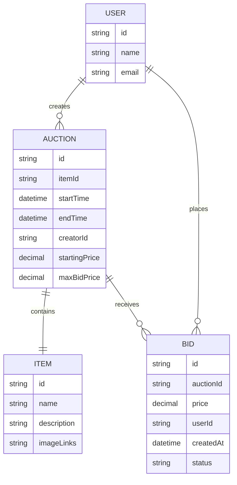
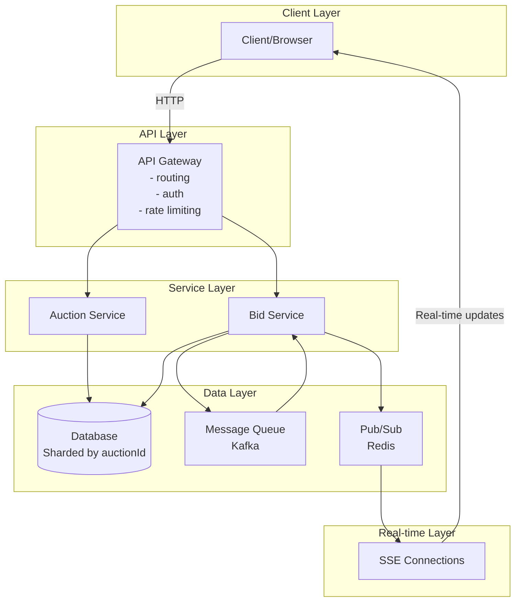
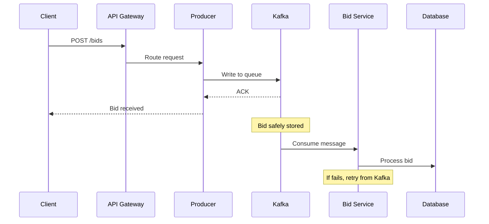
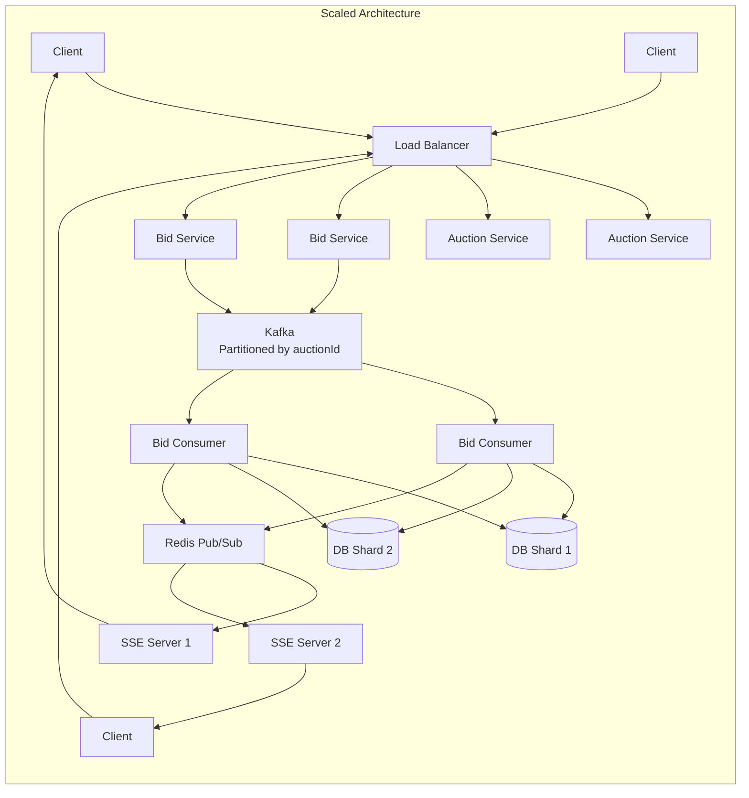

# Online Auction System Design - Interview Notes

## Problem Understanding

### What is an Online Auction?

A service where users list items for sale while others compete by placing increasingly higher bids until the auction ends, with the highest bidder winning.

## Requirements

### Functional Requirements

**Core (Above the line):**

1. Users can post items for auction with starting price and end date
2. Users can bid on items (bids accepted if higher than current max)
3. Users can view auctions including current highest bid

**Below the line (out of scope):**

- Search for items
- Filter by category
- Sort by price
- View auction history

### Non-Functional Requirements

**Core:**

1. **Strong consistency** for bids (all users see same highest bid)
2. **Fault tolerance** - can't drop any bids
3. **Real-time display** of current highest bid
4. **Scale** to 10M concurrent auctions

**Below the line:**

- Observability/monitoring
- Security
- CI/CD pipelines

## Core Entities



## API Design

```
POST /auctions -> Auction & Item
{
    item: Item,
    startDate: Date,
    endDate: Date,
    startingPrice: number
}

POST /auctions/:auctionId/bids -> Bid
{
    amount: number
}

GET /auctions/:auctionId -> Auction & Item
```

## High-Level Architecture



## Deep Dives

### 1. Ensuring Strong Consistency for Bids

#### ❌ Bad Solution: Row Locking with Bids Query

```sql
BEGIN;
WITH current_max AS (
    SELECT MAX(amount) AS max_bid
    FROM bids
    WHERE auction_id = :auction_id
    FOR UPDATE  -- Locks ALL bid rows!
)
INSERT INTO bids (auction_id, user_id, amount)
SELECT :auction_id, :user_id, :amount
FROM current_max
WHERE :amount > COALESCE(max_bid, 0);
COMMIT;
```

**Problems:**

- Locks many rows for long duration
- Performance bottleneck
- Poor scalability

#### 🔄 Good Solution: Cache Max Bid Externally (Redis)

```javascript
// Lua script for atomic compare-and-set
local current_max = tonumber(redis.call('GET', auction_key) or '0')
local proposed_bid = tonumber(proposed_bid)
if proposed_bid > current_max then
    redis.call('SET', auction_key, proposed_bid)
    return true
else
    return false
end
```

**Challenges:**

- Consistency between cache and database
- Need for distributed transactions or eventual consistency

#### ✅ Great Solution: Cache Max Bid in Database

Store `maxBidPrice` directly in the Auction table:

**With Pessimistic Locking:**

```sql
BEGIN;
-- Lock only ONE row
SELECT * FROM auctions WHERE id = :auction_id FOR UPDATE;
-- Check max bid and insert if valid
INSERT INTO bids...
-- Update max bid if needed
UPDATE auctions SET max_bid = :new_bid WHERE id = :auction_id;
COMMIT;
```

**With Optimistic Concurrency Control (Preferred):**

```sql
-- No locks! Retry on conflict
UPDATE auctions
SET max_bid = :new_bid
WHERE id = :auction_id
  AND max_bid = :original_max_bid
RETURNING *;
```

### 2. Fault Tolerance & Durability



**Benefits of Message Queue:**

- **Durability**: Bids persisted immediately
- **Buffer against spikes**: Handle surge traffic
- **Guaranteed ordering**: Process bids in order received
- **Fault recovery**: Retry failed bids

### 3. Real-Time Updates

#### 🔄 Basic Solution: Polling

```javascript
// Client polls every few seconds
setInterval(() => {
  fetch(`/auctions/${auctionId}/max-bid`)
    .then((res) => res.json())
    .then((data) => updateUI(data.maxBid));
}, 3000);
```

#### 🔄 Good Solution: Long Polling

```javascript
async function pollMaxBid(auctionId) {
  try {
    const response = await fetch(`/api/auctions/${auctionId}/max-bid`, {
      timeout: 30000, // 30 second timeout
    });
    if (response.ok) {
      const { maxBid } = await response.json();
      updateUI(maxBid);
    }
  } catch (error) {
    // Handle timeout
  }
  pollMaxBid(auctionId); // Immediately restart
}
```

#### ✅ Great Solution: Server-Sent Events (SSE)

```javascript
// Client implementation
const eventSource = new EventSource(`/api/auctions/${auctionId}/bid-stream`);
eventSource.onmessage = (event) => {
  const { maxBid } = JSON.parse(event.data);
  updateUI(maxBid);
};
```

```javascript
// Server implementation
class AuctionEventManager {
    private connections: Map<string, Set<Response>> = new Map();

    broadcastNewBid(auctionId: string, maxBid: number) {
        const connections = this.connections.get(auctionId);
        if (connections) {
            const event = `data: ${JSON.stringify({ maxBid })}\n\n`;
            connections.forEach(response => response.write(event));
        }
    }
}
```

### 4. Scaling to 10M Concurrent Auctions

#### Scale Analysis

- **10M concurrent auctions** × **100 bids/auction** = **1B bids total**
- **1B bids/day** = **~10K bids/second** average
- **Storage**: ~25TB/year (manageable)

#### Scaling Components



**Key Scaling Strategies:**

1. **Message Queue**: Kafka handles 10K req/s easily
2. **Services**: Horizontal scaling with auto-scaling
3. **Database**: Shard by auctionId (no scatter-gather needed)
4. **SSE**: Use Pub/Sub for cross-server coordination

## Additional Considerations

### Dynamic Auction End Times

**Simple Solution:**

- Update auction end time with each bid
- Cron job checks for expired auctions

**Precise Solution:**

- Use SQS with visibility timeout
- Process after timeout to check if bid still winning

### Patterns Applied

1. **Dealing with Contention**: Managing concurrent bids on same auction
2. **Real-time Updates**: Keeping clients updated with latest bid information

## Interview Level Expectations

### Mid-Level

- Basic high-level design
- Understand consistency challenges
- Respond to guided discussion

### Senior

- Lead discussion on consistency and real-time updates
- Arrive at working solution for bid consistency
- Recognize scaling challenges

### Staff

- Demonstrate mastery of distributed systems concepts
- Proactively identify edge cases (clock drift, auction endings)
- Propose sophisticated solutions (scheduling services, fraud prevention)
- Lead entire conversation with technical depth

## Key Takeaways

1. **Never destroy data** - Keep full bid history, not just max bid
2. **Consistency is critical** - Wrong winner = lost trust
3. **Cache strategically** - Database can be your cache
4. **Message queues for durability** - Never lose a bid
5. **SSE > WebSockets** for unidirectional updates
6. **Shard by auction ID** - Natural partitioning boundary
7. **Optimistic > Pessimistic locking** for low-contention scenarios

## Common Pitfalls to Avoid

1. ❌ Storing only maxBidPrice instead of full bid history
2. ❌ Using distributed transactions when not necessary
3. ❌ Locking too many rows for too long
4. ❌ Not considering message queue for fault tolerance
5. ❌ Over-engineering with WebSockets when SSE suffices
6. ❌ Forgetting about clock drift in distributed systems

## Questions to Ask Interviewer

1. What's the expected bid volume per auction?
2. How long do auctions typically run?
3. Are there different auction types (reserve price, Buy It Now)?
4. What happens if winner doesn't pay?
5. Do we need to support proxy bidding?
6. Are there regulatory/compliance requirements?
7. What's the geographic distribution of users?

# Online Auction System - Last Minute Revision

## 🎯 Core Problem

Design a system where users list items for auction, others bid, highest bidder wins when auction ends.

## 📋 Requirements Breakdown

**Functional (Above the line):**

- Post items with starting price & end date
- Place bids (only if higher than current max)
- View auctions with current highest bid

**Non-Functional (Critical):**

- **Strong consistency** for bids
- **Fault tolerance** (never lose bids)
- **Real-time updates**
- **Scale to 10M concurrent auctions**

## 🏗️ High-Level Architecture

```
Client → API Gateway → Services (Auction/Bid) → Message Queue → Database (Sharded)
                                                     ↓
                                               Pub/Sub → SSE → Real-time updates
```

## 🔑 Key Design Decisions

### Bid Consistency (Most Important!)

**❌ Bad:** Row locking on all bids (locks too many rows)
**🔄 Good:** External cache like Redis (consistency issues)
**✅ Best:** Store `maxBidPrice` in Auction table + optimistic locking

```sql
UPDATE auctions
SET max_bid = :new_bid
WHERE id = :auction_id AND max_bid = :original_max_bid
RETURNING *;
```

### Fault Tolerance

**Use Kafka Message Queue:**

- Client → Producer → Kafka → Consumer → Database
- Bids persisted immediately, processed asynchronously
- Built-in retry and ordering guarantees

### Real-Time Updates

**❌ Bad:** Simple polling (wasteful)
**🔄 Good:** Long polling (better but complex)
**✅ Best:** Server-Sent Events (SSE)

- Unidirectional (perfect for bid updates)
- Simpler than WebSockets
- Auto-reconnect built-in

### Scaling Strategy

- **Message Queue:** Kafka handles 10K+ req/sec easily
- **Services:** Horizontal auto-scaling
- **Database:** Shard by `auctionId` (natural boundary)
- **SSE:** Redis Pub/Sub for cross-server coordination

## 📊 Scale Analysis

- 10M auctions × 100 bids/auction = 1B total bids
- 1B bids/day = ~10K bids/second (manageable)
- Storage: ~25TB/year

## ⚠️ Critical Patterns

1. **Dealing with Contention:** Optimistic locking for concurrent bids
2. **Real-time Updates:** SSE + Pub/Sub for immediate notifications
3. **Data Durability:** Message queue ensures no bid loss
4. **Natural Sharding:** Partition by auctionId (no scatter-gather)

## 🚫 Common Pitfalls to Avoid

- Storing only maxBid instead of full bid history
- Using distributed transactions unnecessarily
- Locking too many rows for too long
- Forgetting message queue for fault tolerance
- Over-engineering with WebSockets
- Ignoring clock drift in distributed systems

## 💡 Pro Tips for Interview

1. **Start simple, then scale** - Don't jump to complex solutions
2. **Ask clarifying questions** about bid volume, auction duration, geographic distribution
3. **Emphasize consistency** - Wrong winner = lost trust
4. **Show trade-off awareness** - Optimistic vs pessimistic locking
5. **Mention edge cases** - Clock drift, auction endings, fraud prevention

## 🎪 Advanced Considerations (Staff Level)

- **Dynamic auction extensions** (bidding extends end time)
- **Scheduled auction endings** using SQS/delay queues
- **Fraud detection** for bid manipulation
- **Proxy bidding** (auto-bid up to max amount)
- **Geographic data distribution** and consistency

## 🔍 Questions to Ask Interviewer

- Expected bid volume per auction?
- Typical auction duration?
- Different auction types (reserve price, Buy It Now)?
- What happens if winner doesn't pay?
- Geographic user distribution?
- Regulatory/compliance requirements?

## 🏆 Success Criteria

**Mid-Level:** Basic design + understand consistency challenges
**Senior:** Lead consistency discussion + recognize scaling issues
**Staff:** Demonstrate distributed systems mastery + proactively identify edge cases

---

**Remember:** Never destroy data, consistency is king, message queues for durability, SSE beats WebSockets for updates, shard by natural boundaries!
