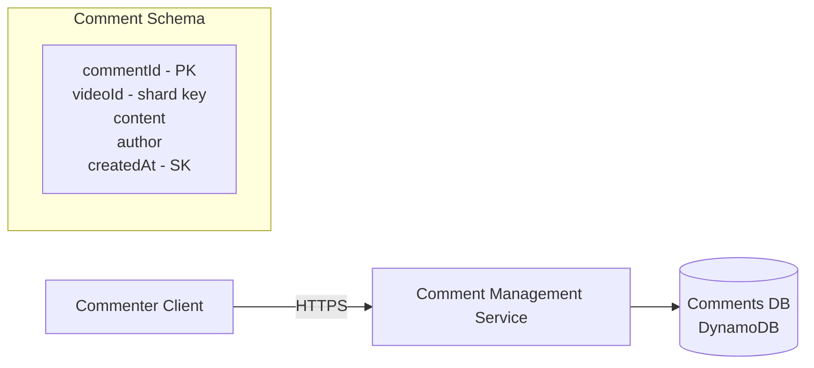
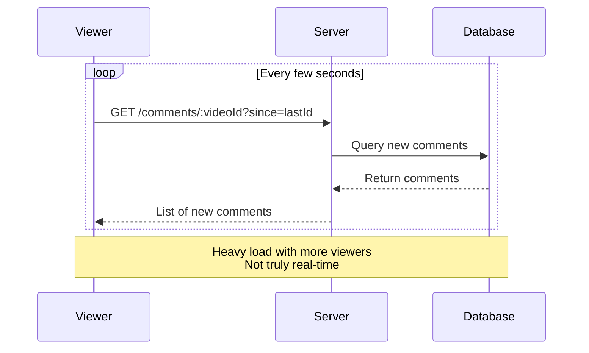
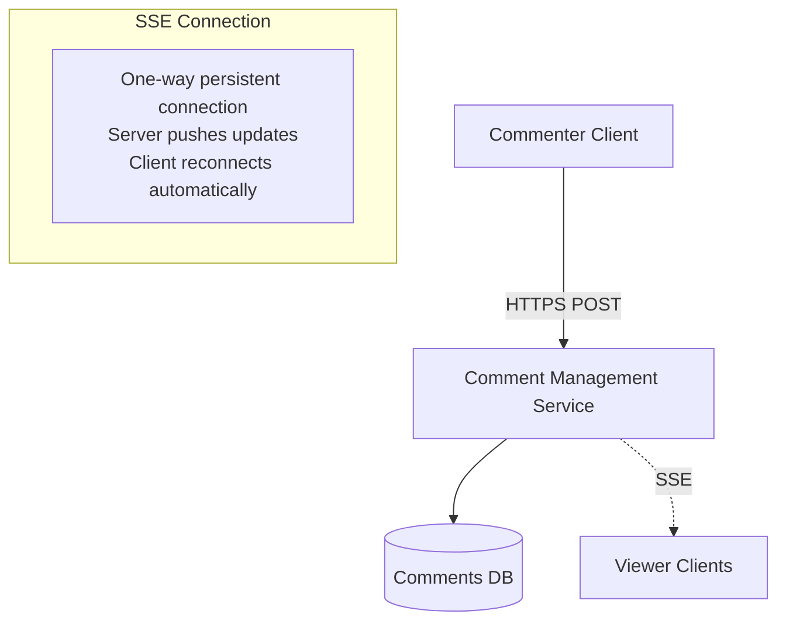
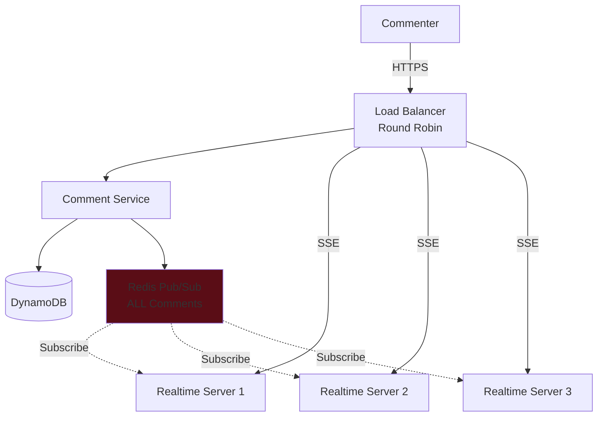
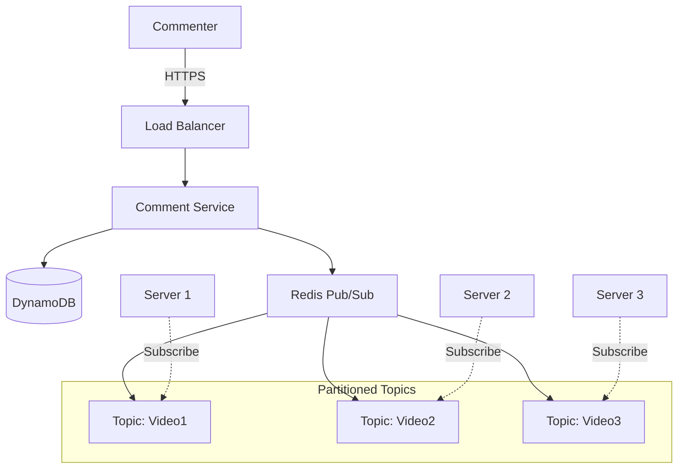
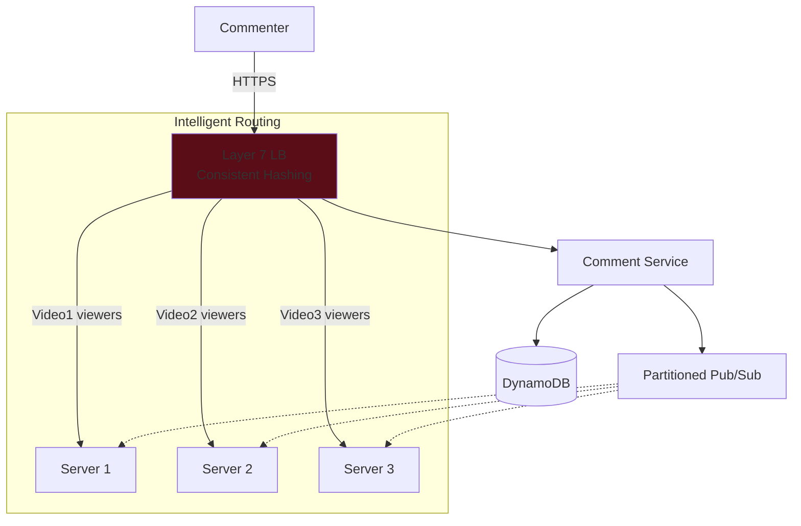
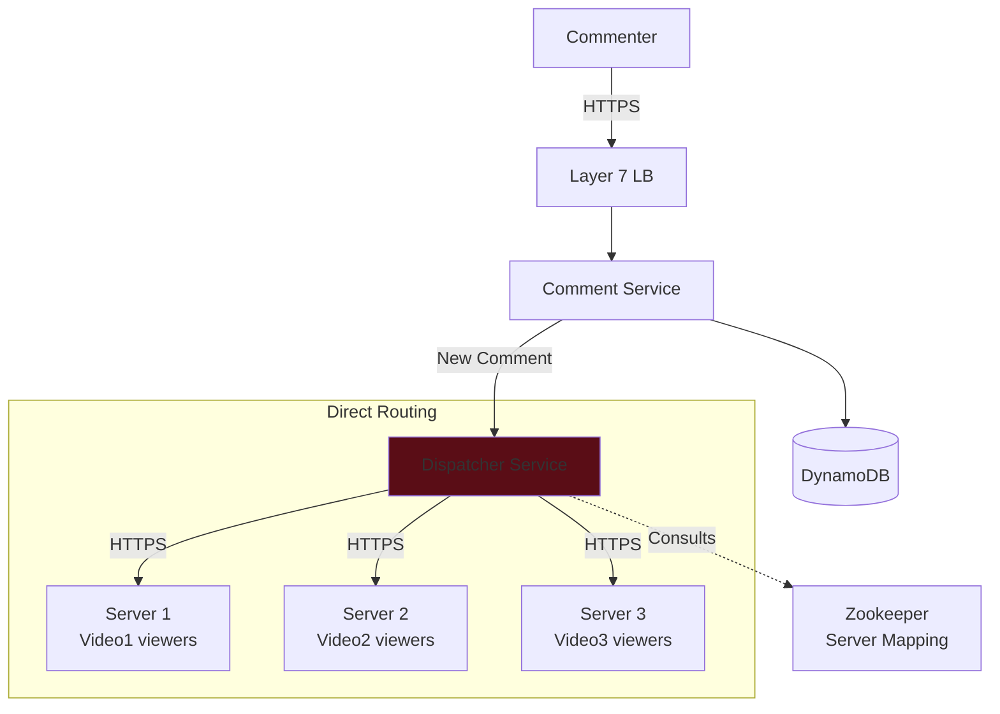

# Facebook Live Comments System Design Interview Guide

## 📋 Problem Overview

Facebook Live Comments enables viewers to post and see comments on live video feeds in near real-time.

## 🎯 Requirements

### Functional Requirements

1. **Post Comments**: Viewers can post comments on a live video feed
2. **Real-time Updates**: Viewers see new comments in near real-time while watching
3. **Historical Comments**: Viewers can see comments posted before they joined

#### Below the Line (Out of Scope)

- Reply to comments
- React to comments

### Non-Functional Requirements

1. **Scale**: Support millions of concurrent videos, thousands of comments/second per video
2. **Availability > Consistency**: Eventual consistency is acceptable
3. **Low Latency**: < 200ms end-to-end latency for comment broadcast

#### Below the Line

- Security & authentication
- Content moderation/integrity

## 🏗️ High-Level Architecture

### Core Entities

- **User**: Viewer or broadcaster
- **Live Video**: The broadcast (managed by another team)
- **Comment**: Message posted by a user

### API Design

```http
POST /comments/:liveVideoId
Header: JWT | SessionToken
{
  "message": "Cool video!"
}

GET /comments/:liveVideoId?cursor={last_comment_id}&pageSize=10&sort=desc
```

### Basic Architecture Flow



## 🔄 Evolution of Real-time Updates

### ❌ Bad Solution: Polling



**Problems**:

- Doesn't scale (database overload)
- High latency (polling interval)
- Wasteful (most polls return nothing)

### ✅ Good Solution: Server-Sent Events (SSE)



**Why SSE over WebSockets?**

- Read-heavy workload (most viewers don't comment)
- One-way communication is sufficient
- Lower overhead than WebSockets
- Auto-reconnection with Last-Event-ID header

## 📈 Scaling Strategies

### Challenge: Horizontal Scaling

When adding multiple servers, viewers of the same video may connect to different servers.

### Evolution of Solutions

#### 1️⃣ Bad: Simple Pub/Sub with Round-Robin LB



**Problem**: Every server processes EVERY comment (inefficient at scale)

#### 2️⃣ Better: Partitioned Pub/Sub



**Improvement**: Servers only subscribe to relevant topics
**Problem**: Round-robin LB may still scatter viewers across servers

#### 3️⃣ Great: Layer 7 LB with Consistent Hashing



**Benefits**:

- Viewers of same video routed to same server
- Fewer topic subscriptions per server
- Better resource utilization

#### 4️⃣ Alternative: Dispatcher Service



**Benefits**:

- No pub/sub overhead
- Direct targeted delivery
- Dynamic server registration

## 🎨 Pagination Strategy

### ❌ Offset Pagination

```sql
SELECT * FROM comments
WHERE videoId = ?
LIMIT 10 OFFSET 20
```

**Problems**:

- Inefficient for large datasets
- Unstable (new comments shift results)

### ✅ Cursor Pagination

```sql
SELECT * FROM comments
WHERE videoId = ? AND commentId < lastCommentId
ORDER BY commentId DESC
LIMIT 10
```

**Benefits**:

- Efficient with indexes
- Stable pagination
- Works well with DynamoDB's LastEvaluatedKey

## 💡 Key Design Decisions

### Database Choice: DynamoDB

- **Partition Key**: videoId (for sharding)
- **Sort Key**: createdAt (for time-based queries)
- Handles high write throughput
- Built-in pagination support

### Real-time Technology: SSE

- Perfect for read-heavy workload
- Lower overhead than WebSockets
- Browser auto-reconnection
- Works over standard HTTP

### Scaling Pattern: Pub/Sub with Co-location

- Partition by videoId
- Route viewers to same server
- Minimize cross-server communication

## 📊 Performance Targets

| Metric             | Target    | Strategy                         |
| ------------------ | --------- | -------------------------------- |
| Latency            | < 200ms   | SSE push model                   |
| Concurrent Viewers | Millions  | Horizontal scaling               |
| Comments/sec       | Thousands | DynamoDB sharding                |
| Availability       | 99.9%     | Multiple servers, auto-reconnect |

## 🎯 Interview Level Expectations

### Mid-Level (L4)

- Identify polling limitations
- Propose push-based solution (SSE/WebSocket)
- Basic pub/sub understanding
- Simple horizontal scaling

### Senior (L5)

- Quickly design initial architecture
- Understand pub/sub trade-offs
- Discuss scaling strategies
- Consider pagination approaches

### Staff+ (L6+)

- Deep dive into scaling challenges
- Multiple solution alternatives
- Technology-specific trade-offs
- Production-ready considerations

## 🔧 Additional Considerations

### Connection Management

```javascript
// Server-side connection tracking
const viewerConnections = {
  liveVideoId1: [sseConnection1, sseConnection2],
  liveVideoId2: [sseConnection3, sseConnection4],
};
```

### Channel Partitioning

```javascript
// Determine pub/sub channel
const channel = `video:${hash(liveVideoId) % NUM_CHANNELS}`;
```

### Reconnection Handling

```javascript
// Client-side SSE reconnection
const eventSource = new EventSource("/comments/stream");
eventSource.addEventListener("error", () => {
  // Browser auto-reconnects with Last-Event-ID
});
```

## 🚀 Production Enhancements

1. **Rate Limiting**: Prevent comment spam
2. **Caching**: Cache recent comments in Redis
3. **CDN**: Serve static assets globally
4. **Monitoring**: Track latency, connection count
5. **Graceful Degradation**: Fallback to polling if SSE fails
6. **Content Moderation**: ML-based filtering pipeline
7. **Analytics**: Track engagement metrics

## 📝 Common Interview Questions

1. **"Why not use WebSockets?"**

   - Read-heavy workload doesn't need bidirectional
   - SSE has lower overhead
   - Simpler implementation

2. **"How do you handle server failures?"**

   - SSE auto-reconnection
   - Last-Event-ID for resuming
   - Multiple server replicas

3. **"What about message ordering?"**

   - Use timestamps for ordering
   - DynamoDB sort key ensures consistency
   - Client-side deduplication

4. **"How to scale beyond single datacenter?"**
   - Regional deployments
   - Cross-region replication
   - Edge servers for SSE connections

## 🎓 Key Takeaways

1. **Start Simple**: Begin with basic architecture, iterate
2. **Consider Trade-offs**: Each solution has pros/cons
3. **Scale Incrementally**: Don't over-engineer initially
4. **Focus on Requirements**: Let NFRs guide decisions
5. **Real-world Experience**: Draw from production systems

## 📚 Technologies to Know

- **Streaming**: SSE, WebSockets, Long Polling
- **Pub/Sub**: Redis, Kafka, RabbitMQ
- **Databases**: DynamoDB, Cassandra, MongoDB
- **Load Balancing**: Layer 4 vs Layer 7, Consistent Hashing
- **Coordination**: Zookeeper, etcd, Consul
- **Caching**: Redis, Memcached, CDN strategies
