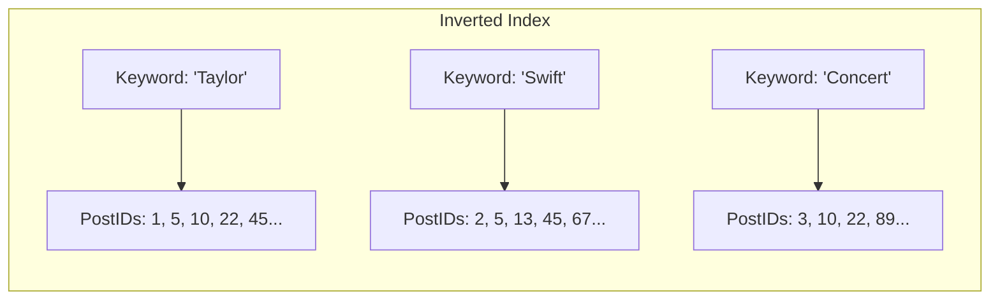
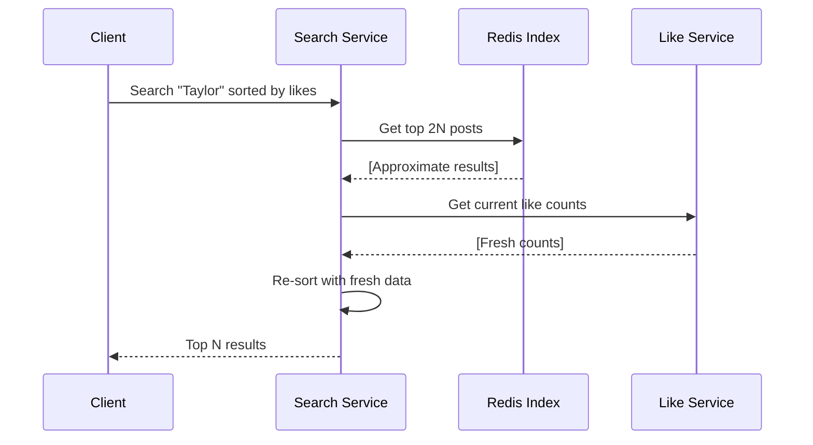

# Facebook Post Search System Design - Interview Guide

## 📋 Problem Overview

Design a search system for Facebook posts that allows users to search by keywords and sort results by recency or like count.

**Key Constraint**: Cannot use pre-built search engines (Elasticsearch) or full-text indexes (Postgres FTS).

## 🎯 Requirements

### Functional Requirements

1. Users can create and like posts
2. Users can search posts by keyword
3. Search results can be sorted by:
   - Recency (time)
   - Like count

### Non-Functional Requirements

1. **Fast queries**: < 500ms median response time
2. **High volume**: Handle 10k searches/second
3. **Fresh results**: New posts searchable within 1 minute
4. **High recall**: All posts discoverable (even old/unpopular)
5. **High availability**

### Out of Scope

- Fuzzy matching
- Personalization
- Advanced relevance ranking
- Privacy rules
- Real-time updates on search page

## 📊 Scale Estimations

### Key Numbers

- **Users**: 1B
- **Posts created**: 10k/second (1B posts/day)
- **Likes created**: 100k/second (10 likes per user/day)
- **Searches**: 10k/second
- **Total posts**: 3.6 trillion (10 years)
- **Storage**: 3.6 PB raw data

**Important Insight**: System is **write-heavy** (100k likes/sec vs 10k searches/sec)

## 🏗️ High-Level Architecture

```mermaid
graph TB
    subgraph "Write Path"
        PS[Post Service]
        LS[Like Service]
        LB[Load Balancer]
        EW[Event Writer]
        K[Kafka]
        LBatch[Like Batcher]
        IS[Ingestion Service]
    end

    subgraph "Read Path"
        Client[Client]
        CDN[CDN]
        AG[API Gateway]
        SS[Search Service]
        SC[Search Cache<br/>Redis]
    end

    subgraph "Storage"
        RI[Redis Index<br/>Hot Data]
        CS[Cold Storage<br/>S3/Blob]
    end

    PS --> LB
    LS --> LB
    LB --> EW
    EW --> K
    K --> LBatch
    LBatch --> IS
    IS --> RI
    IS --> CS

    Client --> CDN
    CDN --> AG
    AG --> SS
    SS --> SC
    SS --> RI
    SS --> CS

    style RI fill:#5A0D16
    style SC fill:#1E4C50
    style K fill:#5A0D16
```



## 🔑 Core Design Decisions

### 1. Inverted Index Structure

**Problem**: Cannot scan 3.6T posts for each search query.

**Solution**: Use inverted index mapping keywords to post IDs.



### 2. Multiple Indexes for Sorting

**Two separate indexes**:

1. **Creation Index**: Redis List (append-only, query from tail)
2. **Likes Index**: Redis Sorted Set (score-based ordering)

```python
# Creation Index (Redis List)
RPUSH "keyword:taylor:creation" post_id

# Likes Index (Redis Sorted Set)
ZADD "keyword:taylor:likes" like_count post_id
```

### 3. Write Optimization Strategies

#### Batch Processing for Likes

- Aggregate likes over 30-second windows
- Reduces write volume for viral posts

#### Logarithmic Updates

- Only update index at milestones (1, 2, 4, 8, 16... likes)
- Reduces writes exponentially
- Trade-off: Index becomes approximately correct

#### Two-Stage Architecture

1. **Stage 1**: Query approximate index (fast)
2. **Stage 2**: Re-rank top N\*2 results with fresh data



## 🚀 Optimization Techniques

### 1. Caching Strategy

**Multi-layer caching**:

1. **CDN (Edge Cache)**: Geographic distribution, 10ms latency
2. **Redis Search Cache**: Application-level, < 1 min TTL
3. **No personalization** = High cache hit rate

### 2. Multi-keyword Query Handling

#### Option A: Intersection + Filter

```python
# For query "Taylor Swift"
taylor_posts = get_posts("taylor")
swift_posts = get_posts("swift")
candidates = intersection(taylor_posts, swift_posts)
# Filter for actual phrase match
results = filter_phrase_match(candidates, "Taylor Swift")
```

#### Option B: Bigrams/Shingles

- Pre-index word pairs: "Taylor Swift", "Swift Concert"
- Larger index size but faster queries
- Trade-off: Storage vs. Speed

### 3. Storage Optimization

**Hot/Cold Data Separation**:

- **Hot (Redis)**: Frequently searched keywords, recent posts
- **Cold (S3/Blob)**: Rarely searched, old posts
- Migration based on access patterns

**Index Capping**:

- Limit each keyword index to 1k-10k items
- Reduces storage by orders of magnitude

## 🎓 Interview Tips by Level

### Mid-Level Focus

- Clear API design and data model
- Basic inverted index understanding
- Simple caching strategy
- Acknowledge bottlenecks

### Senior-Level Focus

- Multiple index optimization
- Write volume handling
- Cache layering strategy
- Trade-off analysis

### Staff+ Level Focus

- Two-stage architecture
- Logarithmic update strategies
- Cold/hot data separation
- Real-world experience examples

## 💡 Additional Considerations

### Data Consistency

- **Eventual consistency** acceptable (1 min delay)
- Like counts can be approximate in index
- Final results should be accurate

### Failure Handling

- Kafka for reliable event processing
- Redis replication for index durability
- Fallback to cold storage if Redis fails

### Monitoring & Metrics

- Query latency percentiles (p50, p95, p99)
- Cache hit rates at each layer
- Write throughput to indexes
- Storage growth rate

### Security Considerations

- Rate limiting at API Gateway
- Input sanitization for search queries
- DDoS protection at CDN level

## 🔄 System Evolution Path

1. **Phase 1**: Basic inverted index with single Redis
2. **Phase 2**: Add caching layers (CDN + Redis cache)
3. **Phase 3**: Implement batching for likes
4. **Phase 4**: Two-stage architecture with re-ranking
5. **Phase 5**: Hot/cold separation for storage optimization

## ❓ Common Interview Questions

1. **"How do you handle stop words?"**

   - Filter common words ("the", "and") during tokenization
   - Reduces index size significantly

2. **"What about search relevance?"**

   - Out of scope for basic design
   - Could add: TF-IDF scoring, user engagement signals

3. **"How to handle index updates?"**

   - Async processing via Kafka
   - Batch updates for efficiency
   - Eventually consistent model

4. **"What if Redis goes down?"**

   - Fallback to cold storage (slower)
   - Redis replication for HA
   - Circuit breaker pattern

5. **"How to scale internationally?"**
   - Geographic sharding
   - Regional CDN deployment
   - Cross-region replication

## 📝 Key Takeaways

1. **Inverted index** is fundamental for text search at scale
2. **Write optimization** crucial for high-volume systems
3. **Approximate correctness** acceptable for performance
4. **Caching** dramatically improves read performance
5. **Hot/cold separation** optimizes storage costs

## 🔗 Related Topics to Study

- Redis data structures (Lists, Sorted Sets, HyperLogLog)
- Consistent hashing for sharding
- Bloom filters for existence checks
- Count-min sketch for frequency estimation
- Vector databases for semantic search
- Apache Lucene internals

Here's a brief explanation of the Facebook Post Search system design:

## The Core Problem

You need to search through 3.6 trillion posts (3.6 PB of data) and return results in under 500ms without using Elasticsearch or built-in database full-text search.

## The Solution: Inverted Index

Instead of scanning all posts for each search, you build a reverse mapping:

- **Traditional**: Post → Contains words ["taylor", "swift", "concert"]
- **Inverted**: "taylor" → Points to posts [1, 5, 10, 22...]

This is stored in Redis (in-memory) for speed.

## Key Design Elements

**1. Two Indexes for Sorting**

- Creation time index (Redis List) - for recency
- Likes index (Redis Sorted Set) - for popularity

**2. Handle 100k likes/second**

- Don't update index on every like
- Only update at milestones (1, 2, 4, 8, 16... likes)
- Or batch updates every 30 seconds

**3. Two-Stage Architecture**

- Stage 1: Get approximate top results from index (fast)
- Stage 2: Fetch real-time like counts and re-rank (accurate)

**4. Caching Strategy**

- CDN at edge (10ms response)
- Redis cache for search results (<1 min TTL)
- Works well because no personalization needed

**5. Storage Optimization**

- Hot data (frequently searched) in Redis
- Cold data (rarely searched) in S3/blob storage
- Cap each keyword index at 10k items max

## The Critical Insight

This is a **write-heavy** system (100k likes/sec vs 10k searches/sec). Most of the complexity comes from optimizing writes, not reads. That's why batching and approximate indexing are crucial - you trade perfect accuracy for massive performance gains.

The interviewer wants to see if you recognize this pattern and can design around it rather than just throwing more servers at the problem.

# Facebook Post Search - Last Minute Revision Points

## 🎯 Core Problem Statement

- Design search for Facebook posts with keyword search + sorting (recency/likes)
- **Key constraint**: No Elasticsearch or full-text search allowed
- Target: <500ms response time, 10k searches/second

## 📊 Critical Numbers to Remember

- **1B users**, 10k posts/second, 100k likes/second, 10k searches/second
- **3.6 trillion total posts** (10 years of data)
- **Write-heavy system**: 100k likes vs 10k searches - this drives design decisions

## 🔑 Essential Design Components

### Inverted Index Structure

- Map keywords → post IDs (not posts → keywords)
- Example: "taylor" → [post_1, post_5, post_10...]
- Stored in Redis for sub-millisecond access

### Two Separate Indexes for Sorting

- **Creation Index**: Redis List (RPUSH for append-only)
- **Likes Index**: Redis Sorted Set (ZADD with like_count as score)

### Write Optimization (Most Important)

- **Logarithmic updates**: Only update at milestones (1, 2, 4, 8, 16... likes)
- **30-second batching**: Aggregate likes before index updates
- **Why**: Reduces 100k writes/sec to manageable levels

### Two-Stage Query Architecture

1. **Stage 1**: Get top 2N results from approximate index (fast)
2. **Stage 2**: Fetch real-time like counts, re-rank to top N (accurate)

## 🚀 Performance Optimizations

### Caching Strategy (3 Layers)

- **CDN**: Geographic edge caching (~10ms)
- **Redis Search Cache**: Application-level (<1 min TTL)
- **High hit rate**: No personalization = cacheable results

### Storage Optimization

- **Hot/Cold separation**: Frequent keywords in Redis, rare ones in S3
- **Index capping**: Limit each keyword to 10k posts max
- **Trade-off**: Storage efficiency vs completeness

### Multi-keyword Queries

- **Option A**: Intersection + phrase filtering
- **Option B**: Pre-index bigrams ("Taylor Swift" as single keyword)

## 🏗️ System Architecture Flow

### Write Path

```
Post/Like → Load Balancer → Event Writer → Kafka →
Like Batcher → Ingestion Service → Redis Index + Cold Storage
```

### Read Path

```
Client → CDN → API Gateway → Search Service →
Search Cache + Redis Index + Cold Storage
```

## ⚖️ Key Trade-offs to Discuss

### Consistency vs Performance

- **Eventual consistency**: 1-minute delay acceptable
- **Approximate index**: Like counts may be slightly stale
- **Final results**: Always fetch fresh data for accuracy

### Storage vs Speed

- **More indexes = faster queries, more storage**
- **Hot/cold separation = cost optimization**
- **Index capping = bounded storage growth**

### Write Optimization vs Accuracy

- **Logarithmic updates = 90% fewer writes, slightly stale data**
- **Batching = burst handling, some delay**

## 🎓 Level-Specific Focus Points

### Mid-Level

- Explain inverted index clearly
- Design basic API and data model
- Identify caching opportunities
- Acknowledge write bottleneck

### Senior-Level

- Multiple optimization strategies
- Detailed trade-off analysis
- Cache layering rationale
- Handle edge cases

### Staff+ Level

- Two-stage architecture reasoning
- Logarithmic update mathematics
- Hot/cold data migration strategy
- Real-world scaling examples

## 💡 Common Gotchas & Solutions

### "How handle viral posts?"

- **Problem**: Viral post gets 1M likes instantly
- **Solution**: Batching + logarithmic updates prevent index thrashing

### "What if Redis crashes?"

- **Fallback**: Query cold storage (slower but functional)
- **Prevention**: Redis replication + circuit breaker

### "How scale globally?"

- **Sharding**: Geographic or hash-based
- **CDN**: Regional deployment
- **Replication**: Cross-region for disaster recovery

## 🔥 Interview Power Moves

### Lead with the Insight

"This is write-heavy (100k likes vs 10k searches), so optimization focuses on write path, not read path."

### Show Depth

"We can use HyperLogLog for unique searchers per keyword, or Bloom filters to check post existence before expensive lookups."

### Demonstrate Experience

"In practice, you'd start with simple Redis index, then add batching when you hit write limits around 10k likes/second."

## 📝 Final Checklist

- [ ] Explained why inverted index is necessary
- [ ] Showed two different sorting approaches
- [ ] Addressed write volume bottleneck
- [ ] Designed multi-layer caching
- [ ] Discussed consistency trade-offs
- [ ] Mentioned monitoring and failure handling
- [ ] Scaled the solution (hot/cold, sharding)

## 🎯 One-Liner Summary

"Build inverted index in Redis with logarithmic like updates, two-stage querying for accuracy, and multi-layer caching - optimizing for write-heavy workload while maintaining sub-500ms reads."
