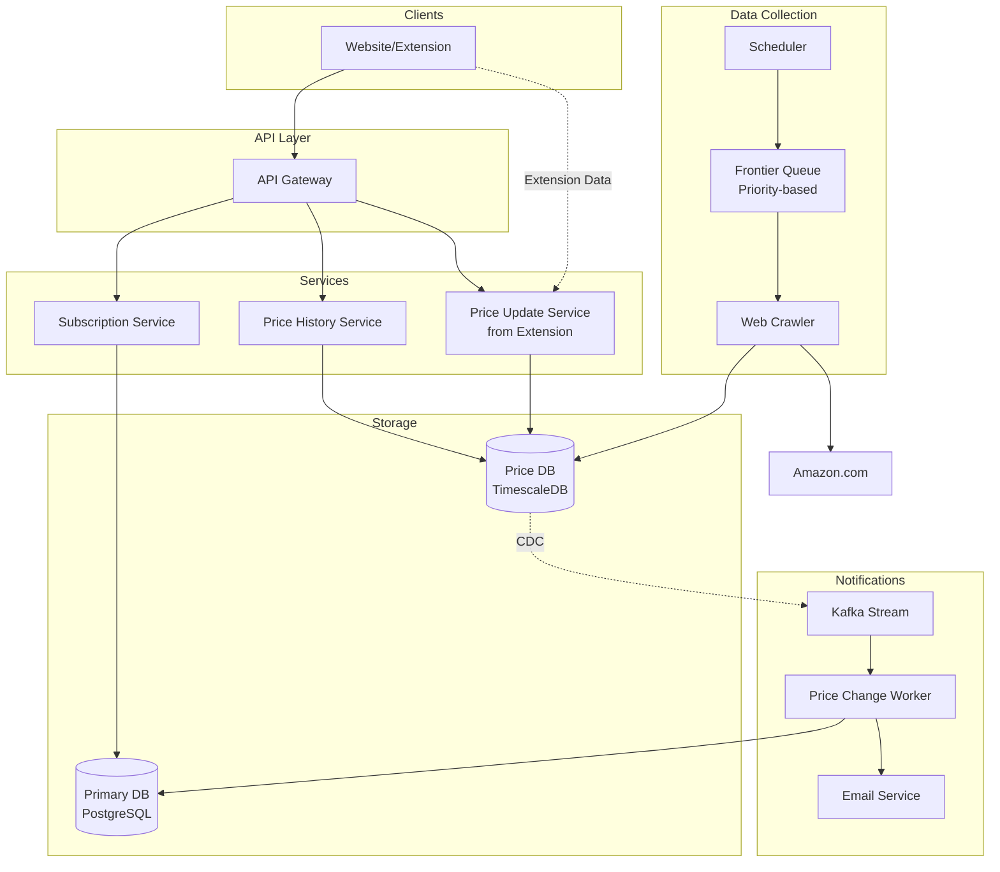
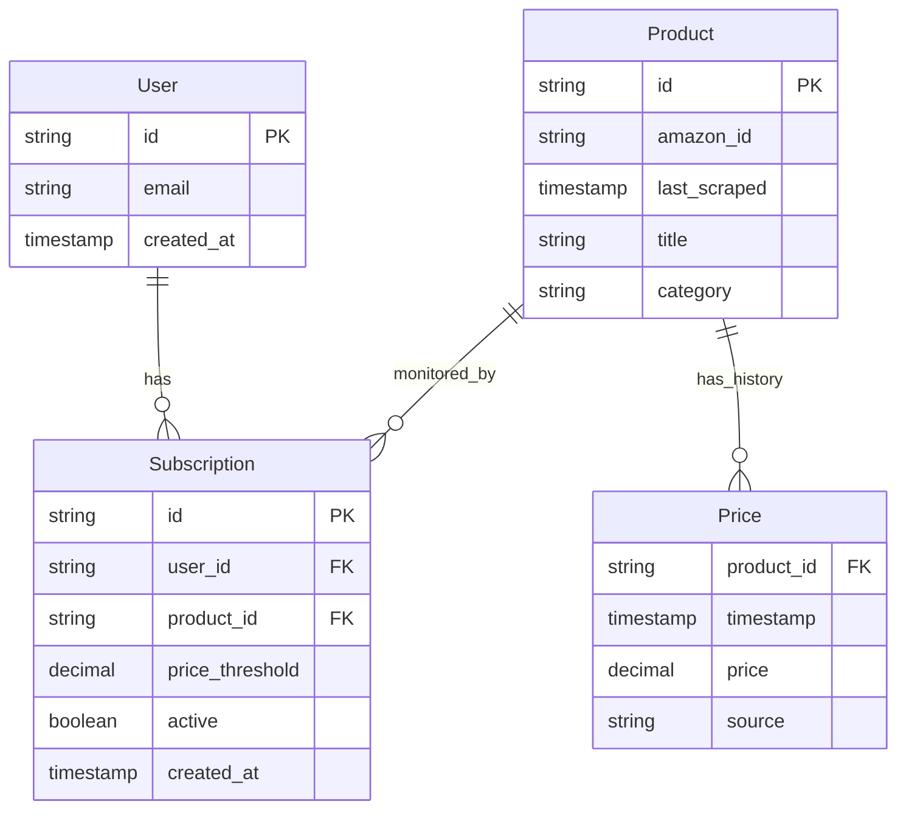
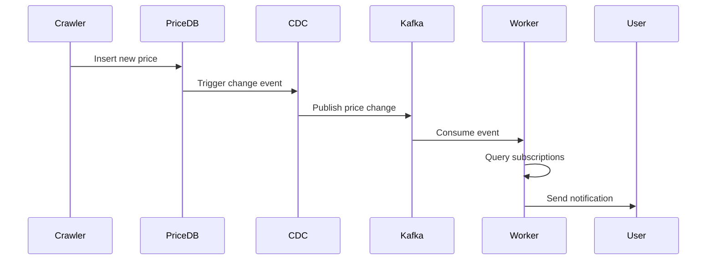

# Design a Price Tracking Service (CamelCamelCamel)

## 📊 Problem Overview

**CamelCamelCamel** is a price tracking service that:

- Monitors Amazon product prices over time
- Alerts users when prices drop below specified thresholds
- Has a Chrome extension with 1M+ active users
- Displays price history directly on Amazon product pages

## 🎯 Requirements

### Functional Requirements

1. **View price history** for Amazon products (via website or Chrome extension)
2. **Subscribe to price drop notifications** with custom thresholds

### Non-Functional Requirements

1. **Availability > Consistency** (eventual consistency acceptable)
2. Scale to **500 million Amazon products**
3. Price history queries with **< 500ms latency**
4. Price drop notifications within **1 hour** of price change

## 🏗️ High-Level Architecture



## 💾 Data Model

### Core Entities



## 🔑 Key Design Decisions

### 1. Data Collection Strategy Evolution

#### ❌ Bad: Naive Web Crawling

- Deploy traditional crawlers to systematically browse Amazon
- **Problem**: 500M products @ 1 req/sec = 15+ years for single pass
- Even with 1000 servers: 5+ days per full refresh

#### ✅ Good: Priority-Based Crawling

- Implement Pareto principle (80/20 rule)
- Prioritize based on:
  - Active subscriptions
  - Search frequency
  - Recent price volatility
- Different refresh rates by tier:
  - High priority: Every 2-4 hours
  - Medium: Daily
  - Low: Weekly or less

#### 🚀 Great: Chrome Extension + Selective Crawling

- **Leverage 1M+ extension users as distributed collectors**
- Users browsing = automatic price updates
- Benefits:
  - Zero crawling cost for popular items
  - Real-time updates for trending products
  - Natural prioritization based on user interest
- Traditional crawlers only handle gaps

### 2. Data Validation

#### Problem: Malicious/Incorrect Extension Data

Users could report false prices (e.g., iPhone for $0.01)

#### Solutions:

**Good: Consensus Validation**

- Wait for N users to report same price
- Configurable thresholds (3 for popular, 2 for niche)
- Reputation scoring over time

**Great: Trust-But-Verify**

- Accept extension data immediately
- Flag suspicious changes:
  - Large price drops (>50%)
  - Untrusted users
  - High-subscription products
- Priority crawl verification within 1-5 minutes
- Send corrections if needed

### 3. Notification System

#### ❌ Bad: Polling with Cron

```python
# Every 2 hours - inefficient!
for price_change in last_2_hours:
    subscriptions = find_subscriptions(price_change)
    send_notifications(subscriptions)
```

#### ✅ Great: Event-Driven with CDC



### 4. Price History Performance

#### Good: Pre-aggregation with Batch Jobs

- Nightly jobs compute daily/weekly/monthly summaries
- Store in `price_aggregations` table
- Trade-off: 24hr staleness for performance

#### Great: TimescaleDB

- Real-time aggregations without pre-computation
- Native time-series optimizations
- Example query:

```sql
SELECT
    time_bucket('1 day', timestamp) as day,
    avg(price) as avg_price,
    min(price) as min_price,
    max(price) as max_price
FROM prices
WHERE product_id = ?
    AND timestamp > NOW() - INTERVAL '6 months'
GROUP BY day
ORDER BY day;
```

## 📈 Scaling Considerations

### Storage Estimates

- 500M products × 365 days × 2 updates/day = 365B price records/year
- Each record: ~50 bytes
- Annual storage: ~18TB for price data alone

### Request Estimates

- 1M extension users × 10 page views/day = 10M price updates/day
- Price history queries: ~100M/day (assuming 10% active users)
- Notification checks: 500M products × varying frequencies

### Optimization Strategies

1. **Data Partitioning**: Partition price table by date
2. **Caching**: CDN for popular price charts
3. **Compression**: TimescaleDB automatic compression for old data
4. **Rate Limiting**: Per-user API limits
5. **Batch Processing**: Group notifications to same user

## 🎯 API Design

```typescript
// Get price history
GET /products/{product_id}/price
Query params:
  - period: 30d, 90d, 1y, all
  - granularity: hourly, daily, weekly
Response: PriceHistory[]

// Create subscription
POST /subscriptions
Body: {
  product_id: string,
  price_threshold: number,
  notification_type: 'email' | 'push'
}

// Update subscription
PUT /subscriptions/{id}

// Delete subscription
DELETE /subscriptions/{id}
```

## 🚨 Critical Interview Points

### Must Discuss

1. **Amazon's constraints**: No API, rate limiting, anti-scraping
2. **Scale challenge**: 500M products impossible to crawl naively
3. **Chrome extension as data source**: Key insight for solving scale
4. **Data validation**: Can't trust all user-submitted data
5. **Event-driven vs polling**: Why polling fails at scale

### Deep Dive Topics (Pick 2-3)

1. How to discover and track 500M products efficiently
2. Handling malicious price updates from extensions
3. Real-time notification processing
4. Fast price history queries for charts
5. Handling Amazon page structure changes
6. Privacy considerations for extension users

### Trade-offs to Mention

- **Accuracy vs Speed**: Trust-but-verify allows fast notifications with occasional corrections
- **Coverage vs Resources**: Prioritization means some products get stale
- **Consistency vs Availability**: Eventually consistent is fine for price tracking
- **Storage vs Computation**: Pre-aggregation vs real-time aggregation

## 💡 Additional Considerations

### Security & Privacy

- Extension user anonymization
- Rate limiting per IP/user
- DDoS protection for API
- GDPR compliance for EU users

### Monitoring & Alerting

- Track crawler success rates
- Monitor notification delivery rates
- Alert on sudden price validation failures
- Dashboard for extension adoption

### Business Logic

- Handling different Amazon domains (.com, .co.uk, etc.)
- Multi-currency support
- Price history for out-of-stock items
- Dealing with Amazon Prime vs regular prices

### Evolution Path

1. **MVP**: Basic crawler + simple notifications
2. **V2**: Add Chrome extension data collection
3. **V3**: Implement smart prioritization
4. **V4**: Add trust-but-verify validation
5. **Future**: ML for price prediction, competitor tracking

## 📚 Expected Knowledge by Level

### Mid-Level

- Working high-level design with basic crawler
- Database schema design
- Understanding scale limitations
- Simple notification system

### Senior

- Chrome extension as data source insight
- Event-driven architecture understanding
- Trade-offs between crawling strategies
- Multiple deep dives with solid reasoning

### Staff+

- Proactive recognition of extension's dual purpose
- System evolution planning
- Business impact of technical choices
- Addressing unasked concerns (anti-scraping, privacy)
- Long-term maintainability focus

## 🔧 Technology Choices

### Recommended Stack

- **API**: Node.js/Python with rate limiting
- **Databases**:
  - PostgreSQL for operational data
  - TimescaleDB for time-series price data
- **Message Queue**: Kafka for price change events
- **Cache**: Redis for hot price data
- **CDN**: CloudFront for static charts
- **Monitoring**: Prometheus + Grafana

### Alternative Choices

- **ClickHouse** instead of TimescaleDB (better analytics, more complex)
- **RabbitMQ/SQS** instead of Kafka (simpler, less throughput)
- **DynamoDB** for subscription data (better scale, vendor lock-in)
- **Elasticsearch** for product search functionality

## ✅ Final Checklist

Before ending the interview, ensure you've covered:

- [ ] How to collect data from 500M products
- [ ] Extension users as data collectors
- [ ] Data validation strategy
- [ ] Event-driven notifications
- [ ] Database choices and why
- [ ] API design for core functions
- [ ] Scale calculations
- [ ] At least 2 deep technical dives
- [ ] Trade-offs and alternatives
- [ ] Evolution and future improvements

# CamelCamelCamel - Last Minute Revision

## 🔥 Key Insights (Must Mention)

• **Scale Problem**: 500M products × 1 req/sec = 15+ years for one pass
• **Solution**: Chrome extension (1M+ users) as distributed data collectors
• **Trade-off**: Trust-but-verify for speed vs accuracy
• **Architecture**: Event-driven notifications via CDC + Kafka

## 📊 Core Requirements

• Track Amazon prices for 500M products
• Price history queries < 500ms
• Notifications within 1 hour
• Availability > Consistency (eventual consistency OK)

## 🏗️ Architecture Components

• **API Gateway** → Price History + Subscription + Update services
• **TimescaleDB** for time-series price data
• **PostgreSQL** for users/subscriptions
• **Kafka** for price change events
• **Priority-based crawler** for gaps

## 💡 Critical Design Decisions

### Data Collection Evolution

❌ **Naive crawling**: Too slow (15+ years)
✅ **Priority-based**: 80/20 rule, different refresh rates
🚀 **Extension + crawling**: Users provide real-time data, crawlers fill gaps

### Data Validation

• **Problem**: Malicious users (iPhone for $0.01)
• **Solution**: Trust-but-verify

- Accept immediately, flag suspicious changes
- Priority crawl verification in 1-5 minutes
- Reputation scoring over time

### Notifications

❌ **Polling cron**: Inefficient, doesn't scale
✅ **Event-driven**: CDC → Kafka → Workers → Email

## 🗄️ Data Model Essentials

```
Product (id, amazon_id, title, last_scraped)
User (id, email, created_at)
Subscription (id, user_id, product_id, price_threshold, active)
Price (product_id, timestamp, price, source)
```

## 📈 Scale Numbers

• **Storage**: 365B records/year, ~18TB annually
• **Requests**: 10M updates/day, 100M queries/day
• **Partitioning**: By date for price table
• **Caching**: CDN for popular charts

## 🚨 Interview Must-Haves

### Technical Deep Dives (Pick 2-3)

1. **Discovery**: How to find 500M products efficiently
2. **Validation**: Handling malicious extension data
3. **Real-time**: CDC + Kafka notification pipeline
4. **Performance**: TimescaleDB for sub-500ms queries
5. **Anti-scraping**: Dealing with Amazon's defenses

### Trade-offs to Discuss

• **Accuracy vs Speed**: Immediate notifications with corrections
• **Coverage vs Resources**: Priority-based vs complete coverage
• **Storage vs Compute**: Pre-aggregation vs real-time queries
• **Consistency vs Availability**: Eventually consistent is fine

## 🔧 Tech Stack

• **API**: Node.js/Python with rate limiting
• **Time-series**: TimescaleDB (real-time aggregations)
• **Operational**: PostgreSQL
• **Events**: Kafka
• **Cache**: Redis + CDN
• **Alternative**: ClickHouse, RabbitMQ, DynamoDB

## 🎯 Sample API

```
GET /products/{id}/price?period=90d&granularity=daily
POST /subscriptions {product_id, price_threshold, notification_type}
PUT /subscriptions/{id}
DELETE /subscriptions/{id}
```

## 📊 TimescaleDB Query Example

```sql
SELECT time_bucket('1 day', timestamp) as day,
       avg(price), min(price), max(price)
FROM prices
WHERE product_id = ? AND timestamp > NOW() - INTERVAL '6 months'
GROUP BY day ORDER BY day;
```

## 🚀 Evolution Path

1. **MVP**: Basic crawler + notifications
2. **V2**: Chrome extension integration
3. **V3**: Smart prioritization
4. **V4**: Trust-but-verify validation
5. **Future**: ML price prediction

## ⚠️ Don't Forget

• Amazon has NO API, aggressive anti-scraping
• Extension users need anonymization/privacy
• Multiple currencies and domains
• Monitor crawler success rates
• Rate limiting and DDoS protection
• GDPR compliance for EU users

## 🎯 Level-Specific Expectations

• **Mid**: Basic design + database schema
• **Senior**: Extension insight + event-driven + deep dives
• **Staff+**: Business impact + evolution + unasked concerns

## 💥 Gotchas

• Don't suggest real-time crawling of 500M products
• Don't use polling for notifications at scale
• Remember to validate extension data
• Mention Amazon's anti-scraping measures
• Consider Chrome extension as solution, not just requirement
