# Instagram System Design Interview Guide

## 📸 Overview

Instagram is a photo/video sharing social media platform. This is one of the most common system design interview questions at FAANG companies.

## 📋 Requirements

### Functional Requirements (Core)

1. **Create posts** with photos/videos and captions
2. **Follow/unfollow** other users
3. **View chronological feed** of posts from followed users

### Functional Requirements (Out of Scope)

- Like/comment on posts
- Search for users/hashtags
- Stories (ephemeral content)
- Live streaming

### Non-Functional Requirements

1. **Highly available** - Availability >> Consistency (eventual consistency OK, up to 2 min)
2. **Low latency feed loading** - < 500ms end-to-end
3. **Low latency media rendering** - < 200ms
4. **Scalable** - Support 500M DAU, 100M posts/day

## 🗂️ Core Entities


## 🔌 API Design

```http
# Create Post
POST /posts
{
  "media": {photo/video bytes},
  "caption": "My cool photo!"
}
Response: { "postId": "123", "presignedUrl": "..." }

# Follow User
POST /follows
{
  "followedId": "user123"
}

# Get Feed
GET /feed?cursor={cursor}&limit={page_size}
Response: { "posts": [...], "next_cursor": "..." }
```

## 🏗️ High-Level Architecture


## 🚀 Deep Dive: Feed Generation

### ❌ Bad: Fan-out on Read

- **Approach**: Generate feed when requested by querying all followed users' posts
- **Problem**: O(N) queries where N = number of followed users
- **Issues**:
  - High latency (can't meet 500ms requirement)
  - Read amplification (expensive at scale)
  - Unpredictable performance

### ✅ Good: Fan-out on Write (Precomputed Feeds)

- **Approach**: When user posts, update all followers' feeds immediately
- **Implementation**:
  ```
  1. User creates post → Store in DB
  2. Post ID → Message Queue
  3. Feed Fanout Service queries followers
  4. For each follower: prepend post to their Redis feed
  ```
- **Problem**: Celebrity problem - millions of writes for celebrity posts

### ⭐ Best: Hybrid Approach

- **Strategy**: Combine both approaches based on follower count
- **Implementation**:
  ```
  IF user.followers < 100,000:
    Use fan-out on write (precompute)
  ELSE (celebrities):
    Use fan-out on read (real-time merge)
  ```



```mermaid
flowchart LR
    Post[New Post Created]
    Check{Follower<br/>Count?}

    Precompute[Precompute Feeds<br/>for all followers]
    Store[Store in Posts DB<br/>only]

    Request[Feed Request]
    Fetch1[Fetch precomputed<br/>feed from Redis]
    Fetch2[Query celebrity<br/>posts from DB]
    Merge[Merge & Sort<br/>chronologically]

    Post --> Check
    Check -->| < 100K | Precompute
    Check -->| ≥ 100K | Store

    Request --> Fetch1
    Request --> Fetch2
    Fetch1 --> Merge
    Fetch2 --> Merge

```

### Redis Data Model

```
Key: feed:{user_id}
Type: Sorted Set (ZSET)
Members: postId
Scores: timestamp
```

## 📦 Deep Dive: Media Upload & Delivery

### Upload Strategy (Large Files)

1. **Multipart Upload** for videos up to 4GB
2. **Presigned URLs** for direct S3 upload
3. **Async processing** via S3 notifications


### Media Delivery Optimization

#### ❌ Bad: Direct S3 Serving

- High latency for global users
- No caching
- Same file size for all devices

#### ✅ Good: CDN Distribution

- Global edge locations
- Automatic caching
- Reduced origin load

#### ⭐ Best: CDN + Dynamic Optimization

- **Multiple variants**: Different resolutions/formats
- **Device-aware serving**: Mobile vs desktop
- **Adaptive streaming** for videos
- **WebP/modern formats** when supported

## 🗄️ Database Design

### DynamoDB Schema

**Posts Table**

- PK: `userId`
- SK: `createdAt#postId`
- Attributes: caption, mediaS3Link, uploadStatus

**Followers Table**

- PK: `followerId`
- SK: `followedId`
- GSI: `followedId` (PK), `followerId` (SK)

### Indexing Strategy

- Partition by user for posts (most queries are user-specific)
- Dual indexing for followers (bidirectional lookups)
- Composite sort keys for chronological ordering

## 📊 Scale Calculations

### Storage

- **Media**: 100M posts × 2MB = 200TB/day → 750PB over 10 years
- **Metadata**: 100M posts × 1KB = 100GB/day
- **Strategy**: Hot/Cold tiering (S3 → Glacier for old media)

### Throughput

- **Feed requests**: 500M DAU × 20 refreshes = 10B/day = ~115K QPS
- **Post creation**: 100M/day = ~1.2K QPS
- **Peak handling**: 3-5x average = ~350K QPS for feeds

## 🎯 Key Design Patterns

### 1. **Scaling Reads Pattern**

- Extreme read-to-write ratio (100:1)
- Solution: Precomputation + caching + CDN

### 2. **Managing Long Running Tasks**

- Feed fanout for millions of followers
- Solution: Async processing with message queues

### 3. **Handling Large Blobs**

- Videos up to 4GB
- Solution: Presigned URLs + multipart upload + CDN

## 💡 Additional Considerations

### Monitoring & Observability

- Track P50/P95/P99 latencies for feed generation
- Monitor cache hit rates
- Alert on celebrity post fanout delays
- CDN cache effectiveness metrics

### Data Consistency

- **Feed consistency**: Eventual consistency acceptable (2 min window)
- **Post metadata**: Strong consistency required
- **Follow relationships**: Strong consistency for user experience

### Failure Handling

- **Redis failure**: Fallback to DB queries with graceful degradation
- **S3 upload failure**: Client retry with exponential backoff
- **Feed fanout failure**: Dead letter queue for retry
- **CDN failure**: Fallback to direct S3 (with alerts)

### Security & Privacy

- **Authentication**: JWT tokens at API Gateway
- **Authorization**: Check follow relationships for private accounts
- **Media access**: Signed URLs with expiration
- **Rate limiting**: Per-user limits at API Gateway

### Cost Optimization

- **Storage tiering**: S3 → S3 IA → Glacier based on access patterns
- **CDN optimization**: Aggressive caching for popular content
- **Database optimization**: Archive old metadata to S3
- **Compute**: Auto-scaling based on traffic patterns

## 📈 Evolution Path

### Phase 1: MVP (1M users)

- Monolithic architecture
- Single DB (PostgreSQL)
- Direct S3 serving

### Phase 2: Growth (10M users)

- Microservices split
- Read replicas
- Basic CDN

### Phase 3: Scale (100M users)

- Sharded databases
- Redis caching
- Precomputed feeds

### Phase 4: Massive Scale (500M+ users)

- Hybrid feed generation
- Global CDN with optimization
- Multi-region deployment

## 🎓 Interview Performance Expectations

### Mid-Level

- Working high-level design
- Basic fan-out approach
- Understand CDN necessity
- Simple database schema

### Senior

- Hybrid feed generation approach
- Media upload optimization
- Database indexing strategies
- Technology choice justification

### Staff+

- Identify true bottlenecks (feed generation, media delivery)
- System evolution strategy
- Operational concerns & failure modes
- Cost-performance tradeoffs

## 🔑 Key Takeaways

1. **Feed generation is the core challenge** - Hybrid approach balances read/write complexity
2. **Media delivery at scale requires CDN** - Direct S3 serving won't work globally
3. **Celebrity problem is real** - Must handle users with millions of followers differently
4. **Storage is hierarchical** - Hot data in Redis/Memory, warm in DB, cold in S3/Glacier
5. **Async processing is essential** - Can't do feed fanout synchronously
6. **Monitoring is critical** - Need visibility into latencies, cache rates, and failures

## 📚 Related Problems

- Facebook News Feed (similar feed generation)
- YouTube (video streaming focus)
- Dropbox (file upload/storage patterns)
- Twitter (real-time feed updates)

# Instagram System Design - Last Minute Revision 🚀

## 🎯 Core Requirements (30 seconds)

- **Functional**: Create posts, follow users, view chronological feed
- **Scale**: 500M DAU, 100M posts/day
- **Performance**: Feed < 500ms, Media < 200ms
- **Trade-off**: Availability > Consistency (eventual consistency OK)

## 🏗️ High-Level Components (1 minute)

- **API Gateway** → Routing, auth, rate limiting
- **Services**: Post Service, Follow Service, Feed Fanout Service
- **Storage**: DynamoDB (metadata), S3 (media), Redis (feed cache)
- **CDN**: CloudFront for global media delivery
- **Queue**: SQS/Kafka for async feed generation

## 🔥 Critical Design Decision: Feed Generation

### ❌ Fan-out on Read

- Generate feed when requested
- Problem: O(N) queries, high latency

### ✅ Fan-out on Write

- Precompute feeds when posts created
- Problem: Celebrity problem (millions of writes)

### ⭐ **BEST: Hybrid Approach**

- **< 100K followers**: Fan-out on write (precompute)
- **≥ 100K followers**: Fan-out on read (merge at request time)
- **Why**: Balances write amplification vs read latency

## 📱 Media Upload Flow (45 seconds)

1. Client requests upload → API returns presigned S3 URL
2. Client uploads directly to S3 (multipart for large files)
3. S3 triggers async processing (thumbnails, formats)
4. CDN serves optimized variants globally

## 🗄️ Database Schema Quick Reference

```
Posts Table (DynamoDB):
- PK: userId, SK: createdAt#postId

Followers Table:
- PK: followerId, SK: followedId
- GSI: followedId (PK) for reverse lookup

Feed Cache (Redis):
- Key: feed:{userId}
- Type: Sorted Set (ZSET)
- Score: timestamp
```

## 📊 Scale Numbers to Remember

- **Storage**: 200TB/day media, 100GB/day metadata
- **QPS**: 115K average feed requests, 1.2K posts
- **Peak**: 3-5x average = ~350K QPS
- **Read:Write ratio**: 100:1

## 🎪 Handle Celebrity Problem

- **Detection**: Follower count threshold (100K)
- **Strategy**: Don't precompute for celebrities
- **At request**: Merge precomputed + celebrity posts
- **Optimization**: Cache celebrity posts separately

## 🌍 Global Performance

- **CDN**: CloudFront with edge locations
- **Multi-format**: WebP, different resolutions
- **Caching**: Aggressive for popular content
- **Fallback**: S3 if CDN fails

## 🚨 Failure Modes & Solutions

- **Redis down**: Fallback to database queries
- **S3 upload fails**: Client retry with exponential backoff
- **Feed fanout fails**: Dead letter queue for retry
- **Celebrity post**: Async processing, don't block user

## 💰 Cost Optimization

- **Storage tiering**: S3 → S3 IA → Glacier
- **CDN**: Cache popular content longer
- **Database**: Archive old posts to S3
- **Compute**: Auto-scaling based on traffic

## 🎓 Interview Performance Levels

### **Mid-Level**:

- Basic fan-out approach, understand CDN need

### **Senior**:

- Hybrid feed generation, media optimization, database indexing

### **Staff+**:

- Identify bottlenecks, evolution strategy, operational concerns

## 🔑 Money Quotes for Interview

1. **"Feed generation is the core scalability challenge"**
2. **"Hybrid approach balances write amplification vs read latency"**
3. **"Celebrity problem requires different strategy than regular users"**
4. **"Media delivery needs CDN - direct S3 won't work globally"**
5. **"Async processing essential - can't do fanout synchronously"**

## ⚡ Technology Choices Justification

- **DynamoDB**: Predictable performance, handles partition hot spots
- **Redis**: Sub-millisecond feed retrieval, sorted sets for chronological order
- **S3**: Virtually unlimited storage, integrates with CDN
- **SQS/Kafka**: Decouples feed generation, handles traffic spikes
- **CloudFront**: Global CDN, automatic format optimization

## 🎯 Common Follow-up Questions

- **"How do you handle trending posts?"** → Separate trending algorithm, cache results
- **"What about real-time updates?"** → WebSocket connections, push notifications
- **"How to prevent spam?"** → Rate limiting, ML-based detection
- **"Multi-region deployment?"** → Master-slave setup, regional caching
- **"Handle 10x traffic?"** → Horizontal scaling, more cache layers

## ⏰ 30-Second Elevator Pitch

_"Instagram needs to handle massive read traffic with low latency. Core challenge is feed generation - we use hybrid approach: precompute feeds for normal users, real-time merge for celebrities. Media goes through CDN for global performance. DynamoDB for metadata, Redis for feed cache, S3 for storage. Async processing handles traffic spikes."_
