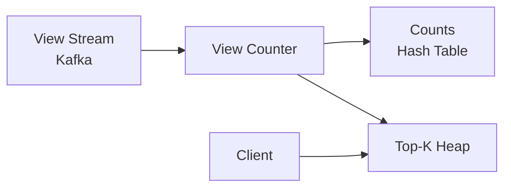
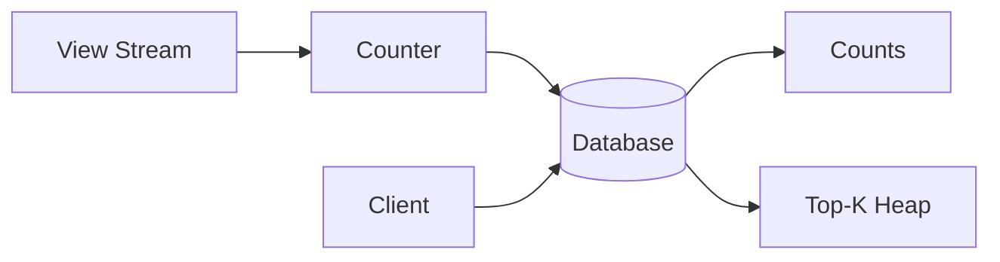
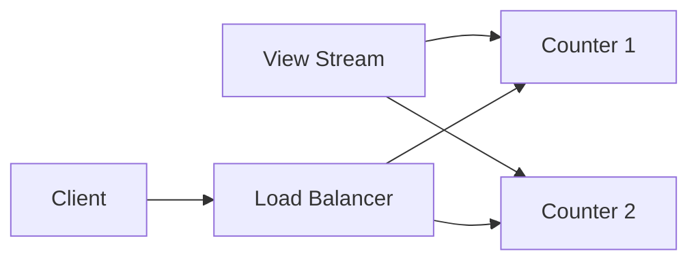
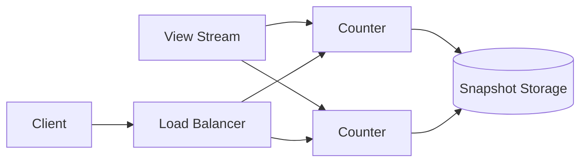
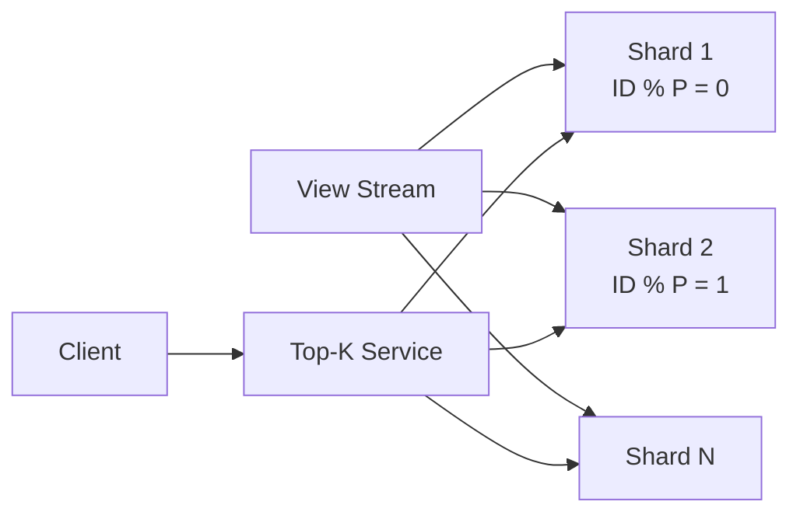
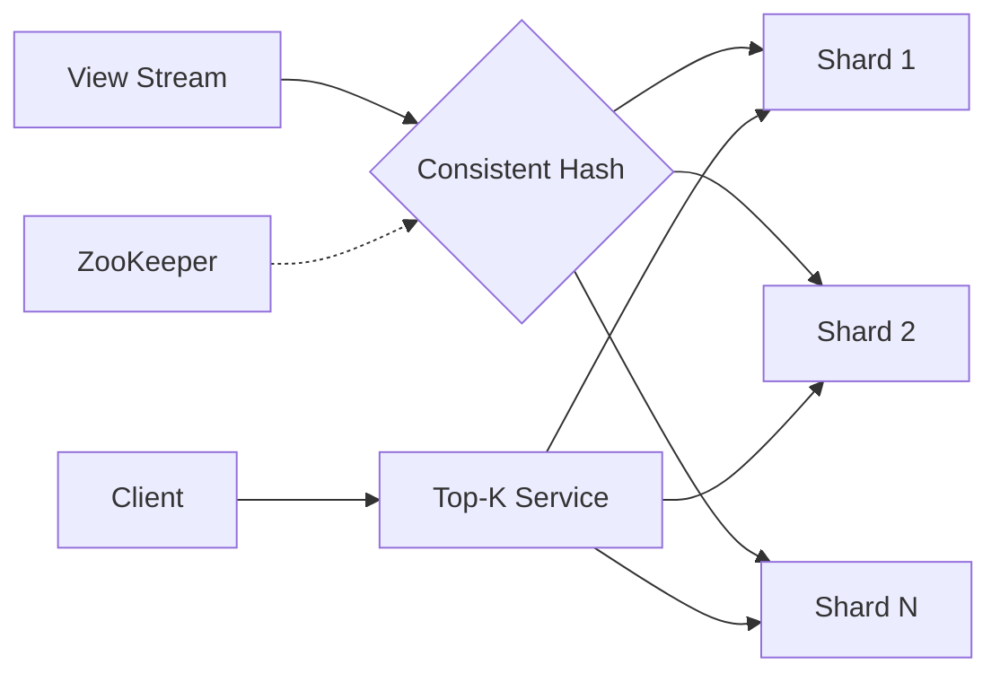
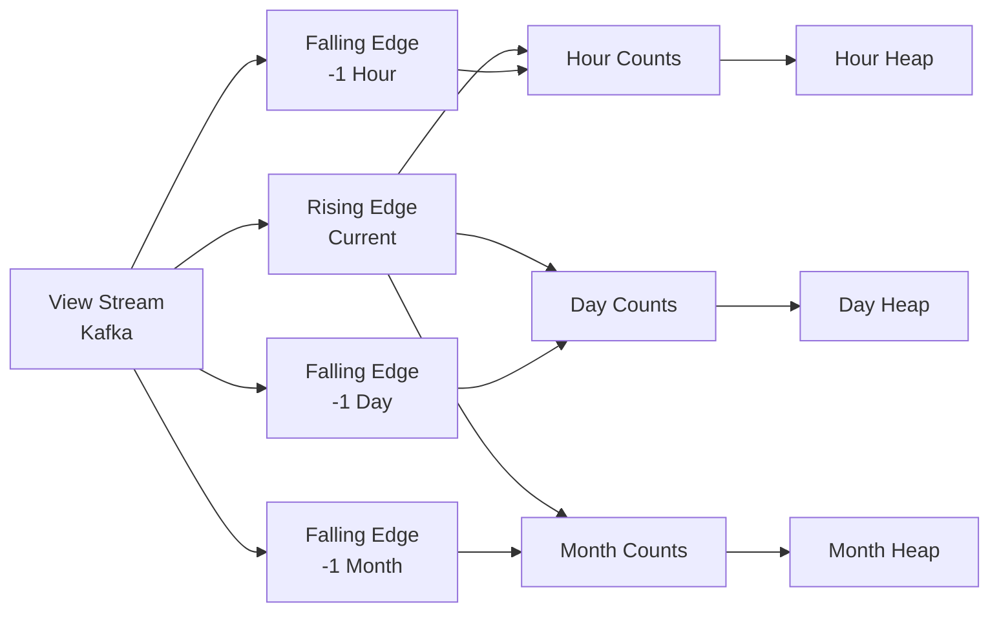
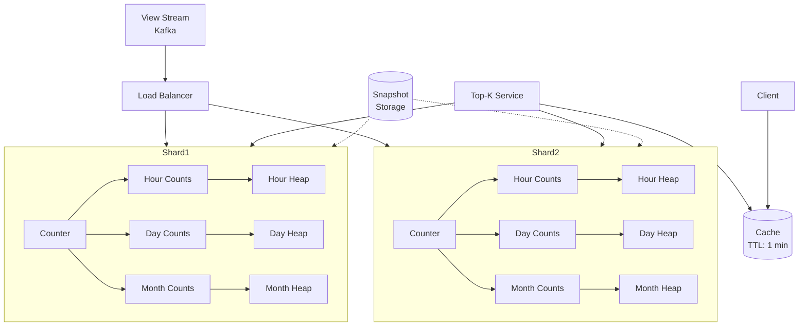

# YouTube Top K Videos System Design Study Guide

## Problem Overview

Design a system to query the **top K most viewed videos** on YouTube for different time periods (1 hour, 1 day, 1 month, all-time) with **precise** counts.

## Key Requirements

### Functional Requirements

- Query top K videos (max 1000) for given time periods
- Support time windows: 1 hour, 1 day, 1 month, all-time
- **Out of scope**: Arbitrary time periods or starting points

### Non-Functional Requirements

- **Latency**: < 1 minute staleness, results in 10-100ms
- **Scale**: 700k views/second, 4B total videos
- **Accuracy**: No approximations (precise counts required)
- **Storage**: ~64 GB for naive solution (4B videos × 16 bytes)
- Must be economical (not 10k host fleet)

## Scale Calculations

```
Views per second: 70B views/day ÷ 100k seconds/day = 700k TPS
Videos per day: 1M videos/day
Total videos: 3.6B videos (10 years accumulation)
Naive storage: 4B videos × (8 bytes ID + 8 bytes count) = 64 GB
```

## Solution Evolution

### 1. Basic Single-Host Solution



**How it works:**

- Increment counter in hash table atomically
- Compare with heap floor
- Update heap if in top 1000

**Problems:**

- Single point of failure
- Can't handle 700k TPS

### 2. Reliability Solutions

#### ❌ Bad: Database-Backed



**Issues:** 2x round trip latency, atomic write requirements, secondary index on 4B videos

#### ✅ Good: Replication



**Benefits:** Fault tolerance, scale reads
**Issues:** Still need catch-up on failure

#### ✅✅ Great: Replicas + Snapshots



**Benefits:** Fast recovery from snapshots + stream replay

### 3. Scaling Writes

#### ❌ Bad: Fixed Partitioning



**Issues:** Can't change partition count, large scatter-gather for queries

#### ✅ Good: Elastic Partitioning



**Benefits:** Dynamic scaling, better load distribution

### 4. Time Windows Solutions

#### ❌ Bad: Naive Micro-buckets

Store counts per [videoId, minute] and aggregate on query
**Issues:**

- Stale heap entries
- Expensive aggregation (43k minutes/month)
- Memory explosion

#### ✅ Good: Heap Expirations

- Add "oldest increment" field to heap entries
- Walk heap before query to refresh stale entries
- Use multiple granularities (30 min, 12 hr, 15 days)
  **Still complex:** Read-time rebuilding, 1-minute data for full month

#### ✅✅ Great: Two Pointers (Rising/Falling Edge)



**How it works:**

- Rising edge: Add to all window counts
- Falling edges: Read from stream at offset (e.g., -1 hour)
- Decrement counts when views exit window
- Maintains separate counts/heaps per window

### 5. Final Architecture with Cache



## Key Design Patterns

### Scaling Writes Pattern

1. **Sharding/Partitioning**: First line of defense for high write volume
2. **Consistent Hashing**: For elastic scaling
3. **Load Balancing**: Distribute across shards

### Reliability Patterns

1. **Replication**: Multiple copies for fault tolerance
2. **Snapshots**: Fast recovery mechanism
3. **Stream Replay**: Rebuild from durable log

### Time Window Patterns

1. **Two Pointers**: Rising edge (add) and falling edge (remove)
2. **Multiple Granularities**: Reduce aggregation cost
3. **Separate Data Structures**: Per time window

## Deep Dive Topics

### 1. Snapshot Consistency

- Pause writes during snapshot
- Use write-ahead log
- Fork process for background snapshot

### 2. Handling Hot Videos

- Local caching on counter nodes
- Batch updates for hot items
- Separate "trending" heap

### 3. Query Optimization

- Cache with 1-minute TTL
- Pre-compute common queries
- Parallel scatter-gather

### 4. Stream Processing

- Kafka partitioning strategy
- Consumer group management
- Offset management for falling edges

## Interview Tips by Level

### Mid-Level (L4/E4)

- **Focus**: 80% breadth, 20% depth
- **Expectations**: End-to-end solution (may not be optimal)
- **Key Points**:
  - Basic sharding understanding
  - Simple fault tolerance (replicas)
  - Identify main bottlenecks

### Senior (L5/E5)

- **Focus**: 60% breadth, 40% depth
- **Expectations**: Near-optimal solution
- **Key Points**:
  - Consistent hashing for elastic scaling
  - Two-pointer solution for time windows
  - Proactive bottleneck identification
  - Trade-off analysis

### Staff+ (L6+/E6+)

- **Focus**: 40% breadth, 60% depth
- **Expectations**: Production-ready design
- **Key Points**:
  - Advanced optimizations (hot video handling)
  - Operational considerations
  - Cost analysis
  - Multiple alternative approaches

## Common Pitfalls to Avoid

1. **Don't jump to approximation algorithms** (Count-Min Sketch) unless asked
2. **Don't over-engineer early** - Start simple, iterate
3. **Remember the precision requirement** - This eliminates many solutions
4. **Consider memory constraints** - 64GB fits in memory but needs sharding for throughput
5. **Don't forget about time window expiration** - Views must age out

## Additional Considerations

### Monitoring & Alerting

- Lag monitoring for falling edge consumers
- Heap size monitoring
- Cache hit rate
- Query latency P50/P99

### Capacity Planning

- Storage: 64GB base + 4x for time windows + snapshots
- Compute: ~500 hosts for 700k TPS (assuming 1.4k TPS per host)
- Network: Consider cross-AZ traffic for replicas

### Disaster Recovery

- Multi-region deployment
- Snapshot replication across regions
- Stream retention for full recovery

### Future Enhancements

- Support for arbitrary time windows
- Real-time trending detection
- Personalized top K
- Geographic segmentation

## Key Takeaways

1. **Start simple**: Single host → Add reliability → Scale → Add features
2. **Two pointers is elegant**: Solves time windows without complex aggregation
3. **Sharding is necessary**: 700k TPS requires horizontal scaling
4. **Cache strategically**: 1-minute TTL aligns with staleness requirement
5. **Multiple data structures**: Separate counts/heaps per time window
6. **Production considerations matter**: Snapshots, monitoring, capacity planning

# YouTube Top K Videos - Quick Revision Points

## 🎯 Problem Statement

- **Goal**: Top K most viewed videos (K ≤ 1000) for different time windows
- **Time Windows**: 1 hour, 1 day, 1 month, all-time
- **Key Constraint**: PRECISE counts (no approximations)

## 📊 Scale Numbers (MEMORIZE)

- **700K views/second** (70B views/day)
- **4B total videos**
- **1M new videos/day**
- **64GB naive storage** (4B × 16 bytes)
- **< 1 min staleness**, **10-100ms query latency**

## 🏗️ Core Solution: Two-Pointer Architecture

### Key Insight

- **Rising Edge**: Add views as they come (current time)
- **Falling Edge**: Remove views as they expire (current - window_size)
- Separate counters & heaps for each time window

### Data Structures Per Shard

```
Hour Window:  [Counter HashMap] → [Top-1000 Heap]
Day Window:   [Counter HashMap] → [Top-1000 Heap]
Month Window: [Counter HashMap] → [Top-1000 Heap]
All-time:     [Counter HashMap] → [Top-1000 Heap]
```

## 🔄 Processing Flow

1. **View arrives** → Hash to shard (consistent hashing)
2. **Rising edge** → Increment all window counters
3. **Falling edges** → Read from Kafka at offset, decrement counters
4. **Heap update** → If count > heap_min, update heap
5. **Query** → Scatter-gather from shards → Merge heaps → Cache (1 min TTL)

## ⚡ Critical Design Decisions

### Why Sharding?

- Single host can't handle 700K TPS
- Use **consistent hashing** for elastic scaling
- ~500 shards needed (1.4K TPS per shard)

### Why Two-Pointer?

- Avoids expensive aggregation of micro-buckets
- No stale heap entries to clean
- Constant time updates

### Why Not Database?

- 2x round trip latency
- Can't handle 700K atomic writes/sec
- Secondary index on 4B videos too expensive

## 🛡️ Reliability

- **Replicas**: 2-3 per shard for fault tolerance
- **Snapshots**: Periodic state dumps for fast recovery
- **Stream Replay**: Rebuild from Kafka after snapshot restore

## 🚀 Optimizations

- **Cache**: 1-minute TTL at Top-K service
- **Hot Videos**: Local cache on counter nodes
- **Batch Updates**: For frequently viewed videos
- **Pre-aggregation**: Common queries pre-computed

## ❌ Common Mistakes

- Suggesting approximation algorithms (Count-Min Sketch)
- Forgetting to handle view expiration
- Over-engineering before establishing basics
- Missing the precision requirement
- Database as primary storage

## 🎓 Level-Specific Focus

### L4/E4 (Mid-Level)

- Basic sharding concept
- Simple replication
- Identify main bottleneck (write throughput)

### L5/E5 (Senior)

- Consistent hashing details
- Two-pointer solution
- Trade-off analysis (memory vs latency)

### L6+ (Staff+)

- Hot video handling strategies
- Cost optimization
- Operational concerns (monitoring, DR)

## 📝 Interview Flow

1. **Clarify**: Precise counts? Fixed time windows? K limit?
2. **Estimate**: Calculate scale (700K TPS is key number)
3. **Start Simple**: Single host solution
4. **Add Reliability**: Replicas + snapshots
5. **Scale Writes**: Sharding with consistent hashing
6. **Handle Time Windows**: Two-pointer approach
7. **Optimize**: Cache, hot paths
8. **Deep Dive**: Pick 1-2 areas based on time

## 🔑 Final Talking Points

- "700K TPS requires sharding, not optimization"
- "Two-pointer elegantly solves time windows"
- "Precision requirement eliminates probabilistic structures"
- "64GB fits in memory, but throughput is the bottleneck"
- "Cache with 1-min TTL meets staleness requirement"

## 💡 If Asked About...

- **Arbitrary time windows**: Micro-bucketing with aggregation
- **Geographic segmentation**: Regional shards with global aggregation
- **Real-time trending**: Velocity tracking, not just absolute counts
- **Cost**: ~500 hosts + Kafka + snapshot storage
- **Recovery time**: Minutes with snapshots + stream replay
