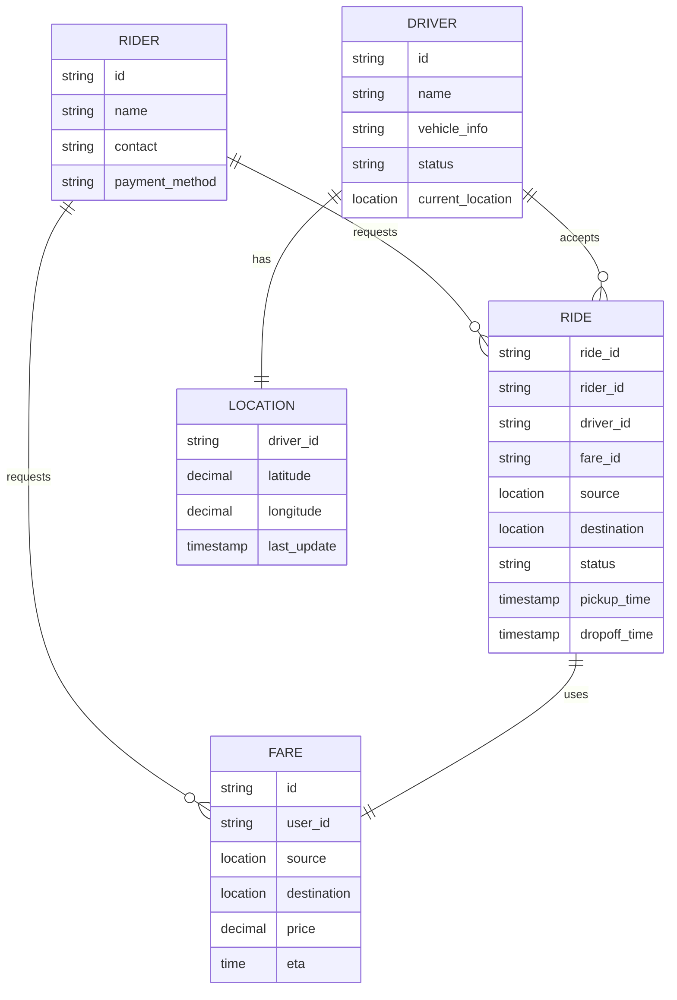
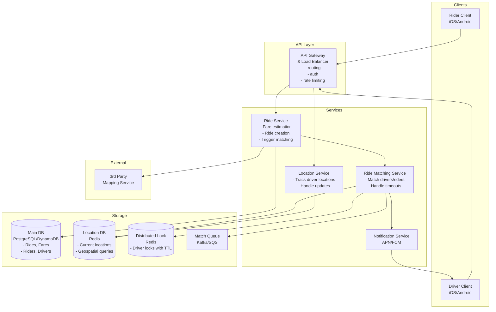
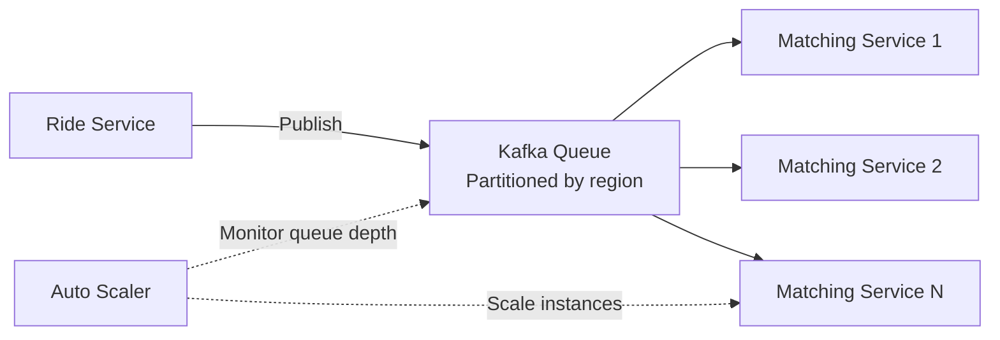
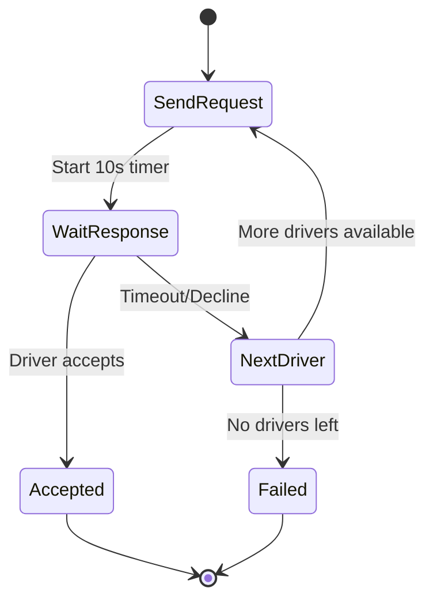
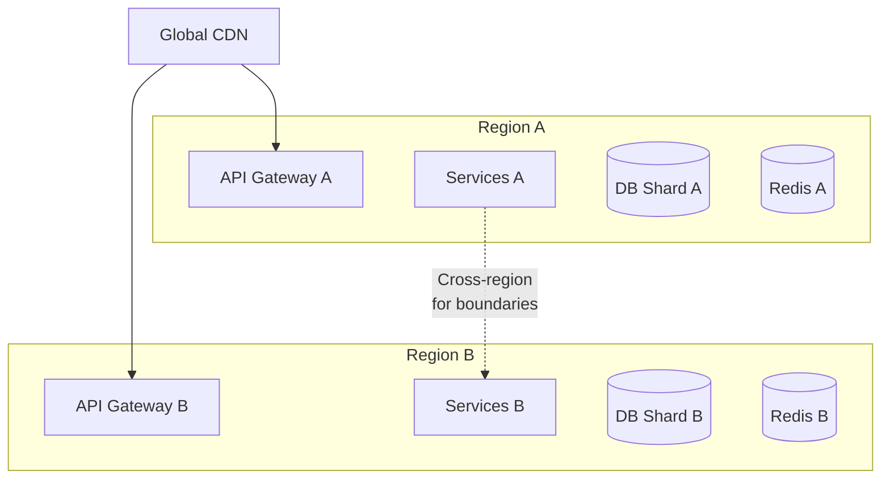

# Design Uber - System Design Interview Guide

## 1. Problem Understanding

### What is Uber?

A ride-sharing platform that connects passengers with drivers for on-demand transportation services through mobile apps.

### Interview Strategy

1. Define functional and non-functional requirements first
2. Prioritize top 3 functional requirements
3. Build design sequentially through each requirement
4. Use non-functional requirements to guide deep dives

## 2. Requirements

### Functional Requirements (Core)

1. **Riders request estimated fare** - Input start/destination, get price estimate
2. **Riders request ride** - Confirm ride based on fare estimate
3. **Driver-rider matching** - Match riders with nearby available drivers
4. **Driver accept/decline** - Drivers can accept/decline and navigate to pickup/dropoff

### Functional Requirements (Out of Scope)

- Rating system for drivers/riders
- Scheduled rides
- Different ride categories (X, XL, Comfort)

### Non-Functional Requirements (Core)

1. **Low latency matching** - < 1 minute to match or failure
2. **Strong consistency** - No driver assigned multiple rides simultaneously
3. **High throughput** - Handle 100k requests from same location during surges

### Non-Functional Requirements (Out of Scope)

- GDPR compliance
- Fault tolerance/redundancy
- CI/CD pipelines
- Monitoring/logging

## 3. Core Entities



## 4. API Design

```yaml
# Get fare estimate
POST /fare
Body: {
  pickupLocation: {lat, lng},
  destination: {lat, lng}
}
Response: Fare object

# Request ride
POST /rides
Body: {
  fareId: string
}
Response: Ride object

# Update driver location
POST /drivers/location
Body: {
  lat: decimal,
  lng: decimal
}
Note: driverId from session/JWT

# Accept/Decline ride
PATCH /rides/:rideId
Body: {
  action: "accept" | "decline"
}
Response: Ride object with pickup location
```

## 5. High-Level Architecture



## 6. Deep Dives

### 6.1 Handling Location Updates & Proximity Searches

#### Problem

- **Scale**: 10M drivers × updates every 5 seconds = 2M updates/second
- **Query efficiency**: Need fast proximity searches without full table scans

#### Solutions Comparison

| Solution                       | Pros                                 | Cons                             | When to Use         |
| ------------------------------ | ------------------------------------ | -------------------------------- | ------------------- |
| **Direct DB Writes**           | Simple                               | Can't handle scale, slow queries | Never (non-starter) |
| **Batch Processing + PostGIS** | Reduces write load                   | Stale data, complexity           | Medium scale        |
| **Redis Geospatial** ✅        | Real-time, fast queries, auto-expiry | In-memory (durability concerns)  | Best for Uber scale |

#### Redis Geospatial Implementation

```python
# Add/update driver location
GEOADD drivers_location longitude latitude driver_id

# Find drivers within radius
GEOSEARCH drivers_location
  FROMLONLAT longitude latitude
  BYRADIUS 5 km
  WITHDIST

# Set TTL for auto-cleanup
EXPIRE driver:location:123 60
```

### 6.2 Preventing Duplicate Driver Assignments

#### Problem

Ensure each driver receives only one ride request at a time with 10-second timeout.

#### Solutions Comparison

| Solution                      | Implementation               | Issues Addressed                  |
| ----------------------------- | ---------------------------- | --------------------------------- |
| **App-level locking**         | In-memory locks              | No coordination between instances |
| **DB status update**          | Update driver status column  | Timeout handling complexity       |
| **Redis distributed lock** ✅ | SET driver:lock:123 EX 10 NX | Auto-expiry, atomic operations    |

#### Redis Lock Implementation

```python
# Acquire lock (returns 1 if successful, 0 if already locked)
SET driver:lock:{driver_id} {ride_id} EX 10 NX

# Release lock
DEL driver:lock:{driver_id}
```

### 6.3 Handling Peak Demand

#### Problem

Prevent dropped requests during surges (100k requests from same location).

#### Solution: Message Queue with Dynamic Scaling



Benefits:

- No lost requests on service failure
- Automatic scaling based on queue depth
- Geographic partitioning for efficiency

### 6.4 Driver Timeout Handling

#### Problem

Handle unresponsive drivers (10-second timeout).

#### Solutions Evolution

1. **Delay Queue**: Schedule retry message after 10 seconds
2. **Durable Execution** (Best): Use Temporal/Step Functions



### 6.5 System Scaling Strategies

#### Geo-Sharding Architecture



Benefits:

- Reduced latency (data closer to users)
- Better fault isolation
- Horizontal scalability

## 7. Optimization Techniques

### Adaptive Location Updates

```python
def calculate_update_interval(driver_state):
    if driver_state.is_stationary:
        return 30  # seconds
    elif driver_state.speed > 50:  # mph
        return 3   # seconds
    elif driver_state.is_turning:
        return 2   # seconds
    else:
        return 5   # default
```

### Intelligent Driver Ranking

```python
factors = {
    'proximity': 0.4,      # Weight
    'driver_rating': 0.2,
    'completion_rate': 0.2,
    'response_time': 0.2
}
```

## 8. Key Design Decisions

| Decision           | Choice                  | Reasoning                                          |
| ------------------ | ----------------------- | -------------------------------------------------- |
| **Location Store** | Redis                   | Real-time updates, geospatial support, auto-expiry |
| **Main Database**  | PostgreSQL with PostGIS | ACID compliance, complex queries, geo support      |
| **Message Queue**  | Kafka                   | Durability, partitioning, high throughput          |
| **Locking**        | Redis with TTL          | Distributed, auto-expiry, simple                   |
| **Workflow**       | Temporal                | Durable execution, fault tolerance                 |

## 9. Interview Tips by Level

### Mid-Level (L4/E4)

- Focus on breadth (80%) over depth (20%)
- Get the basic architecture working
- Implement at least "good" solutions
- Be ready to explain each component's purpose

### Senior (L5/E5)

- Balance breadth (60%) and depth (40%)
- Discuss 2+ deep dive topics in detail
- Articulate trade-offs clearly
- Show scaling strategies

### Staff+ (L6+/E6+)

- Emphasize depth (60%) over breadth (40%)
- Lead the conversation proactively
- Discuss 3+ complex areas deeply
- Draw from real-world experience
- Teach the interviewer something new

## 10. Common Pitfalls to Avoid

1. **Over-engineering early**: Start simple, iterate
2. **Ignoring client-side logic**: Adaptive updates happen on device
3. **Forgetting about consistency**: Multiple services updating same data
4. **Not considering failures**: Services crash, networks partition
5. **Security oversights**: Never trust client-provided IDs/timestamps

## 11. Additional Considerations

### Monitoring & Observability

- Track match success rate
- Monitor driver utilization
- Alert on high queue depth
- Trace request latency

### A/B Testing Infrastructure

- Test different matching algorithms
- Experiment with pricing models
- Measure driver acceptance rates

### ML Integration Points

- Demand prediction for driver positioning
- Dynamic pricing based on supply/demand
- ETA prediction improvements
- Fraud detection

### Business Metrics

- Average wait time
- Driver utilization rate
- Ride completion rate
- Revenue per ride
- Customer lifetime value

## 12. Flow Walkthrough

### Fare Estimation Flow

1. Rider enters pickup and destination
2. API Gateway authenticates and routes to Ride Service
3. Ride Service calls Mapping API for distance/time
4. Calculate fare using pricing model
5. Store Fare object in DB
6. Return fare estimate to rider

### Ride Request & Matching Flow

1. Rider accepts fare estimate
2. Ride Service creates Ride object (status: "requested")
3. Trigger matching workflow via queue
4. Matching Service queries Redis for nearby drivers
5. Rank drivers by proximity, rating, etc.
6. Lock first driver using Redis (TTL: 10s)
7. Send notification to driver
8. If accepted: Update ride status, assign driver
9. If declined/timeout: Release lock, try next driver

### Location Update Flow

1. Driver app calculates update interval based on movement
2. Send location update to Location Service
3. Update Redis with GEOADD command
4. Set TTL to prevent stale data

## 13. Capacity Planning

### Storage Estimates

- **Rides**: 10M/day × 1KB = 10GB/day
- **Locations**: 10M drivers × 100 bytes = 1GB (in-memory)
- **Historical data**: 10GB/day × 365 = 3.65TB/year

### Throughput Estimates

- **Location updates**: 2M/second peak
- **Ride requests**: 100K/minute peak
- **Notifications**: 10K/second peak

### Infrastructure Needs

- **Services**: 100-500 instances per service
- **Redis**: Cluster with 5-10 nodes
- **Database**: Multi-region with read replicas
- **Queue**: Kafka with 20+ partitions

## 14. Practice Questions

1. How would you handle driver navigation and real-time route updates?
2. How would you implement surge pricing?
3. How would you design the payment system?
4. How would you handle carpooling/ride sharing?
5. How would you implement driver incentives and bonuses?
6. How would you handle international expansion?
7. How would you implement safety features?
8. How would you design the driver onboarding system?

## 15. Key Takeaways

- **Start simple**: Begin with basic flow, then add complexity
- **Consider scale early**: 2M location updates/second is the key challenge
- **Use right tools**: Redis for geo queries, Kafka for queuing, Temporal for workflows
- **Think about failures**: Every component can fail, plan accordingly
- **Client matters**: Don't ignore client-side optimizations
- **Consistency is crucial**: Prevent double-bookings with proper locking
- **Geographic distribution**: Shard by region for better performance

Remember: The key to success is not memorizing solutions but understanding the trade-offs and being able to reason through problems systematically.

I'll create concise bullet points covering the essential aspects of the Uber system design for quick revision:

## 🚀 Uber System Design - Last Minute Revision

### 📋 Core Requirements

• **Functional**: Fare estimation → Ride request → Driver matching → Accept/Decline
• **Non-functional**: <1min matching, Strong consistency (no double-booking), 100k surge requests
• **Entities**: Rider, Driver, Ride, Fare, Location

### 🏗️ Architecture Overview

• **Client** → **API Gateway** → **Services** → **Storage**
• **Key Services**: Ride Service, Matching Service, Location Service, Notification Service
• **Storage**: PostgreSQL (main), Redis (locations + locks), Kafka (queue)

### 📍 Location Management (2M updates/sec)

• **Solution**: Redis Geospatial (`GEOADD`, `GEOSEARCH`)
• **Updates**: Every 5 seconds from drivers
• **Auto-cleanup**: TTL on location entries (60s)
• **Adaptive intervals**: 2-30 seconds based on driver state

### 🔒 Preventing Double Assignment

• **Redis Distributed Lock**: `SET driver:lock:{id} {ride_id} EX 10 NX`
• **10-second TTL** for auto-release
• **Atomic operations** ensure consistency

### 📈 Handling Peak Demand (100k requests)

• **Kafka queue** partitioned by region
• **Auto-scaling** based on queue depth
• **No lost requests** during service failures

### ⏱️ Driver Timeout Flow

• **Durable execution** (Temporal/Step Functions)
• **10-second timeout** per driver
• **Automatic retry** with next driver
• **Fail after exhausting driver list**

### 🌍 Scaling Strategy

• **Geo-sharding** by region
• **Each region**: Own API Gateway, Services, DB shard, Redis
• **Cross-region** coordination at boundaries

### 💡 Key Design Decisions

• **Redis over DB** for locations: Real-time, geospatial, auto-expiry
• **Kafka over SQS**: Durability, partitioning, throughput
• **Temporal for workflows**: Fault tolerance, state management
• **PostgreSQL + PostGIS**: ACID, complex queries

### 🔄 Critical Flows

**Fare Estimation**:

1. Rider inputs locations
2. Call Mapping API for distance
3. Calculate price
4. Store Fare object
5. Return estimate

**Ride Matching**:

1. Create Ride (status: requested)
2. Query Redis for nearby drivers (GEOSEARCH)
3. Rank drivers (proximity 40%, rating 20%, etc.)
4. Lock driver (Redis, 10s TTL)
5. Send notification
6. Accept → Assign / Decline → Next driver

### 📊 Capacity Numbers

• **Storage**: 10GB/day rides, 1GB in-memory locations
• **Throughput**: 2M/sec locations, 100K/min rides peak
• **Infrastructure**: 100-500 instances/service, 5-10 Redis nodes

### ⚠️ Common Pitfalls

• Don't over-engineer early - start simple
• Remember client-side logic (adaptive updates)
• Handle consistency (distributed locks)
• Plan for failures (every component can fail)
• Security: Never trust client IDs/timestamps

### 🎯 Interview Level Focus

• **L4**: 80% breadth, basic architecture working
• **L5**: 60% breadth, 2+ deep dives, clear trade-offs
• **L6+**: 60% depth, lead conversation, 3+ complex areas

### 🔑 Remember

• **Scale challenge**: 2M location updates/sec is the bottleneck
• **Consistency**: Distributed locks prevent double-booking
• **Right tools**: Redis (geo), Kafka (queue), Temporal (workflows)
• **Geographic distribution**: Shard by region for performance
• **Start simple, iterate**: Don't jump to complex solutions

### ⚡ Quick Wins

• Mention adaptive location updates early
• Discuss Redis geospatial for proximity searches
• Explain distributed locking for consistency
• Show queue + auto-scaling for surge handling
• Consider cross-region coordination at boundaries

Good luck! Focus on explaining trade-offs clearly and walking through the flows systematically. 🎯
