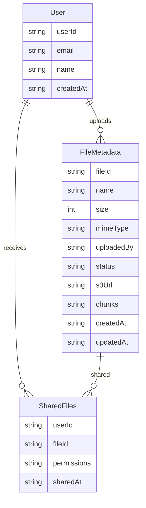
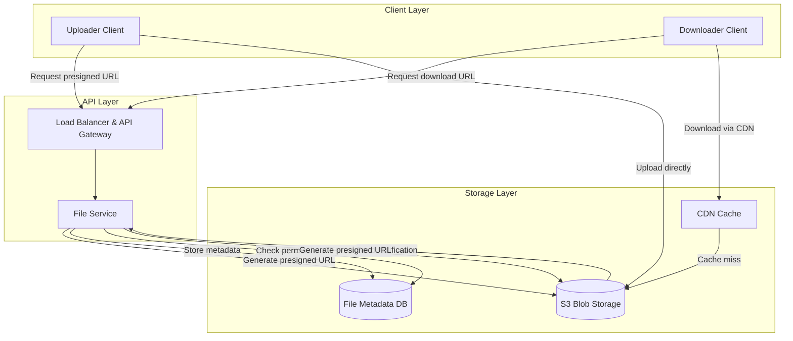
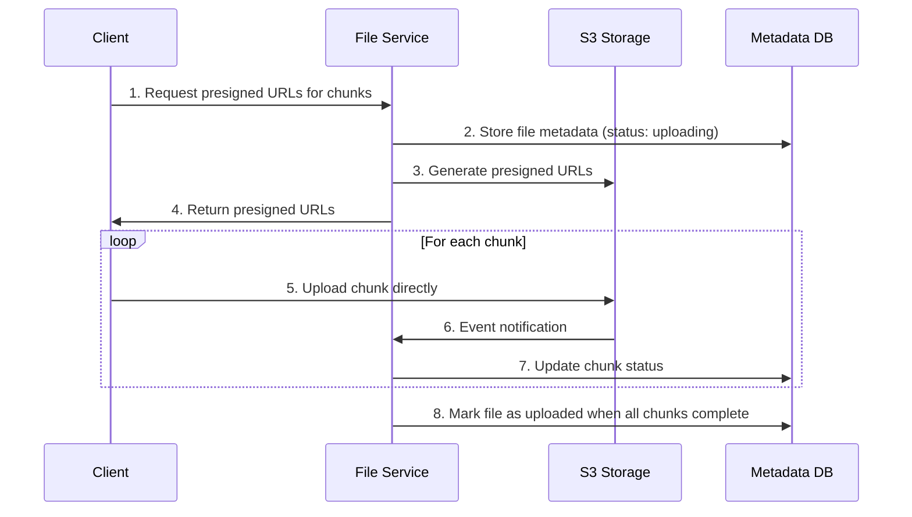
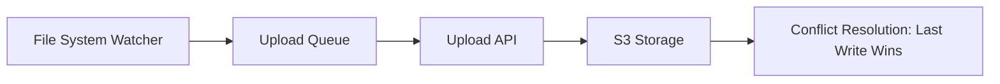
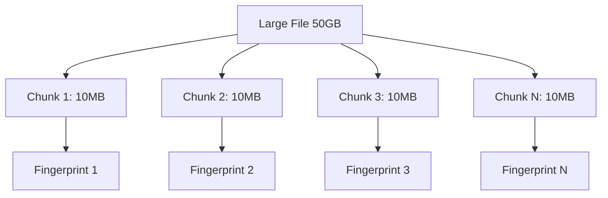
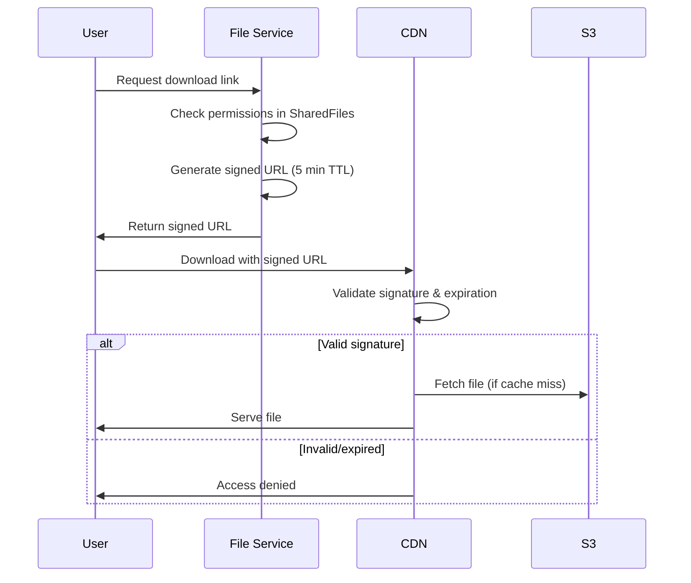

# Dropbox System Design - Interview Guide

## 📋 Problem Statement

Design a cloud-based file storage service like Dropbox that allows users to store, share, and sync files across devices.

## 🎯 Functional Requirements

### Core Requirements

1. **Upload files** from any device
2. **Download files** from any device
3. **Share files** with other users and view shared files
4. **Auto-sync files** across devices

### Out of Scope

- File editing capabilities
- File preview without download
- User storage limits
- File versioning
- Virus/malware scanning

## 🔧 Non-Functional Requirements

### Core Requirements

1. **High Availability** (prioritize availability over consistency)
2. **Support large files** (up to 50GB)
3. **Security & Reliability** (file recovery capabilities)
4. **Low latency** for upload/download/sync

### CAP Theorem Trade-off

- **Choose Availability over Consistency**
- Example: If user in Germany uploads file, user in US can wait a few seconds to see it
- Unlike stock trading where immediate consistency is critical

## 🏗️ Core Entities



## 🔌 API Design

### File Upload

```http
POST /files/presigned-url
Request: { fileName, fileSize, mimeType }
Response: { presignedUrl, fileId }
```

### File Download

```http
GET /files/{fileId}/presigned-url
Response: { presignedUrl }
```

### File Sharing

```http
POST /files/{fileId}/share
Request: { userEmails: [] }
```

### Sync Changes

```http
GET /files/changes?since={timestamp}
Response: { files: [FileMetadata] }
```

## 🏛️ High-Level Architecture



## 📁 File Upload Evolution

### ❌ Bad: Upload to Server

- Files go through application server
- Server becomes bottleneck
- Expensive and slow

### ✅ Good: Direct to Blob Storage

- Use presigned URLs for direct S3 upload
- Bypass application server for data transfer
- Secure with time-limited URLs

### 🌟 Great: Chunked Upload

- Break large files into 5-10MB chunks
- Enable progress tracking
- Support resumable uploads
- Parallel chunk uploads



## 📥 File Download Evolution

### ❌ Bad: Download through Server

- Double download (S3→Server→Client)
- Slow and expensive

### ✅ Good: Direct from Blob Storage

- Presigned URLs for direct download
- Faster and cheaper

### 🌟 Great: CDN Integration

- Cache frequently accessed files globally
- Serve from nearest edge location
- Signed URLs for security

## 👥 File Sharing Strategies

### ❌ Bad: Sharelist in Metadata

```json
{
  "fileId": "123",
  "name": "file.txt",
  "sharelist": ["user2", "user3"]
}
```

**Problem**: Slow to find files shared with a user (requires scanning all files)

### ✅ Good: Cached Inverse Mapping

- Cache: `user1: ["fileId1", "fileId2"]`
- Fast lookup for user's shared files
- Must keep in sync with metadata

### 🌟 Great: Normalized SharedFiles Table

```sql
SharedFiles:
userId (PK) | fileId (SK) | permissions
user1       | fileId1     | read
user1       | fileId2     | write
```

**Benefits**: No sync issues, clean separation of concerns

## 🔄 File Synchronization

### Local → Remote Sync



**Client-side sync agent**:

- Monitor local folder with OS file system events
- Queue changes for upload
- Use fingerprinting for deduplication
- Resolve conflicts with "last write wins"

### Remote → Local Sync

**Hybrid Approach**:

- **Fresh files** (recently edited): WebSocket for real-time updates
- **Stale files** (inactive): Periodic polling
- Efficient resource usage


## 🚀 Supporting Large Files (Deep Dive)

### Key Challenges

1. **Timeouts**: 50GB at 100Mbps = 1.11 hours
2. **Server Limits**: Most servers limit request size (API Gateway: 10MB)
3. **Network Interruptions**: Need resumability
4. **User Experience**: Need progress indicators

### Solution: File Chunking



### Chunking Process

1. **Client chunks file** into 5-10MB pieces
2. **Calculate fingerprints** (SHA-256) for each chunk and entire file
3. **Check existing uploads** using file fingerprint as ID
4. **Upload missing chunks** with progress tracking
5. **S3 event notifications** update chunk status
6. **Combine chunks** when all uploaded

### Updated File Metadata Schema

```json
{
  "id": "file-fingerprint-sha256",
  "name": "video.mp4",
  "size": 50000000000,
  "status": "uploading",
  "chunks": [
    {
      "id": "chunk1-fingerprint",
      "status": "uploaded"
    },
    {
      "id": "chunk2-fingerprint",
      "status": "uploading"
    },
    {
      "id": "chunk3-fingerprint",
      "status": "not-uploaded"
    }
  ]
}
```

## ⚡ Performance Optimizations

### 1. Compression

- **When to use**: Text files (high compression ratio)
- **When to avoid**: Media files (low compression ratio)
- **Rule**: Compress before encrypt
- **Algorithms**: Gzip (universal), Brotli (better ratio), Zstandard (newest)

### 2. Parallel Chunk Upload

- Maximize bandwidth utilization
- Adaptive chunk sizes based on network conditions
- Only sync changed chunks for file updates

### 3. CDN Optimization

- Cache frequently accessed files
- Strategic caching with TTL headers
- Cache invalidation for updates
- Cost optimization through selective caching

## 🔒 Security Measures

### 1. Encryption

- **In Transit**: HTTPS for all communications
- **At Rest**: S3 server-side encryption with unique keys

### 2. Access Control

- **Authorization**: Check SharedFiles table/cache before generating download URLs
- **Signed URLs**: Time-limited (5 minutes) for downloads
- **CDN Security**: CloudFront signed URLs with expiration

### 3. Signed URL Flow



## 📊 System Components Deep Dive

### File Service Responsibilities

- Generate presigned URLs for S3
- Manage file metadata in database
- Handle permissions and sharing
- **Does NOT** handle actual file data

### Database Schema

```sql
-- File Metadata
FileMetadata:
- fileId (PK): SHA-256 fingerprint
- name: Original filename
- size: File size in bytes
- mimeType: File type
- uploadedBy: User ID
- status: uploading/uploaded/failed
- s3Url: S3 object location
- chunks: Array of chunk metadata
- createdAt, updatedAt: Timestamps

-- Shared Files (Normalized)
SharedFiles:
- userId (PK): User receiving access
- fileId (SK): File being shared
- permissions: read/write
- sharedAt: Timestamp
```

## 🎯 Interview Expectations by Level

### Mid-Level (E4) - 80% Breadth, 20% Depth

**Expected to deliver**:

- Clear API endpoints and data model
- Functional high-level design for upload/download/sharing
- Respond well to probing questions about optimization

**Not expected to know initially**:

- Presigned URLs
- Chunking strategies
- CDN implementation details

### Senior (E5) - 60% Breadth, 40% Depth

**Expected to deliver**:

- Advanced system design principles
- Trade-off discussions with justification
- Proactive problem identification
- Deep dive into large file handling

**Should demonstrate**:

- Experience with blob storage patterns
- Understanding of CDN benefits
- Knowledge of chunking/multipart uploads

### Staff+ (E6+) - 40% Breadth, 60% Depth

**Expected to deliver**:

- Deep technical expertise from real-world experience
- Proactive problem solving without guidance
- Complex trade-off analysis
- Advanced scalability considerations

**Should demonstrate**:

- Practical technology application
- Anticipate edge cases and solutions
- Drive conversation based on experience

## 🔄 AWS Services Mapping

### Real-World Implementation

- **S3 Multipart Upload**: Handles chunking automatically
- **CloudFront**: CDN with signed URL support
- **API Gateway**: Rate limiting, SSL termination
- **DynamoDB**: File metadata storage
- **Lambda**: Event processing for S3 notifications

## 💡 Key Interview Tips

### 1. Start Simple, Iterate

- Begin with basic upload/download
- Add complexity incrementally
- Show evolution of thinking

### 2. Justify Design Choices

- Explain trade-offs explicitly
- Reference real-world constraints
- Consider cost implications

### 3. Think About Scale

- Mention global distribution needs
- Discuss caching strategies
- Consider bandwidth optimization

### 4. Security Mindset

- Always mention encryption
- Discuss access control
- Explain signed URL benefits

### 5. User Experience Focus

- Progress indicators for uploads
- Resumable operations
- Fast sync across devices

## 🎪 Common Follow-up Questions

1. **"How would you handle file versioning?"**

   - Append-only storage with version pointers
   - Metadata tracks version history
   - Cleanup policies for old versions

2. **"What about conflict resolution?"**

   - Last-write-wins for simplicity
   - Could implement operational transforms
   - User notification for conflicts

3. **"How to optimize for mobile clients?"**

   - Smaller chunk sizes for poor networks
   - Progressive download for media
   - Offline capability with local cache

4. **"Database consistency concerns?"**

   - Eventual consistency acceptable for file sync
   - Strong consistency for permissions
   - Use distributed transactions when needed

5. **"Cost optimization strategies?"**
   - Intelligent CDN caching
   - Compression for appropriate file types
   - Tiered storage (frequent vs. archival)

Remember: **Show your thought process, discuss trade-offs, and demonstrate practical experience with distributed systems!**

# Dropbox System Design - Last Minute Revision

## 🎯 Core Requirements (30 seconds)

- **Upload/Download** files from any device
- **Share files** with other users
- **Auto-sync** across devices
- **Large file support** (up to 50GB)
- **High availability** over consistency (CAP theorem)

## 🏗️ Key Architecture Pattern

**Direct Blob Storage + Presigned URLs**

- Client never sends files through app server
- App server only handles metadata
- S3 handles actual file storage
- CDN for fast global downloads

## 📁 File Upload Evolution (Know This Cold)

1. **❌ Bad**: Upload through server (bottleneck)
2. **✅ Good**: Direct to S3 with presigned URLs
3. **🌟 Great**: Chunked upload (5-10MB chunks)
   - Resumable uploads
   - Progress tracking
   - Parallel chunk uploads

## 🔑 Critical Components

- **File Service**: Metadata + presigned URL generation
- **S3**: Blob storage with event notifications
- **CDN**: Global caching with signed URLs
- **Database**: File metadata + SharedFiles table

## 💾 Database Schema (Must Know)

```
FileMetadata:
- fileId (PK): SHA-256 fingerprint
- name, size, mimeType, uploadedBy
- status: uploading/uploaded/failed
- chunks: [chunk metadata]

SharedFiles:
- userId (PK), fileId (SK), permissions
```

## 🚀 Large File Strategy

- **Problem**: 50GB = 1+ hour upload, timeouts, interruptions
- **Solution**: File chunking with fingerprints
- **Benefits**: Resumability, progress, parallel uploads
- **Implementation**: S3 multipart upload

## 🔄 Sync Strategies

- **Local→Remote**: File system watcher + upload queue
- **Remote→Local**: WebSocket (fresh files) + polling (stale files)
- **Conflict Resolution**: Last write wins

## 🔒 Security Essentials

- **Encryption**: HTTPS in transit, S3 server-side at rest
- **Access Control**: Check SharedFiles before generating URLs
- **Signed URLs**: Time-limited (5 min) for downloads
- **CDN Security**: CloudFront signed URLs

## ⚡ Performance Optimizations

- **Compression**: Text files only (not media)
- **Parallel uploads**: Multiple chunks simultaneously
- **CDN caching**: Frequently accessed files
- **Deduplication**: Use file fingerprints as IDs

## 🎪 Common Gotchas & Answers

**Q: "Why not upload through server?"**
A: Creates bottleneck, expensive, slower than direct S3

**Q: "How handle 50GB files?"**
A: Chunking - break into 5-10MB pieces, upload in parallel

**Q: "Database consistency?"**
A: Eventual consistency OK for sync, strong for permissions

**Q: "File versioning?"**
A: Append-only storage with version pointers in metadata

**Q: "Mobile optimization?"**
A: Smaller chunks, progressive download, offline cache

## 📊 Level-Specific Expectations

**Mid-Level (E4)**: Basic design + APIs, respond to optimization hints
**Senior (E5)**: Proactive trade-offs, chunking strategy, CDN benefits
**Staff+ (E6+)**: Deep expertise, edge cases, complex scalability

## 🔄 Real AWS Implementation

- S3 Multipart Upload (auto-chunking)
- CloudFront (CDN with signed URLs)
- API Gateway (rate limiting)
- DynamoDB (metadata)
- Lambda (S3 event processing)

## 💡 Interview Success Formula

1. **Start simple** (basic upload/download)
2. **Add complexity incrementally** (chunking, CDN)
3. **Justify every choice** (trade-offs, costs)
4. **Think at scale** (global users, bandwidth)
5. **Security mindset** (always mention encryption/access)

## 🎯 Money Quotes

- "We choose availability over consistency - users can wait seconds to see synced files"
- "Presigned URLs eliminate the server bottleneck for file transfers"
- "Chunking solves the large file problem - resumable, parallel, progress tracking"
- "File fingerprints enable deduplication and serve as natural primary keys"
- "Hybrid sync: WebSocket for active files, polling for inactive ones"

## ⚠️ Don't Forget

- Mention **event notifications** from S3 to update chunk status
- **SharedFiles table** prevents slow "scan all files" queries
- **CDN cache invalidation** when files are updated
- **Cost optimization** through selective caching strategies
- **User experience** - progress bars, resumable operations
