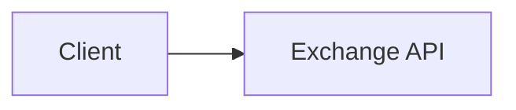
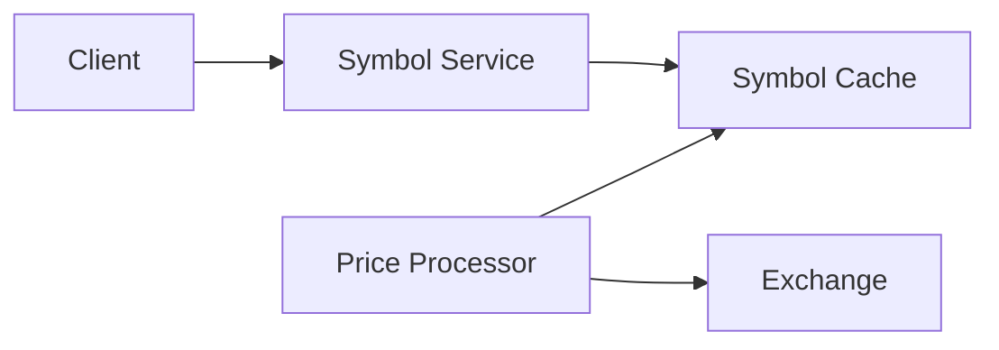
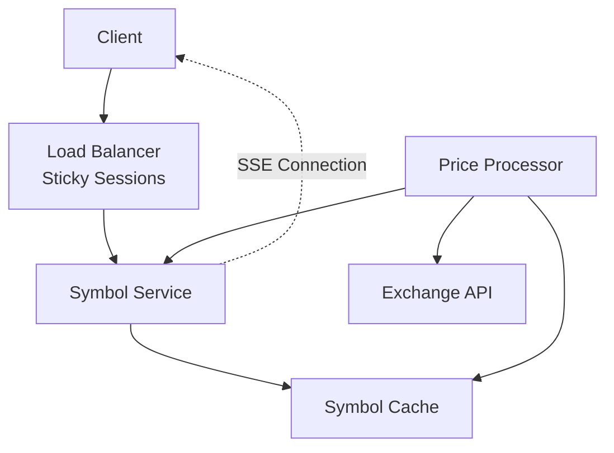
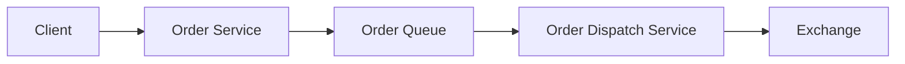
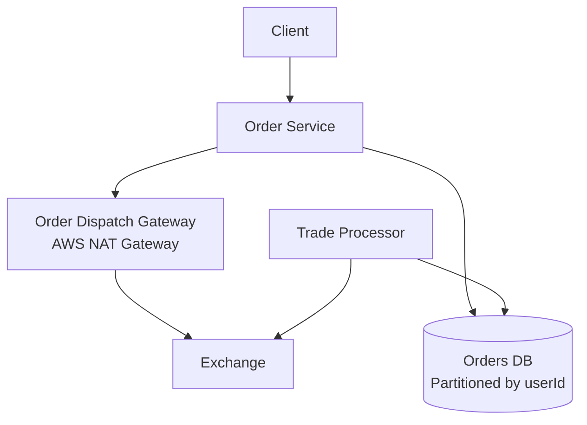
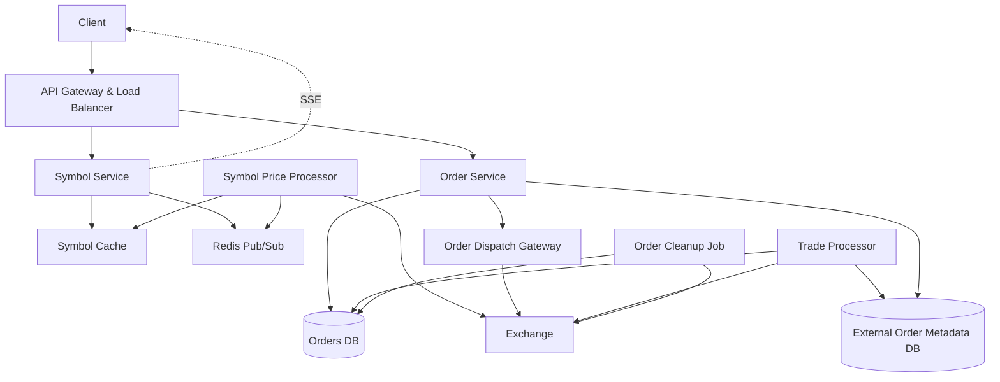
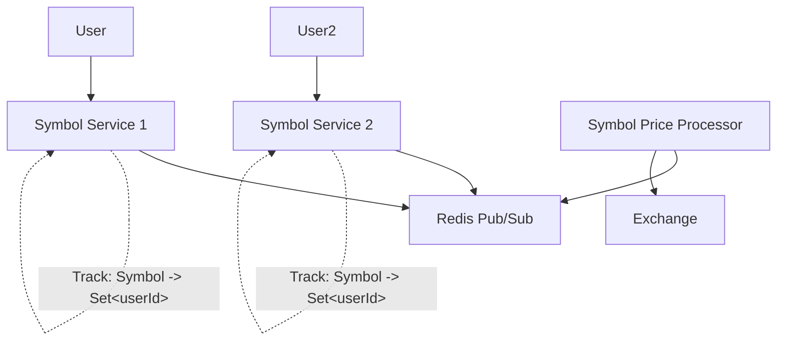
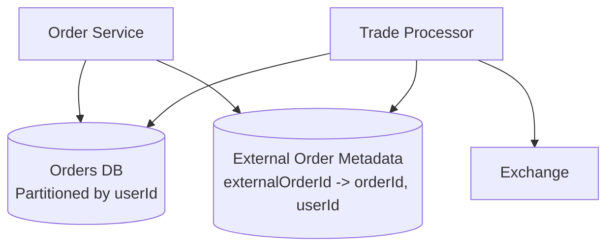
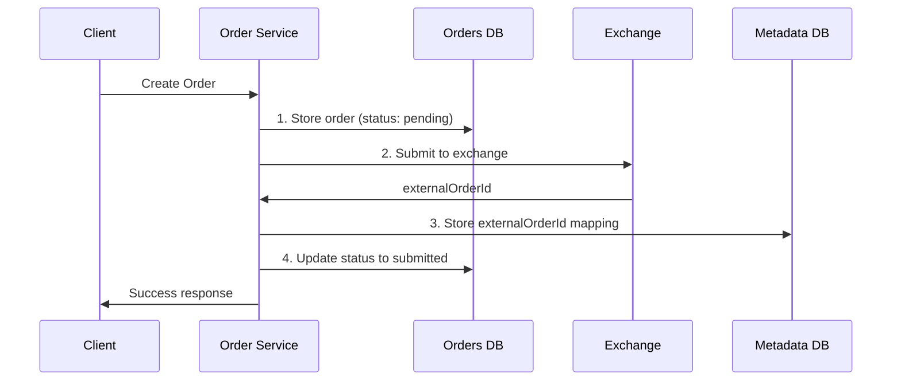

# Robinhood System Design Interview Guide

## Understanding the Problem

### What is Robinhood?

Robinhood is a **commission-free trading platform** for stocks, ETFs, options, and cryptocurrencies. It features real-time market data and basic order management.

**Key Point**: Robinhood is a **brokerage**, not an exchange. It routes trades through market makers and is compensated via payment for order flow.

### Core Financial Terms

- **Symbol/Ticker**: Unique stock identifier (e.g., META, AAPL)
- **Market Order**: Immediate buy/sell at current market price
- **Limit Order**: Buy/sell at specified price, can wait on exchange

### Exchange Interface

The exchange provides:

- **Order Processing**: Synchronous request/response API for placing/canceling orders
- **Trade Feed**: Push-based subscription for real-time trade data (symbol, price, shares, orderId)

## Requirements

### Functional Requirements

1. Users can see **live prices** of stocks
2. Users can **manage orders** (create/cancel market/limit orders)

### Non-Functional Requirements

1. **High consistency** for order management
2. **Scale**: 20M daily active users, 5 trades/day average, 1000s of symbols
3. **Low latency**: Under 200ms for price updates and order placement
4. **Minimize exchange connections** (expensive)

### Out of Scope

- Multiple exchanges
- Trading fees/calculations
- Daily trading limits
- Bot protection

## Core Entities

```
User: Platform user
Symbol: Stock being traded
Order: Buy/sell request by user
```

## API Design

```http
# Get symbol with price data
GET /symbol/:name
Response: Symbol

# Create order (use priceInCents to avoid floating point issues)
POST /order
{
  "position": "buy",
  "symbol": "META",
  "priceInCents": 52210,
  "numShares": 10
}
Response: Order

# Cancel order
DELETE /order/:id
Response: { "ok": true }

# List user orders (paginated)
GET /orders
Response: Order[]
```

**Security Note**: Pass user info in headers (JWT/session token), never in request body.

## High-Level Architecture

### 1. Live Price Updates - Evolution of Solutions

#### ❌ Bad: Direct Exchange Polling



**Problems:**

- Redundant exchange calls (5000 clients = 5000 calls for same data)
- Slow updates (polling interval = worst-case latency)
- Expensive exchange connections

#### ⚠️ Better: Internal Cache Polling



**Problems:**

- Still wasteful HTTP polling
- Polling interval dictates SLA

#### ✅ Best: Server-Sent Events (SSE)



**Benefits:**

- Real-time updates (no polling waste)
- Efficient resource usage
- Meets <200ms latency requirement

### 2. Order Management - Evolution of Solutions

#### ❌ Bad: Direct Exchange Orders


**Problems:**

- Too many expensive exchange connections
- No order status tracking
- Client-side storage unreliable

#### ⚠️ Better: Queue-Based Dispatch



**Problems:**

- Queue delays during high traffic
- Violates <200ms SLA during spikes
- Not suitable for time-sensitive trading

#### ✅ Best: Gateway Pattern



**Benefits:**

- Direct communication (low latency)
- Controlled exchange connections via gateway
- Consistent order tracking
- Auto-scaling based on CPU/traffic

## Detailed System Architecture



## Deep Dives

### 1. Scaling Price Updates with Redis Pub/Sub

**Problem**: How to route symbol price updates to the correct symbol service servers?

**Solution**: Redis Pub/Sub pattern



**Workflow**:

1. User subscribes via symbol service → server tracks `Symbol -> Set<userId>`
2. Symbol service subscribes to Redis channels for required symbols
3. Price processor publishes updates to Redis
4. Symbol services receive updates and fan out to subscribed users
5. Auto-unsubscribe when no users need a symbol

### 2. Order Update Tracking

**Problem**: How to update orders in our DB when exchange trades occur?

**Solution**: External Order Metadata mapping



**Why needed**: Orders DB is partitioned by `userId`, but trade processor only has `externalOrderId` from exchange.

### 3. Order Consistency & Fault Tolerance

#### Order Creation Workflow



#### Failure Scenarios & Solutions

| Failure Point | Impact                | Solution                                         |
| ------------- | --------------------- | ------------------------------------------------ |
| Step 1 fails  | No order created      | Return error to client                           |
| Step 2 fails  | Order not on exchange | Mark as failed, notify client                    |
| Step 3/4 fail | Inconsistent state    | Cleanup job queries exchange using clientOrderId |

#### Order Cancellation Workflow

1. Update status to `pending_cancel`
2. Submit cancellation to exchange
3. Update status to `cancelled`
4. Respond to client

**Cleanup Job**: Handles orphaned orders in `pending` or `pending_cancel` states.

### Order States

```
pending → submitted → filled/partially_filled
                  ↘ pending_cancel → cancelled
                  ↘ failed
```

## Data Models

### Orders Database (Partitioned by userId)

```sql
CREATE TABLE orders (
  order_id UUID PRIMARY KEY,
  user_id UUID NOT NULL,
  external_order_id VARCHAR(255),
  symbol VARCHAR(10) NOT NULL,
  shares INTEGER NOT NULL,
  price_in_cents BIGINT,
  position VARCHAR(4) NOT NULL, -- 'buy'/'sell'
  order_type VARCHAR(10) NOT NULL, -- 'market'/'limit'
  state VARCHAR(20) NOT NULL,
  created_at TIMESTAMP,
  updated_at TIMESTAMP
);
```

### External Order Metadata (Key-Value Store)

```
Key: externalOrderId
Value: { orderId, userId }
```

## Technology Choices

### Databases

- **Orders DB**: PostgreSQL (ACID compliance, partitioning support)
- **External Metadata**: RocksDB (fast key-value lookups)
- **Symbol Cache**: Redis (fast reads, pub/sub support)

### Communication

- **Client ↔ Server**: Server-Sent Events (SSE) for price updates
- **Service ↔ Exchange**: HTTP/REST with connection pooling
- **Inter-service**: Redis Pub/Sub for price distribution

### Infrastructure

- **Load Balancer**: Sticky sessions for SSE connections
- **Gateway**: AWS NAT Gateway for controlled exchange access
- **Auto-scaling**: CPU-based scaling with sensitive thresholds

## Interview Performance Expectations

### Mid-Level (E4)

- **Focus**: 80% breadth, 20% depth
- Define API endpoints and basic data model
- Create functional high-level design for price updates and ordering
- Understand need to proxy exchange (avoid direct connections)
- May need interviewer guidance for optimization

### Senior (E5)

- **Focus**: 60% breadth, 40% depth
- Quickly establish high-level design
- Deep dive into real-time price propagation (SSE, pub/sub)
- Design consistent order workflow with fault tolerance
- Articulate trade-offs between different approaches
- Proactively identify potential issues

### Staff+ (E6+)

- **Focus**: 40% breadth, 60% depth
- Breeze through basics to focus on interesting problems
- Deep expertise in chosen technologies
- Anticipate and solve issues independently
- May steer conversation toward specific areas of interest
- Treat interviewer as peer, discuss complex trade-offs

## Key Patterns & Best Practices

### Real-time Updates Pattern

- Use SSE over WebSockets when data flow is unidirectional
- Implement pub/sub for efficient data distribution
- Handle connection management (sticky sessions, reconnection logic)

### Financial Systems

- Use integers for money (avoid floating point errors)
- Implement comprehensive audit trails
- Design for high consistency in critical paths
- Plan for regulatory compliance and error recovery

### External API Integration

- Minimize expensive external connections
- Implement retry logic and circuit breakers
- Design for API rate limits and quotas
- Use gateway pattern for connection management

### Fault Tolerance

- Design workflows to be recoverable
- Implement cleanup jobs for orphaned states
- Use synchronous operations for critical consistency
- Plan for partial failures at each step

## Additional Considerations

### Performance Optimizations

- **Connection pooling** for exchange APIs
- **Batch operations** where possible
- **Caching strategies** for frequently accessed data
- **Database indexing** on common query patterns

### Monitoring & Alerting

- **Order processing latency** (SLA: <200ms)
- **Exchange API success rates** and error patterns
- **Price update propagation delays**
- **System health metrics** (CPU, memory, connections)

### Security

- **Authentication/authorization** at API gateway
- **Rate limiting** to prevent abuse
- **Audit logging** for financial transactions
- **Data encryption** in transit and at rest

# Robinhood System Design - Last Minute Revision

## Core Understanding

- **Robinhood is a brokerage, not an exchange** - routes trades through market makers
- **Key entities**: User, Symbol, Order
- **Scale**: 20M DAU, 5 trades/day average, 1000s of symbols
- **SLA**: <200ms for price updates and order placement

## Critical Requirements

- **High consistency** for order management (money is involved)
- **Live price updates** with minimal latency
- **Minimize expensive exchange connections**
- **Handle order lifecycle** (create, track, cancel)

## API Design Essentials

- `GET /symbol/:name` - get current price
- `POST /order` - create order (use priceInCents to avoid floating point)
- `DELETE /order/:id` - cancel order
- `GET /orders` - list user orders (paginated)
- **Always pass user info in headers, never request body**

## Architecture Evolution (Know the "Why")

### Price Updates: Bad → Better → Best

- **❌ Direct polling**: Too many exchange calls, slow updates
- **⚠️ Cache polling**: Still wasteful HTTP polling
- **✅ Server-Sent Events (SSE)**: Real-time, efficient, meets latency SLA

### Order Management: Bad → Better → Best

- **❌ Direct exchange**: Too many connections, no tracking
- **⚠️ Queue-based**: Delays during spikes, violates SLA
- **✅ Gateway pattern**: Direct communication + controlled connections

## Key Components & Data Flow

### Price Updates Flow

1. **Price Processor** gets data from exchange → updates **Symbol Cache**
2. **Symbol Service** subscribes to **Redis Pub/Sub** for relevant symbols
3. Users get real-time updates via **SSE connections** (sticky sessions required)
4. Auto-subscribe/unsubscribe based on user interest

### Order Flow

1. **Order Service** stores order in DB (status: pending)
2. Submit to exchange via **Gateway** (NAT Gateway for connection control)
3. Store **externalOrderId mapping** in metadata DB
4. **Trade Processor** updates orders when trades occur

## Database Design

- **Orders DB**: PostgreSQL, partitioned by userId
- **External Metadata**: RocksDB for fast lookups (externalOrderId → orderId, userId)
- **Symbol Cache**: Redis for speed + pub/sub

## Order States & Consistency

- **States**: pending → submitted → filled/cancelled → failed
- **Fault tolerance**: Every step can fail, cleanup job handles orphaned orders
- **Critical**: Use integers for money, comprehensive audit trail

## Technology Choices (Justify Each)

- **SSE over WebSockets**: Unidirectional data flow, simpler to scale
- **Redis Pub/Sub**: Efficient symbol update distribution
- **PostgreSQL**: ACID compliance, partitioning for orders
- **Gateway pattern**: Control expensive exchange connections
- **Sticky sessions**: Required for SSE connections

## Deep Dive Topics (Be Ready)

### Redis Pub/Sub Pattern

- Symbol services track `Symbol → Set<userId>` mappings
- Subscribe to Redis channels only for needed symbols
- Price processor publishes updates, services fan out to users

### Order Consistency Challenges

- **Problem**: Orders DB partitioned by userId, but trade updates only have externalOrderId
- **Solution**: External metadata mapping table
- **Cleanup job**: Handles failed states using clientOrderId

### Scaling Considerations

- Connection pooling for exchange APIs
- Auto-scaling based on CPU (trading is bursty)
- Rate limiting and circuit breakers for external APIs

## Interview Performance by Level

### Mid-Level (E4)

- Focus on getting basic design right
- Understand why direct exchange connections are bad
- May need guidance on optimizations

### Senior (E5)

- Quickly establish high-level design
- Deep dive into real-time updates and fault tolerance
- Articulate trade-offs between approaches

### Staff+ (E6+)

- Breeze through basics, focus on complex problems
- Treat interviewer as peer
- May steer toward specific technical interests

## Common Gotchas & Best Practices

- **Never use floats for money** - always integers (cents)
- **SSE needs sticky sessions** for load balancing
- **Gateway pattern** prevents connection explosion to exchange
- **Cleanup jobs essential** for financial systems
- **Pub/sub subscription management** to avoid memory leaks
- **Rate limiting** and **audit logging** for financial compliance

## Key Metrics to Monitor

- Order processing latency (<200ms SLA)
- Exchange API success rates
- Price update propagation delays
- Connection counts to exchange

## Final Tips

- **Start with requirements** and **scale numbers**
- **Evolve your design** - show bad → good → better progression
- **Justify every technology choice** with specific reasoning
- **Think about failure scenarios** - what happens when each component fails?
- **Money systems need high consistency** - emphasize this throughout
