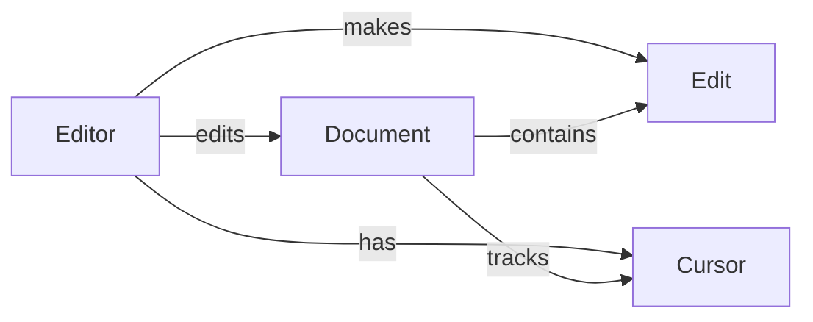
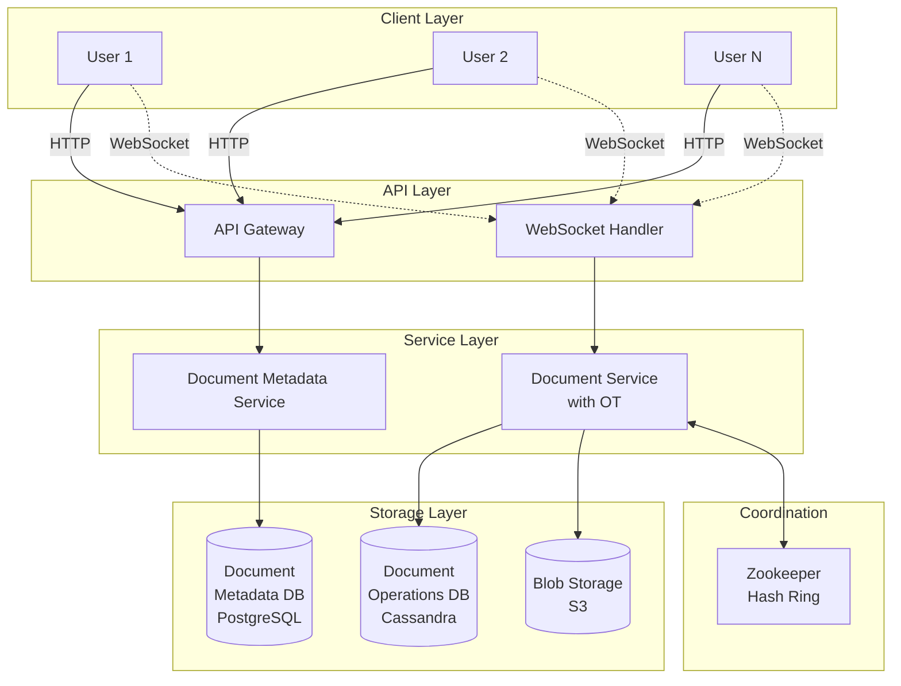
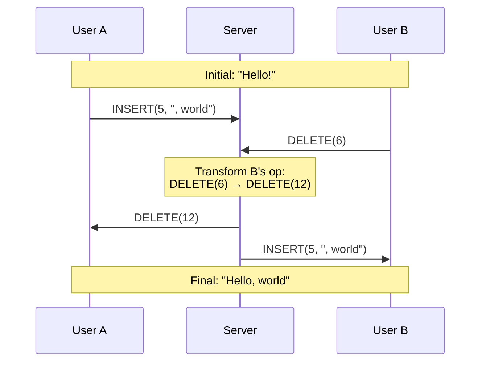
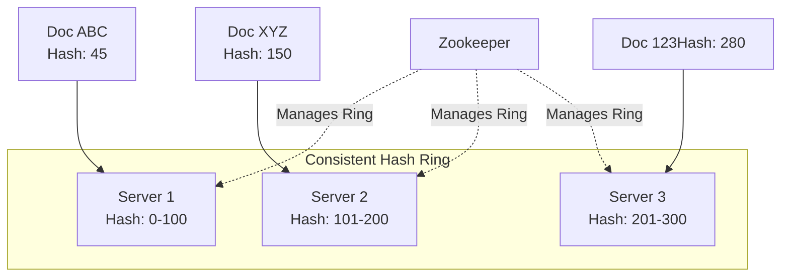
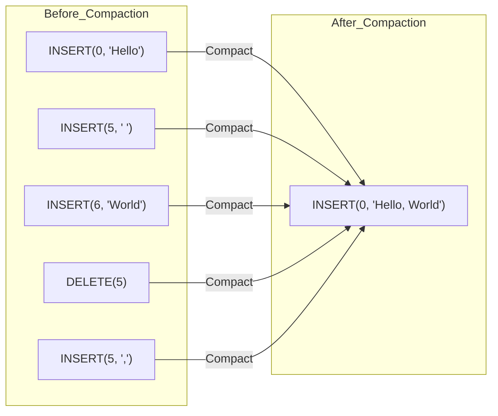

# Google Docs System Design Interview Guide

## 📋 Problem Overview

Design a browser-based collaborative document editor (like Google Docs) that supports real-time collaboration.

## 🎯 Requirements

### Functional Requirements

1. **Create documents** - Users can create new documents
2. **Concurrent editing** - Multiple users edit same document simultaneously
3. **Real-time updates** - View other users' changes in real-time
4. **Presence awareness** - See cursor position and presence of other users

### Non-Functional Requirements

- **Eventually consistent** documents across all users
- **Low latency** updates (< 100ms)
- **Scale**: Millions of concurrent users, billions of documents
- **Limit**: Max 100 concurrent editors per document
- **Durability**: Documents persist through server restarts

### Out of Scope

- Complex document structure (assume simple text editor)
- Permissions and access control
- Document history/versioning (initially)

## 🏗️ Core Entities



- **Editor**: User editing a document
- **Document**: Collection of text managed by editors
- **Edit**: Change made to document by an editor
- **Cursor**: Position and presence of editor in document

## 🔌 API Design

### REST APIs

```javascript
// Create new document
POST /docs
{
  title: string
}
→ { docId: string }
```

### WebSocket Messages

```javascript
// WebSocket connection
WS /docs/{docId}

// Client → Server
SEND { type: "insert", position: int, text: string }
SEND { type: "delete", position: int }
SEND { type: "updateCursor", position: int }

// Server → Client
RECV { type: "update", operations: [...] }
RECV { type: "cursorUpdate", userId: string, position: int }
```

## 🏛️ High-Level Architecture

### Basic System Design



## 🔄 Collaborative Editing Approaches

### ❌ Problem: Naive Approaches Don't Work

1. **Sending Snapshots** - Inefficient (100s KB per keystroke) and loses concurrent edits
2. **Sending Raw Edits** - Context-dependent edits conflict without coordination

### ✅ Solution 1: Operational Transformation (OT)

**How it works:**

- Transform operations based on other concurrent operations
- Central server provides final ordering
- Each edit adjusted based on prior edits



**Pros:**

- Low memory usage
- Fast processing
- Good for centralized systems

**Cons:**

- Requires central server
- Complex to implement correctly
- Limited concurrent users per document

### ✅ Solution 2: Conflict-free Replicated Data Types (CRDTs)

**How it works:**

- Make all operations commutative (order-independent)
- Use real numbers for positions (infinite divisibility)
- Keep tombstones for deleted text

**Example:**

```
Initial: H(0) e(1) l(2) l(3) o(4) !(5)
User A inserts ",": H(0) e(1) l(2) l(3) o(4) ,(4.3) !(5)
User B inserts " there": H(0) e(1) l(2) l(3) o(4) t(4.1) h(4.2) e(4.4) r(4.5) e(4.7) !(5)
Result: "Hello t,here!" (converges regardless of order)
```

**Pros:**

- No central server needed
- Works offline
- Eventually consistent

**Cons:**

- Higher memory usage
- Less efficient computationally
- Inelegant conflict resolution

## 🎯 Design Choice: Using OT

For this design, we choose **Operational Transformation** because:

- Google Docs actually uses it
- Lower memory footprint
- Works well with our 100 concurrent editors limit
- Centralized server aligns with our architecture

## 📈 Scaling Strategies

### 1. Horizontal Scaling with Consistent Hashing



**Connection Flow:**

1. Client connects to any server via HTTP
2. Server checks hash ring for document ownership
3. Redirects if necessary to correct server
4. Upgrades to WebSocket on correct server
5. All document users connect to same server

### 2. Storage Optimization: Compaction

**Problem:** Billions of documents × thousands of operations = massive storage

**Solution: Operation Compaction**



**Two Approaches:**

1. **Offline Compaction Service**

   - Separate service periodically compacts operations
   - Uses document versioning for atomicity
   - Safer but more complex

2. **Online Compaction** (Preferred)
   - Document Service compacts when last user disconnects
   - Already has operations in memory
   - Lower latency, simpler implementation

## 🔑 Key Implementation Details

### Document Operations Database Schema

```sql
Operations Table (Cassandra):
- documentVersionId (partition key)
- timestamp (clustering key)
- operation_data
- metadata
```

### Document Metadata Database Schema

```sql
Document Table (PostgreSQL):
- id (primary key)
- title
- documentVersionId (foreign key)
- created_at
- updated_at
```

### WebSocket State Management

```javascript
// Server maintains per document:
documentConnections = {
  docId: {
    operations: [...],        // All operations
    connections: Map(),       // userId → WebSocket
    cursors: Map(),          // userId → position
    versionId: string        // Current version
  }
}
```

## 🎓 Interview Tips by Level

### Mid-Level (L4/E4)

- Focus on high-level design
- Understand consistency challenges
- Know basic scaling patterns
- Identify bottlenecks with guidance

### Senior (L5/E5)

- Proactively identify consistency issues
- Discuss database tradeoffs
- Understand WebSocket scaling
- Complete 1-2 deep dives

### Staff (L6/E6)

- Demonstrate mastery of distributed systems
- Know OT/CRDT concepts
- Handle complex scaling scenarios
- Complete 3+ deep dives with optimizations

## 🚀 Additional Deep Dive Topics

### 1. Read-Only Mode

- Separate read-only servers using CDN
- Cache rendered documents
- No OT needed for viewers
- Scale to millions of readers

### 2. Offline Support

- Local operation queue
- Client-side OT
- Sync on reconnection
- Handle conflict resolution

### 3. Performance Optimizations

- Operation batching (reduce network calls)
- Lazy loading for large documents
- Memory-mapped files for Document Service
- Redis for cursor positions

### 4. Security & Permissions

- Document-level access control
- JWT tokens for WebSocket auth
- Rate limiting per user
- Encryption at rest and in transit

## 📊 Back-of-Envelope Calculations

### Storage Requirements

- 1 billion documents × 50KB average = 50TB
- With 3x replication = 150TB
- Operation logs: 100 operations × 100 bytes × 1B docs = 10TB
- Total: ~200TB storage needed

### Memory Requirements (per Document Service)

- 1000 active documents × 50KB = 50MB for documents
- 1000 documents × 100 users × 100 bytes (cursor) = 10MB
- WebSocket overhead: 100K connections × 10KB = 1GB
- Total: ~2GB RAM per server

### Bandwidth

- 100 concurrent editors × 10 edits/sec × 100 bytes = 100KB/s per document
- 1000 documents per server = 100MB/s per server
- Manageable with modern infrastructure

## 🔍 Common Pitfalls to Avoid

1. **Don't forget about cursor synchronization** - It's ephemeral but critical for UX
2. **Consider operation ordering** - OT requires strict ordering from central server
3. **Handle reconnection gracefully** - WebSockets will disconnect
4. **Plan for compaction early** - Storage will explode without it
5. **Remember consistency guarantees** - Eventually consistent is okay here

## 📚 References & Further Reading

- [Google's OT Implementation](https://drive.googleblog.com/2010/09/whats-different-about-new-google-docs.html)
- [Understanding CRDTs](https://crdt.tech/)
- [Yjs - CRDT Framework](https://github.com/yjs/yjs)
- [OT vs CRDT Comparison](https://www.inkandswitch.com/peritext/)
- [Figma's Multiplayer Technology](https://www.figma.com/blog/how-figmas-multiplayer-technology-works/)

---

## 💡 Quick Reference Checklist

- [ ] Define functional and non-functional requirements
- [ ] Identify core entities and relationships
- [ ] Design REST and WebSocket APIs
- [ ] Draw high-level architecture
- [ ] Explain consistency problem (concurrent edits)
- [ ] Choose OT vs CRDT and justify
- [ ] Design scaling solution (consistent hashing)
- [ ] Address storage optimization (compaction)
- [ ] Handle cursor/presence synchronization
- [ ] Discuss at least 2 deep dives based on level

# Google Docs System Design - Quick Revision Points

## 🎯 Core Requirements

• **Functional**: Create docs, concurrent editing, real-time updates, cursor presence
• **Non-Functional**: Eventually consistent, <100ms latency, millions of users, max 100 concurrent editors/doc
• **Out of scope**: Complex formatting, permissions, versioning (initially)

## 🏗️ Key Components

• **API Gateway** → handles HTTP requests
• **WebSocket Handler** → maintains persistent connections for real-time updates
• **Document Service** → manages OT/CRDT operations
• **Document Metadata Service** → handles doc properties
• **Storage**: PostgreSQL (metadata), Cassandra (operations), S3 (blobs)
• **Zookeeper** → manages consistent hash ring for scaling

## 🔄 Consistency Solutions

### Operational Transformation (OT) ✅ Chosen

• Transforms operations based on concurrent edits
• Central server provides ordering
• Lower memory, faster processing
• Needs central coordination
• Google Docs actually uses this

### CRDTs (Alternative)

• Order-independent operations
• Works offline, no central server
• Higher memory usage
• Less elegant conflict resolution

## 📡 API Design

• **REST**: `POST /docs` to create document
• **WebSocket**: `/docs/{docId}` for real-time connection
• **Messages**: insert, delete, updateCursor operations
• **Server broadcasts**: updates to all connected clients

## 🚀 Scaling Strategy

### Consistent Hashing

• Documents distributed across servers using hash ring
• Each doc lives on ONE server (all users connect there)
• Zookeeper manages ring membership
• Server redirects if doc not owned

### Connection Flow

1. Client HTTP request → any server
2. Check hash ring for doc owner
3. Redirect if needed
4. Upgrade to WebSocket on correct server
5. All doc users on same server for OT

## 💾 Storage Optimization

### Operation Compaction

• **Problem**: Billions of docs × thousands of ops = massive storage
• **Solution**: Compact operations when last user disconnects
• Example: 5 operations → 1 snapshot
• **Online compaction** preferred (simpler than offline service)

### Storage Schema

• **Cassandra**: Operations table (docVersionId, timestamp, operation_data)
• **PostgreSQL**: Document metadata (id, title, versionId, timestamps)
• **S3**: Document snapshots after compaction

## 📊 Scale Numbers

• **Storage**: 1B docs × 50KB = 50TB (150TB with replication)
• **Memory/server**: ~2GB (1000 docs × 50KB + WebSocket overhead)
• **Bandwidth/server**: 100MB/s (1000 docs × 100 editors × edits)
• **Latency target**: <100ms for operation propagation

## 🎓 Deep Dives by Level

### L4/E4 (Mid-Level)

• High-level architecture
• Basic consistency challenges
• Simple scaling patterns
• WebSocket vs HTTP polling

### L5/E5 (Senior)

• OT implementation details
• Database tradeoffs (SQL vs NoSQL)
• WebSocket scaling challenges
• Compaction strategies

### L6/E6 (Staff)

• OT vs CRDT mathematical foundations
• Complex failure scenarios
• Cross-region replication
• Performance optimizations (batching, lazy loading)

## ⚡ Performance Optimizations

• **Operation batching**: Group multiple ops before sending
• **Lazy loading**: Load document chunks as needed
• **CDN for read-only**: Separate read path from write
• **Redis**: Cache cursor positions (ephemeral data)
• **Memory-mapped files**: Fast document access in service

## 🔴 Common Pitfalls

• Forgetting cursor synchronization (critical for UX)
• Not addressing operation ordering (OT requires strict order)
• Ignoring WebSocket disconnections (need reconnection logic)
• Missing compaction (storage explodes without it)
• Over-engineering consistency (eventual is fine here)

## 🏃 Interview Flow

1. **Clarify requirements** (2-3 min)
2. **Draw high-level design** (5-7 min)
3. **Explain consistency problem** (5 min)
4. **Choose OT vs CRDT** with justification (3-5 min)
5. **Design scaling solution** (5-7 min)
6. **Discuss storage & compaction** (5 min)
7. **Deep dives** based on time/level (10-15 min)
8. **Handle interviewer questions** (5-10 min)

## 💡 Key Talking Points

• "OT requires central coordination but provides better UX"
• "Consistent hashing ensures all doc users on same server"
• "Compaction prevents unbounded storage growth"
• "WebSockets for real-time, REST for metadata"
• "Eventually consistent is acceptable for documents"
• "Cursor position is ephemeral, doesn't need persistence"

## 🚨 Must Remember

• **100 concurrent editors limit** → influences OT choice
• **Document ownership** → one server per doc for OT
• **Operation log** → source of truth, snapshots are optimization
• **Cursor updates** → separate from document operations
• **Reconnection handling** → critical for reliability
