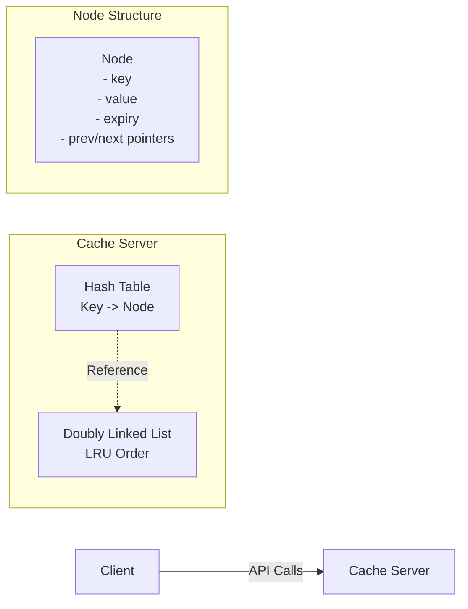
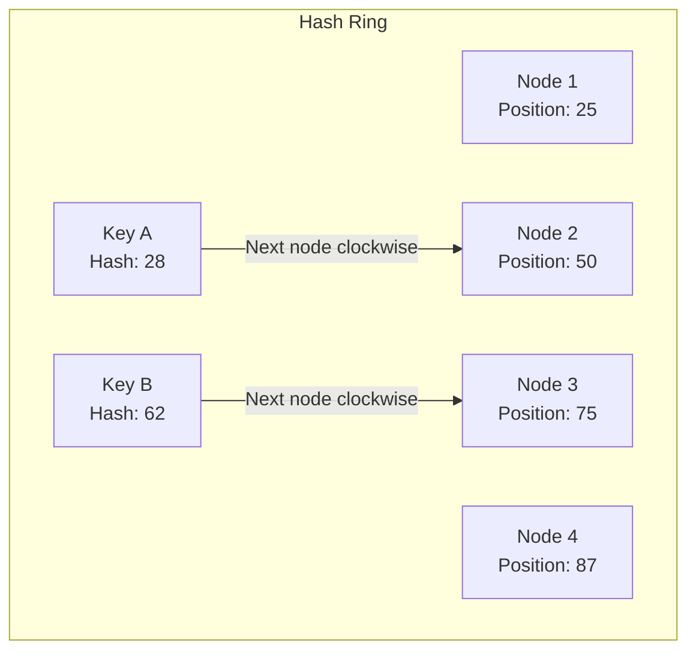
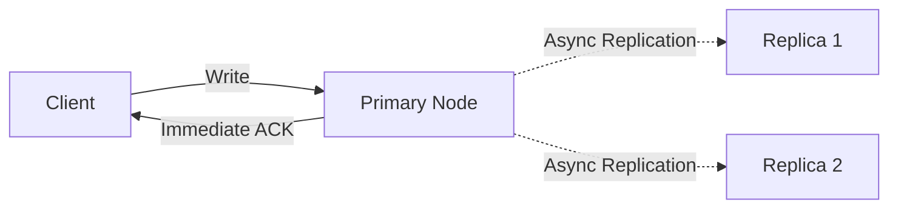
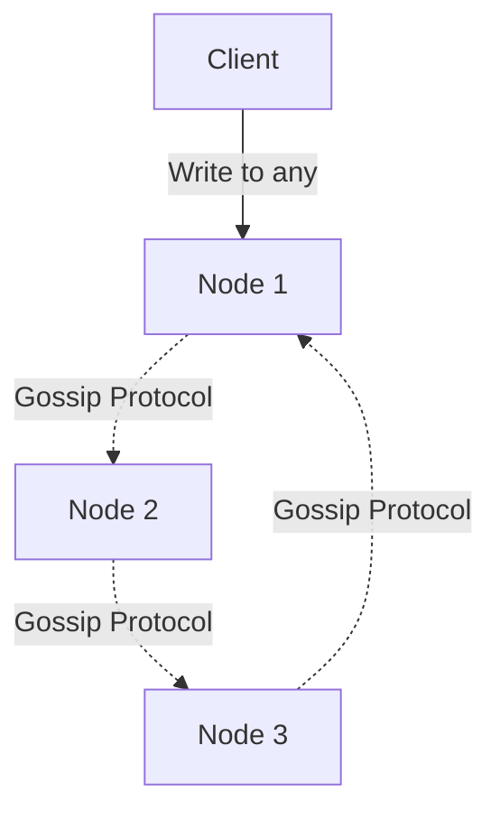
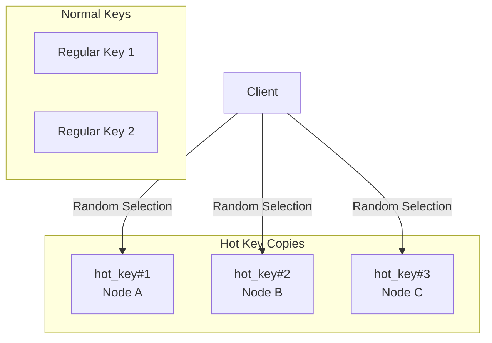
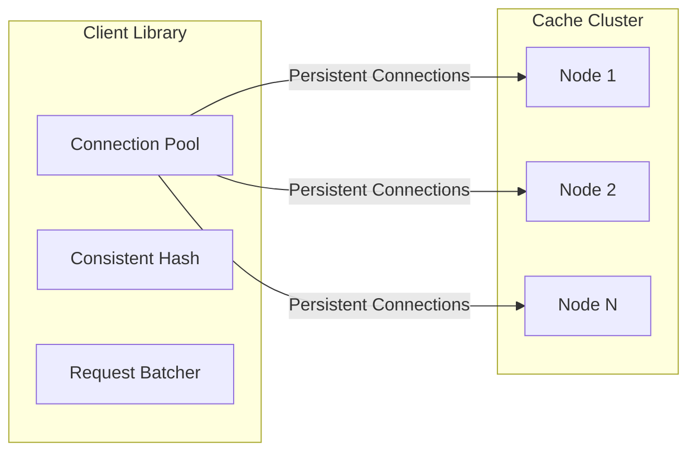
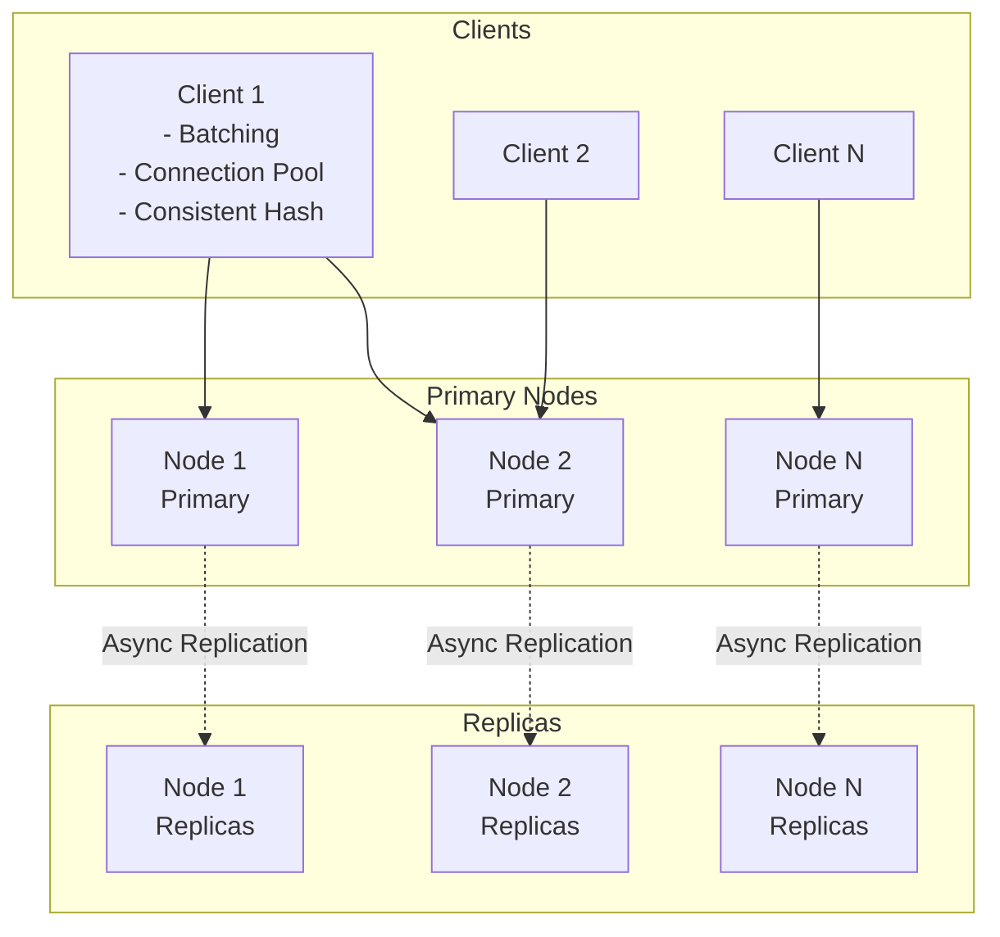

# Distributed Cache System Design Interview Guide

## Problem Understanding

### What is a Distributed Cache?

- **Definition**: A system that stores key-value pairs in memory across multiple machines
- **Key Difference from Single-Node**: Scales horizontally across many nodes to handle massive workloads
- **Core Features**: Data partitioning, replication, high availability, fault tolerance

## Requirements Analysis

### Functional Requirements

1. **Core Operations**
   - `set(key, value)` - Store key-value pairs
   - `get(key)` - Retrieve values
   - `delete(key)` - Remove entries
2. **TTL Support** - Configure expiration time for entries
3. **Eviction Policy** - LRU (Least Recently Used)

### Non-Functional Requirements

- **Scale**: 1TB data storage, 100k requests/second
- **Availability**: High availability with eventual consistency
- **Latency**: < 10ms for get/set operations
- **Scalability**: Support horizontal scaling

### Out of Scope

- Data persistence/durability
- Strong consistency guarantees
- Complex querying
- Transaction support

## Core Design Components

### 1. Single Node Architecture

#### Data Structures



#### LRU Implementation

- **Hash Table**: O(1) lookups - maps keys to nodes
- **Doubly Linked List**: O(1) order updates - maintains access order
- **Operations**:
  - On access: Move node to front
  - On capacity: Remove from tail
  - All operations remain O(1)

#### TTL Implementation

```python
# Pseudocode structure
class CacheEntry:
    value: any
    expiry_time: timestamp

get(key):
    if entry.expiry_time < current_time:
        delete(key)
        return null
    move_to_front(entry)
    return entry.value
```

### 2. Distributed Architecture

#### Capacity Planning

- **Storage**: 1TB / 24GB per node ≈ 50 nodes needed
- **Throughput**: 100k RPS / 20k per node ≈ 5 nodes minimum
- **Decision**: Use 50 nodes (storage-bound requirement)

## Scaling Strategies

### Data Distribution - Consistent Hashing



**Benefits**:

- Minimal key remapping when nodes join/leave
- Only keys in affected range need redistribution
- Better than simple modulo (hash % N)

### Replication Strategies

#### 1. Asynchronous Replication (Recommended)



**Pros**: Low write latency, high availability
**Cons**: Eventual consistency, potential data loss

#### 2. Peer-to-Peer Replication



**Pros**: No single point of failure, excellent scalability
**Cons**: Complex conflict resolution, eventual consistency

## Hot Key Mitigation

### Hot Reads Solutions

#### 1. Key Replication



**Implementation**:

- Create multiple copies with suffixes (key#1, key#2, key#3)
- Client randomly selects a copy for reads
- Distribute load across multiple nodes

### Hot Writes Solutions

#### 1. Key Sharding with Suffixes

```python
# Write distribution
def write_counter(key, increment):
    shard_count = 10
    shard_id = random(0, shard_count-1)
    shard_key = f"{key}:{shard_id}"
    increment_value(shard_key, increment)

# Read aggregation
def read_counter(key):
    total = 0
    for i in range(10):
        total += get(f"{key}:{i}")
    return total
```

#### 2. Write Batching

- Collect writes over time window (50-100ms)
- Apply as single atomic update
- Reduces load by order of magnitude

## Performance Optimizations

### Client-Side Optimizations

1. **Connection Pooling**: Maintain persistent connections
2. **Request Batching**: Combine multiple operations
3. **Client-Side Hashing**: Direct routing without proxy

### Network Optimizations



## Final Architecture



## API Design

```http
# Set operation
POST /:key
{
  "value": "data",
  "ttl": 3600  // optional, in seconds
}

# Get operation
GET /:key
Response: {"value": "data"}

# Delete operation
DELETE /:key
```

## Interview Tips by Level

### Mid-Level Focus

- Emphasize data structure choices (HashMap + DLL for LRU)
- Basic understanding of replication needs
- Simple sharding strategies

### Senior-Level Focus

- Deep dive into consistent hashing
- Trade-offs between replication strategies
- Hot key mitigation techniques
- Performance optimization strategies

### Staff-Level Focus

- Operational concerns and monitoring
- Complex failure scenarios
- Multi-region considerations
- Cost optimization strategies

## Additional Considerations

### Monitoring & Operations

1. **Metrics to Track**:

   - Cache hit/miss ratio
   - Latency percentiles (p50, p95, p99)
   - Hot key detection
   - Memory usage per node
   - Replication lag

2. **Failure Handling**:
   - Node failure detection (heartbeats)
   - Automatic failover to replicas
   - Rebalancing after node addition/removal
   - Split-brain scenarios

### Advanced Features

1. **Multi-Region Support**:

   - Cross-region replication
   - Geo-routing for low latency
   - Consistency models per region

2. **Security**:

   - Authentication/Authorization
   - Encryption at rest and in transit
   - Key namespace isolation

3. **Advanced Eviction Policies**:
   - LFU (Least Frequently Used)
   - FIFO (First In, First Out)
   - Custom policies based on key patterns

## Common Pitfalls to Avoid

1. **Don't over-engineer early**: Start with simple design, then scale
2. **Consider read/write ratio**: Different strategies for read-heavy vs write-heavy
3. **Network overhead**: Don't ignore connection setup costs
4. **Consistency requirements**: Be clear about eventual consistency trade-offs
5. **Hot key detection**: Must be proactive, not reactive

## Quick Decision Framework

| Scenario                 | Recommended Approach                     |
| ------------------------ | ---------------------------------------- |
| High availability needed | Asynchronous replication                 |
| Many hot reads           | Key replication with suffixes            |
| Many hot writes          | Sharding with suffixes + batching        |
| Need strong consistency  | Synchronous replication (rare for cache) |
| Global distribution      | Multi-region with geo-routing            |

## Sample Capacity Calculations

```
Given: 1TB data, 100k RPS

Per Node Capacity:
- Memory: 32GB instance → 24GB usable
- Throughput: ~20k RPS per node

Nodes Required:
- For storage: 1024GB / 24GB = 43 nodes
- For throughput: 100k / 20k = 5 nodes
- Decision: 50 nodes (storage-bound)

With Replication (3x):
- Total nodes: 50 × 3 = 150 nodes
- Cost consideration: ~$15k/month on AWS
```

## References & Further Reading

- Consistent Hashing: Used in Cassandra, DynamoDB
- LRU Implementation: Redis approach
- Hot Key Mitigation: Facebook's mcrouter
- Gossip Protocol: Used in Cassandra, Riak

# Distributed Cache System - Quick Revision Points

## 🎯 Core Concepts

• **What**: In-memory key-value store distributed across multiple machines
• **Why**: Single node can't handle TB-scale data or 100k+ RPS
• **Key Operations**: get(key), set(key, value), delete(key) with TTL support

## 📊 Requirements Checkpoint

• **Scale**: 1TB storage, 100k RPS
• **Latency**: < 10ms for operations
• **Consistency**: Eventual consistency is acceptable
• **Availability**: High availability with fault tolerance

## 🏗️ Single Node Design

• **Data Structure**: HashMap + Doubly Linked List
• **HashMap**: O(1) key lookups
• **DLL**: O(1) LRU order updates (move to front on access, evict from tail)
• **TTL**: Check expiry on get(), use background cleanup thread

## 🌐 Distribution Strategy

• **Consistent Hashing**: Minimal key redistribution when nodes join/leave
• **Hash Ring**: Keys assigned to next node clockwise
• **Virtual Nodes**: Multiple positions per physical node for better distribution

## 📈 Capacity Planning

• **Storage**: 1TB / 24GB per node = ~50 nodes
• **Throughput**: 100k RPS / 20k per node = 5 nodes
• **Decision**: Use 50 nodes (storage-bound)
• **With 3x Replication**: 150 total nodes

## 🔄 Replication Approaches

• **Async Replication** (Recommended):

- Write to primary → immediate ACK → async to replicas
- Low latency, eventual consistency

• **Sync Replication**:

- Wait for replica ACK before client response
- Higher latency, strong consistency

• **Peer-to-Peer**:

- Gossip protocol, no master
- Complex but highly available

## 🔥 Hot Key Solutions

**Hot Reads:**
• Create key copies with suffixes (key#1, key#2, key#3)
• Client randomly selects copy
• Distributes load across nodes

**Hot Writes:**
• Shard key into buckets (key:0, key:1, ... key:9)
• Write to random shard
• Aggregate on read
• Batch writes over 50-100ms window

## ⚡ Performance Optimizations

• **Connection Pooling**: Reuse persistent connections
• **Request Batching**: Combine multiple operations
• **Client-Side Hashing**: Direct routing without proxy
• **Compression**: For large values
• **Binary Protocol**: More efficient than text

## 🚨 Failure Handling

• **Detection**: Heartbeat mechanism (every 5-10 seconds)
• **Failover**: Automatic switch to replicas
• **Rebalancing**: Redistribute keys after node changes
• **Split Brain**: Use quorum or external coordinator

## 📝 Key Design Decisions

| Problem       | Solution                      | Trade-off              |
| ------------- | ----------------------------- | ---------------------- |
| Scale to 1TB  | Consistent hashing + 50 nodes | Operational complexity |
| 100k RPS      | Async replication             | Eventual consistency   |
| Hot keys      | Key replication/sharding      | Storage overhead       |
| Node failures | 3x replication                | 3x storage cost        |
| Low latency   | In-memory storage             | No persistence         |

## 🎓 Interview Level Focus

**Mid-Level:**
• Focus on LRU implementation details
• Basic sharding with modulo
• Simple replication understanding

**Senior:**
• Consistent hashing deep dive
• Replication strategy trade-offs
• Hot key detection and mitigation
• Connection pooling and batching

**Staff:**
• Multi-region considerations
• Cost optimization ($15k/month for 150 nodes)
• Operational monitoring and alerting
• Complex failure scenarios

## ⚠️ Common Mistakes to Avoid

• Forgetting about hot keys problem
• Ignoring network connection overhead
• Over-engineering for strong consistency (cache doesn't need it)
• Not considering replication impact on capacity
• Missing TTL implementation details
• Assuming unlimited node memory

## 🔍 Quick Monitoring Metrics

• Cache hit/miss ratio (target > 90%)
• Latency percentiles (p50, p95, p99)
• Memory usage per node
• Hot key frequency
• Replication lag
• Connection pool saturation

## 💡 Final Tips

• Start simple (single node), then distribute
• Clarify consistency requirements early
• Consider read/write ratio (90/10 typical)
• Remember: Cache can lose data (not persistent)
• Use existing solutions as reference (Redis, Memcached)
• Always calculate capacity with real numbers
