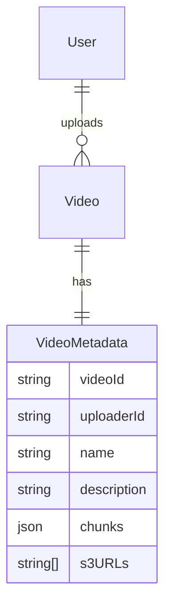
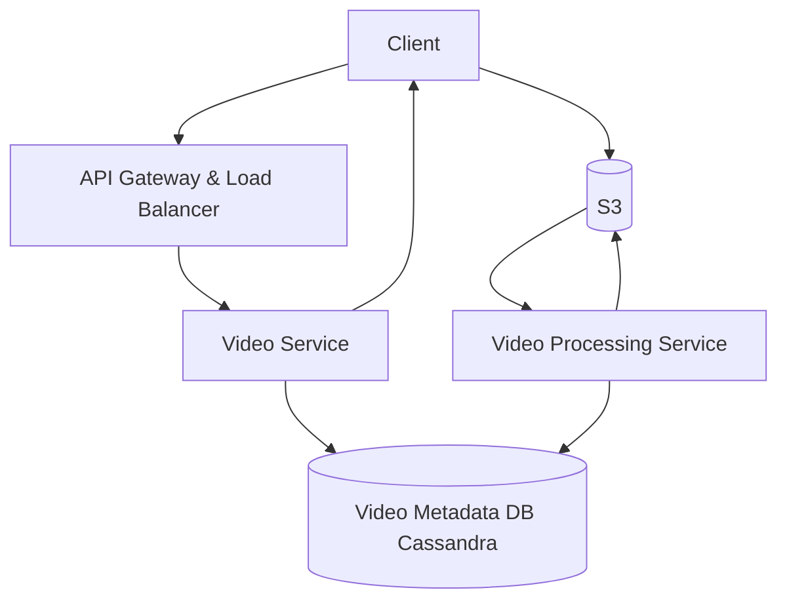
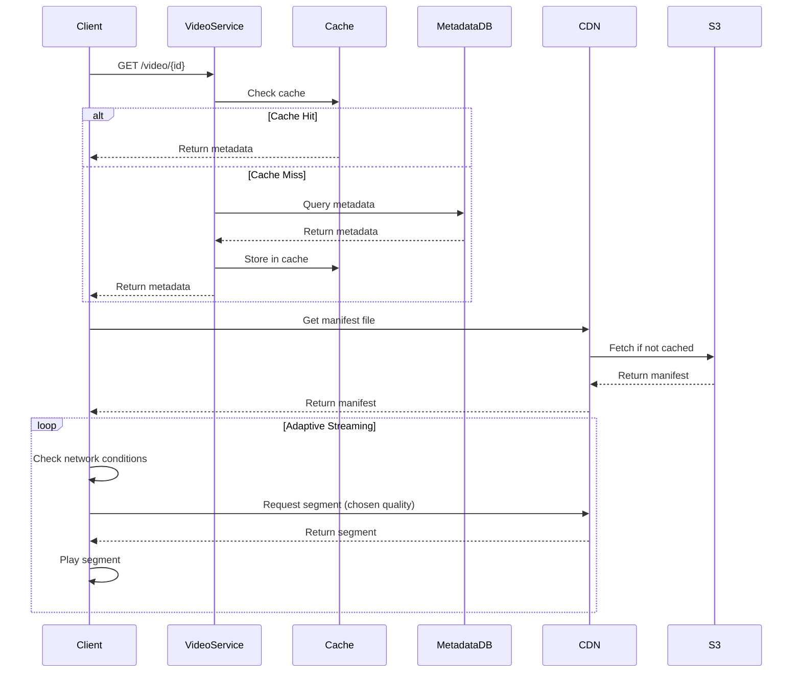
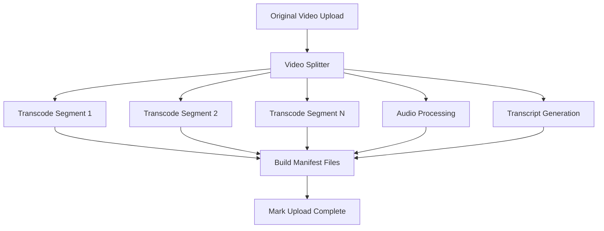
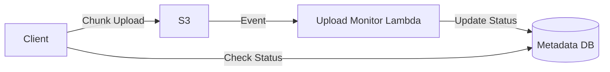
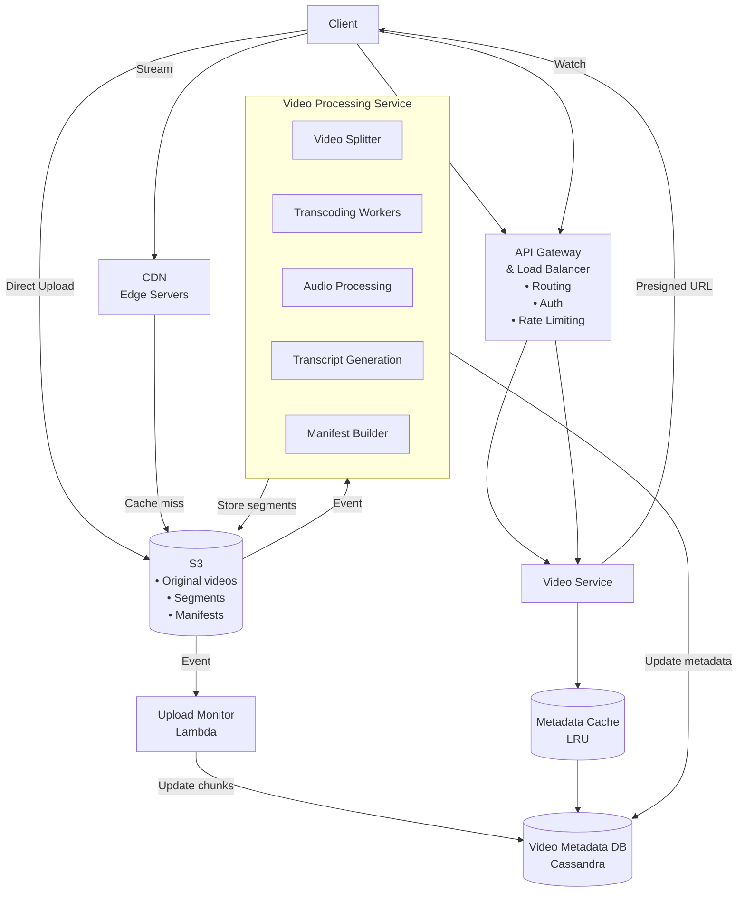

# YouTube System Design Interview Guide

## 📋 Overview

YouTube is a video-sharing platform - the second most visited website in the world. This design has overlap with file storage systems (like Dropbox) but focuses on video streaming complexities.

## 🎯 Functional Requirements

### Core Requirements

1. **Upload videos** - Users can upload videos
2. **Watch/stream videos** - Users can stream videos

### Below the Line (Out of Scope)

- View video metadata (view counts, descriptions)
- Search for videos
- Comment on videos
- Recommendations
- Channel management
- Subscriptions

## ⚡ Non-Functional Requirements

### Critical Requirements

1. **High availability** (prioritize over consistency)
2. **Support large videos** (10+ GB)
3. **Low latency streaming** (even in low bandwidth)
4. **High scale**:
   - ~1M videos uploaded/day
   - 100M videos watched/day
5. **Resumable uploads**

### Out of Scope

- Content moderation
- Bot protection
- Monitoring/alerting

## 🏗️ Core Entities



## 🔌 API Design

### Initial APIs

- `POST /presigned_url` - Get presigned URL for direct S3 upload
  - Request: VideoMetadata
  - Response: Presigned URL
- `GET /videos/{videoId}` - Get video metadata
  - Response: VideoMetadata with manifest file URLs

## 🎬 Video Storage & Streaming Fundamentals

### Key Concepts

- **Video Codec**: Compresses/decompresses video (H.264, H.265, VP9, AV1)
- **Video Container**: File format storing video data and metadata
- **Bitrate**: Data transmitted per time (affects quality)
- **Manifest Files**: Index files listing video segments in different formats
  - Primary manifest: Lists all available video versions
  - Media manifest: Lists segments for specific format

## 📤 Video Upload Flow

### Evolution of Storage Approaches

#### ❌ Bad: Store Raw Video

- Different devices need different formats
- No post-processing = incompatible playback

#### ✅ Good: Store Different Formats

- Post-process into multiple formats
- Still stores entire video files

#### ✅✅ Great: Store Formatted Segments

- Split videos into small segments (few seconds each)
- Convert each segment to multiple formats
- Enables adaptive bitrate streaming

### Upload Architecture



## 📺 Video Streaming Flow

### Evolution of Streaming Approaches

#### ❌ Bad: Download Entire Video

- Long wait times (10GB = 13+ min on 100Mbps)
- Network disruption = lost progress
- Not true "streaming"

#### ✅ Good: Download Segments Incrementally

- Quick start (download first segment)
- Background downloading of next segments
- Doesn't adapt to network changes

#### ✅✅ Great: Adaptive Bitrate Streaming

- Dynamically adjusts quality based on network
- Uses manifest files to track segments
- Seamless quality transitions

### Streaming Process

1. Fetch VideoMetadata (includes manifest URL)
2. Download manifest file
3. Choose format based on network/settings
4. Download first segment
5. Play segment while downloading more
6. Adjust quality based on network conditions



## 🔧 Deep Dives

### 1. Video Processing Pipeline (DAG)



**Key Points:**

- Use orchestrator (e.g., Temporal) for DAG management
- Parallel processing of segments
- Store temporary files in S3
- CPU-intensive transcoding distributed across workers

### 2. Resumable Uploads

**Implementation:**

1. Client divides video into chunks (5-10MB)
2. Each chunk has fingerprint hash
3. VideoMetadata tracks chunks with status
4. Client uploads chunks to S3
5. Lambda updates chunk status on S3 events
6. Resume by checking uploaded chunks



### 3. Scaling Strategies

#### Pattern: Handling Large Blobs

- Presigned URLs for direct S3 upload
- Multipart upload for resumability
- Bypass application servers for file transfer

#### Pattern: Scaling Reads

- **Problem**: Hot videos create DB bottlenecks
- **Solutions**:
  - Cassandra replication (multiple nodes serve same data)
  - LRU cache for popular video metadata
  - CDN for video segments and manifest files

### Final Architecture



## 📊 Scale Calculations

### Storage

- 1M videos/day × 365 days = 365M videos/year
- Partition by videoId in Cassandra

### Bandwidth

- 100M views/day
- CDN crucial for geographic distribution
- Cache popular content at edge

## 🎓 Interview Expectations by Level

### Mid-Level

- **Focus**: 80% breadth, 20% depth
- **Key Points**:
  - Define clear APIs and data model
  - Understand multipart upload
  - Basic segment-based streaming
  - Direct S3 interaction
  - One deep dive topic

### Senior

- **Focus**: 60% breadth, 40% depth
- **Key Points**:
  - Quick high-level design
  - Detailed video post-processing
  - Multipart upload for resumability
  - Adaptive bitrate streaming details
  - DAG-based processing pipeline

### Staff+

- **Focus**: 40% breadth, 60% depth
- **Key Points**:
  - Breeze through basics
  - Deep dive into complex scenarios
  - Trade-off analysis
  - Real-world experience examples
  - Alternative approaches (e.g., pipelined upload)

## 💡 Additional Considerations

### Performance Optimizations

1. **Pipelined Upload**: Start processing while still uploading
2. **Predictive Caching**: Pre-cache likely next segments
3. **Geographic Sharding**: Store videos closer to expected audience

### Features to Discuss (if time)

- Resume playback position
- View count tracking (exact vs estimated)
- Live streaming capabilities
- Recommendation system integration
- Content delivery optimization

## 🔑 Key Takeaways

1. **Storage Strategy**: Segment-based storage enables adaptive streaming
2. **Upload Pattern**: Direct S3 upload with presigned URLs
3. **Processing**: DAG-based parallel processing for efficiency
4. **Streaming**: Adaptive bitrate with manifest files
5. **Scale**: CDN + caching for read-heavy workload
6. **Reliability**: Resumable uploads via chunking

## 📝 Common Pitfalls to Avoid

- Don't store raw video only
- Don't route large files through application servers
- Don't forget about different device formats
- Don't neglect CDN for global users
- Don't process video sequentially (use parallel DAG)
- Don't ignore network variability (use adaptive streaming)

## 🏆 Tips for Success

1. Start with simple design, iterate to complex
2. Clarify scope early (focus on video upload/stream)
3. Draw clear diagrams
4. Explain trade-offs explicitly
5. Use real numbers for scale calculations
6. Reference similar systems you've built
7. Ask clarifying questions about requirements

# YouTube System Design - Quick Revision Points

## 🎯 Core Requirements

• **Upload videos** + **Stream videos** (focus on these two)
• High availability > consistency
• Support 10GB+ videos with resumable uploads
• Low latency streaming with adaptive quality
• Scale: 1M uploads/day, 100M views/day

## 📤 Upload Flow - Key Evolution

• ❌ **Bad**: Store raw video → incompatible formats
• ✅ **Good**: Store different formats → still large files
• ✅✅ **Best**: Store formatted segments → enables adaptive streaming

## 🔑 Upload Architecture Must-Haves

• **Presigned URLs** → direct S3 upload (bypass servers)
• **Multipart upload** → resumable (5-10MB chunks with fingerprints)
• **S3 events** → trigger processing pipeline
• **DAG processing** → parallel segment transcoding
• Store metadata in Cassandra (partition by videoId)

## 📺 Streaming Flow - Key Evolution

• ❌ **Bad**: Download entire video → long wait
• ✅ **Good**: Download segments incrementally → quick start
• ✅✅ **Best**: Adaptive bitrate streaming → adjusts to network

## 🎬 Video Processing Essentials

• **Video segments**: Few seconds each
• **Multiple formats**: Different devices/bandwidths
• **Manifest files**:

- Primary manifest → lists all formats
- Media manifest → lists segments per format
  • **DAG pipeline**: Split → Transcode (parallel) → Audio → Transcript → Manifest

## 🏗️ Architecture Components

• **API Gateway** → routing, auth, rate limiting
• **Video Service** → generates presigned URLs, serves metadata
• **S3** → videos, segments, manifests
• **Cassandra** → video metadata (high availability)
• **LRU Cache** → popular video metadata
• **CDN** → edge caching for segments/manifests
• **Lambda** → monitor upload progress
• **Processing Service** → DAG orchestrator (Temporal)

## 📊 Scaling Strategies

• **Reads**: CDN + LRU cache + Cassandra replication
• **Writes**: Direct S3 upload with presigned URLs
• **Hot videos**: Cache at multiple levels (metadata + segments)
• **Geographic**: CDN edge servers globally

## 🚀 Performance Optimizations

• **Pipelined upload**: Start processing while uploading
• **Predictive caching**: Pre-cache next segments
• **Adaptive quality**: Switch formats based on bandwidth
• **Parallel processing**: Transcode segments simultaneously

## ⚠️ Critical Design Decisions

• **Segments over full files** → enables streaming + adaptivity
• **Direct S3 upload** → avoid server bottleneck
• **Manifest-based streaming** → flexible format selection
• **DAG processing** → efficient parallelization
• **Chunked uploads** → resumability
• **CDN mandatory** → global low-latency delivery

## 🎓 Level-Specific Focus

• **Mid-Level**: APIs, data model, basic streaming, one deep dive
• **Senior**: Processing pipeline, adaptive streaming, DAG details
• **Staff+**: Trade-offs, alternatives, real-world optimizations

## 🔴 Common Mistakes to Avoid

• Routing large files through app servers
• Sequential video processing
• Ignoring different device formats
• Missing CDN for global scale
• Not supporting resumable uploads
• Storing only raw video

## 💬 Key Talking Points

• "Segment-based storage enables adaptive streaming"
• "Presigned URLs bypass server bottleneck"
• "DAG allows parallel processing of segments"
• "Manifest files enable quality switching"
• "CDN + caching handles read-heavy load"
• "Chunking enables resumable uploads"

## 📝 Quick API Reference

```
POST /presigned_url → Get S3 upload URL
GET /videos/{id} → Get video metadata + manifest URL
```

## 🏁 Interview Flow

1. Clarify requirements (focus on upload/stream)
2. Design data model (VideoMetadata with chunks)
3. Upload flow (presigned URL → S3 → processing)
4. Streaming flow (metadata → manifest → segments)
5. Scale discussion (CDN, caching, replication)
6. Deep dive (pick DAG/resumability/adaptive streaming)
