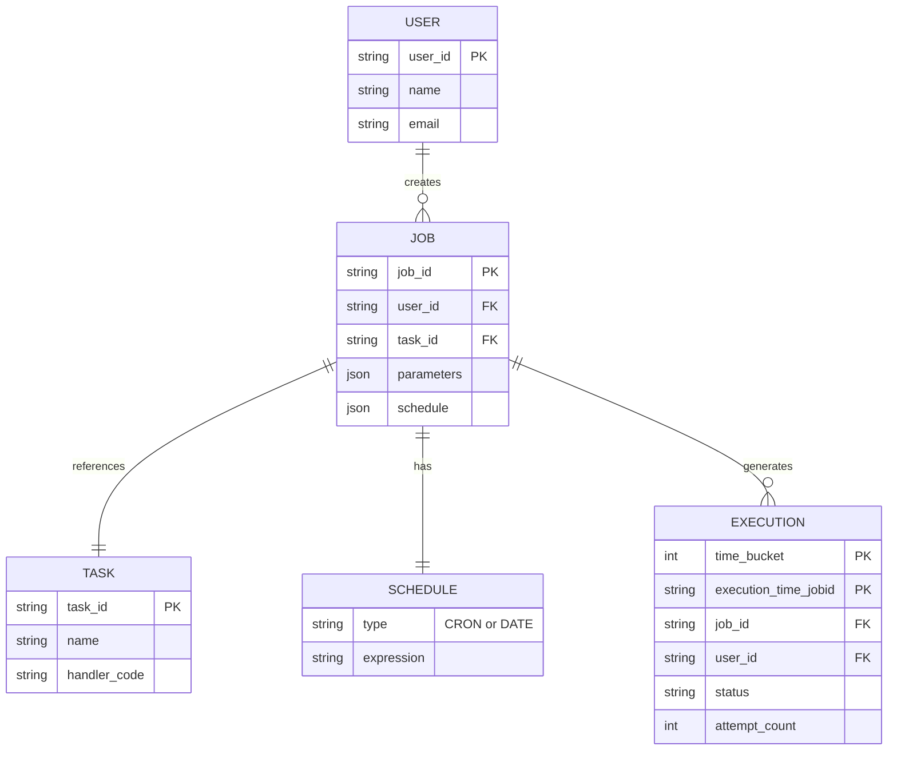
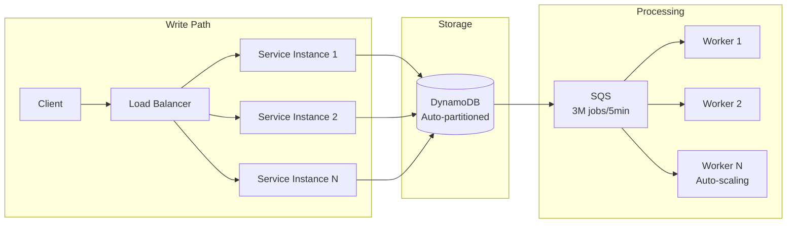
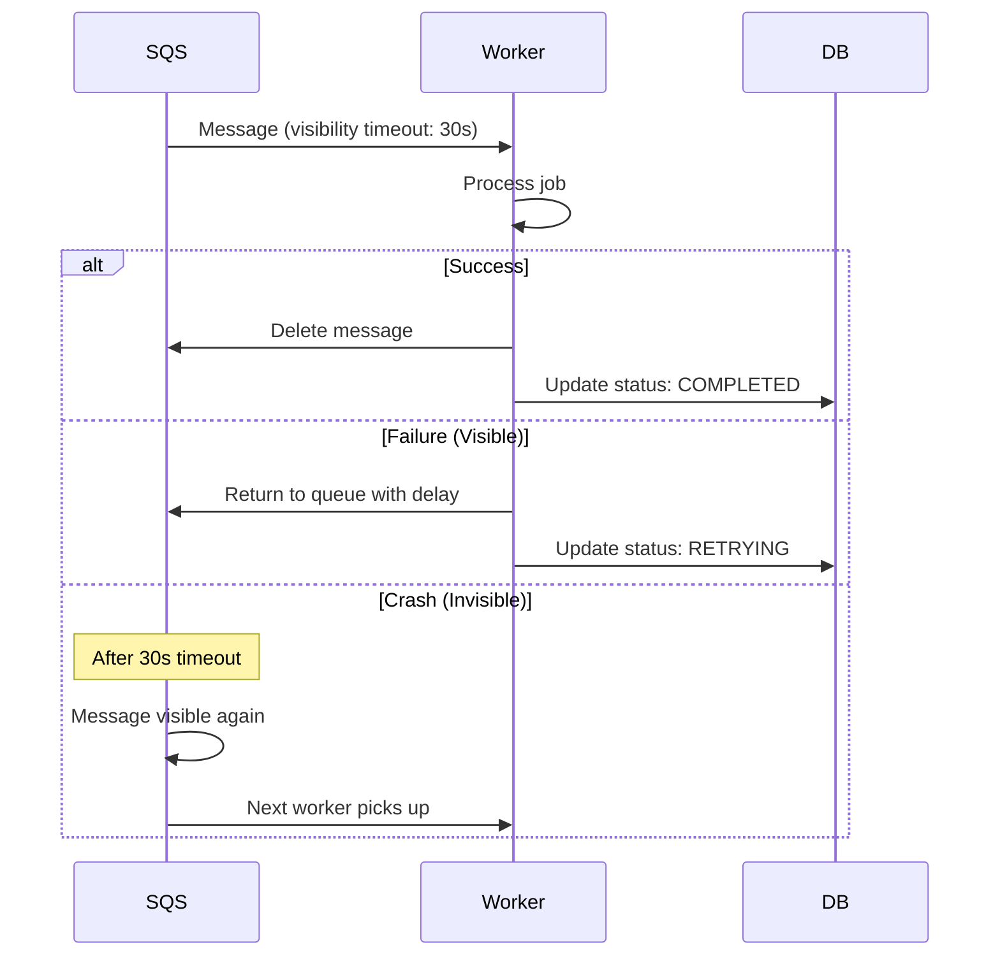

# Distributed Job Scheduler System Design

## Core Concepts

### Key Definitions

- **Task**: Abstract concept of work to be done (e.g., "send an email"). Reusable template.
- **Job**: Instance of a task with specific parameters and schedule (e.g., "send email to john@example.com at 10 AM Friday")
- **Schedule**: When a job should execute - can be immediate, future date, or recurring (CRON)

## Requirements

### Functional Requirements

1. **Core**

   - Schedule jobs (immediate/future/recurring)
   - Monitor job status
   - Cancel/reschedule jobs

2. **Out of Scope**
   - Security policies
   - CI/CD pipeline

### Non-Functional Requirements

- **Availability > Consistency**
- Execute jobs within **2 seconds** of scheduled time
- Scale to **10,000 jobs/second**
- **At-least-once** execution guarantee

## Core Entities



## API Design

```yaml
# Create Job
POST /jobs
{
  "task_id": "send_email",
  "schedule": "0 10 * * *",  # CRON or timestamp
  "parameters": {
    "to": "john@example.com",
    "subject": "Daily Report"
  }
}

# Query Jobs
GET /jobs?user_id={user_id}&status={status}&start_time={start_time}&end_time={end_time}
```

## System Architecture

### High-Level Design

```mermaid
graph TB
    Client[Client] --> API[API Gateway]
    API --> SS[Schedule Service]
    SS --> JDB[(Job Store<br/>DynamoDB)]

    JDB --> W[Watcher Service<br/>Polls every 5 min]
    W --> SQS[Message Queue<br/>Amazon SQS]

    SQS --> WP[Worker Pool]
    WP --> TE[Task Executor]
    TE --> JDB

    API --> QS[Query Service]
    QS --> JDB

    style JDB fill:#5A0D16,stroke:#333,stroke-width:2px
    style SQS fill:#1E4C50,stroke:#333,stroke-width:2px
```



### Two-Layered Scheduler Architecture

**Why?** Single-layer polling can't meet 2-second precision requirement at scale.

1. **Layer 1 - Database Polling**

   - Runs every 5 minutes
   - Queries jobs due in next 5 minutes
   - Reduces database load

2. **Layer 2 - Message Queue**
   - Uses SQS with delivery delays
   - Provides sub-second precision
   - Handles immediate job submissions

## Database Design

### Two-Table Pattern

**Jobs Table** (Definition)

```json
{
  "job_id": "uuid",
  "user_id": "user_123",
  "task_id": "send_email",
  "schedule": {
    "type": "CRON",
    "expression": "0 10 * * *"
  },
  "parameters": {}
}
```

**Executions Table** (Instances)

```json
{
  "time_bucket": 1715547600, // Partition key (hourly buckets)
  "execution_time": "1715548800-job123", // Sort key
  "job_id": "job123",
  "status": "PENDING",
  "attempt": 0
}
```

### Key Design Decisions

1. **Time Buckets**: Round timestamps to nearest hour for efficient partitioning

   ```python
   time_bucket = (execution_time // 3600) * 3600
   ```

2. **Global Secondary Index**: On user_id for efficient user queries

## Deep Dives

### 1. Achieving 2-Second Precision

#### Problem

- Polling every 2 seconds → 20k jobs per query
- High database load
- Network latency issues

#### Solution: Priority Queue Options

| Solution          | Pros                                       | Cons                                       | Recommendation |
| ----------------- | ------------------------------------------ | ------------------------------------------ | -------------- |
| Redis Sorted Sets | Sub-millisecond latency, Atomic ops        | Operational complexity, Manual retry logic | Good           |
| RabbitMQ          | Mature, Built-in persistence               | Plugin-based delays, Manual scaling        | Good           |
| **Amazon SQS**    | Fully managed, Native delays, Auto-scaling | AWS vendor lock-in                         | **Best**       |

**SQS Implementation:**

- Use delivery delays for scheduling
- Visibility timeouts for failure handling
- Dead-letter queues for failed jobs

### 2. Scaling to 10K Jobs/Second



**Scaling Strategies:**

- DynamoDB: Auto-partitioning by job_id and time_bucket
- SQS: Request quota increase (default 3k/sec)
- Workers: Container-based with auto-scaling (ECS/K8s)
- Consider spot instances for cost optimization

### 3. At-Least-Once Execution

#### Failure Types

1. **Visible Failures** (Code errors)

   - Wrap in try/catch
   - Update status to RETRYING
   - Exponential backoff (SQS handles this)
   - Max 3 retries → FAILED status

2. **Invisible Failures** (Worker crashes)



**SQS Visibility Timeout Solution:**

- Short timeout (30s) + periodic heartbeats
- Workers extend timeout every 15s for long jobs
- Failed messages → Dead-letter queue after retries

### 4. Idempotency

**Problem:** At-least-once = potential duplicates

**Solutions:**

| Approach              | Implementation                       | Trade-offs                    |
| --------------------- | ------------------------------------ | ----------------------------- |
| No Control            | Execute every time                   | Data corruption risk ❌       |
| Deduplication Table   | Check before execution               | Extra DB ops, race conditions |
| **Idempotent Design** | Make operations naturally idempotent | Best approach ✅              |

**Idempotent Patterns:**

- Instead of "increment counter" → "set counter to X"
- Check flags before operations (e.g., "if not email_sent")
- Use unique execution IDs for downstream deduplication

## Technology Choices Summary

| Component     | Technology       | Why                                  |
| ------------- | ---------------- | ------------------------------------ |
| Database      | DynamoDB         | Horizontal scaling, managed service  |
| Message Queue | Amazon SQS       | Native delays, managed, auto-scaling |
| Workers       | ECS/Containers   | Cost-effective for steady load       |
| Cache         | Redis (optional) | Session management, rate limiting    |

## Performance Optimizations

1. **Database**

   - Batch writes where possible
   - Archive old executions to S3 after 1 year
   - Use GSI for user queries

2. **Message Queue**

   - Batch message consumption
   - Adjust visibility timeout based on job type
   - Use multiple queues for priority levels

3. **Workers**
   - Pre-warm container pool
   - Use spot instances for cost
   - Scale based on queue depth

## Monitoring & Observability

### Key Metrics

- Job creation rate
- Execution latency (P50, P95, P99)
- Queue depth
- Worker utilization
- Failure rate by job type
- Database throttling events

### Alerts

- Jobs delayed > 5 seconds
- Queue depth > threshold
- Worker failure rate > 5%
- Database capacity > 80%

## Interview Tips by Level

### Mid-Level

- Focus on clear data model
- Understand basic scaling concepts
- Know trade-offs between solutions

### Senior

- Lead deep dives independently
- Articulate two-phase architecture necessity
- Show hands-on experience with technologies

### Staff+

- Identify bottlenecks proactively
- Justify technology choices with experience
- Teach something new to the interviewer

## Common Pitfalls to Avoid

1. ❌ Not separating job definitions from executions
2. ❌ Polling database too frequently
3. ❌ Ignoring idempotency requirements
4. ❌ Over-engineering with unnecessary queues
5. ❌ Not considering worker failure scenarios

## Additional Considerations

### Security (if asked)

- Authentication/authorization for job creation
- Encryption at rest and in transit
- Rate limiting per user
- Audit logging

### Multi-tenancy (if asked)

- Tenant isolation strategies
- Fair scheduling across tenants
- Resource quotas per tenant

### Disaster Recovery

- Multi-region deployment
- Point-in-time recovery for database
- Job replay capabilities

## Quick Reference Formulas

```python
# Time bucket calculation
time_bucket = (execution_time // 3600) * 3600

# Jobs per window
jobs_per_5min = 10000 * 300 = 3,000,000

# Message size estimate
message_size = 200 bytes
total_size_per_window = 3M * 200B = 600MB

# Lease renewal frequency
lease_renewals_per_sec = 10000 * (1/5) = 2000/sec
```

# Distributed Job Scheduler - Quick Revision Points

## 🎯 Core Requirements

- **10,000 jobs/second** throughput
- **2-second execution precision**
- **At-least-once** delivery guarantee
- **Availability > Consistency**

## 📊 Key Entities

- **Task**: Template (e.g., "send email")
- **Job**: Instance with params & schedule
- **Schedule**: CRON or timestamp
- **Execution**: Job run instance

## 🏗️ Architecture Components

### Two-Layer Scheduling (Critical!)

1. **Layer 1**: DB polling every 5 minutes → bulk fetch
2. **Layer 2**: SQS with delivery delays → precision timing

### Tech Stack

- **Database**: DynamoDB (partitioned by time_bucket + job_id)
- **Queue**: Amazon SQS (native delays, visibility timeout)
- **Workers**: Auto-scaling containers (ECS/K8s)

## 💾 Database Design

### Two Tables Pattern

```
Jobs Table: job_id, user_id, task_id, schedule, parameters
Executions Table: time_bucket (PK), execution_time_jobid (SK), status
```

### Time Bucket Formula

```python
time_bucket = (execution_time // 3600) * 3600  # Round to hour
```

## ⚡ Scaling Strategy

- **Write path**: Load balancer → Multiple service instances
- **Storage**: DynamoDB auto-partitioning
- **Processing**: SQS (3M jobs/5min) → Worker pool auto-scaling
- **Query**: Global Secondary Index on user_id

## 🔄 Failure Handling

### Two Failure Types

1. **Visible** (code errors): Try-catch → Update status → Retry with backoff
2. **Invisible** (crashes): SQS visibility timeout (30s) → Auto-retry

### SQS Configuration

- Visibility timeout: 30 seconds
- Heartbeat extension: Every 15 seconds
- Max retries: 3 → Dead Letter Queue

## 🎭 Idempotency

- **Problem**: At-least-once = duplicates possible
- **Solution**: Design idempotent operations
  - Use "set to X" not "increment by Y"
  - Check flags before operations
  - Use unique execution IDs

## 📈 Performance Numbers

- Jobs per 5-min window: 10,000 × 300 = **3M jobs**
- Message size: ~200 bytes
- Total data per window: 3M × 200B = **600MB**
- Lease renewals: 10,000 × (1/5) = **2,000/sec**

## 🚨 Critical Design Decisions

### Why Two-Layer Architecture?

- Single polling can't meet 2-sec precision
- Polling every 2 sec = 20k jobs/query = DB overload
- Solution: Bulk fetch + queue delays

### Why SQS over Redis/RabbitMQ?

- **SQS**: Managed, native delays, auto-scaling ✅
- **Redis**: Manual retry logic, operational complexity
- **RabbitMQ**: Plugin-based delays, manual scaling

### Why DynamoDB?

- Horizontal scaling
- Managed service
- Auto-partitioning

## 🔍 Monitoring Metrics

- Job creation rate
- Execution latency (P50, P95, P99)
- Queue depth
- Worker utilization
- Failure rate by job type

## ❌ Common Mistakes to Avoid

1. Not separating job definitions from executions
2. Polling database too frequently
3. Ignoring idempotency
4. Not handling invisible failures
5. Single-layer architecture for precision timing

## 🎓 Level-Specific Focus

### Mid-Level

- Clear data model
- Basic scaling concepts
- Trade-offs understanding

### Senior

- Two-phase architecture justification
- Deep dive leadership
- Technology experience

### Staff+

- Proactive bottleneck identification
- Experience-based tech choices
- Teaching moments

## 🔑 Key Formulas

```python
# Partition key for even distribution
partition_key = hash(job_id) % num_partitions

# Queue depth threshold
threshold = avg_processing_time × arrival_rate

# Worker count
workers = queue_depth / (items_per_worker × processing_time)
```

## 💡 Quick Win Talking Points

- "Two-layer architecture solves the precision vs. scale trade-off"
- "Visibility timeout handles invisible failures elegantly"
- "Time bucketing reduces hot partitions in DynamoDB"
- "Idempotency is cheaper than exactly-once delivery"
- "SQS delivery delays eliminate need for custom timer service"

## 🏁 Final Checklist

- [ ] Can explain why 2-layer architecture is necessary
- [ ] Know the 2-second precision requirement impact
- [ ] Understand visibility timeout for crash handling
- [ ] Can justify DynamoDB + SQS choice
- [ ] Remember time_bucket partitioning strategy
- [ ] Clear on idempotency vs deduplication trade-off
