# Web Crawler System Design Interview Guide

## 📋 Problem Overview

**What is a Web Crawler?**

- Program that automatically traverses the web by downloading pages and following links
- Used for: search engine indexing, data collection for ML training, website monitoring
- Focus: Design a crawler to extract text data for LLM training (like GPT-4, Gemini)

## 🎯 Requirements

### Functional Requirements

**Core:**

1. Crawl the web starting from seed URLs
2. Extract text data from each webpage and store for later processing

**Out of Scope:**

- Processing text data (e.g., training LLM)
- Non-text data (images, videos)
- JavaScript-rendered dynamic content
- Authentication-required pages

### Non-Functional Requirements

**Core:**

1. **Fault Tolerance** - Handle failures gracefully, resume without losing progress
2. **Politeness** - Respect robots.txt, avoid overloading servers
3. **Efficiency** - Complete crawl in under 5 days
4. **Scalability** - Handle 10B pages (avg size: 2MB)

**Scale Assumptions:**

- 10 billion pages on the web
- Average page size: 2MB
- Time constraint: 5 days to complete
- Total data: ~20 PB

## 🏗️ System Architecture Evolution

### Stage 1: Basic High-Level Design

```mermaid
graph LR
    FQ[Frontier Queue] --> C[Crawler]
    C --> DNS[DNS]
    DNS --> WP[Webpage]
    C --> S3[S3 Text Data]
    C -.->|Extract URLs| FQ

    style FQ fill:#5A0D16
    style C fill:#1E4C50
    style S3 fill:#5A0D16
```



**Components:**

- **Frontier Queue**: URLs to crawl (Kafka/Redis/SQS)
- **Crawler**: Fetches pages, extracts text & URLs
- **DNS**: Resolves domains to IPs
- **S3**: Stores extracted text data

### Stage 2: Multi-Stage Pipeline (Fault Tolerance)

```mermaid
graph TB
    FQ[Frontier Queue<br/>SQS] --> URLFetch[URL Fetcher]
    URLFetch --> DNS
    DNS --> WP[Webpage]
    URLFetch --> S3HTML[S3 HTML<br/>Storage]
    URLFetch --> MD[(Metadata DB<br/>DynamoDB)]

    S3HTML --> PQ[Parsing Queue<br/>SQS]
    PQ --> PW[Parsing Worker]
    PW --> S3Text[S3 Text<br/>Storage]
    PW -.->|New URLs| FQ

    MD -.->|Track Status| URLFetch
    MD -.->|Track Status| PW

    style FQ fill:#1E4C50
    style PQ fill:#5A0D16
    style URLFetch fill:#1E4C50
    style PW fill:#5A0D16
    style S3HTML fill:#1E4C50
    style S3Text fill:#5A0D16
    style MD fill:#1E4C50
```



**Key Improvements:**

- **Separation of Concerns**: URL fetching vs parsing
- **State Management**: Metadata DB tracks progress
- **Queue Messages**: Only contain URL IDs, not raw HTML
- **Failure Recovery**: Each stage can be retried independently

### Stage 3: Complete System with All Features

```mermaid
graph TB
    FQ[Frontier Queue<br/>SQS] --> C[Crawler Fleet<br/>4 machines]
    C --> RL[Rate Limiter<br/>& DNS Cache<br/>Redis]
    RL --> DNS
    DNS --> WP[Webpage]

    C --> S3HTML[S3 HTML<br/>Storage]
    C --> MD[(Metadata DB<br/>DynamoDB)]

    S3HTML --> PQ[Parsing Queue<br/>SQS]
    PQ --> PW[Parsing Workers<br/>Lambda/ECS]
    PW --> S3Text[S3 Text<br/>Storage]
    PW --> DeDup[Dedup Check<br/>Hash/Bloom Filter]
    DeDup -.->|New URLs| FQ

    FQ -.->|Retry with<br/>Exp Backoff| FQ
    FQ --> DLQ[Dead Letter<br/>Queue]

    MD --> DD[(Domain DB)]
    DD -.->|robots.txt<br/>crawl-delay| C

    style FQ fill:#1E4C50
    style PQ fill:#5A0D16
    style DLQ fill:#1E4C50
    style C fill:#5A0D16
    style PW fill:#1E4C50
    style S3HTML fill:#5A0D16
    style S3Text fill:#1E4C50
    style MD fill:#5A0D16
    style DD fill:#1E4C50
    style RL fill:#5A0D16
    style DeDup fill:#1E4C50
```



## 💡 Deep Dive Topics

### 1. Fault Tolerance & Retry Logic

**Problem**: URL fetching is most likely to fail (site down, timeout, etc.)

**Solution**: SQS with Exponential Backoff

- Visibility timeout: 30s → 2min → 5min → 15min
- After 5 failures → Dead Letter Queue (DLQ)
- Message stays in queue until confirmed processed

```
Retry Timeline:
Attempt 1: Immediate
Attempt 2: +30 seconds
Attempt 3: +2 minutes
Attempt 4: +5 minutes
Attempt 5: +15 minutes
→ DLQ (site considered offline)
```

### 2. Politeness & Rate Limiting

**robots.txt Handling:**

```
User-agent: *
Disallow: /private/
Crawl-delay: 10
```

**Implementation:**

1. Store robots.txt in Domain DB
2. Check before each crawl:
   - Is URL allowed? (check Disallow)
   - How long to wait? (check Crawl-delay)
3. Global rate limiter: 1 request/second/domain
4. Use Redis sliding window + jitter to prevent thundering herd

**Domain Table Schema:**

```
Domain {
  domain: string (PK)
  lastCrawlTime: timestamp
  robotsRules: JSON
  crawlDelay: int
}
```

### 3. Scaling & Efficiency

**Crawler Scaling Math:**

```
Network capacity: 400 Gbps/instance
Effective utilization: 30%
Pages/second: 400 Gbps × 0.3 / (8 bits/byte × 2MB) = 7,500 pages/sec
Time for 10B pages: 10B / 7,500 = 15.4 days (single machine)
Required machines: 15.4 days / 5 days ≈ 4 machines
```

**Deduplication Strategies:**

| Approach                | Implementation                                     | Pros                   | Cons                     |
| ----------------------- | -------------------------------------------------- | ---------------------- | ------------------------ |
| Content Hash + DB Index | Hash page content, store in Metadata DB with index | Simple, accurate       | Index overhead           |
| Bloom Filter            | Redis Bloom filter for seen content hashes         | Fast, memory efficient | False positives possible |

**URL Metadata Schema:**

```
URL {
  id: string (PK)
  url: string
  s3HtmlLink: string
  s3TextLink: string
  lastCrawlTime: timestamp
  contentHash: string (GSI)
  depth: int  // Prevent crawler traps
  status: enum
}
```

### 4. Additional Optimizations

**DNS Optimization:**

- Cache DNS lookups locally
- Use multiple DNS providers (round-robin)
- Implement DNS prefetching for discovered domains

**Crawler Trap Prevention:**

- Set maximum depth (e.g., 100 levels)
- Track depth in URL metadata
- Skip URLs exceeding threshold

**Handling Large Files:**

- Check Content-Length header before download
- Skip files > threshold (e.g., 10MB)
- Implement streaming for borderline cases

## 🎨 Technology Choices & Justifications

| Component      | Technology | Why                                                                  |
| -------------- | ---------- | -------------------------------------------------------------------- |
| Queue          | SQS        | Built-in retry, exponential backoff, DLQ, visibility timeout         |
| Metadata Store | DynamoDB   | Scalable NoSQL, good for URL tracking, supports GSI for hash lookups |
| Blob Storage   | S3         | Highly scalable, durable, cost-effective for 20PB data               |
| Rate Limiter   | Redis      | Fast in-memory ops, sliding window support, Bloom filter capability  |
| Parser Workers | Lambda/ECS | Auto-scaling, serverless, cost-effective for variable load           |

## 📊 Back-of-Envelope Calculations

**Storage:**

- Total pages: 10B
- Avg HTML size: 2MB
- Avg text size: 100KB (5% of HTML)
- HTML storage: 10B × 2MB = 20PB
- Text storage: 10B × 100KB = 1PB
- Metadata: 10B × 1KB = 10TB

**Throughput:**

- Target: 10B pages in 5 days
- Required: 10B / (5 × 86,400s) = 23,148 pages/sec
- With 4 crawlers: ~5,800 pages/sec each

**Network:**

- Total bandwidth: 23,148 × 2MB = 46.3GB/sec
- Per crawler: 11.6GB/sec (well within 400Gbps limit)

## 🔍 What to Emphasize by Level

### Mid-Level (L4/E4)

- Basic high-level design with queue, crawler, storage
- Understanding of robots.txt and basic politeness
- Simple scaling approach (multiple crawlers)

### Senior (L5/E5)

- Multi-stage pipeline for fault tolerance
- Detailed retry mechanisms and error handling
- Rate limiting implementation
- Deduplication strategies

### Staff+ (L6+/E6+)

- All above + deep dives into 3+ areas
- Practical solutions (e.g., multiple DNS providers)
- Crawler trap prevention
- Continuous crawling strategy
- Dynamic content handling considerations
- Cost optimization strategies

## 🚀 Interview Tips

1. **Start Simple**: Begin with basic design, then iterate
2. **Think Aloud**: Explain trade-offs for each decision
3. **Be Practical**: Consider real-world constraints (rate limits, costs)
4. **Show Experience**: Reference similar problems you've solved
5. **Ask Questions**: Clarify requirements and constraints
6. **Handle Scale**: Always consider how solution scales

## ⚠️ Common Pitfalls to Avoid

1. **Storing HTML in Queue**: Queues aren't for large payloads
2. **Ignoring Politeness**: Real crawlers must respect site policies
3. **No Deduplication**: Wastes resources on duplicate content
4. **Single Point of Failure**: Every component needs redundancy
5. **Forgetting Crawler Traps**: Can get stuck infinitely
6. **Over-engineering Early**: Start simple, add complexity as needed

## 🎯 Key Takeaways

1. **Pipeline Architecture**: Separate fetch and parse stages for resilience
2. **State Management**: Track everything in metadata DB
3. **Respect the Web**: Implement proper rate limiting and robots.txt
4. **Scale Horizontally**: Multiple crawlers, distributed queues
5. **Plan for Failure**: Every network call can fail - design accordingly
6. **Optimize Wisely**: Focus on bottlenecks (network I/O, dedup)

# Web Crawler System Design - Last Minute Revision

## 🚀 Quick Problem Statement

- **Goal**: Design a web crawler to extract text data for LLM training
- **Scale**: 10B pages, 2MB average, complete in 5 days
- **Key Requirements**: Fault tolerant, polite, efficient, scalable

## 🏗️ Core Architecture (Draw This!)

```
[Frontier Queue] → [Crawler Fleet] → [HTML Storage]
     ↑                                      ↓
[Dedup Check] ← [Parsing Workers] ← [Parsing Queue]
                      ↓
                [Text Storage]
```

**Supporting Components**: DNS Cache, Rate Limiter, Metadata DB, Domain DB

## 💾 Technology Stack (Memorize!)

- **Queues**: SQS (built-in retry + DLQ)
- **Metadata**: DynamoDB (scalable NoSQL)
- **Storage**: S3 (20PB capacity)
- **Cache**: Redis (rate limiting + DNS)
- **Workers**: Lambda/ECS (auto-scaling)

## 📊 Scale Math (Know These Numbers!)

- **Required throughput**: 23,148 pages/sec
- **Crawler machines needed**: 4 (based on 400 Gbps network)
- **Storage**: 20PB HTML + 1PB text + 10TB metadata
- **Per crawler**: ~6K pages/sec

## 🔧 Critical Design Decisions

### Multi-Stage Pipeline (Fault Tolerance)

- **Stage 1**: URL Fetch → HTML Storage
- **Stage 2**: Parse HTML → Text Storage
- **Why**: Allows independent retry of each stage

### SQS Retry Strategy

- **Pattern**: Exponential backoff (30s → 2m → 5m → 15m)
- **After 5 failures**: Dead Letter Queue
- **Key**: Visibility timeout prevents duplicate processing

### Rate Limiting (Politeness)

- **Global rule**: 1 request/second per domain
- **Implementation**: Redis sliding window + jitter
- **robots.txt**: Store in Domain DB, check before each crawl

## 🎯 Deep Dive Topics (Pick 2-3)

### 1. Deduplication

- **Content Hash**: SHA-256 of page content
- **Storage**: DynamoDB with GSI on hash
- **Alternative**: Bloom filter (faster, but false positives)

### 2. Crawler Trap Prevention

- **Max depth**: 100 levels from seed URLs
- **Track in metadata**: URL depth field
- **Large file handling**: Check Content-Length header

### 3. DNS Optimization

- **Local caching**: Reduce lookup latency
- **Multiple providers**: Round-robin for reliability
- **Prefetching**: For discovered domains

## 📋 Interview Flow Checklist

### Step 1: Requirements (5 min)

- [ ] Clarify functional requirements
- [ ] Confirm scale (10B pages, 5 days)
- [ ] Non-functional: fault tolerance, politeness, efficiency

### Step 2: Basic Design (10 min)

- [ ] Draw: Queue → Crawler → Storage
- [ ] Mention: DNS, metadata tracking
- [ ] Estimate: Basic scaling math

### Step 3: Deep Dive (20 min)

- [ ] Multi-stage pipeline for fault tolerance
- [ ] Rate limiting and robots.txt handling
- [ ] Deduplication strategy
- [ ] Technology choices with justification

### Step 4: Scale & Optimize (10 min)

- [ ] Calculate required machines
- [ ] Discuss bottlenecks (network I/O)
- [ ] Additional optimizations (DNS cache, crawler traps)

## ⚠️ Don't Forget These!

### Common Mistakes

- **DON'T**: Store HTML in queue messages (too large)
- **DON'T**: Ignore robots.txt (real crawlers must be polite)
- **DON'T**: Skip deduplication (wastes resources)
- **DON'T**: Create single points of failure

### Key Talking Points

- **Fault tolerance**: "Every network call can fail"
- **Separation of concerns**: "Fetch and parse are different failure modes"
- **Politeness**: "Respect crawl-delay and robots.txt"
- **Horizontal scaling**: "Add more crawlers as needed"

## 🎯 Level-Specific Focus

### Mid-Level (L4)

- Basic architecture with scaling
- Simple retry logic
- robots.txt awareness

### Senior (L5)

- Multi-stage pipeline
- Detailed rate limiting
- Deduplication strategies
- Error handling patterns

### Staff+ (L6+)

- All above + 3 deep dives
- Practical optimizations
- Cost considerations
- Alternative approaches

## 🔥 Power Phrases

- "Let's start simple and iterate"
- "Every network operation needs retry logic"
- "We need to be respectful citizens of the web"
- "This creates a single point of failure - let's fix that"
- "The bottleneck here is network I/O, not CPU"

## 📝 Final Tips

1. **Start with requirements** - don't jump into design
2. **Draw as you talk** - visual architecture is key
3. **Justify technology choices** - explain the "why"
4. **Consider failure scenarios** - what breaks and how to handle it
5. **Scale incrementally** - don't over-engineer from the start
