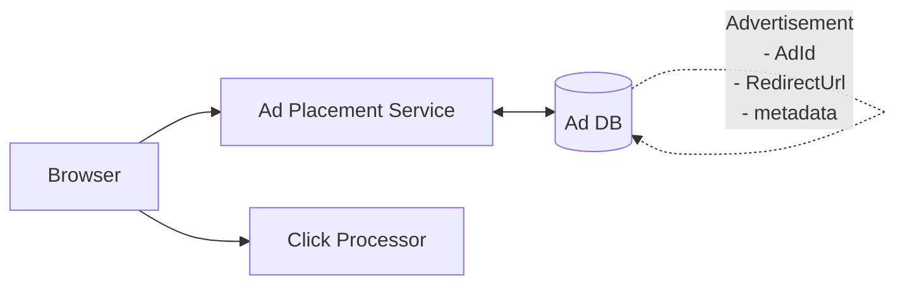
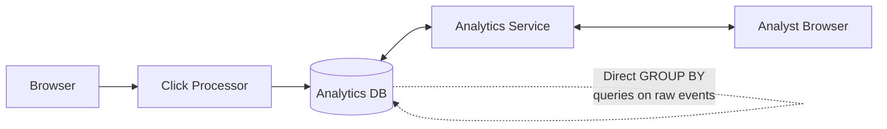
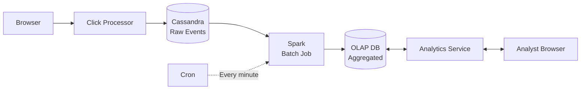
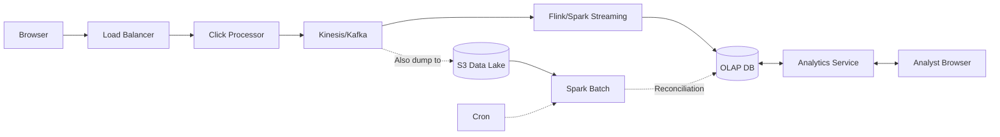
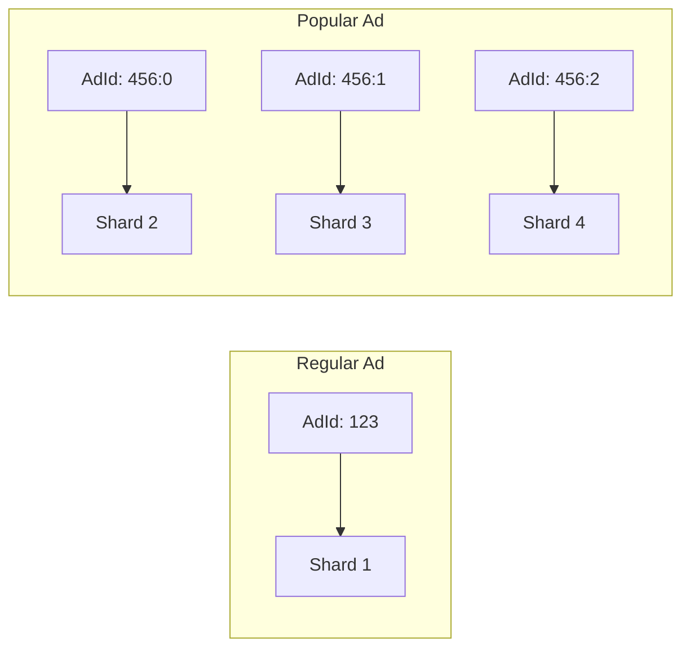
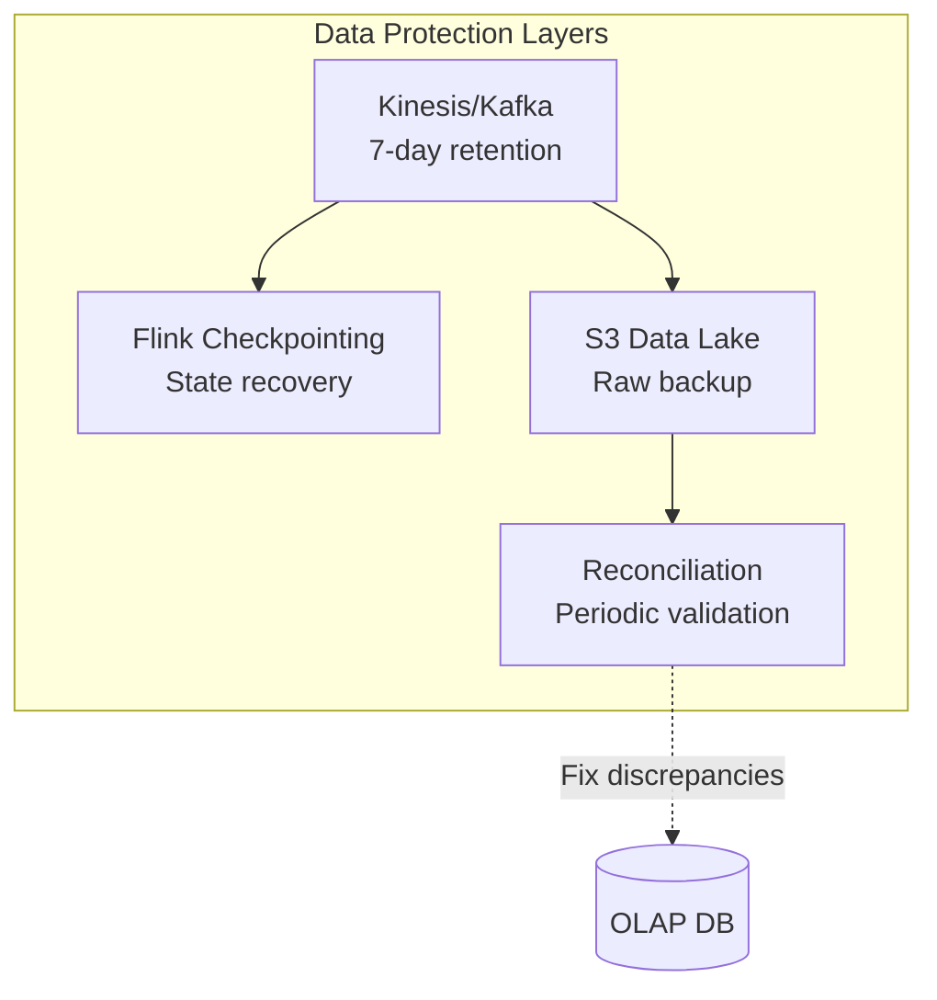
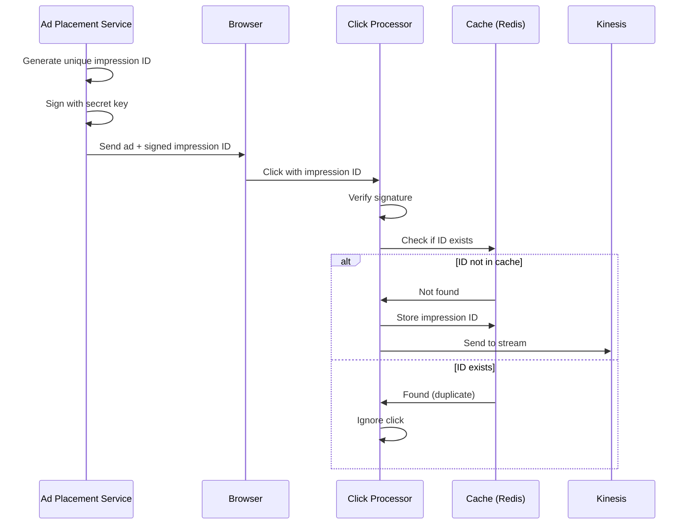
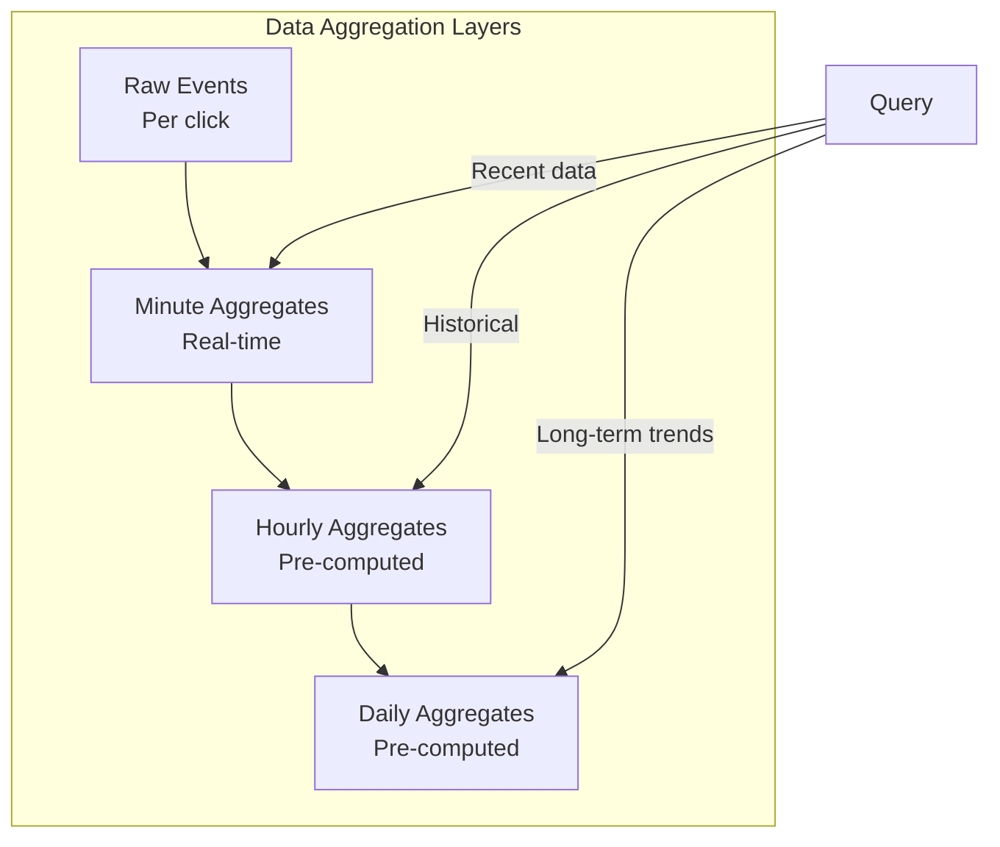

# Ad Click Aggregator System Design Interview Guide

## 📋 Problem Overview

An **Ad Click Aggregator** is a system that collects and aggregates data on ad clicks, used by advertisers to track ad performance and optimize campaigns.

## 🎯 Requirements

### Functional Requirements

1. **Core Requirements:**

   - Users can click on ads and be redirected to advertiser's website
   - Advertisers can query ad click metrics over time (minimum 1-minute granularity)

2. **Out of Scope:**
   - Ad targeting & serving
   - Cross-device tracking
   - Integration with offline marketing channels
   - Fraud/spam detection
   - Demographic profiling
   - Conversion tracking

### Non-Functional Requirements

#### Scale

- **10M active ads** at any given time
- **10k clicks per second** at peak
- **100M clicks per day** total

#### Performance & Reliability

1. **Scalability:** Support peak 10k CPS
2. **Low latency:** Sub-second analytics queries
3. **Fault tolerance:** No data loss
4. **Data integrity:** Accurate collection
5. **Real-time processing:** Minimal delay for data availability
6. **Idempotency:** Prevent duplicate click counting

## 🏗️ High-Level Design Evolution

### Step 1: Basic Click Handling



### Step 2: Redirect Strategies

#### Option A: Client-Side Redirect (Simple)

- Browser gets redirect URL with ad
- Sends click event to `/click` endpoint in parallel
- **Problem:** Users can bypass tracking

#### Option B: Server-Side Redirect (Robust) ✅

- Click goes to server first
- Server tracks click, returns 302 redirect
- **Benefit:** Ensures all clicks are tracked
- **Challenge:** Added latency

### Step 3: Data Processing Evolution

#### ❌ Bad Solution: Direct Query from Event Store



**Problems:**

- Database bottleneck at 10k CPS
- Slow GROUP BY queries
- Violates low-latency requirement

#### ✅ Good Solution: Batch Processing with Pre-aggregation



**Benefits:**

- Cassandra optimized for writes (LSM structure)
- Spark handles large-scale aggregation
- OLAP DB optimized for analytics queries

**Challenges:**

- Data is always minutes old
- Not truly real-time

#### ✅✅ Great Solution: Real-time Stream Processing



**Benefits:**

- Near real-time processing
- Scalable architecture
- Reconciliation ensures accuracy

## 🚀 Scaling Strategies

### 1. Component-Level Scaling

| Component                  | Scaling Strategy         | Details                                 |
| -------------------------- | ------------------------ | --------------------------------------- |
| **Click Processor**        | Horizontal scaling       | Multiple instances behind load balancer |
| **Stream (Kafka/Kinesis)** | Sharding by AdId         | 1MB/s or 1000 records/s per shard       |
| **Stream Processor**       | Parallel processing      | One Flink job per shard                 |
| **OLAP Database**          | Sharding by AdvertiserId | Optimizes advertiser-specific queries   |

### 2. Hot Shard Problem

**Problem:** Popular ads (e.g., Nike with LeBron) overwhelm single shard

**Solution:** Composite partition key

```
Regular ads: AdId
Popular ads: AdId:0 to AdId:N (N partitions)
```



## 🛡️ Data Integrity & Fault Tolerance

### 1. Preventing Data Loss



### 2. Idempotency & Click Deduplication

#### ✅ Best Solution: Impression ID with Signature



**Cache sizing:** ~1.6GB for 100M daily impressions (16 bytes per ID)

## 📊 Query Optimization

### Multi-Level Aggregation Strategy



## 🎭 Interview Level Expectations

### Mid-Level (E4)

- **Focus:** 80% breadth, 20% depth
- **Expected:**
  - Basic high-level design
  - Understanding of batch processing need
  - Basic idempotency handling
  - Component responsibilities

### Senior (E5)

- **Focus:** 60% breadth, 40% depth
- **Expected:**
  - Trade-offs between batch vs stream processing
  - Scaling strategies
  - Basic fault tolerance
  - Technology justification (Cassandra vs SQL, etc.)

### Staff+ (E6+)

- **Focus:** 40% breadth, 60% depth
- **Expected:**
  - Complete fault-tolerant solution
  - Hot shard handling
  - Reconciliation strategy
  - Real-world experience examples
  - Teaching interviewer something new

## 💡 Key Technical Decisions & Trade-offs

### 1. Database Choices

| Use Case              | Technology        | Why                                    |
| --------------------- | ----------------- | -------------------------------------- |
| **Raw Events**        | Cassandra         | LSM structure, write-optimized         |
| **Stream**            | Kafka/Kinesis     | Distributed, fault-tolerant, retention |
| **Stream Processing** | Flink             | Real-time aggregation, checkpointing   |
| **Analytics**         | Redshift/BigQuery | OLAP, optimized for aggregations       |
| **Cache**             | Redis Cluster     | Fast, distributed, persistent          |

### 2. Aggregation Window Trade-offs

| Window Size   | Latency | Accuracy                 | Resource Usage |
| ------------- | ------- | ------------------------ | -------------- |
| **1 second**  | Lowest  | May miss boundary clicks | Highest        |
| **1 minute**  | Low     | Good                     | Moderate       |
| **5 minutes** | Higher  | Better                   | Lower          |

### 3. Processing Architecture Comparison

| Approach                    | Latency   | Complexity | Fault Tolerance | Cost    |
| --------------------------- | --------- | ---------- | --------------- | ------- |
| **Direct Query**            | High      | Low        | Poor            | Low     |
| **Batch Only**              | Minutes   | Medium     | Good            | Medium  |
| **Stream Only**             | Real-time | High       | Good            | High    |
| **Hybrid (Stream + Batch)** | Real-time | Highest    | Excellent       | Highest |

## 🔍 Deep Dive Topics

### 1. Exactly-Once Semantics

- Kafka transactions
- Flink checkpointing
- Idempotent writes to OLAP

### 2. Data Retention & Compliance

- GDPR considerations
- Data archival strategies
- Cold storage for historical data

### 3. Monitoring & Alerting

- Click rate anomaly detection
- System health metrics
- Data quality monitoring
- Reconciliation discrepancy alerts

### 4. Advanced Optimizations

- Bloom filters for deduplication
- HyperLogLog for unique user counting
- Materialized views for common queries
- CDC (Change Data Capture) for real-time updates

## 📝 Interview Tips

1. **Start Simple:** Begin with basic design, then iterate
2. **Clarify Scale Early:** Scale dramatically affects design choices
3. **Consider Trade-offs:** Always discuss pros/cons of decisions
4. **Show Evolution:** Demonstrate how you'd improve the system
5. **Be Specific:** Name actual technologies and explain why
6. **Handle Edge Cases:** Hot shards, data loss, duplicates
7. **Think About Operations:** Deployment, monitoring, debugging

## 🎯 Final Architecture Checklist

- [ ] Handles 10k clicks/second
- [ ] Sub-second query latency
- [ ] No data loss (fault-tolerant)
- [ ] Prevents duplicate clicks
- [ ] Near real-time data availability
- [ ] Scales horizontally
- [ ] Handles hot shards
- [ ] Includes reconciliation
- [ ] Supports various aggregation windows
- [ ] Optimized for advertiser queries

## 📚 Additional Considerations

### Security

- HTTPS for all communications
- Authentication for analytics API
- Rate limiting per advertiser
- Encryption at rest and in transit

### Cost Optimization

- Data tiering (hot/warm/cold)
- Compression for historical data
- Reserved instance pricing
- Spot instances for batch processing

### Future Enhancements

- ML-based fraud detection
- Real-time bidding integration
- Multi-touch attribution
- Cross-device tracking
- A/B testing framework

# 🎯 Ad Click Aggregator - Quick Revision Guide

## 📊 **Scale Numbers (Memorize!)**

- **10M** active ads
- **10k clicks/second** peak
- **100M clicks/day** total
- **Sub-second** query latency required

## 🏗️ **Core Architecture Flow**

1. **Click Path:** Browser → Load Balancer → Click Processor → Kafka/Kinesis → Flink → OLAP DB
2. **Redirect:** Use **server-side 302 redirect** (ensures tracking)
3. **Analytics:** OLAP DB → Analytics Service → Advertiser Dashboard

## ⚡ **Key Design Decisions**

### Database Choices:

- **Cassandra** for raw events (write-optimized, LSM tree)
- **Kafka/Kinesis** for streaming (7-day retention)
- **Flink** for stream processing (real-time aggregation)
- **Redshift/BigQuery** for analytics (OLAP, aggregation-optimized)
- **Redis** for deduplication cache

### Processing Architecture:

- ❌ **Bad:** Direct queries on raw events (can't handle 10k CPS)
- ✅ **Good:** Batch processing with Spark (minutes delay)
- ✅✅ **Best:** Hybrid stream + batch (real-time + reconciliation)

## 🔥 **Critical Problems & Solutions**

### 1. **Hot Shard Problem**

- **Issue:** Popular ads overwhelm single shard
- **Solution:** Composite key: `AdId:0`, `AdId:1`, `AdId:N` for popular ads

### 2. **Duplicate Clicks**

- **Issue:** Network retries, user double-clicks
- **Solution:** Impression ID + signature + Redis cache check
- **Cache size:** ~1.6GB for 100M daily impressions

### 3. **Data Loss Prevention**

- Kafka 7-day retention
- Flink checkpointing
- S3 raw backup
- Daily reconciliation job

## 🎨 **Aggregation Strategy**

```
Raw Events → Minute Aggregates → Hourly → Daily
           (real-time)        (pre-computed)
```

- Query recent: Use minute aggregates
- Query historical: Use hourly/daily aggregates

## 🚀 **Scaling Tactics**

- **Click Processor:** Horizontal scaling (stateless)
- **Kafka:** Shard by AdId (1MB/s per shard)
- **Flink:** One job per shard
- **OLAP:** Shard by AdvertiserId

## 🛡️ **Fault Tolerance Checklist**

- ✓ Kafka retention (7 days)
- ✓ Flink checkpointing
- ✓ S3 backup of raw events
- ✓ Daily reconciliation
- ✓ Redis persistence enabled
- ✓ Multi-AZ deployment

## 💡 **Interview Pro Tips**

### Start With:

"Let me clarify the scale - 10k CPS means we need distributed processing, not a simple database solution"

### When Asked About Trade-offs:

- **Batch only:** Simple but high latency (minutes)
- **Stream only:** Real-time but complex and expensive
- **Hybrid:** Best of both - real-time with reconciliation safety net

### Deep Dive Ready Topics:

1. **Exactly-once semantics:** Kafka transactions + Flink checkpointing
2. **Query optimization:** Multi-level aggregates + materialized views
3. **Cost optimization:** Data tiering (hot/warm/cold storage)

## 🎯 **Final Architecture Must-Haves**

1. **Server-side redirect** (tracking guarantee)
2. **Stream processing** (real-time requirement)
3. **Impression ID** (deduplication)
4. **Composite sharding** (hot shard handling)
5. **Reconciliation** (data integrity)
6. **Multi-level aggregates** (query performance)

## 🔴 **Red Flags to Avoid**

- Don't suggest client-side tracking only
- Don't use single database for everything
- Don't ignore duplicate clicks
- Don't forget about hot shards
- Don't skip reconciliation

## 📝 **30-Second Pitch**

"We'll use server-side redirects to ensure tracking, stream clicks through Kafka to Flink for real-time aggregation, store in OLAP database sharded by advertiser. Handle duplicates with impression IDs cached in Redis, manage hot shards with composite keys, and run daily reconciliation for data integrity. This gives us real-time analytics at 10k CPS with fault tolerance."

## 🏆 **Level-Specific Focus**

- **E4:** Get the basic flow right, mention batch processing
- **E5:** Discuss stream vs batch trade-offs, explain technology choices
- **E6+:** Deep dive on hot shards, reconciliation, teach something new
