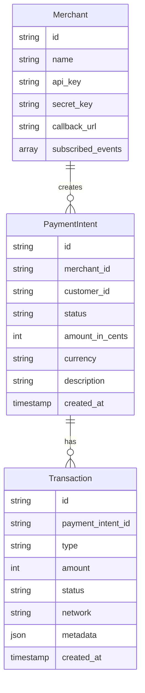
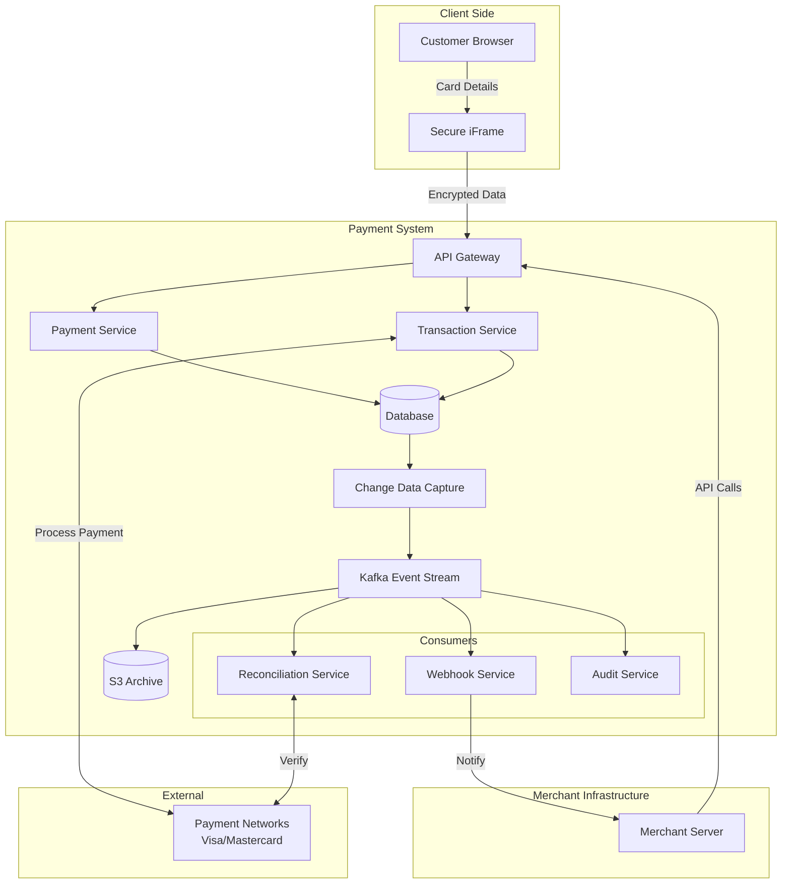
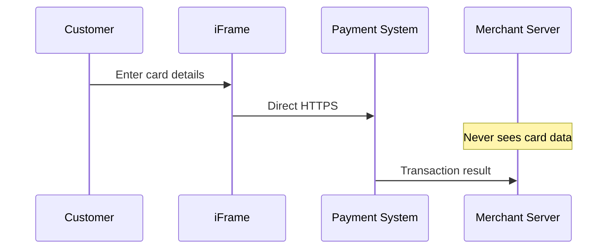
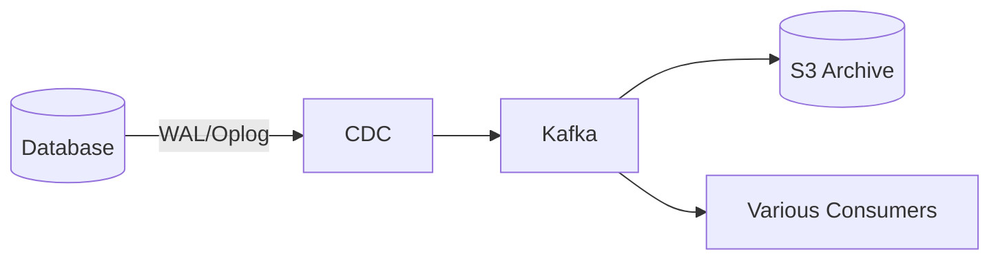
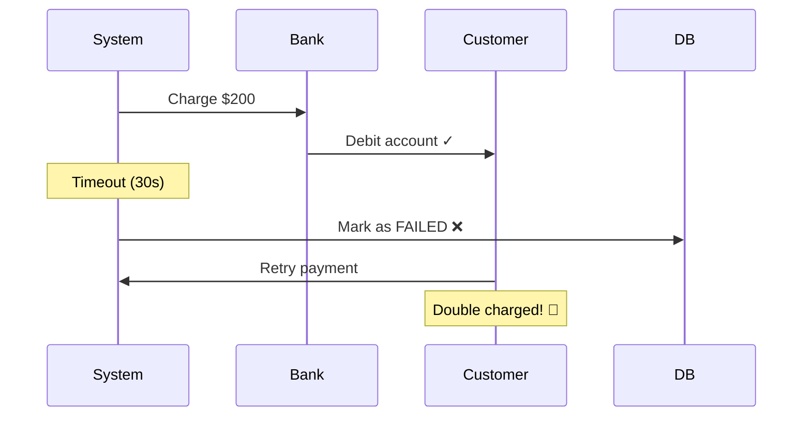
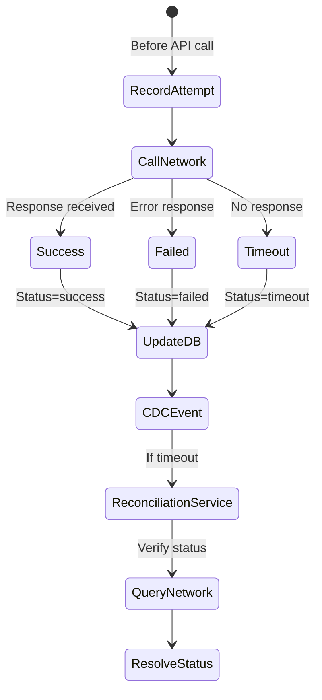
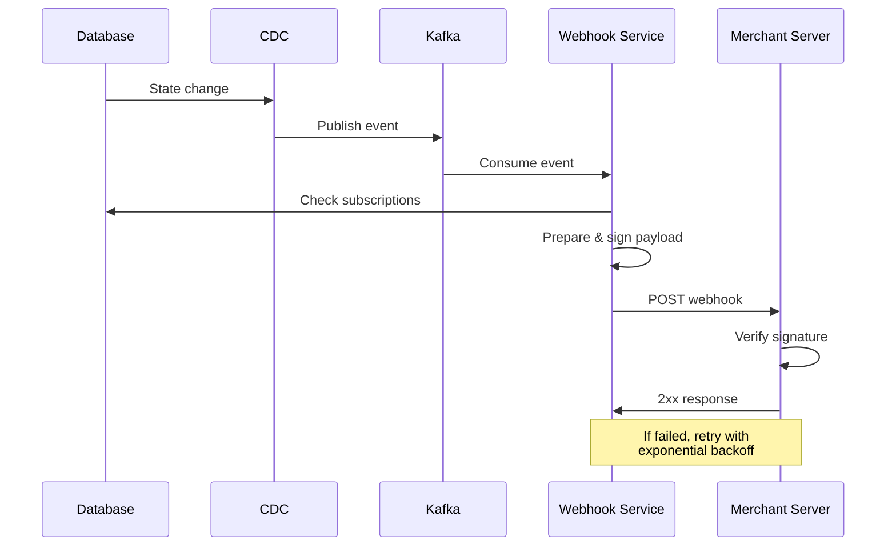

# Payment System Design Interview Guide (Stripe-like)

## 📋 Overview

Design a payment processing system similar to Stripe that allows merchants to accept payments from customers without building their own payment infrastructure.

**Scale**: 10,000 TPS at peak load

## 🎯 Functional Requirements

### Core Requirements

1. **Merchants can initiate payment requests** (charge customers for specific amounts)
2. **Users can pay with credit/debit cards**
3. **Merchants can view payment status updates** (pending, success, failed)

### Below the Line (Out of Scope)

- Save payment methods for future use
- Full/partial refunds
- Transaction history and reports
- Alternative payment methods (bank transfers, digital wallets)
- Recurring payments/subscriptions
- Payouts to merchants

## 🔒 Non-Functional Requirements

1. **Highly secure** - PCI DSS compliance
2. **Durability & Auditability** - No transaction data loss ever
3. **Transaction Safety** - Financial integrity despite async payment networks
4. **Scalability** - Handle 10,000+ TPS with bursty traffic

## 🏗️ Core Entities



### Key Concepts:

- **PaymentIntent**: Merchant's intention to collect payment, tracks lifecycle
- **Transaction**: Polymorphic money-movement record (Charge, Refund, Dispute, Payout)
- **One-to-Many**: Single PaymentIntent can have multiple Transactions

## 🔌 API Design

### 1. Create Payment Intent

```http
POST /payment-intents
{
    "amountInCents": 2499,
    "currency": "usd",
    "description": "Order #1234"
}
Response: { "paymentIntentId": "pi_123..." }
```

### 2. Process Payment

```http
POST /payment-intents/{paymentIntentId}/transactions
{
    "type": "charge",
    "card": {
        "number": "4242424242424242",
        "exp_month": 12,
        "exp_year": 2025,
        "cvc": "123"
    }
}
```

_Note: In production, card data would be tokenized/encrypted, never sent raw_

### 3. Check Payment Status

```http
GET /payment-intents/{paymentIntentId}
Response: {
    "status": "succeeded",
    "amount": 2499,
    ...
}
```

## 🏛️ High-Level Architecture



## 🔐 Security Deep Dive

### Authentication Evolution

#### ❌ Bad: Static API Keys Only

- Vulnerable to interception
- No replay attack protection
- Keys often hardcoded

#### ✅ Good: Basic API Key

- Simple implementation
- Works for basic scenarios

#### ✅✅ Great: Request Signing with HMAC

```javascript
// Example signed request
{
    headers: {
        "Authorization": "Bearer pk_live_xyz...",
        "X-Request-Timestamp": "2023-10-15T14:22:31Z",
        "X-Request-Nonce": "unique-id-123",
        "X-Signature": "sha256=7f83b1657..."
    }
}
```

- Timestamp validation (5-15 min window)
- Nonce tracking prevents replay
- HMAC signature ensures integrity

### Card Data Protection

#### ❌ Bad: Server-Side Collection

- Merchant servers touch card data
- PCI compliance burden on merchants
- High liability risk

#### ✅ Good: iFrame Isolation



#### ✅✅ Great: iFrame + Encryption

- Client-side encryption before transmission
- Multiple security layers
- Hardware Security Modules (HSM) for key storage

## 💾 Durability & Auditability

### Evolution of Approaches

#### ❌ Bad: Single Database with Updates

```sql
UPDATE payment_intents
SET status = 'captured'
WHERE id = 'pi_123';
-- History is lost!
```

#### ✅ Good: Separate Audit Tables

```sql
BEGIN TRANSACTION;
    UPDATE payments SET status = 'captured';
    INSERT INTO payment_audit_log (...);
COMMIT;
```

#### ✅✅ Great: CDC + Event Stream



**Benefits:**

- Automatic capture at DB level
- Immutable event log
- No application code dependency
- Enables event sourcing patterns

**Retention Strategy:**

- Kafka: 7-30 days (hot data)
- S3: Permanent (cold storage for compliance)

## ⚡ Transaction Safety & Reconciliation

### Handling Async Payment Networks

#### ❌ Bad: Assume Timeout = Failure



#### ✅ Good: Pending States

- Add "pending_verification" status
- Manual reconciliation process
- Idempotency keys prevent duplicates

#### ✅✅ Great: Event-Driven Reconciliation



**Key Components:**

1. **Pre-call Recording**: Track intention before action
2. **Timeout Handling**: Mark as uncertain, not failed
3. **Automated Reconciliation**:
   - Real-time API queries
   - Batch reconciliation files (daily/hourly)
4. **Idempotency**: Unique constraint on (merchant_id, idempotency_key)

## 📈 Scaling to 10,000 TPS

### Kafka Configuration

- **Partitions**: 3-5 partitions (each handles ~5-10k msg/sec)
- **Partitioning Key**: `payment_intent_id` (ensures ordering)
- **Replication Factor**: 3 (fault tolerance)
- **Consumer Groups**: Independent scaling per service

### Database Scaling

- **Write Load**: ~10k writes/second
- **Sharding**: By `merchant_id`
- **Read Replicas**: For status queries
- **Caching Layer**: Redis/Memcached for hot data

### Data Growth Management

- **Rate**: ~500GB/day, ~180TB/year
- **Strategy**:
  - Hot data: 3-6 months in primary DB
  - Cold storage: S3 for older records
  - Scheduled archival jobs

## 🔔 Webhook System (Bonus)



**Webhook Payload Example:**

```json
{
  "id": "evt_123",
  "type": "payment.succeeded",
  "data": {
    "paymentId": "pay_456",
    "amountInCents": 2499,
    "status": "succeeded"
  }
}
```

## 🎯 Interview Level Expectations

### Mid-Level

- Basic payment flow implementation
- Understand security needs (don't touch card data)
- Simple consistency solution
- Basic scaling concepts

### Senior

- Proactive security solutions (iFrame approach)
- Idempotent transactions
- Prevent double-charging
- Horizontal scaling strategies
- Database sharding basics

### Staff+

- Event sourcing justification
- Multi-layered security (defense in depth)
- Edge case handling (network outages, fallback paths)
- Reconciliation architecture
- Trade-off analysis
- System evolution planning

## 💡 Key Insights & Best Practices

1. **Never fight async nature** - Design for eventual consistency
2. **Layer security** - Multiple defense mechanisms
3. **Immutable audit trail** - CDC + Event streaming
4. **Idempotency is critical** - Prevent duplicate charges
5. **Separate concerns** - Operational DB vs audit/analytics
6. **Plan for failure** - Timeouts ≠ failures
7. **Reconciliation is core** - Not an afterthought

## 🚨 Critical Implementation Notes

### Security

- **PCI DSS Compliance**: Required for handling card data
- **Tokenization**: Replace sensitive data with tokens
- **End-to-end encryption**: From browser to HSM
- **Regular security audits**: Penetration testing

### Reliability

- **Circuit breakers**: For payment network calls
- **Retry strategies**: Exponential backoff with jitter
- **Graceful degradation**: Fallback payment processors
- **Health checks**: Monitor all critical paths

### Monitoring & Observability

- **Transaction tracing**: Distributed tracing across services
- **Alert thresholds**: Payment failure rates, latencies
- **Business metrics**: Success rates by payment method
- **Compliance logging**: Audit trail for all actions

## 📚 Additional Considerations

### Multi-Currency Support

- Store amounts in smallest currency unit
- Handle currency conversion rates
- Timezone considerations for settlement

### Fraud Detection

- ML models for risk scoring
- Velocity checks (too many attempts)
- Geographic anomaly detection
- Integration with third-party fraud services

### Regulatory Compliance

- **PCI DSS**: Payment card industry standards
- **SOX**: Financial reporting requirements
- **GDPR**: Data privacy (EU)
- **Regional regulations**: Vary by country

### Testing Strategy

- **Unit tests**: Business logic validation
- **Integration tests**: Payment network mocks
- **Load testing**: Verify 10k TPS capability
- **Chaos engineering**: Network failure scenarios
- **Security testing**: Penetration testing

## 🔗 Related System Design Topics

- Event-driven architecture
- Distributed transactions
- Eventual consistency
- Message queuing systems
- API gateway patterns
- Microservices orchestration
- Database sharding strategies
- CDC (Change Data Capture)
- Event sourcing & CQRS

I'll create concise bullet points covering the essential concepts for last-minute revision of this payment system design:

## 🎯 Payment System Quick Revision Points

### **Core Requirements**

• **Scale**: 10,000 TPS peak load
• **Main flows**: Create payment intent → Process payment → Check status
• **Key entities**: Merchant, PaymentIntent, Transaction (1-to-many relationship)
• **Critical NFRs**: Security (PCI DSS), Durability (no data loss), Transaction safety (async handling)

### **🔐 Security Evolution**

• **BAD**: Static API keys only, server touches card data
• **GOOD**: Basic API key auth, separate payment service
• **GREAT**: HMAC request signing + timestamp/nonce validation, iFrame isolation (merchant never sees card data), client-side encryption

### **💾 Durability & Audit**

• **BAD**: Direct UPDATE on tables (loses history)
• **GOOD**: Separate audit tables with transactions
• **GREAT**: CDC → Kafka → S3 (immutable event log, automatic capture at DB level)
• **Retention**: Kafka (7-30 days hot), S3 (permanent cold storage)

### **⚡ Transaction Safety**

• **Critical insight**: Timeout ≠ Failure (can cause double charging!)
• **Solution**: Record attempt BEFORE API call → Mark timeouts as "pending_verification" → Automated reconciliation service
• **Idempotency**: Unique constraint on (merchant_id, idempotency_key) prevents duplicates

### **🏗️ Architecture Components**

• **API Gateway** → Payment Service + Transaction Service
• **Database** → CDC → Kafka → Multiple consumers (Reconciliation, Webhooks, Audit)
• **Security layer**: Customer → Secure iFrame → Direct to payment system (bypasses merchant)
• **External**: Async payment networks (Visa/Mastercard)

### **📈 Scaling Strategy**

• **Kafka**: 3-5 partitions, partition by payment_intent_id, replication factor 3
• **Database**: Shard by merchant_id, read replicas for queries, Redis cache layer
• **Data growth**: ~500GB/day → Hot data (3-6 months primary DB) → Cold (S3 archive)

### **🔄 Reconciliation Process**

1. Pre-record transaction attempt
2. Call payment network
3. Handle response: Success/Failed/Timeout
4. If timeout → Mark "pending_verification"
5. Reconciliation service queries network
6. Resolve final status via API or batch files

### **🔔 Webhook System**

• DB change → CDC → Kafka → Webhook Service
• Check merchant subscriptions → Sign payload → POST to merchant
• Exponential backoff retry on failure
• Merchant verifies signature

### **🎨 Design Patterns Used**

• **Event Sourcing**: Immutable event log via CDC
• **Async messaging**: Kafka for decoupling
• **Idempotency**: Prevent duplicate operations
• **Circuit breakers**: For payment network calls
• **Defense in depth**: Multiple security layers

### **⚠️ Critical Anti-Patterns to Avoid**

• Never assume timeout = failure
• Don't let merchants touch card data
• Don't UPDATE payment records (lose audit trail)
• Don't process payments synchronously
• Don't ignore reconciliation

### **📊 Interview Level Differentiators**

**Mid-Level Focus**:
• Basic payment flow
• Don't touch card data
• Simple consistency

**Senior Focus**:
• iFrame security approach
• Idempotent transactions
• Prevent double-charging
• Database sharding

**Staff+ Focus**:
• Event sourcing justification
• Multi-layered security
• Edge case handling
• Reconciliation architecture
• System evolution planning

### **🚀 Key Takeaways**

1. **Design for async** - Payment networks are inherently asynchronous
2. **Layer security** - Multiple defense mechanisms (HMAC, iFrame, encryption)
3. **Immutable audit** - CDC + Kafka ensures compliance
4. **Idempotency critical** - Prevents financial disasters
5. **Reconciliation is core** - Not an afterthought, built into architecture
6. **Separate concerns** - Operational DB vs audit/analytics streams
7. **Plan for failure** - Every network call can fail/timeout

### **💡 One-Liner Reminders**

• "Timeout doesn't mean failure - reconcile!"
• "Merchants never see card data - use iFrame"
• "CDC → Kafka → Everything else"
• "Record intent before action"
• "Idempotency key = no double charge"
• "Shard by merchant, partition by payment"
• "Hot in DB, cold in S3"
