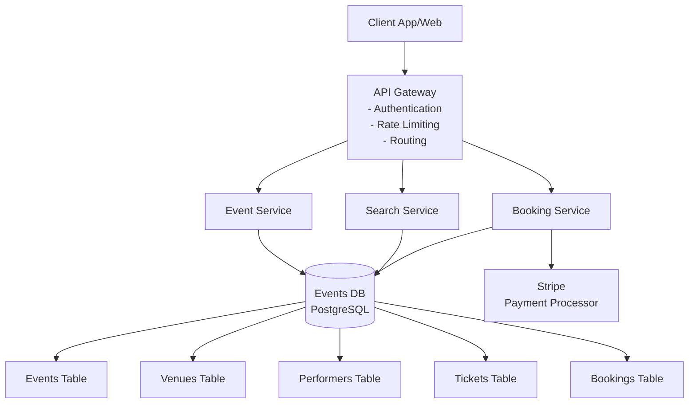
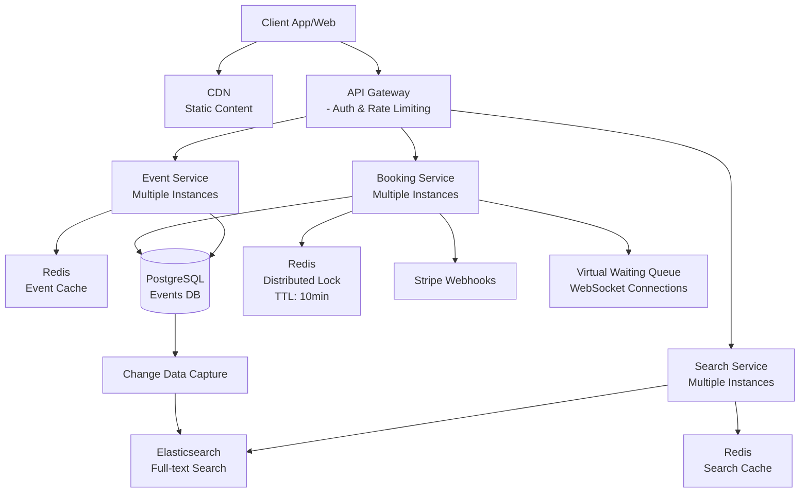
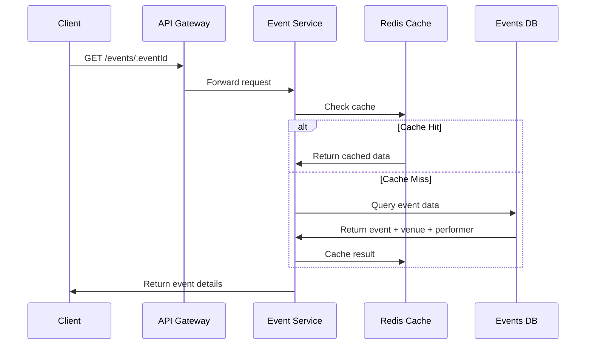
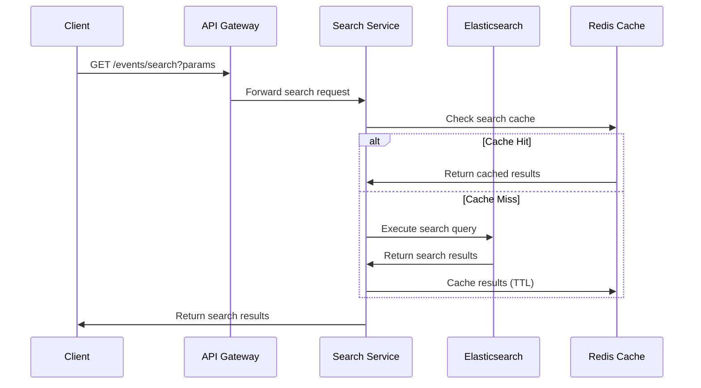
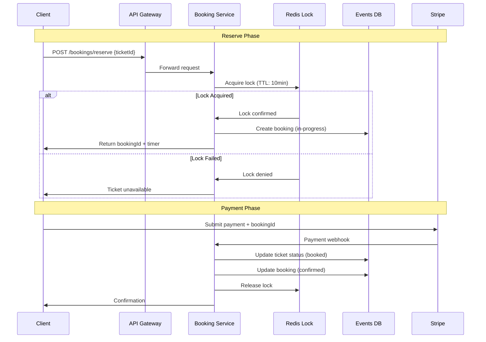
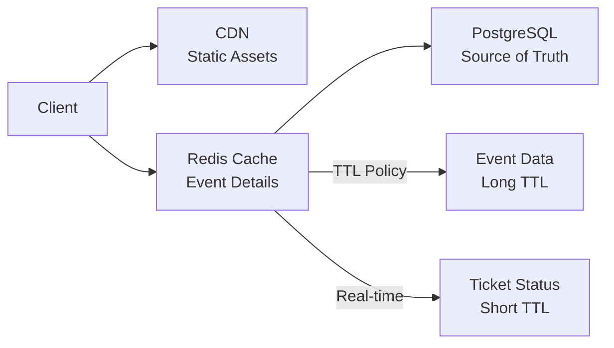
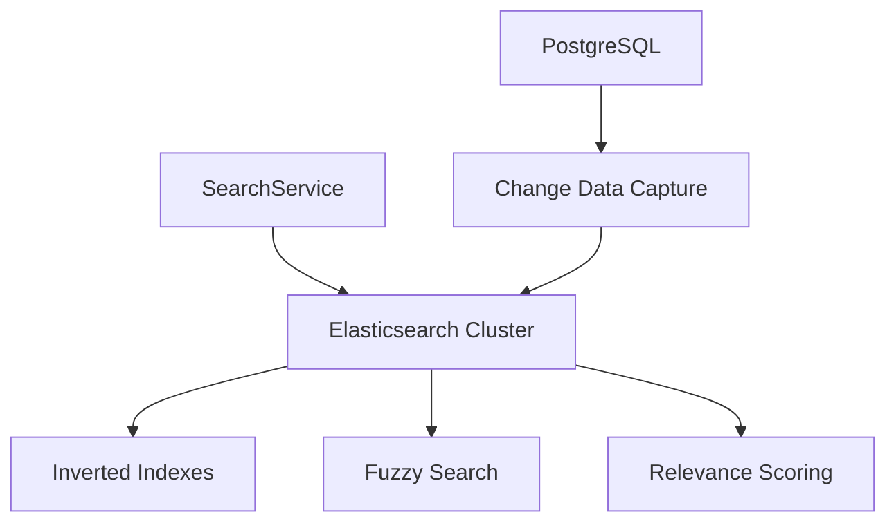
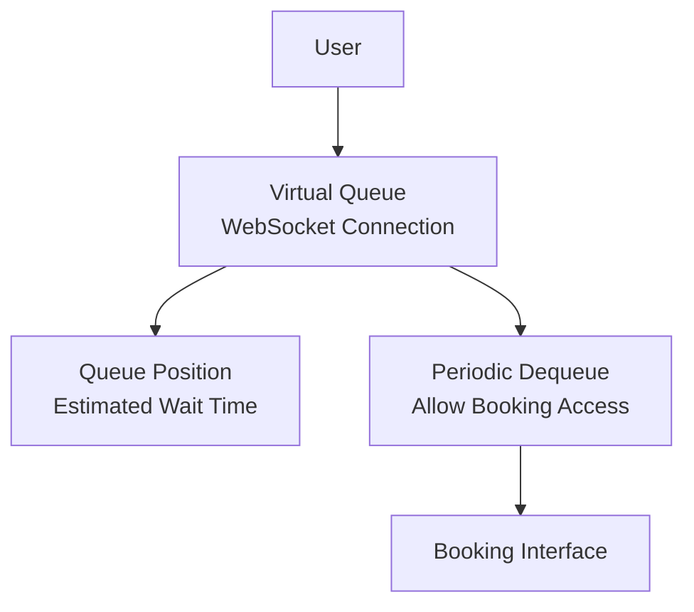

# Ticketmaster System Design - Interview Guide

## 🎯 Problem Statement

Design an online platform like Ticketmaster that allows users to purchase tickets for concerts, sports events, theater, and other live entertainment.

## 📋 Requirements Gathering

### Functional Requirements (Top 3)

1. **Users should be able to view events**
   - Event details, venue info, seat map with availability
2. **Users should be able to search for events**
   - By keywords, location, date, artist/team, event type
3. **Users should be able to book tickets to events**
   - Reserve seats, make payments, prevent double booking

### Below the Line (Out of Scope)

- Users viewing their booked events
- Admin flows (adding/editing events)
- Dynamic pricing for popular events

### Non-Functional Requirements (Top 4)

1. **Prioritize availability for search/viewing, consistency for booking** (no double booking)
2. **Handle high throughput** (10M users, popular events)
3. **Low latency search** (< 500ms)
4. **Read-heavy system** (100:1 read/write ratio)

### Below the Line (Out of Scope)

- GDPR compliance
- Fault tolerance
- Secure transactions
- CI/CD pipelines
- Regular backups

## 🏗️ Core Entities

```
📊 Core Entities:
• Event: id, venueId, performerId, name, description, date, tickets[]
• User: id, name, email, etc.
• Performer: id, name, description, links
• Venue: id, location, capacity, seatMap
• Ticket: id, eventId, seat, price, status (available/reserved/booked), userId
• Booking: id, userId, ticketIds[], totalPrice, status (in-progress/confirmed)
```

## 🔌 API Design

### Core APIs

```http
# View Event
GET /events/:eventId
→ Event & Venue & Performer & Ticket[]

# Search Events
GET /events/search?keyword={keyword}&start={start_date}&end={end_date}&pageSize={page_size}&page={page_number}
→ Event[]

# Book Tickets (Initial)
POST /bookings/:eventId
→ bookingId
{
  "ticketIds": string[],
  "paymentDetails": {...}
}

# Enhanced Booking APIs (Later)
POST /bookings/reserve → bookingId
POST /bookings/confirm → confirmation
```

## 🏛️ High-Level Architecture

### Initial Architecture



### Final Scaled Architecture



## 🔄 Core Flows

### 1. View Event Flow



### 2. Search Events Flow



### 3. Enhanced Booking Flow (with Distributed Lock)



## 🔧 Key Deep Dives

### 1. Preventing Double Booking

#### ❌ Bad Solution: Long-running Database Locks

- Uses `SELECT FOR UPDATE` with extended transactions
- Problems: Resource strain, deadlocks, poor scalability

#### ✅ Good Solution: Status Field with Expiration

```sql
-- Ticket states: available, reserved, booked
-- Add expiration_time field
-- Use cron job to clean expired reservations
```

#### 🚀 Great Solution: Distributed Lock with TTL

```redis
# Redis lock with automatic expiration
SET ticket:123 user:456 EX 600  # 10 minutes TTL
```

**Benefits:**

- Automatic cleanup via TTL
- High performance
- Handles failures gracefully
- No database strain

### 2. Scaling Read Operations

#### Caching Strategy



**Cache Layers:**

- **CDN**: Static content (images, CSS, JS)
- **Redis**: Event details, venue info (long TTL)
- **Application**: Computed seat maps

#### Horizontal Scaling

- Load balancers with round-robin/least connections
- Stateless services for easy scaling
- Database read replicas

### 3. Search Optimization

#### ❌ Basic SQL Search (Slow)

```sql
-- Full table scan - very slow
SELECT * FROM Events
WHERE name LIKE '%Taylor%'
   OR description LIKE '%Taylor%'
```

#### ✅ Better: Database Indexes

- B-tree indexes on frequently searched columns
- Full-text search extensions (PostgreSQL FTS)

#### 🚀 Best: Elasticsearch



**Features:**

- Inverted indexes for fast text search
- Fuzzy matching for typos
- Real-time sync via CDC
- Distributed and scalable

### 4. Handling Popular Events

#### 🎯 Real-time Updates Problem

Users see stale seat maps and click unavailable seats.

#### ✅ Good Solution: Server-Sent Events (SSE)

- Push real-time seat updates to clients
- Works for moderate traffic

#### 🚀 Great Solution: Virtual Waiting Queue



**Benefits:**

- Prevents system overload
- Better user experience
- Manages expectations with wait times
- Admin-controlled for high-demand events

### 5. Search Performance Optimization

#### Query Result Caching

```redis
# Cache structure
search:keyword=taylor&date=2024-01-01:results
search:location=london&type=concert:results
```

#### Edge Caching with CDN

- Geographic distribution
- Cache popular search results
- Reduces latency globally

## 📊 Data Model

### Key Tables Schema

```sql
-- Events Table
CREATE TABLE events (
    id SERIAL PRIMARY KEY,
    venue_id INT REFERENCES venues(id),
    performer_id INT REFERENCES performers(id),
    name VARCHAR(255) NOT NULL,
    description TEXT,
    event_date TIMESTAMP,
    created_at TIMESTAMP DEFAULT NOW()
);

-- Tickets Table
CREATE TABLE tickets (
    id SERIAL PRIMARY KEY,
    event_id INT REFERENCES events(id),
    seat_section VARCHAR(50),
    seat_row VARCHAR(10),
    seat_number VARCHAR(10),
    price DECIMAL(10,2),
    status VARCHAR(20) CHECK (status IN ('available', 'reserved', 'booked')),
    user_id INT REFERENCES users(id),
    booking_id INT REFERENCES bookings(id),
    reserved_until TIMESTAMP,
    created_at TIMESTAMP DEFAULT NOW()
);

-- Bookings Table
CREATE TABLE bookings (
    id SERIAL PRIMARY KEY,
    user_id INT REFERENCES users(id),
    total_price DECIMAL(10,2),
    status VARCHAR(20) CHECK (status IN ('in-progress', 'confirmed', 'cancelled')),
    stripe_payment_id VARCHAR(255),
    created_at TIMESTAMP DEFAULT NOW(),
    confirmed_at TIMESTAMP
);
```

## 🎯 Interview Performance by Level

### Mid-Level (E4) Expectations

- **Focus**: 80% breadth, 20% depth
- **Requirements**: Clear API design, basic high-level architecture
- **Key Challenge**: Solve double booking with status field + cron approach
- **Guidance**: Interviewer drives later stages

### Senior (E5) Expectations

- **Focus**: 60% breadth, 40% depth
- **Requirements**: Advanced concepts (Elasticsearch, distributed cache, scaling strategies)
- **Key Challenges**:
  - Distributed locking solution
  - Search optimization
  - Popular event handling
- **Guidance**: More proactive problem identification

### Staff+ (E6+) Expectations

- **Focus**: 40% breadth, 60% depth
- **Requirements**: Deep technical expertise, innovative solutions
- **Key Challenges**:
  - 2-3 deep dives with optimal solutions
  - Proactive problem solving
  - Novel insights that teach the interviewer
- **Guidance**: Minimal interviewer intervention

## 🔍 Common Interview Questions & Answers

### Q: "What happens if Redis goes down?"

**A**: We'd have a 10-minute window where multiple users could reach payment for the same ticket. However, our database still ensures consistency through atomic transactions. Users get errors instead of double bookings - poor experience but maintains data integrity.

### Q: "How do you keep event cache synchronized?"

**A**: We don't cache ticket availability with event details. Event details (rarely changing) are cached with long TTL. Ticket availability is checked separately by querying the ticket table and cross-referencing with Redis locks.

### Q: "Why not use optimistic concurrency control?"

**A**: Works for low concurrency, but with millions of users competing for limited seats, most requests would fail with version conflicts, creating a poor user experience.

## 💡 Pro Tips for Interview Success

### Visual Communication

- Draw clear, labeled diagrams
- Show data flow with arrows
- Update diagrams as you evolve the design
- Use consistent symbols and notation

### Time Management

- Spend 15% on requirements
- 40% on basic design (functional requirements)
- 45% on deep dives (non-functional requirements)

### Key Phrases to Use

- "Let's start simple and evolve the design"
- "This approach has trade-offs..."
- "For this scale, we need to consider..."
- "The bottleneck here would be..."

### Red Flags to Avoid

- Jumping to complex solutions immediately
- Not clarifying requirements
- Ignoring trade-offs
- Over-engineering for the given scale

## 🚀 Advanced Considerations

### Monitoring & Observability

- Real-time ticket availability metrics
- Search performance monitoring
- Queue wait time tracking
- Payment success/failure rates

### Security Considerations

- Rate limiting to prevent bot attacks
- CAPTCHA for high-demand events
- Payment tokenization
- Input validation and sanitization

### Global Scale Considerations

- Multi-region deployment
- Event data replication
- Currency and localization
- Regional payment processors

---

_Remember: The goal is to demonstrate systematic thinking, trade-off analysis, and the ability to scale solutions based on requirements. Focus on solving real problems rather than showcasing technology knowledge._

# Ticketmaster System Design - Last Minute Revision 🎯

## 🔥 Core Problem

Design an online ticketing platform handling millions of users booking limited seats without double booking.

## ⚡ Key Requirements (Memorize These)

**Functional (Top 3):**

- View events with seat maps
- Search events (keyword, location, date)
- Book tickets without double booking

**Non-Functional (Top 4):**

- Availability > Consistency for reads, Consistency > Availability for booking
- Handle 10M users, high throughput
- Sub-500ms search latency
- 100:1 read/write ratio

## 🏗️ Architecture Evolution

### Simple → Advanced

**Start Simple:** Single DB + Basic APIs
**Scale Up:** Add caching, search service, horizontal scaling
**Handle Popular Events:** Distributed locks + virtual queues

## 🔑 Critical Deep Dives

### 1. Double Booking Prevention (MOST IMPORTANT)

**❌ Bad:** Long database locks (deadlocks, poor performance)
**✅ Good:** Status field + cron cleanup
**🚀 Best:** Redis distributed locks with TTL

```
SET ticket:123 user:456 EX 600  # 10min auto-expire
```

### 2. Search Optimization

**❌ Basic:** SQL LIKE queries (table scans)
**✅ Better:** Database indexes + full-text search
**🚀 Best:** Elasticsearch with CDC sync

### 3. Popular Event Handling

**Problem:** System overload, stale seat maps
**🚀 Solution:** Virtual waiting queue with WebSocket

- Controls traffic flow
- Real-time position updates
- Better UX than crashes

## 🎯 APIs to Remember

```http
GET /events/:eventId                    # View event
GET /events/search?keyword=...          # Search events
POST /bookings/reserve {ticketIds}      # Reserve seats
POST /bookings/confirm {bookingId}      # Confirm payment
```

## 📊 Data Model Essentials

```sql
tickets: [id, event_id, seat_info, price, status, user_id, reserved_until]
bookings: [id, user_id, total_price, status, stripe_payment_id]
events: [id, venue_id, performer_id, name, date]
```

**Key:** Ticket status = available/reserved/booked

## 🚀 Scaling Strategies

### Caching Layers

- **CDN:** Static assets
- **Redis:** Event details (long TTL), search results
- **Application:** Computed data

### Database Scaling

- Read replicas for event viewing
- Master for booking operations
- Horizontal partitioning by geographic region

## 🔄 Booking Flow (Critical)

1. **Reserve:** Acquire Redis lock → Create in-progress booking
2. **Payment:** Process via Stripe → Confirm booking → Release lock
3. **Cleanup:** TTL expires if payment fails

## ⚠️ Trade-offs to Mention

- **Consistency vs Availability:** Strict consistency for booking, eventual for viewing
- **Memory vs Performance:** Redis locks use memory but prevent DB strain
- **Complexity vs Scale:** Simple DB works until high concurrency hits

## 🎭 Interview Performance Levels

### Mid-Level (Focus: Breadth)

- Clear API design
- Basic architecture diagram
- Status field solution for double booking

### Senior (Focus: 60% Breadth, 40% Depth)

- Distributed locking
- Elasticsearch for search
- Caching strategies

### Staff+ (Focus: Deep Technical Expertise)

- Multiple optimization approaches
- Proactive problem identification
- Novel solutions that impress interviewer

## 🚨 Common Gotchas

**Q:** "What if Redis fails?"
**A:** 10-min window of potential conflicts, but DB transactions prevent actual double booking

**Q:** "How to sync cache?"
**A:** Don't cache ticket availability with events - separate concerns

**Q:** "Why not optimistic locking?"
**A:** Too many version conflicts with millions competing for few seats

## 💡 Interview Success Formula

1. **Start Simple:** Basic single-DB solution
2. **Identify Bottlenecks:** "At this scale, we'd see..."
3. **Evolve Systematically:** Add one optimization at a time
4. **Explain Trade-offs:** Every decision has costs/benefits
5. **Draw Everything:** Visual communication is key

## 🎯 Winning Phrases

- "Let's start simple and evolve"
- "This approach trades X for Y because..."
- "The bottleneck here would be..."
- "For this scale, we need to consider..."

## ⏰ Time Allocation

- **15%** Requirements gathering
- **40%** Basic functional design
- **45%** Scaling & deep dives

Remember: Demonstrate systematic thinking and problem-solving approach over memorizing specific technologies!
