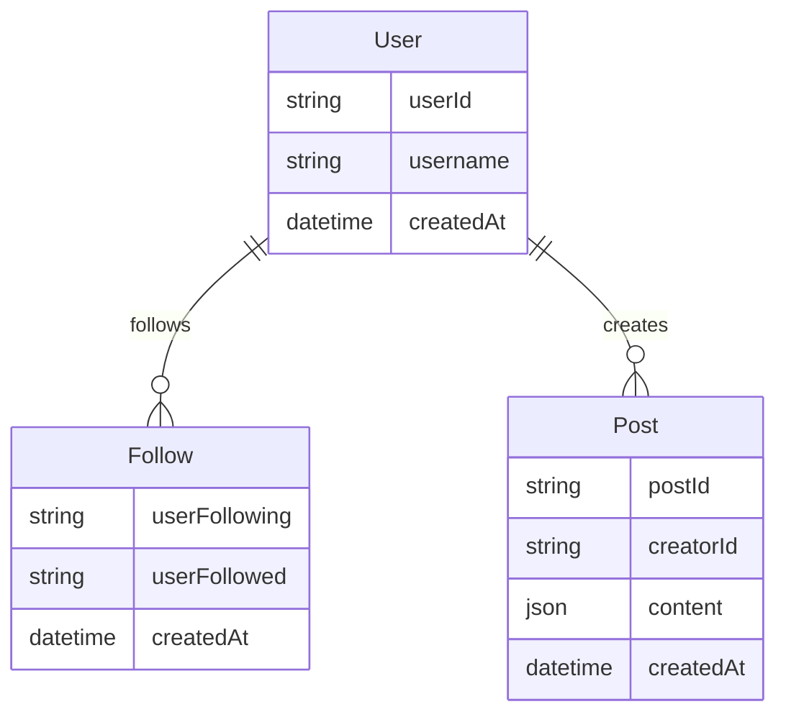
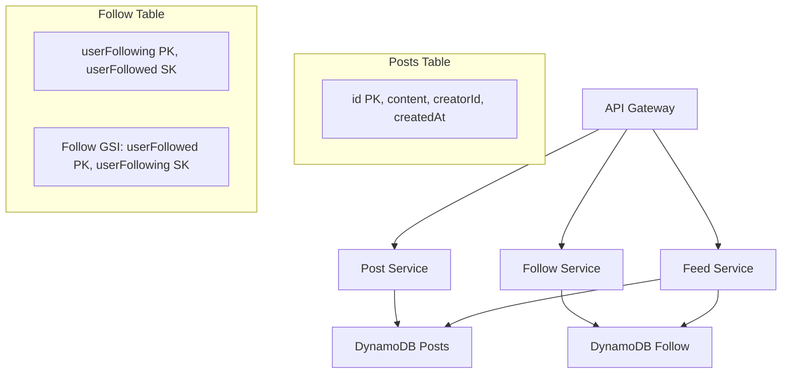
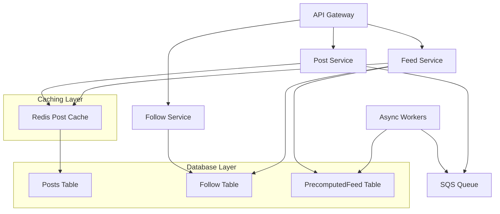
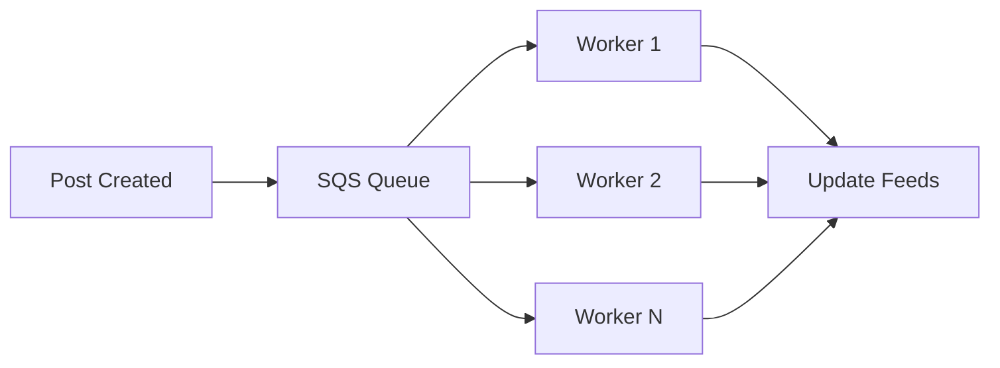
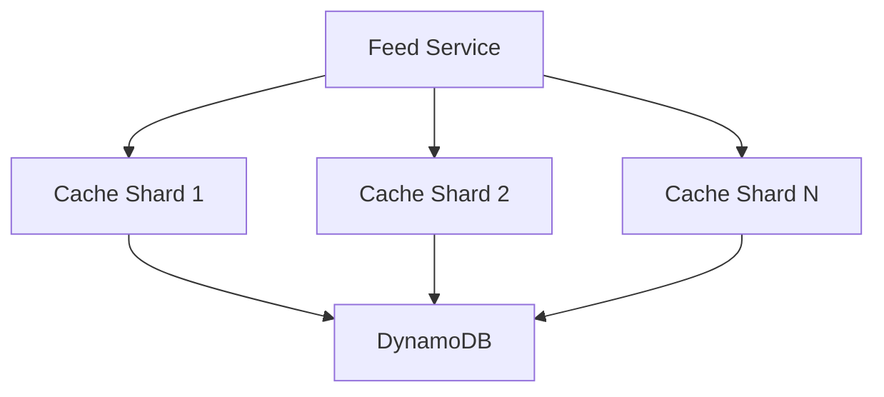
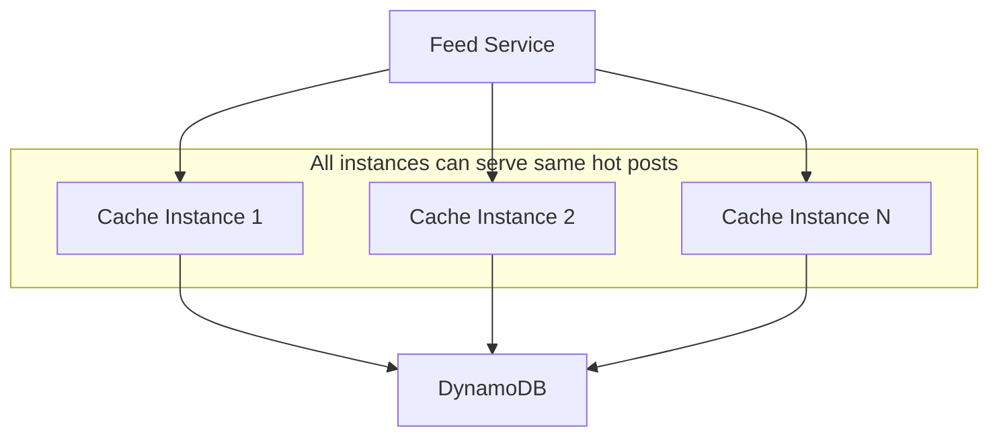

# Facebook News Feed System Design - Interview Study Guide

## Overview

Facebook's News Feed is a classic system design problem dealing with **fan-out** and **data management**. It shows recent stories from users in your social graph using uni-directional "follow" relationships.

## 1. Requirements Definition

### Functional Requirements

1. Users should be able to create posts
2. Users should be able to friend/follow people
3. Users should be able to view a feed of posts from people they follow, in chronological order
4. Users should be able to page through their feed

### Non-Functional Requirements

1. **High availability** (prioritizing availability over consistency)
2. **Eventual consistency** - up to 1 minute of post staleness is acceptable
3. **Fast response times** - posting and viewing feed should be < 500ms
4. **Massive scale** - handle 2B users
5. **Unlimited relationships** - users can follow/be followed by unlimited numbers

### Out of Scope

- Likes and comments on posts
- Private posts or restricted visibility
- Authentication (assume users are already authenticated)

## 2. Core Entities



## 3. API Design

### Create Post

```http
POST /posts
{
    "content": { }
}
→ 200 OK
{
    "postId": "abc123"
}
```

### Follow User

```http
PUT /users/{id}/followers
{ }
→ 200 OK
```

### Get Feed

```http
GET /feed?pageSize={size}&cursor={timestamp}
{
    "items": Post[],
    "nextCursor": "string"
}
```

## 4. High-Level Architecture Evolution

### Basic Architecture



### Enhanced Architecture with Caching



## 5. Database Design

### Posts Table (DynamoDB)

- **Partition Key**: `postId`
- **Attributes**: `content`, `creatorId`, `createdAt`
- **GSI**: `creatorId` (PK), `createdAt` (SK) - for fetching user's posts chronologically

### Follow Table (DynamoDB)

- **Partition Key**: `userFollowing`
- **Sort Key**: `userFollowed`
- **GSI**: `userFollowed` (PK), `userFollowing` (SK) - for finding followers

### PrecomputedFeed Table (DynamoDB)

- **Partition Key**: `userId`
- **Sort Key**: `createdAt`
- **Attributes**: `postId`
- **Purpose**: Store recent 200 posts for users who follow many people

## 6. Scaling Challenges & Solutions

### Challenge 1: Users Following Many People (Fan-out on Read)

**Problem**: User follows 10,000+ people → need to query many users' posts

**Solution**: Precomputed Feed Table

- Store list of recent post IDs (200) per user
- Update feeds when new posts are created
- **Storage calculation**: 10 bytes/postID × 200 posts × 2B users = 4TB (reasonable)

### Challenge 2: Users with Many Followers (Fan-out on Write)

**Problem**: Celebrity posts to 10M followers → need to update 10M feeds

**Solutions**:

#### Good: Async Workers



#### Great: Hybrid Approach

- **Normal users**: Precompute feeds (fan-out on write)
- **Celebrities**: Don't precompute, fetch on-demand (fan-out on read)
- **Feed generation**: Merge precomputed + celebrity posts at read time

### Challenge 3: Hot Post Problem

**Problem**: Viral posts get millions of reads → database hot spots

**Solutions**:

#### Good: Distributed Cache



#### Great: Redundant Cache



## 7. Feed Generation Algorithm

### Naive Approach (Small Scale)

1. Get all users the current user follows
2. Get all posts from those users
3. Sort by timestamp
4. Return paginated results

### Optimized Approach (Large Scale)

1. **Check if user has precomputed feed**
   - If yes: Fetch from PrecomputedFeed table
2. **Merge with celebrity posts**
   - Get posts from non-precomputed follows
   - Merge with precomputed feed chronologically
3. **Apply pagination using timestamp cursor**

## 8. Key Patterns & Principles

### Scaling Reads Pattern

- **Problem**: Users read feeds constantly but post rarely
- **Solution**: Pre-compute feeds for active users, cache recent posts, smart pagination
- **Key insight**: Users typically only read first few items → aggressive caching pays off

### Fan-out Strategies

- **Fan-out on Write**: Update all followers' feeds when post is created
- **Fan-out on Read**: Generate feed when user requests it
- **Hybrid**: Use both based on user characteristics

### Product Constraints

- **Max follows**: Consider limits (Facebook has 5,000 friend limit)
- **Feed depth**: Most users don't scroll past a few pages
- **Consistency trade-offs**: 1-minute delay acceptable for better performance

## 9. Interview Expectations by Level

### Mid-Level (E4)

- **Focus**: 80% breadth, 20% depth
- **Expectations**:
  - Define API endpoints and data model
  - Create functional high-level design
  - May have some "good" solutions but not all edge cases
- **Interviewer involvement**: More guidance, may drive later stages

### Senior (E5)

- **Focus**: 60% breadth, 40% depth
- **Expectations**:
  - Speed through initial design to focus on 2+ deep dives
  - Discuss pros/cons of architectural choices
  - Proactively identify fan-out and performance bottlenecks
  - Explain scalability, performance, maintainability trade-offs

### Staff+ (E6+)

- **Focus**: 40% breadth, 60% depth
- **Expectations**:
  - Cover all deep dives and additional ones
  - Demonstrate real-world experience with technologies
  - Identify and solve issues independently
  - Discuss performance tuning in detail
- **Interviewer involvement**: Minimal guidance, only to focus not steer

## 10. Key Talking Points

### Technology Choices

- **DynamoDB**: Scales well, but requires even load distribution
- **Redis**: Good for caching, LRU eviction for posts
- **SQS**: Reliable message queuing for async processing
- **Why not graph databases**: Simple requirements don't justify complexity

### Performance Optimizations

- **Caching strategy**: Cache what's frequently read, not frequently written
- **Pagination**: Use timestamp cursors for chronological ordering
- **Batch processing**: Async workers for high fan-out scenarios

### Monitoring & Metrics

- **Key metrics**: Feed generation latency, cache hit ratio, queue depth
- **Alerting**: High latency, queue backup, cache misses
- **Capacity planning**: Storage growth, throughput requirements

## 11. Common Pitfalls to Avoid

1. **Over-engineering early**: Start simple, then add complexity
2. **Ignoring product constraints**: Ask about limits and trade-offs
3. **Not considering fan-out**: Core problem in social media systems
4. **Forgetting about hot keys**: Viral content creates uneven load
5. **Skipping storage calculations**: Always verify storage requirements
6. **Not discussing consistency**: CAP theorem trade-offs are crucial

## 12. Questions to Ask Interviewer

1. "Should we set limits on follows/followers?"
2. "How important is real-time vs eventual consistency?"
3. "What's the read/write ratio we're optimizing for?"
4. "Are there any specific latency requirements for different user tiers?"
5. "Should we consider geographic distribution?"

---

## Quick Reference Formulas

- **Storage per user**: postID_size × posts_per_feed × total_users
- **Write throughput**: posts_per_second × average_followers
- **Read throughput**: users × feed_requests_per_day / 86400
- **Cache size**: hot_posts × post_size × replication_factor

# Facebook News Feed - Last Minute Revision

## Core Problem

• **Fan-out problem**: How to efficiently distribute posts to millions of followers
• **Read-heavy system**: Users read feeds constantly but post rarely
• **Scale**: 2B users, unlimited follows, <500ms response times

## Key Architecture Decisions

### Database Design

• **Posts Table**: `postId` (PK), GSI on `creatorId` + `createdAt` for user posts
• **Follow Table**: `userFollowing` (PK), `userFollowed` (SK), GSI reversed for followers
• **PrecomputedFeed Table**: `userId` (PK), `createdAt` (SK), stores 200 recent post IDs

### Fan-out Strategies

• **Fan-out on Write**: Precompute feeds, good for normal users
• **Fan-out on Read**: Generate on-demand, good for celebrities
• **Hybrid Approach**: Combine both - precompute normal users, fetch celebrities live

### Scaling Solutions

#### Celebrity Problem (High Fan-out on Write)

• **Solution**: Async workers with SQS queues
• **Better**: Hybrid - don't precompute celebrity feeds, merge at read time

#### Hot Posts Problem

• **Good**: Distributed cache sharding
• **Great**: Redundant cache - same hot posts in multiple instances

#### Many Follows Problem (High Fan-out on Read)

• **Solution**: PrecomputedFeed table stores recent 200 posts per user
• **Storage calc**: 10 bytes × 200 posts × 2B users = 4TB (reasonable)

## API Endpoints

```
POST /posts              → Create post
PUT /users/{id}/followers → Follow user
GET /feed?cursor=X       → Get paginated feed
```

## Feed Generation Algorithm

1. **Check precomputed feed** for current user
2. **Merge celebrity posts** from non-precomputed follows
3. **Sort chronologically** and apply cursor pagination
4. **Cache results** for performance

## Technology Stack

• **DynamoDB**: Scales well, handles uneven load distribution
• **Redis**: Post caching with LRU eviction
• **SQS**: Reliable async processing for high fan-out
• **Why not graph DB**: Simple requirements don't need complexity

## Key Metrics & Monitoring

• **Latency**: Feed generation <500ms
• **Cache hit ratio**: Optimize for frequently read posts
• **Queue depth**: Monitor async worker backlog
• **Storage growth**: Track precomputed feed size

## Interview Level Expectations

### Mid-Level (E4) - 80% Breadth, 20% Depth

• Define APIs and basic data model
• Create functional high-level architecture
• May need guidance on scaling challenges

### Senior (E5) - 60% Breadth, 40% Depth

• Speed through basics to focus on 2+ deep dives
• Proactively identify fan-out bottlenecks
• Explain trade-offs between solutions

### Staff+ (E6+) - 40% Breadth, 60% Depth

• Cover all deep dives independently
• Demonstrate real-world technology experience
• Discuss detailed performance optimizations

## Critical Don'ts

• **Don't over-engineer early** - start simple, add complexity
• **Don't ignore product constraints** - ask about limits
• **Don't forget hot keys** - viral content creates uneven load
• **Don't skip storage calculations** - always verify requirements
• **Don't ignore consistency trade-offs** - CAP theorem matters

## Smart Questions to Ask

• "Should we set limits on follows/followers?"
• "How important is real-time vs eventual consistency?"
• "What's the read/write ratio we're optimizing for?"
• "Are there specific latency requirements for different user tiers?"

## Quick Calculations

• **Write throughput**: posts/sec × avg_followers = fan-out load
• **Storage per user**: 10 bytes × 200 posts = 2KB precomputed feed
• **Cache sizing**: hot_posts × post_size × replication_factor

## Remember: Focus on Trade-offs

• **Consistency vs Performance**: 1-minute staleness acceptable
• **Storage vs Compute**: Precompute feeds vs generate on-demand
• **Simplicity vs Optimization**: Start basic, optimize bottlenecks
